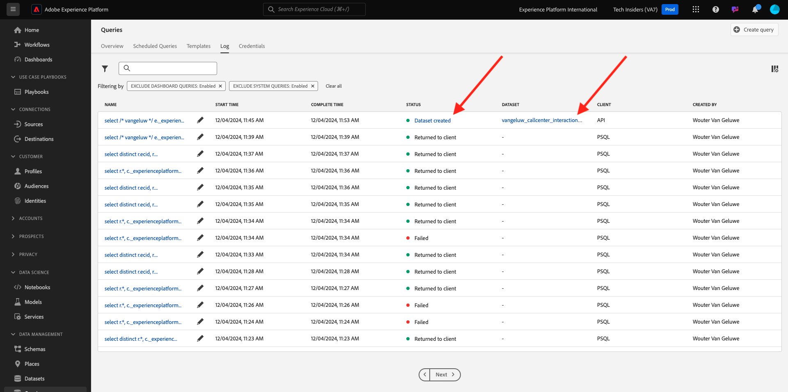

# 5.1.5 Generieren eines Datensatzes aus einer Abfrage

## Ziel

Erfahren Sie, wie Sie Datensätze aus Abfrageergebnissen generieren
Microsoft Power BI Desktop/Tableau direkt mit dem Abfrage-Service verbinden
Erstellen eines Berichts in Microsoft Power BI Desktop/Tableau Desktop

## Kontext

Eine Befehlszeilenschnittstelle zur Abfrage von Daten ist aufregend, bietet jedoch keine gute Präsentation. In dieser Lektion führen wir Sie durch einen empfohlenen Workflow, in dem beschrieben wird, wie Sie Microsoft Power BI Desktop/Tableau direkt über den Abfrage-Service verwenden können, um visuelle Berichte für Ihre Stakeholder zu erstellen.

## Erstellen eines Datensatzes aus einer SQL-Abfrage

Die Komplexität Ihrer Abfrage wirkt sich darauf aus, wie lange es dauert, bis der Abfrage-Service Ergebnisse zurückgibt. Und wenn Sie direkt über die Befehlszeile oder andere Lösungen wie Microsoft Power BI/Tableau abfragen, wird der Abfrage-Service mit einer maximalen Wartezeit von 5 Minuten (600 Sekunden) konfiguriert. In bestimmten Fällen werden diese Lösungen mit kürzeren Zeitüberschreitungswerten konfiguriert. Um größere Abfragen auszuführen und die für die Ergebnisrückgabe benötigte Zeit vorab zu laden, bieten wir eine Funktion zum Generieren eines Datensatzes aus den Abfrageergebnissen. Diese Funktion nutzt die standardmäßige SQL-Funktion namens „Create Table As Select“ (CTAS). Sie ist in der Platform-Benutzeroberfläche über die Abfrageliste verfügbar und kann auch direkt über die Befehlszeile mit PSQL ausgeführt werden.

Im vorherigen Beispiel haben Sie &quot;**Name eingeben“ durch** eigenes LDAP ersetzt, bevor Sie es in PSQL ausführen.

```sql
select /* enter your name */
       e.--aepTenantId--.identification.core.ecid as ecid,
       e.placeContext.geo.city as city,
       e.placeContext.geo._schema.latitude latitude,
       e.placeContext.geo._schema.longitude longitude,
       e.placeContext.geo.countryCode as countrycode,
       c.--aepTenantId--.interactionDetails.core.callCenterAgent.callFeeling as callFeeling,
       c.--aepTenantId--.interactionDetails.core.callCenterAgent.callTopic as callTopic,
       c.--aepTenantId--.interactionDetails.core.callCenterAgent.callContractCancelled as contractCancelled,
       l.--aepTenantId--.loyaltyDetails.level as loyaltystatus,
       l.--aepTenantId--.loyaltyDetails.points as loyaltypoints,
       l.--aepTenantId--.identification.core.crmId as crmid
from   demo_system_event_dataset_for_website_global_v1_1 e
      ,demo_system_event_dataset_for_call_center_global_v1_1 c
      ,demo_system_profile_dataset_for_crm_global_v1_1 l
where  e.--aepTenantId--.demoEnvironment.brandName IN ('Citi Signal')
and    e.web.webPageDetails.name in ('Cancel Service', 'Call Start')
and    e.--aepTenantId--.identification.core.ecid = c.--aepTenantId--.identification.core.ecid
and    l.--aepTenantId--.identification.core.ecid = e.--aepTenantId--.identification.core.ecid;
```

Navigieren Sie zur Adobe Experience Platform-Benutzeroberfläche - [https://experience.adobe.com/platform](https://experience.adobe.com/platform)

Sie suchen Ihre ausgeführte Anweisung in der Adobe Experience Platform Query UI, indem Sie Ihr LDAP in das Suchfeld eingeben:

Wählen Sie **Abfragen**, gehen Sie zu **Protokoll** und geben Sie Ihr LDAP in das Suchfeld ein.


Wählen Sie Ihre Abfrage aus und klicken Sie **Als CTAS ausführen**.


Geben Sie `--aepUserLdap-- Callcenter Interaction Analysis` als Namen und Beschreibung für den Datensatz ein und klicken Sie auf **Als CTAS ausführen**.


Daher wird eine neue Abfrage mit dem Status **Gesendet** angezeigt.


Nach Abschluss wird ein neuer Eintrag für **Datensatz erstellt** angezeigt (möglicherweise müssen Sie die Seite aktualisieren).



Sobald Ihr Datensatz erstellt wurde (was 5-10 Minuten dauern kann), können Sie mit der Übung fortfahren.

Nächster Schritt - Option A: [5.1.6 Query Service und Power BI &#x200B;](./ex6.md)

Nächster Schritt - Option B: [5.1.7 Query Service und Tableau](./ex7.md)

[Zurück zu Modul 5.1](./query-service.md)

[Zurück zu „Alle Module“](../../../overview.md)
