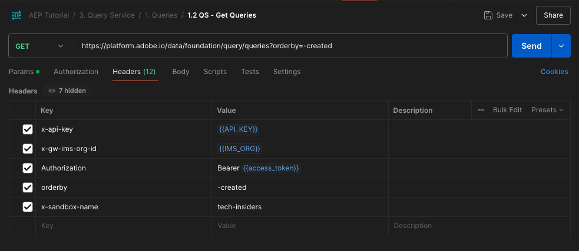

# 5.1.8 Query Service-API

## Ziel

- Verwenden Sie die Query Service-API zum Verwalten von Abfragevorlagen und Abfragezeitplänen.

## Kontext

In dieser Übung führen Sie API-Aufrufe aus, um Abfragevorlagen und Abfragezeitpläne mithilfe einer Postman-Kollektion zu verwalten. Sie definieren Abfragevorlagen, führen reguläre Abfragen und CTAS-Abfragen aus. Eine **CTAS** -Abfrage (Tabelle als ausgewählte Abfrage erstellen) speichert den Ergebnissatz in einem expliziten Datensatz. Während reguläre Abfragen in einem impliziten (oder systemgenerierten) Datensatz gespeichert werden, wird dieser normalerweise im Parquet-Dateiformat exportiert.

## Dokumentation

- [Hilfe zum Adobe Experience Platform Query Service](https://experienceleague.adobe.com/docs/experience-platform/query/api/getting-started.html?lang=de)
- [Query Service-API](https://www.adobe.io/apis/experienceplatform/home/api-reference.html#!acpdr/swagger-specs/qs-api.yaml)

## Query Service-API

Mit der Query Service-API können Sie nicht interaktive Abfragen für den Adobe Experience Platform Data-Lake verwalten.

&quot;Nicht interaktiv&quot;bedeutet, dass eine Anfrage zum Ausführen einer Abfrage keine sofortige Antwort zur Folge hat. Die Abfrage wird verarbeitet und der Ergebnissatz wird in einem impliziten oder expliziten Datensatz (CTAS: Tabelle als ausgewählte Tabelle erstellen) gespeichert.

## Beispielabfrage

Als Beispielabfrage verwenden Sie die erste in [4.3 - Abfragen, Abfragen, Abfragen.. und Abwanderungsanalyse](./ex3.md) aufgelistete Abfrage:

Wie viele Produktansichten haben wir täglich?

**SQL**

```sql
select date_format( timestamp , 'yyyy-MM-dd') AS Day,
       count(*) AS productViews
from   demo_system_event_dataset_for_website_global_v1_1
where  --aepTenantId--.demoEnvironment.brandName IN ('Citi Signal')
and eventType = 'commerce.productViews'
group by Day
limit 10;
```

## Abfragen

Öffnen Sie Postman auf Ihrem Computer. Im Rahmen von Modul 2.1 haben Sie eine Postman-Umgebung erstellt und eine Postman-Sammlung importiert. Befolgen Sie die Anweisungen unter [Übung 2.1.3](./../../../modules/rtcdp-b2c/module2.1/ex3.md) , falls Sie dies noch nicht getan haben.

Im Rahmen der von Ihnen importierten Postman-Sammlung wird der Ordner &quot;**3&quot;angezeigt. Query Service**. Wenn dieser Ordner nicht angezeigt wird, laden Sie die [Postman-Sammlung](./../../../assets/postman/postman_profile.zip) erneut herunter und importieren Sie diese Sammlung erneut in Postman, wie in [Übung 2.1.3](./../../../modules/rtcdp-b2c/module2.1/ex3.md) beschrieben.


>[!NOTE]
>
>Derzeit ist nur der Ordner **1. Abfragen** enthält Anforderungen. Andere Anforderungen werden in einem Ebenenstadium hinzugefügt.

Öffnen Sie diesen Ordner und lernen Sie die Query Service-API-Aufrufe kennen, mit denen die Abfrage ausgeführt, überwacht und heruntergeladen werden kann.

Ein POST-Aufruf an [/query/queries] mit der folgenden Payload Trigger die Ausführung unserer Abfrage.

### Abfrage erstellen

Klicken Sie auf die Anforderung **1.1 QS - Abfrage erstellen** und gehen Sie zu **Kopfzeilen**. Daraufhin sehen Sie Folgendes:


Fokussieren wir uns auf dieses Kopfzeilenfeld:

| Schlüssel | Wert |
| ----------- | ----------- |
| x-sandbox-name | `--aepSandboxName--` |

>[!NOTE]
>
>Sie müssen den Namen der verwendeten Adobe Experience Platform-Sandbox angeben. Das Kopfzeilenfeld **x-sandbox-name** sollte `--aepSandboxName--` sein.

Wechseln Sie zum Abschnitt **Hauptteil** dieser Anfrage. Im **Hauptteil** dieser Anfrage sehen Sie Folgendes:


```sql
{
    "name" : "ldap - QS API demo - Citi Signal - Product Views Per Day",
	"description": "ldap - QS API demo - Citi Signal - Product Views Per Day",
	"dbName": "--aepSandboxName--:all",
	"sql": "select date_format( timestamp , 'yyyy-MM-dd') AS Day, count(*) AS productViews from demo_system_event_dataset_for_website_global_v1_1 where _experienceplatform.demoEnvironment.brandName IN ('Citi Signal') and eventType = 'commerce.productViews' group by Day limit 10"
}
```

Achtung: Aktualisieren Sie die Variable **name** in der folgenden Anfrage, indem Sie **ldap** durch Ihre spezifische **—aepUserLdap—** ersetzen.

Nach dem Hinzufügen Ihres spezifischen **ldap** sollte der Hauptteil in etwa wie folgt aussehen:

```json
{
    "name" : "vangeluw - QS API demo - Citi Signal - Product Views Per Day",
	"description": "vangeluw - QS API demo - Citi Signal - Product Views Per Day",
	"dbName": "tech-insiders:all",
	"sql": "select date_format( timestamp , 'yyyy-MM-dd') AS Day, count(*) AS productViews from demo_system_event_dataset_for_website_global_v1_1 where _experienceplatform.demoEnvironment.brandName IN ('Citi Signal') and eventType = 'commerce.productViews' group by Day limit 10"
}
```

>[!NOTE]
>
>Der Schlüssel **dbName** im obigen JSON-Hauptteil bezieht sich auf die Sandbox, die in Ihrer Adobe Experience Platform-Instanz verwendet wird. Wenn Sie die PROD-Sandbox verwenden, sollte der dbName **prod:all** sein. Wenn Sie eine andere Sandbox verwenden, z. B. **tech-insiders**, sollte dbName gleich **tech-insiders:all** sein.

Klicken Sie anschließend auf die blaue Schaltfläche **Senden** , um das Segment zu erstellen und die Ergebnisse anzuzeigen.


Nach erfolgreichem Abschluss gibt die POST-Anfrage die folgende Antwort zurück:

```json
{
    "isInsertInto": false,
    "request": {
        "dbName": "module7:all",
        "sql": "select date_format( timestamp , 'yyyy-MM-dd') AS Day, count(*) AS productViews from demo_system_event_dataset_for_website_global_v1_1 where _experienceplatform.demoEnvironment.brandName IN ('Luma Telco', 'Citi Signal') and eventType = 'commerce.productViews' group by Day limit 10",
        "name": "vangeluw - QS API demo - Citi Signal - Product Views Per Day",
        "description": "vangeluw - QS API demo - Citi Signal - Product Views Per Day"
    },
    "clientId": "5a143b5ae4aa4631a1f3b09cd051333f",
    "state": "SUBMITTED",
    "rowCount": 0,
    "errors": [],
    "isCTAS": false,
    "version": 1,
    "id": "8f0d7f25-f7aa-493b-9792-290f884a7e5b",
    "elapsedTime": 0,
    "updated": "2021-01-20T13:23:13.951Z",
    "client": "API",
    "userId": "A3392DB95FFF08EE0A495E87@techacct.adobe.com",
    "created": "2021-01-20T13:23:13.951Z",
    "_links": {
        "self": {
            "href": "https://platform-va7.adobe.io/data/foundation/query/queries/8f0d7f25-f7aa-493b-9792-290f884a7e5b",
            "method": "GET"
        },
        "soft_delete": {
            "href": "https://platform-va7.adobe.io/data/foundation/query/queries/8f0d7f25-f7aa-493b-9792-290f884a7e5b",
            "method": "PATCH",
            "body": "{ \"op\": \"soft_delete\"}"
        },
        "cancel": {
            "href": "https://platform-va7.adobe.io/data/foundation/query/queries/8f0d7f25-f7aa-493b-9792-290f884a7e5b",
            "method": "PATCH",
            "body": "{ \"op\": \"cancel\"}"
        }
    }
}
```

Der aktuelle **Status** der Abfrage lautet **GESENDET**, der Status wird nach der Ausführung zu **ERFOLG**.

Sie können auch gesendete Abfragen über die Adobe Experience Platform-Benutzeroberfläche nachschlagen, [Adobe Experience Platform](https://experience.adobe.com/#/@experienceplatform/platform/home) öffnen, zu **Abfragen**, zu **Protokoll** navigieren und Ihre Abfrage auswählen:


### Abfragen abrufen

Klicken Sie auf die Anfrage mit dem Namen **1.2 QS - Abfragen abrufen** und gehen Sie zu **Kopfzeilen**. Daraufhin sehen Sie Folgendes:



Fokussieren wir uns auf dieses Kopfzeilenfeld:

| Schlüssel | Wert |
| ----------- | ----------- |
| x-sandbox-name | `--aepSandboxName--` |

>[!NOTE]
>
>Sie müssen den Namen der verwendeten Adobe Experience Platform-Sandbox angeben. Das Kopfzeilenfeld **x-sandbox-name** sollte `--aepSandboxName--` sein.

Wechseln Sie zu **Parameter**. Daraufhin sehen Sie Folgendes:


Mit dem Parameter **orderby** können Sie eine Sortierreihenfolge festlegen, die auf der Eigenschaft **created** basiert. Beachten Sie, dass das Vorzeichen **&#39;-&#39;** vor der Erstellung steht. Das bedeutet, dass die Reihenfolge, in der die Liste der Abfragen zurückgegeben wird, ihr erstelltes Datum in der Reihenfolge **Absteigend** verwendet. Ihre Abfrage sollte oben in der Liste stehen.

Klicken Sie anschließend auf die blaue Schaltfläche **Senden** , um das Segment zu erstellen und die Ergebnisse anzuzeigen.


Bei Erfolg gibt die Anfrage eine Antwort zurück, die der folgenden ähnelt. Der **state** der Antwort kann **SUBMITTED**, **IN_PROGRESS** oder **SUCCESS** lauten. Es kann mehrere Minuten dauern, bis die Abfrage den Status **SUCCESS** aufweist. Sie können den Versand dieser Anfrage mehrmals wiederholen, bis der Status **SUCCESS** angezeigt wird.

```json
{
    "queries": [
        {
            "isInsertInto": false,
            "sessionType": "HTTP_SESSION",
            "request": {
                "dbName": "tech-insiders:all",
                "sql": "select date_format( timestamp , 'yyyy-MM-dd') AS Day, count(*) AS productViews from demo_system_event_dataset_for_website_global_v1_1 where _experienceplatform.demoEnvironment.brandName IN ('Citi Signal') and eventType = 'commerce.productViews' group by Day limit 10",
                "name": "vangeluw - QS API demo - Citi Signal - Product Views Per Day",
                "description": "vangeluw - QS API demo - Citi Signal - Product Views Per Day"
            },
            "computeMetrics": null,
            "clientId": "b7d8a1fc396242889bb31dc83644e91d",
            "state": "IN_PROGRESS",
            "rowCount": 0,
            "isService": false,
            "errors": [],
            "isCTAS": false,
            "version": 1,
            "id": "a535234e-dc0c-42ea-bcad-eb09c5997d76",
            "elapsedTime": 8088,
            "updated": "2024-12-04T14:17:10.627Z",
            "client": "API",
            "effectiveSQL": "select date_format( timestamp , 'yyyy-MM-dd') AS Day, count(*) AS productViews from demo_system_event_dataset_for_website_global_v1_1 where _experienceplatform.demoEnvironment.brandName IN ('Citi Signal') and eventType = 'commerce.productViews' group by Day limit 10",
            "userId": "8CD31E54673C49EE0A495E05@techacct.adobe.com",
            "isParentLevel": true,
            "created": "2024-12-04T14:14:22.637Z",
                "version": 1,
    "_links": {
        "next": {
            "href": "https://platform-va7.adobe.io/data/foundation/query/queries?orderby=-created&start=2024-11-22T00:32:04.505Z"
        },
        "prev": {
            "href": "https://platform-va7.adobe.io/data/foundation/query/queries?orderby=-created&start=2024-12-04T14:14:22.637Z&isPrevLink=true"
        }
    }
}
```

Wenn der Status **SUCCESS** lautet, fahren Sie mit der nächsten Anfrage fort.

### Abrufen des Abfragestatus

Klicken Sie auf die Anfrage mit dem Namen **1.3 QS - Get Query Status** und gehen Sie zu **Headers**. Daraufhin sehen Sie Folgendes:


Fokussieren wir uns auf dieses Kopfzeilenfeld:

| Schlüssel | Wert |
| ----------- | ----------- |
| x-sandbox-name | `--aepSandboxName--` |

>[!NOTE]
>
>Sie müssen den Namen der verwendeten Adobe Experience Platform-Sandbox angeben. Das Kopfzeilenfeld **x-sandbox-name** sollte `--aepSandboxName--` sein.

Klicken Sie anschließend auf die blaue Schaltfläche **Senden** , um das Segment zu erstellen und die Ergebnisse anzuzeigen.


Bei Erfolg gibt die Anfrage eine Antwort zurück, die der folgenden ähnelt.

```json
{
    "isInsertInto": false,
    "sessionType": "HTTP_SESSION",
    "request": {
        "dbName": "tech-insiders:all",
        "sql": "select date_format( timestamp , 'yyyy-MM-dd') AS Day, count(*) AS productViews from demo_system_event_dataset_for_website_global_v1_1 where _experienceplatform.demoEnvironment.brandName IN ('Citi Signal') and eventType = 'commerce.productViews' group by Day limit 10",
        "name": "vangeluw - QS API demo - Citi Signal - Product Views Per Day",
        "description": "vangeluw - QS API demo - Citi Signal - Product Views Per Day"
    },
    "computeMetrics": {
        "executorVMSeconds": 138,
        "clusterCpuSeconds": 3312,
        "clusterVMHours": 0.07666666805744171,
        "driverVMSeconds": 138,
        "clusterVMSeconds": 276
    },
    "clientId": "b7d8a1fc396242889bb31dc83644e91d",
    "state": "SUCCESS",
    "rowCount": 1,
    "isService": false,
    "errors": [],
    "isCTAS": false,
    "version": 1,
    "id": "a535234e-dc0c-42ea-bcad-eb09c5997d76",
    "elapsedTime": 199219,
    "updated": "2024-12-04T14:17:41.856Z",
    "client": "API",
    "effectiveSQL": "select date_format( timestamp , 'yyyy-MM-dd') AS Day, count(*) AS productViews from demo_system_event_dataset_for_website_global_v1_1 where _experienceplatform.demoEnvironment.brandName IN ('Citi Signal') and eventType = 'commerce.productViews' group by Day limit 10",
    "userId": "8CD31E54673C49EE0A495E05@techacct.adobe.com",
    "isParentLevel": true,
    "created": "2024-12-04T14:14:22.637Z",
    "_links": {
        "self": {
            "href": "https://platform-va7.adobe.io/data/foundation/query/queries/a535234e-dc0c-42ea-bcad-eb09c5997d76",
            "method": "GET"
        },
        "soft_delete": {
            "href": "https://platform-va7.adobe.io/data/foundation/query/queries/a535234e-dc0c-42ea-bcad-eb09c5997d76",
            "method": "PATCH",
            "body": "{ \"op\": \"soft_delete\"}"
        },
        "referenced_datasets": [
            {
                "id": "672a10b1074ceb2af0aa7034",
                "href": "https://platform-va7.adobe.io/data/foundation/catalog/dataSets/672a10b1074ceb2af0aa7034"
            }
        ]
    }
}
```

Wenn eine Abfrage den Status **SUCCESS** erreicht, gibt die Antwort auch die Anzahl der Zeilen an, die von der Abfrage über die Eigenschaft **rowCount** abgerufen wurden. In unserem Beispiel werden 10 Zeilen von der Abfrage zurückgegeben. Im nächsten Abschnitt sehen wir, wie wir die zehn Zeilen abrufen können.

### Abrufen des Abfrageergebnisses

Die obige Antwort **SUCCESS** enthält die Eigenschaft **referenced_datasets** , die auf den impliziten Datensatz verweist, in dem das Abfrageergebnis gespeichert wird. Um Zugriff auf das Ergebnis zu erhalten, verwenden wir die zugehörige Eigenschaft **href** oder **id** .

Klicken Sie auf die Anfrage mit dem Namen **1.4 QS - Get Query Result** und gehen Sie zu **Headers**. Daraufhin sehen Sie Folgendes:


Fokussieren wir uns auf dieses Kopfzeilenfeld:

| Schlüssel | Wert |
| ----------- | ----------- |
| x-sandbox-name | `--aepSandboxName--` |

>[!NOTE]
>
>Sie müssen den Namen der verwendeten Adobe Experience Platform-Sandbox angeben. Das Kopfzeilenfeld **x-sandbox-name** sollte `--aepSandboxName--` sein.

Klicken Sie anschließend auf die blaue Schaltfläche **Senden** , um das Segment zu erstellen und die Ergebnisse anzuzeigen.


Die Antwort dieser Anfrage verweist auf die Datensatzdateien:

```json
{
    "672a10b1074ceb2af0aa7034": {
        "name": "Demo System - Event Dataset for Website (Global v1.1)",
        "description": "Demo System - Event Dataset for Website (Global v1.1)",
        "enableErrorDiagnostics": false,
        "tags": {
            "adobe/siphon/partition/definition": [
                "day(timestamp, _ACP_DATE)",
                "identity(_ACP_BATCHID)"
            ],
            "adobe/siphon/meta": [
                "acpBufferedFlag::false"
            ],
            "aep/siphon/partitions": [
                "_ACP_DATE",
                "_ACP_BATCHID"
            ],
            "acp_granular_plugin_validation_flags": [
                "identity:enabled",
                "profile:disabled"
            ],
            "adobe/pqs/table": [
                "demo_system_event_dataset_for_website_global_v1_1"
            ],
            "acp_granular_validation_flags": [
                "requiredFieldCheck:enabled"
            ],
            "aep/siphon/cleanup/trash/timestamp": [
                "1733302532212"
            ],
            "acp_validationContext": [
                "enabled"
            ],
            "adobe/siphon/table/format": [
                "delta"
            ],
            "unifiedProfile": [
                "enabled:true",
                "enabledAt:2024-11-05 12:33:59"
            ],
            "aep/siphon/cleanup/meta/timestamp": [
                "1733302532287"
            ],
            "unifiedIdentity": [
                "enabled:true"
            ]
        },
        "state": "ACTIVE",
        "imsOrg": "907075E95BF479EC0A495C73@AdobeOrg",
        "sandboxId": "79e3c8b2-0609-4564-a3c8-b20609a5648c",
        "extensions": {
            "adobe_lakeHouse": {
                "metrics": {
                    "storageSize": 810709,
                    "rowCount": 1141,
                    "asOf": 1732494676514
                }
            },
            "adobe_unifiedProfile": {}
        },
        "version": "1.0.21",
        "created": 1730810034023,
        "updated": 1733302532348,
        "createdClient": "d75039d36ca543c78612f7aac18e6c2b",
        "createdUser": "53FB1E5E66CDC87D0A495FC0@techacct.adobe.com",
        "updatedUser": "acp_foundation_dataTracker@AdobeID",
        "classification": {
            "dataBehavior": "time-series",
            "managedBy": "CUSTOMER"
        },
        "viewId": "672a10b2074ceb2af0aa7035",
        "fileDescription": {
            "format": "parquet"
        },
        "files": "@/dataSetFiles?dataSetId=672a10b1074ceb2af0aa7034",
        "schemaRef": {
            "id": "https://ns.adobe.com/experienceplatform/schemas/d9b88a044ad96154637965a97ed63c7b20bdf2ab3b4f642e",
            "contentType": "application/vnd.adobe.xed-full+json;version=1"
        }
    }
}
```

Nächster Schritt: [Zusammenfassung und Vorteile](./summary.md)

[Zurück zu Modul 5.1](./query-service.md)

[Zu allen Modulen zurückkehren](../../../overview.md)
