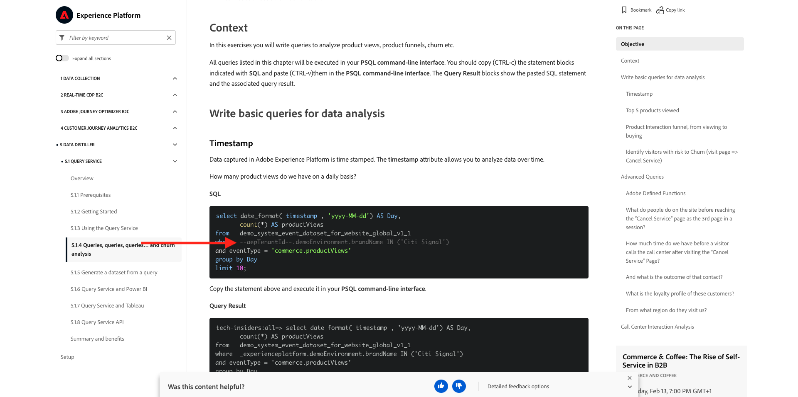

# 0.1 Installieren der Chrome-Erweiterung für die Experience League-Dokumentation

## 0.1.1 Warum haben wir eine Chrome-Erweiterung erstellt?

Die Dokumentation wurde allgemein gehalten, damit sie von jedem mithilfe einer beliebigen Adobe Experience Platform-Instanz problemlos wiederverwendet werden kann.
Durch Wiederverwendbarkeit der Dokumentation wurde **Umgebungsvariablen** in die Dokumentation eingeführt, was bedeutet, dass Sie die folgenden **Schlüssel** in der Dokumentation finden. Jeder Schlüssel ist eine spezifische Variable für eine bestimmte Umgebung. Die Chrome-Erweiterung ändert diese Variable für Sie und erleichtert Ihnen daher das Kopieren von Code und Text aus den Anleitungsseiten und das Einfügen dieser Variable in die verschiedenen Benutzeroberflächen, die Sie im Rahmen des Tutorials verwenden werden.

Ein Beispiel für solche Werte finden Sie unten. Derzeit können diese Werte noch nicht verwendet werden. Sobald Sie die Chrome-Erweiterung installieren und aktivieren, sehen Sie, dass sich diese Variablen in &quot;normalen&quot;Text ändern, den Sie kopieren und wiederverwenden können.

| Name | Schlüssel |
|:-------------:| :---------------:|
| Kennung der IMS-Organisation von AEP | `--aepImsOrgId--` |
| AEP-Mandanten-ID | `--aepTenantId--` |
| AEP-Sandbox-Name | `--aepSandboxName--` |
| LDAP des Lernprofils | `--aepUserLdap--` |

Im folgenden Screenshot sehen Sie beispielsweise einen Verweis auf `--aepTenantId--`.

Sobald die Erweiterung installiert ist, wird derselbe Text automatisch geändert, um Ihre instanzspezifischen Werte widerzuspiegeln.

Die Erweiterung ermöglicht Ihnen außerdem Folgendes:

- Registrieren Sie sich für das Tutorial

## 0.1.2 Chrome-Erweiterung installieren

Um diese Chrome-Erweiterung zu installieren, öffnen Sie den Chrome-Browser und navigieren Sie zu: [https://chrome.google.com/webstore/detail/platform-learn-configurat/hhnbkfgioecmhimdhooigajdajplinfi/related?hl=en&amp;authuser=0](https://chrome.google.com/webstore/detail/platform-learn-configurat/hhnbkfgioecmhimdhooigajdajplinfi/related?hl=en&amp;authuser=0). Dann wirst du das sehen.

Klicken Sie auf **Zu Chrome hinzufügen**.

Dann wirst du das sehen. Klicken Sie auf **Erweiterung hinzufügen**.

Die Erweiterung wird dann installiert und Sie erhalten eine ähnliche Benachrichtigung.

Klicken Sie im Menü **Erweiterungen** auf das Symbol **Puzzleteil** und veröffentlichen Sie die Erweiterung **Plattform-Lernen - Konfiguration** im Erweiterungsmenü.

## 0.1.2 Chrome-Erweiterung konfigurieren

Wechseln Sie zu [https://experienceleague.adobe.com/docs/platform-learn/comprehensive-technical-tutorial-v22/overview.html?lang=en](https://experienceleague.adobe.com/docs/platform-learn/comprehensive-technical-tutorial-v22/overview.html?lang=en) und klicken Sie auf das Symbol für die Erweiterung, um es zu öffnen.

Dann sehen Sie dieses Popup. Klicken Sie auf das Symbol **+**.

Geben Sie Ihren Namen und die Konfigurationskennung ein, die für Ihre Adobe Experience Platform-Umgebung erstellt wurde. Klicken Sie auf **Neu erstellen**.

>[!IMPORTANT]
>
>Wenn Sie Adobe-Mitarbeiter sind: Sie finden die Konfigurations-ID, die im internen GitHub-Repository verwendet werden soll (https://git.corp.adobe.com/vangeluw/platformenablement).
>
>Wenn Sie Adobe Solution Partner sind, wenden Sie sich an Ihren Lösungspartner oder senden Sie eine E-Mail an **spphelp@adobe.com**.

Im linken Menü der Erweiterung sehen Sie jetzt ein Symbol mit Ihren Initialen. Klicken Sie darauf. Anschließend sehen Sie die Zuordnung zwischen den **Umgebungsvariablen** und Ihren spezifischen Adobe Experience Platform-Instanzwerten. Klicken Sie auf **Konfiguration aktivieren**.

Nach der Aktivierung Ihrer Konfiguration wird neben Ihren Initialen ein grüner Punkt angezeigt. Das bedeutet, dass Ihre Konfigurations-ID jetzt aktiv ist. Außerdem werden eine Reihe zusätzlicher Menüoptionen angezeigt.

Sie haben jetzt zwei Optionen:

- Wenn Sie bereits Benutzer der Aktivierung sind und ein vorhandenes Setup haben, gehen Sie zu **0.1.3 Vorhandener Benutzer - Anmeldung**
- Wenn Sie ein völlig neuer Benutzer sind, der dieses Tutorial zum ersten Mal startet, gehen Sie zu **0.1.4 Anmelden** und überspringen Sie **0.1.3 Vorhandener Benutzer - Anmeldung**

## 0.1.3 Vorhandener Benutzer - Anmeldung

>[!IMPORTANT]
>
>Übung **0.1.3 Vorhandener Benutzer - Anmeldung** funktioniert nur, wenn Sie ein bestehender Benutzer sind, der sich zuvor für dieses Tutorial angemeldet hat.

Wenn Sie bereits Benutzer sind und diese Chrome-Erweiterung zum ersten Mal einrichten, klicken Sie im linken Menü auf das violette Symbol. Dann wirst du das sehen.

Füllen Sie die Werte nach Bedarf aus.

>[!IMPORTANT]
>
>Das wichtigste Feld ist **LDAP**: Sie sollten denselben LDAP verwenden, den Sie beim ersten Anmelden für das Tutorial verwendet haben. Dadurch wird sichergestellt, dass Ihr Fortschritt erfolgreich geladen wird. Wenn Sie sich nicht sicher sind, was Ihr LDAP ist, schauen Sie sich Ihre E-Mail-Adresse an. Verwenden Sie den Text vor dem @-Symbol in Ihrer E-Mail-Adresse als LDAP. Wenn Ihre E-Mail-Adresse **techinsiders@adobe.com** ist, sollte der LDAP, den Sie hier eingeben, **vangeluw** sein.

Klicken Sie auf **OK**.

Nach 30 Sekunden - 1 Minute ändert sich Ihr Bildschirm und Sie werden wieder auf **Home** zurückgesetzt, wo Folgendes angezeigt wird:

Ihre Chrome-Erweiterung ist jetzt konfiguriert und Sie können jetzt überprüfen, ob alles funktioniert.

## 0.1.4 Neuer Benutzer - Anmeldung

>[!IMPORTANT]
>
>Übung **0.1.4 Neuer Benutzer - Die Anmeldung** richtet sich an neue Benutzer, die dieses Tutorial zum ersten Mal starten.

Wenn Sie ein neuer Benutzer sind, der sich zum ersten Mal für dieses Tutorial anmeldet, klicken Sie auf das gelbe Symbol im Menü. Dann wirst du das sehen.

Füllen Sie die Felder nach Bedarf aus. Klicken Sie auf **Speichern**.

>[!IMPORTANT]
>
>Der **LDAP** ist das wichtigste Feld. Wenn Sie sich nicht sicher sind, was Ihr LDAP ist, schauen Sie sich Ihre E-Mail-Adresse an. Verwenden Sie den Text vor dem @-Symbol in Ihrer E-Mail-Adresse als LDAP. Wenn Ihre E-Mail-Adresse **techinsiders@adobe.com** ist, sollte der LDAP, den Sie hier eingeben, **vangeluw** sein.

Nach 30 Sekunden - 1 Minute ändert sich Ihr Bildschirm und Sie werden wieder auf **Home** zurückgesetzt, wo Folgendes angezeigt wird:

Ihre Chrome-Erweiterung ist jetzt konfiguriert und Sie können jetzt überprüfen, ob alles funktioniert.

## 0.1.5 Tutorial-Inhalt überprüfen

Gehen Sie als Test zu [dieser Seite](https://experienceleague.adobe.com/docs/platform-learn/comprehensive-technical-tutorial-v22/module4/ex3.html?lang=en).

Sie sollten nun sehen, dass alle **Umgebungsvariablen** anhand der Konfigurations-ID in der Chrome-Erweiterung durch ihre tatsächlichen Werte ersetzt wurden.

Sie sollten nun eine ähnliche Ansicht wie die unten stehende haben, in der die Umgebungsvariablen `--aepTenantId--` durch Ihre echte Mandanten-ID ersetzt wurden, die in diesem Fall **_experiencePlatform** lautet.

Nächster Schritt: [0.2 Demo-System verwenden Weiter zum Einrichten der Adobe Experience Platform-Datenerfassungs-Client-Eigenschaft](./ex2.md)

[Zurück zu Modul 0](./getting-started.md)

[Zu allen Modulen zurückkehren](./../../../overview.md)
