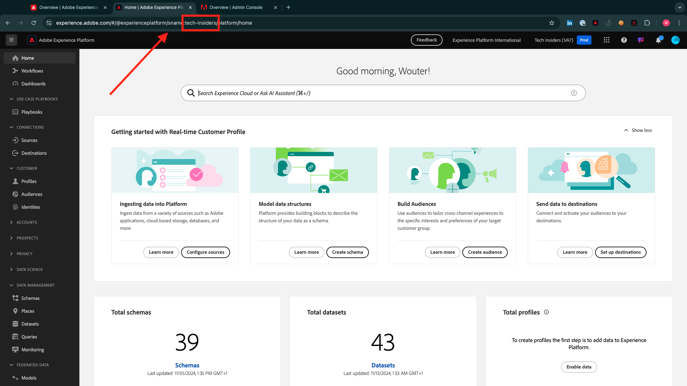

# Installieren der Chrome-Erweiterung für die Experience League-Dokumentation

## Über die Chrome-Erweiterung

Die Dokumentation wurde generisch gestaltet, sodass sie von jedem mithilfe einer beliebigen Adobe Experience Platform-Instanz einfach wiederverwendet werden kann.
Um die Dokumentation wiederverwendbar zu machen, **„Umgebungsvariablen** in der Dokumentation eingeführt, was bedeutet, dass Sie die folgenden **(Platzhalter** in der Dokumentation finden. Jeder Platzhalter ist eine spezifische Variable für eine bestimmte Umgebung. Die Chrome-Erweiterung ändert diese Variable, damit Sie Code und Text aus den Tutorial-Seiten einfach kopieren und in die verschiedenen Benutzeroberflächen einfügen können, die Sie im Rahmen des Tutorials verwenden werden.

Ein Beispiel für solche Werte finden Sie unten. Derzeit können diese Werte noch nicht verwendet werden. Sobald Sie jedoch die Chrome-Erweiterung installieren und aktivieren, werden diese Variablen in normalen Text geändert, den Sie kopieren und wiederverwenden können.

| Name | Schlüssel | Beispiel |
|:-------------:| :---------------:| :---------------:|
| AEP IMS-Organisations-ID | `--aepImsOrgId--` | `907075E95BF479EC0A495C73@AdobeOrg` |
| AEP IMS-Organisationsname | `--aepImsOrgName--` | `Experience Platform International` |
| AEP-Mandanten-ID | `--aepTenantId--` | `_experienceplatform` |
| AEP-Sandbox-Name | `--aepSandboxName--` | `tech-insiders` |
| LDAP für Teilnehmerprofil | `--aepUserLdap--` | `vangeluw` |

Im folgenden Screenshot sehen Sie beispielsweise einen Verweis auf `aepTenantId`.

Sobald die Erweiterung installiert ist, wird derselbe Text automatisch geändert, um Ihre instanzspezifischen Werte widerzuspiegeln.

## Installieren der Chrome-Erweiterung

Um diese Chrome-Erweiterung zu installieren, öffnen Sie den Chrome-Browser und navigieren Sie zu: [https://chromewebstore.google.com/detail/tech-insiders-learning-fo/hhnbkfgioecmhimdhooigajdajplinfi](https://chromewebstore.google.com/detail/tech-insiders-learning-fo/hhnbkfgioecmhimdhooigajdajplinfi). Sie werden es dann sehen.

Klicken Sie **Zu Chrome hinzufügen**.

Sie werden es dann sehen. Klicken Sie **Erweiterung hinzufügen**.

Die Erweiterung wird dann installiert, und es wird eine ähnliche Benachrichtigung angezeigt.

Im **Erweiterungen**-Menü klicken Sie auf das Symbol **Puzzleteil** und heften Sie die Erweiterung **Platform Lernen - Konfiguration** an das Erweiterungsmenü an.

## Konfigurieren der Chrome-Erweiterung

Wechseln Sie zu [https://experienceleague.adobe.com/de/docs/platform-learn/tutorial-comprehensive-technical/overview](https://experienceleague.adobe.com/de/docs/platform-learn/tutorial-comprehensive-technical/overview) und klicken Sie dann auf das Erweiterungssymbol, um es zu öffnen.

Dann sehen Sie dieses Popup. Klicken Sie auf das Symbol **+**.

Geben Sie die Werte wie unten angegeben ein, die sich alle auf Ihre Adobe Experience Platform-Instanz beziehen.

Wenn Sie nicht sicher sind, welche Werte für diese Felder eingegeben werden sollen, befolgen Sie die unten stehende Anleitung.

**Adobe Experience Platform IMS-Organisationsname**

Wenn Sie sich bei Ihrer Adobe Experience Platform-Instanz auf [https://platform.adobe.com/](https://platform.adobe.com/) anmelden, finden Sie den Namen Ihrer Instanz in der oberen rechten Ecke Ihres Bildschirms.

**Adobe Experience Platform IMS-Organisations-ID**

Die IMS-Organisations-ID ist die eindeutige Kennung für Ihre Adobe Experience Cloud-Instanz und wird in diesem Tutorial an mehreren Stellen referenziert.

Das Ermitteln der IMS-Organisations-ID kann auf verschiedene Weise erfolgen. Wenn Sie sich nicht sicher sind, wenden Sie sich an einen Systemadministrator Ihrer Instanz, um die ID zu finden.

Sie können ihn möglicherweise finden, indem Sie zu [Admin Console &#x200B;](https://adminconsole.adobe.com/) wechseln, wo Sie ihn als Teil der URL finden können.

Möglicherweise finden Sie sie auch über das Menü **Daten-Management > Abfragen** in Ihrem Adobe Experience Platform, wo Sie sie unter **Benutzername** finden.

Kopieren Sie den **@AdobeOrgTeil und fügen Sie** ID ein.

**Adobe Experience Platform-Mandanten-ID**

Ihre Mandanten-ID ist die eindeutige Kennung der Adobe Experience Platform-Instanz Ihres Unternehmens. Wenn Sie sich auf [https://platform.adobe.com/](https://platform.adobe.com/) bei Ihrer Adobe Experience Platform-Instanz anmelden, finden Sie die Mandanten-ID in der URL.

Wenn Sie ihn in die Chrome-Erweiterung eingeben, sollten Sie sicherstellen, dass ein Unterstrich als Präfix hinzugefügt wird. In diesem Beispiel **experienceplatform** wird daher **_experienceplatform**. Denken Sie außerdem daran, beim Kopieren aus der URL das Symbol **@** zu entfernen.

**Adobe Experience Platform Sandbox-Name**

Ihr Sandbox-Name ist der Name der Umgebung, die Sie in Ihrer Adobe Experience Platform-Instanz verwenden werden. Wenn Sie sich auf [https://platform.adobe.com/](https://platform.adobe.com/) bei Ihrer Adobe Experience Platform-Instanz anmelden, finden Sie die Mandanten-ID in der URL.

Bevor Sie den Sandbox-Namen aus der URL übernehmen, sollten Sie sicherstellen, dass Sie sich in der Sandbox befinden, die Sie für dieses Tutorial verwenden sollten. Sie können zur rechten Sandbox wechseln, indem Sie auf das Menü Sandbox-Umschalter in der oberen rechten Ecke Ihres Bildschirms klicken.

In diesem Beispiel lautet der Name der Adobe Experience Platform-Sandbox **tech-insiders**.

**Ihr LDAP**

Dies ist der Benutzername, der im Rahmen des Tutorials verwendet wird. In diesem Beispiel basiert das LDAP auf der E-Mail-Adresse dieses Benutzers. Die E-Mail-Adresse lautet **vangeluw@adobe.com** sodass der LDAP zu **vangeluw** wird.

Das LDAP wird verwendet, um sicherzustellen, dass die Konfiguration, die Sie durchführen werden, mit Ihnen verknüpft wird und nicht mit anderen Benutzern in Konflikt gerät, die möglicherweise dieselbe Instanz und Sandbox verwenden, die Sie verwenden.

Ihre Werte sollten in etwa wie folgt aussehen.
Klicken Sie abschließend **Neu erstellen**.

Im linken Menü der Erweiterung wird jetzt ein neues Symbol mit den Initialen Ihrer Umgebung angezeigt. Klicken Sie darauf. Anschließend sehen Sie die Zuordnung zwischen den **Umgebungsvariablen** und Ihren spezifischen Adobe Experience Platform-Instanzwerten. Klicken Sie **Konfiguration aktivieren**.

Nach der Aktivierung der Konfiguration wird neben den Initialen der Umgebung ein grüner Punkt angezeigt. Das bedeutet, dass Ihre Umgebung jetzt aktiv ist.

## Überprüfen des Tutorial-Inhalts

Gehen Sie als Test zu [diese Seite](https://experienceleague.adobe.com/de/docs/platform-learn/tutorial-comprehensive-technical/datadistiller/module51/ex4).

Sie sollten nun sehen, dass alle **Umgebungsvariablen** basierend auf der aktivierten Umgebung in der Chrome-Erweiterung durch ihre wahren Werte ersetzt wurden.

Sie sollten jetzt eine ähnliche Ansicht wie die unten haben, in der die Umgebungsvariable `aepTenantId` durch Ihre echte Adobe Experience Platform-Mandanten-ID ersetzt wurde, in diesem Fall **_experienceplatform**.

Nächster Schritt: [Verwenden Sie das Demosystem Weiter , um Ihre Client-Eigenschaft für die Datenerfassung in Adobe Experience Platform einzurichten](./ex2.md)

[Zurück zu den ersten Schritten](./getting-started.md)

[Zurück zu „Alle Module“](./../../../overview.md)
