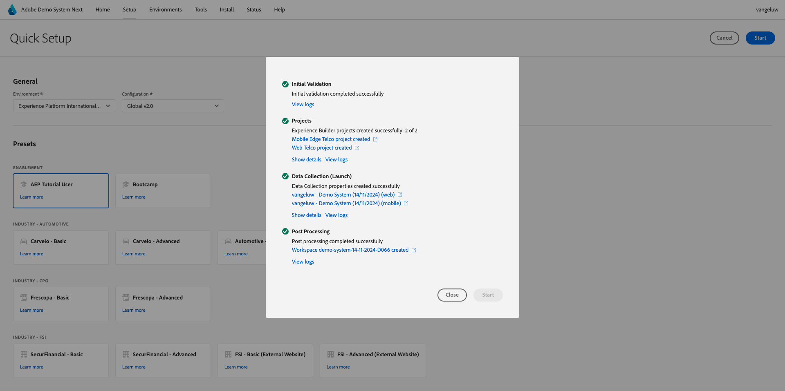

# Verwenden des Demosystems Als Nächstes richten Sie Ihre Client-Eigenschaft für die Adobe Experience Platform-Datenerfassung ein

Um die Lerninhalte in diesem Tutorial zu visualisieren und es Ihnen zu ermöglichen, Ihre Konfiguration in einer sicheren Umgebung zu testen, verwendet dieses Tutorial die Demo System Next-Tools von Adobe. Um dieses Tutorial optimal nutzen zu können, muss Ihre Adobe Experience Platform-Instanz so konfiguriert sein, dass sie als Nächstes in das Demosystem integriert wird.

Sobald Sie Zugriff auf das Demosystem haben, fahren Sie mit den folgenden Schritten fort.

Navigieren Sie zu [https://dsn.adobe.com/](https://dsn.adobe.com/) und dann zu **Setup**.

Wählen Sie **Dropdown-** „Umgebung“ Ihre Adobe Experience Platform-Instanz und Sandbox aus.

Wählen Sie als Nächstes die Voreinstellung **AEP-Tutorial-Benutzer** aus.

Klicken Sie anschließend auf **Starten**.

Geben Sie im Popup einen Namen für Ihre Datenerfassungseigenschaften und Experience Builder-Projekte ein. Verwenden Sie diese Namenskonvention: **Demosystem (TT/MM/JJJJ)**. Zu Ihrer Information: Ihr LDAP wird automatisch angehängt, Sie müssen es nicht selbst hinzufügen.

Klicken Sie auf **Starten**.

Anschließend wird dieses Popup angezeigt, in dem der Fortschritt beim Erstellen Ihrer Website- und Mobile-App-Projekte und Ihrer Datenerfassungseigenschaften angezeigt wird.

Sobald der Schnelleinrichtungsprozess abgeschlossen ist, verfügen Sie über:

- 1 Webprojekt, das die Nutzung einer Demo-Website mit einer Demo-Marke von Telco ermöglicht
- 1 Mobile-App-Projekt, das die Verwendung einer Demo-App mit einer Demo-Marke von Telco ermöglicht
- 1 CX-App-Projekt, das die Verwendung einer Call-Center-App mit einer Demo-Marke von Telco ermöglicht
- 1 Datenerfassungseigenschaft für das Web, mit der Sie Daten von der Website erfassen
- 1 Datenerfassungseigenschaft für Mobilgeräte, mit der Sie Daten aus der Mobile App erfassen

Lassen Sie diesen Bildschirm offen, da Sie ihn in den nächsten Schritten benötigen werden.

Nächster Schritt: [Erstellen Sie Ihren Datenstrom](./ex3.md)

[Zurück zu den ersten Schritten](./getting-started.md)

[Zurück zu „Alle Module“](./../../../overview.md)
