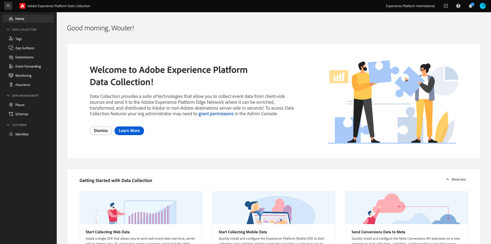

# Erstellen Ihres Datenspeichers

Wechseln Sie zu [https://experience.adobe.com/#/data-collection/](https://experience.adobe.com/#/data-collection/).

Klicken Sie im linken Menü auf **[!UICONTROL Tags]**. Nach der vorherigen Übung verfügen Sie nun über zwei Datenerfassungseigenschaften: eine für Web und eine für Mobile.

Diese Eigenschaften können fast verwendet werden. Bevor Sie mit der Datenerfassung mit diesen Eigenschaften beginnen können, müssen Sie jedoch einen Datastream einrichten. Weitere Informationen dazu, was ein Datastream ist und was es bedeutet, erhalten Sie in einer späteren Übung im Datenerfassungsmodul.

Befolgen Sie zunächst diese Schritte.

## Erstellen Ihres Datenspeichers für das Web

Klicken Sie auf **[!UICONTROL Datastreams]**.

Wählen Sie oben rechts auf Ihrem Bildschirm den Namen Ihrer Sandbox aus, der `--aepSandboxName--` lauten soll.

Klicken Sie auf **[!UICONTROL New Datastream]**.

Geben Sie für den **[!UICONTROL Namen]** und für die optionale Beschreibung `--aepUserLdap-- - Demo System Datastream` ein. Wählen Sie für **Zuordnungsschema** **Demo-System - Ereignisschema für Website (Global v1.1)** aus. Klicken Sie auf **Speichern**.

Dann wirst du das sehen. Klicken Sie auf **Dienst hinzufügen**.

Wählen Sie den Dienst **[!UICONTROL Adobe Experience Platform]** aus, der zusätzliche Felder verfügbar macht. Dann wirst du das sehen.

Wählen Sie für &quot;Ereignis-Datensatz&quot;die Option **Demo-System - Ereignis-Datensatz für Website (Global v1.1)** und wählen Sie für den Profildatensatz **Demo-System - Profildatensatz für Website (Global v1.1)**. Klicken Sie auf **Speichern**.

Das wirst du jetzt sehen.

Das ist es vorerst. In [Modul 1.1](./../../../modules/datacollection/module1.1/data-ingestion-launch-web-sdk.md) erfahren Sie mehr über das Web SDK und die Konfiguration aller seiner Funktionen.

Klicken Sie im linken Menü auf **[!UICONTROL Tags]**.

Filtern Sie die Suchergebnisse, um Ihre beiden Datenerfassungseigenschaften anzuzeigen. Öffnen Sie die Eigenschaft für **Web**, indem Sie darauf klicken.

Dann wirst du das sehen. Klicken Sie auf **Erweiterungen**.

Klicken Sie zuerst auf die Adobe Experience Platform Web SDK-Erweiterung und dann auf **Konfigurieren**.

Dann wirst du das sehen. Machen Sie sich mit dem Menü **Datastreams** vertraut und stellen Sie sicher, dass die richtige Sandbox ausgewählt ist, die in diesem Fall `--aepSandboxName--` sein sollte.

Öffnen Sie das Dropdown-Menü **Datastreams** und wählen Sie den zuvor erstellten Datastream aus.

Stellen Sie sicher, dass Sie Ihren **Datastream** in allen drei verschiedenen Umgebungen ausgewählt haben. Klicken Sie dann auf **Speichern**.

Wechseln Sie zu **Veröffentlichungsfluss**.

Klicken Sie auf den **...** für **Main** und klicken Sie dann auf **Bearbeiten**.

Klicken Sie auf **Alle geänderten Ressourcen hinzufügen** und dann auf **Speichern und für Entwicklung erstellen**.

Ihre Änderungen werden jetzt veröffentlicht und sind in einigen Minuten fertig. Danach wird der grüne Punkt neben **Main** angezeigt.

## Erstellen Ihres Datenspeichers für Mobilgeräte

Wechseln Sie zu [https://experience.adobe.com/#/data-collection/](https://experience.adobe.com/#/data-collection/).

Klicken Sie auf **[!UICONTROL Datastreams]**.

Wählen Sie oben rechts auf Ihrem Bildschirm den Namen Ihrer Sandbox aus, der `--aepSandboxName--` lauten soll.

Klicken Sie auf **[!UICONTROL New Datastream]**.

Geben Sie für den **[!UICONTROL Anzeigenamen]** und für die optionale Beschreibung `--aepUserLdap-- - Demo System Datastream (Mobile)` ein. Wählen Sie für **Zuordnungsschema** **Demo-System - Ereignisschema für mobile App (globale Version 1.1)** aus. Klicken Sie auf **Speichern**.

Klicken Sie auf **[!UICONTROL Speichern]**.

Dann wirst du das sehen. Klicken Sie auf **Dienst hinzufügen**.

Wählen Sie den Dienst **[!UICONTROL Adobe Experience Platform]** aus, der zusätzliche Felder verfügbar macht. Dann wirst du das sehen.

Wählen Sie für &quot;Ereignis-Datensatz&quot;die Option &quot;**Demo-System - Ereignis-Datensatz für mobile App (Global v1.1)**&quot;und wählen Sie für den Profildatensatz &quot;**Demo-System - Profildatensatz für mobile App (Global v1.1)**&quot;. Klicken Sie auf **Speichern**.

Dann wirst du das sehen.

Ihr Datastream kann jetzt in Ihrer Adobe Experience Platform-Datenerfassungs-Client-Eigenschaft für Mobile verwendet werden.

Navigieren Sie zu **Tags** und filtern Sie die Suchergebnisse, um Ihre beiden Datenerfassungseigenschaften anzuzeigen. Öffnen Sie die Eigenschaft für **Mobile**, indem Sie darauf klicken.

Dann wirst du das sehen. Klicken Sie auf **Erweiterungen**.

Klicken Sie auf die Erweiterung **Adobe Experience Platform Edge Network** und dann auf **Konfigurieren**.

Dann wirst du das sehen. Jetzt müssen Sie die richtige Sandbox und den korrekt konfigurierten Datastream auswählen. Die zu verwendende Sandbox ist `--aepSandboxName--` und der Datastream heißt `--aepUserLdap-- - Demo System Datastream (Mobile)`.

Verwenden Sie für die **Edge Network-Domäne** die Standarddomäne.

Klicken Sie auf **Speichern** , um Ihre Änderungen zu speichern.

Wechseln Sie zu **Veröffentlichungsfluss**.

Klicken Sie auf den **...** neben **Main** und klicken Sie dann auf **Bearbeiten**.

Klicken Sie auf **Alle geänderten Ressourcen hinzufügen** und dann auf **Für Entwicklung speichern und erstellen**.

Ihre Änderungen werden jetzt veröffentlicht und sind in einigen Minuten fertig. Danach wird der grüne Punkt neben **Main** angezeigt.

Nächster Schritt: [Verwenden der Website](./ex4.md)

[Zurück zu den ersten Schritten](./getting-started.md)

[Zu allen Modulen zurückkehren](./../../../overview.md)
