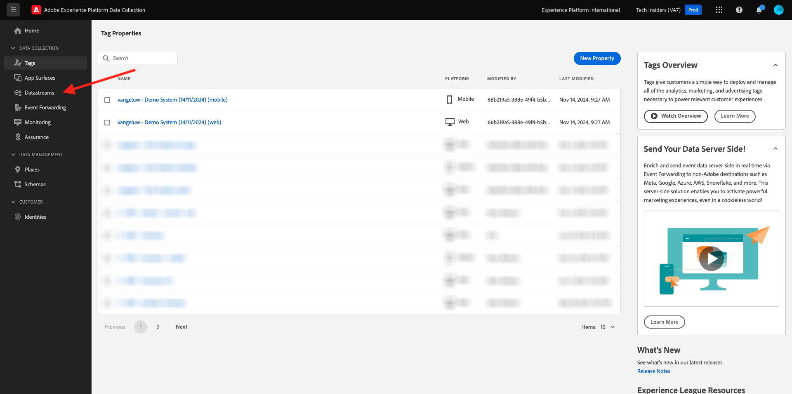
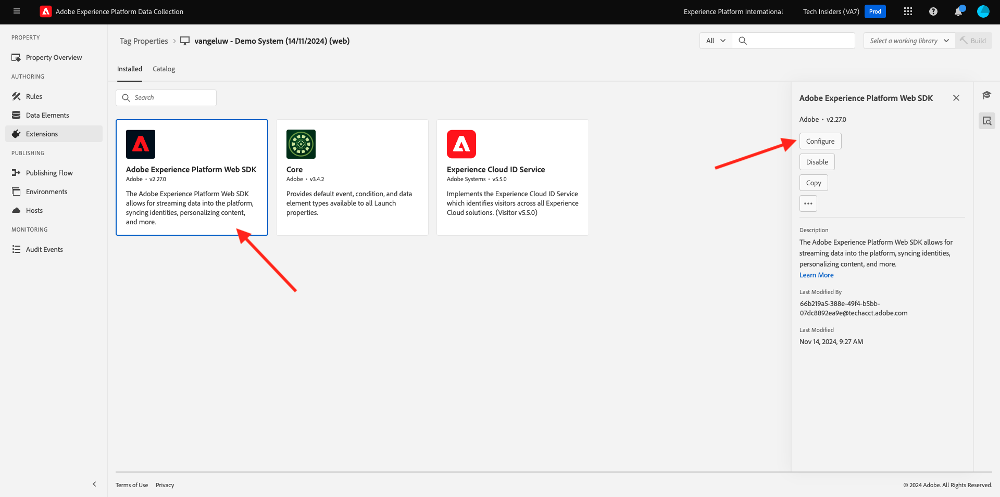

# Erstellen eines Datenstroms

Navigieren Sie zu [https://experience.adobe.com/#/data-collection/](https://experience.adobe.com/#/data-collection/).

Klicken Sie im linken Menü auf &quot;**[!UICONTROL &quot;]**. Nach der vorherigen Übung verfügen Sie jetzt über drei Datenerfassungseigenschaften: eine für das Web, eine für Mobilgeräte und eine für CX-Mobile-Apps.

Diese Eigenschaften sind fast einsatzbereit. Bevor Sie jedoch mit der Datenerfassung mit diesen Eigenschaften beginnen können, müssen Sie einen Datenstrom einrichten. In einer späteren Übung im Datenerfassungsmodul erfahren Sie mehr darüber, was ein Datenstrom ist und was er bedeutet.

Führen Sie zunächst die folgenden Schritte aus.

## Erstellen eines Datenstroms für das Web

Klicken Sie **[!UICONTROL Datenströme]**.

Wählen Sie oben rechts im Bildschirm den Namen Ihrer Sandbox aus, der `--aepSandboxName--` werden soll.

Klicken Sie **[!UICONTROL Neuer Datenstrom]**.

Geben **[!UICONTROL als]** und als optionale Beschreibung `--aepUserLdap-- - Demo System Datastream` ein. Wählen Sie **Zuordnungsschema** die Option **Demosystem - Ereignisschema für Website (Global v1.1)**. Klicken Sie auf **Speichern**.

Sie werden es dann sehen. Klicken Sie **Service hinzufügen**.

Wählen Sie den Dienst **[!UICONTROL Adobe Experience Platform]** aus, wodurch zusätzliche Felder angezeigt werden. Sie werden es dann sehen.

Wählen Sie für den Ereignisdatensatz die Option **Demosystem - Ereignisdatensatz für die Website (Global v1.1)** und für den Profildatensatz die Option **Demosystem - Profildatensatz für die Website (Global v1.1)**. Klicken Sie auf **Speichern**.

Das wirst du jetzt sehen.

Das war&#39;s fürs Erste. In [Modul 1](./../../../modules/datacollection/module1.1/data-ingestion-launch-web-sdk.md)1 erfahren Sie mehr über Web SDK und darüber, wie Sie alle zugehörigen Funktionen konfigurieren können.

Klicken Sie im linken Menü auf &quot;**[!UICONTROL &quot;]**.

Filtern Sie die Suchergebnisse, um Ihre Datenerfassungseigenschaften anzuzeigen. Öffnen Sie die Eigenschaft für **Web** durch Klicken.

Sie werden es dann sehen. Klicken Sie **Erweiterungen**.

Klicken Sie zunächst auf die Adobe Experience Platform Web SDK-Erweiterung und dann auf **Konfigurieren**.

Sie werden es dann sehen. Sehen Sie sich das Menü **Datenströme** an und stellen Sie sicher, dass die richtige Sandbox ausgewählt ist, was in Ihrem Fall `--aepSandboxName--` werden sollte.

Öffnen Sie das **Datenströme** und wählen Sie den zuvor erstellten Datenstrom aus.

Stellen Sie sicher, dass Sie Ihren **Datenstrom** in allen drei verschiedenen Umgebungen ausgewählt haben. Klicken Sie dann auf **Speichern**.

Navigieren Sie **Veröffentlichungsfluss**.

Klicken Sie auf **…** für **Main** und dann auf **Bearbeiten**.

Klicken Sie auf **Alle geänderten Ressourcen hinzufügen** und anschließend auf **Für Entwicklung speichern und erstellen**.

Ihre Änderungen werden jetzt veröffentlicht und sind in einigen Minuten bereit. Danach wird der grüne Punkt neben &quot;**&quot;**.

## Erstellen eines Datenstroms für Mobilgeräte

Navigieren Sie zu [https://experience.adobe.com/#/data-collection/](https://experience.adobe.com/#/data-collection/).

Klicken Sie **[!UICONTROL Datenströme]**.

Wählen Sie oben rechts im Bildschirm den Namen Ihrer Sandbox aus, der `--aepSandboxName--` werden soll.

Klicken Sie **[!UICONTROL Neuer Datenstrom]**.

Geben **[!UICONTROL als Anzeigename]** als optionale Beschreibung `--aepUserLdap-- - Demo System Datastream (Mobile)` ein. Wählen Sie **Zuordnungsschema** die Option **Demosystem - Ereignisschema für Mobile App (Global v1.1)**. Klicken Sie auf **Speichern**.

Klicken Sie auf **[!UICONTROL Speichern]**.

Sie werden es dann sehen. Klicken Sie **Service hinzufügen**.

Wählen Sie den Dienst **[!UICONTROL Adobe Experience Platform]** aus, wodurch zusätzliche Felder angezeigt werden. Sie werden es dann sehen.

Wählen Sie für den Ereignisdatensatz **Demosystem - Ereignisdatensatz für die Mobile App (Global v1.1)** und für den Profildatensatz **Demosystem - Profildatensatz für die Mobile App (Global v1.1)**. Klicken Sie auf **Speichern**.

Sie werden es dann sehen.

Ihr Datenstrom kann jetzt in Ihrer Adobe Experience Platform-Datenerfassungs-Client-Eigenschaft für Mobilgeräte verwendet werden.

Navigieren Sie **Tags** und filtern Sie die Suchergebnisse, um Ihre Datenerfassungseigenschaften anzuzeigen. Öffnen Sie die Eigenschaft für **Mobile**, indem Sie darauf klicken.

Sie werden es dann sehen. Klicken Sie **Erweiterungen**.

Klicken Sie auf die Erweiterung **Adobe Experience PlatformEdge Network** und dann auf **Konfigurieren**.

Sie werden es dann sehen. Jetzt müssen Sie die richtige Sandbox und den richtigen Datenstrom auswählen, die Sie gerade konfiguriert haben. Die zu verwendende Sandbox wird `--aepSandboxName--` und der Datenstrom heißt `--aepUserLdap-- - Demo System Datastream (Mobile)`.

Für die **Edge Network-Domain** verwenden Sie die Standard-Domain.

Klicken Sie **Speichern**, um Ihre Änderungen zu speichern.

Navigieren Sie **Veröffentlichungsfluss**.

Klicken Sie auf **…** neben **Main** und dann auf **Edit**.

Klicken Sie **Alle geänderten Ressourcen hinzufügen** und anschließend auf **Für Entwicklung speichern und erstellen**.

Ihre Änderungen werden jetzt veröffentlicht und sind in einigen Minuten bereit. Danach wird der grüne Punkt neben &quot;**&quot;**.

Nächster Schritt: [Verwenden der Website](./ex4.md)

[Zurück zu den ersten Schritten](./getting-started.md)

[Zurück zu „Alle Module“](./../../../overview.md)
