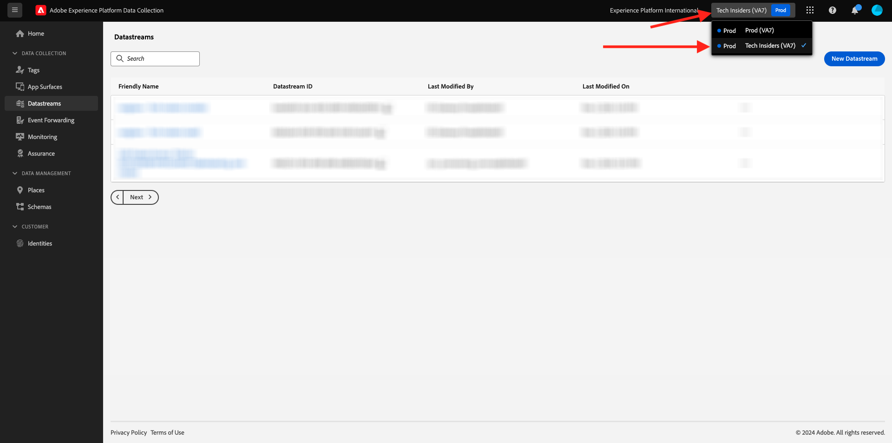
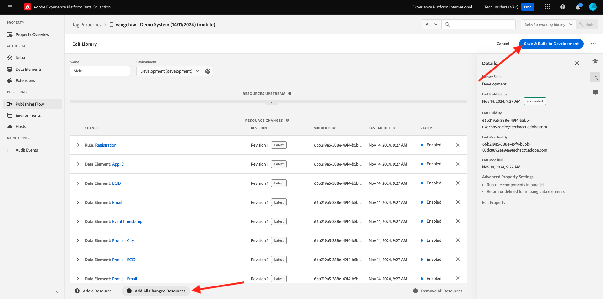

# 0.3 Datenspeicher erstellen

Wechseln Sie zu [https://experience.adobe.com/#/data-collection/](https://experience.adobe.com/#/data-collection/). Nach der vorherigen Übung verfügen Sie nun über zwei Datenerfassungseigenschaften: eine für Web und eine für Mobile.

Diese Eigenschaften können fast verwendet werden. Bevor Sie mit der Datenerfassung mit diesen Eigenschaften beginnen können, müssen Sie jedoch einen Datastream einrichten. Sie erhalten weitere Informationen über das Konzept, was ein Datastream ist und was es in Übung 1.2 bedeutet.

Befolgen Sie zunächst diese Schritte.

## 0.3.1 Erstellen Ihres Datenspeichers für Web

Klicken Sie auf **[!UICONTROL Datastreams]** oder **[!UICONTROL Datastreams (Beta)]**.

Wählen Sie oben rechts auf Ihrem Bildschirm den Namen Ihrer Sandbox aus, der `--aepSandboxId--` lauten soll.

Klicken Sie auf **[!UICONTROL New Datastream]**.

Geben Sie für den **[!UICONTROL Anzeigenamen]** und für die optionale Beschreibung `--demoProfileLdap-- - Demo System Datastream` ein. Wählen Sie für das Ereignisschema **Demo-System - Ereignisschema für Website (Global v1.1)** aus. Klicken Sie auf **Speichern**.

Dann wirst du das sehen. Klicken Sie auf **Dienst hinzufügen**.

Wählen Sie den Dienst **[!UICONTROL Adobe Experience Platform]** aus, der zusätzliche Felder verfügbar macht. Dann wirst du das sehen.

Wählen Sie für &quot;Ereignis-Datensatz&quot;die Option **Demo-System - Ereignis-Datensatz für Website (Global v1.1)** und wählen Sie für den Profildatensatz **Demo-System - Profildatensatz für Website (Global v1.1)**. Klicken Sie auf **Speichern**.

Das wirst du jetzt sehen.

Das ist es vorerst. In [Modul 1.1](./../../../modules/datacollection/module1.1/data-ingestion-launch-web-sdk.md) erfahren Sie mehr über das Web SDK und die Konfiguration aller seiner Funktionen.

Klicken Sie im linken Menü auf **[!UICONTROL Tags]**.

Filtern Sie die Suchergebnisse, um Ihre beiden Datenerfassungseigenschaften anzuzeigen. Öffnen Sie die Eigenschaft für **Web**, indem Sie darauf klicken.

Dann wirst du das sehen. Klicken Sie auf **Erweiterungen**.

Klicken Sie in der Adobe Experience Platform Web SDK-Erweiterung auf **Konfigurieren**.

Dann wirst du das sehen. Für **Datastreams** sehen Sie derzeit einen Platzhalterwert, der auf 1 gesetzt ist. Sie müssen jetzt auf das Optionsfeld **Aus Liste auswählen** klicken. Wählen Sie in der Dropdown-Liste den zuvor erstellten Datastream aus.

Stellen Sie sicher, dass Sie Ihren **Datastream** ausgewählt haben. TIPP: Sie können die Ergebnisse im Dropdown-Menü einfach filtern, indem Sie Ihren `--demoProfileLdap--` eingeben.

Scrollen Sie nach unten, bis **Datenerfassung** angezeigt wird. Stellen Sie sicher, dass das Kontrollkästchen für **Klick-Datenerfassung aktivieren** nicht aktiviert ist. Klicken Sie auf **Speichern** , um Ihre Änderungen zu speichern.

Wechseln Sie zu **Veröffentlichungsfluss**.

Klicken Sie auf den **...** für **Main** und klicken Sie dann auf **Bearbeiten**.

Klicken Sie auf **Alle geänderten Ressourcen hinzufügen** und dann auf **Speichern und für Entwicklung erstellen**.

Ihre Änderungen werden jetzt veröffentlicht und sind in einigen Minuten fertig.

## 0.3.2 Datenspeicher für Mobilgeräte erstellen

Wechseln Sie zu [https://experience.adobe.com/#/data-collection/](https://experience.adobe.com/#/data-collection/).

Klicken Sie auf **[!UICONTROL Datastreams]** oder **[!UICONTROL Datastreams (Beta)]**.

Wählen Sie oben rechts auf Ihrem Bildschirm den Namen Ihrer Sandbox aus, der `--aepSandboxId--` lauten soll.

Klicken Sie auf **[!UICONTROL New Datastream]**.

Geben Sie für den **[!UICONTROL Anzeigenamen]** und für die optionale Beschreibung `--demoProfileLdap-- - Demo System Datastream (Mobile)` ein. Wählen Sie für das Ereignisschema **Demo-System - Ereignisschema für mobile App (globale Version 1.1)** aus. Klicken Sie auf **Speichern**.

Klicken Sie auf **[!UICONTROL Speichern]**.

Dann wirst du das sehen. Klicken Sie auf **Dienst hinzufügen**.

Wählen Sie den Dienst **[!UICONTROL Adobe Experience Platform]** aus, der zusätzliche Felder verfügbar macht. Dann wirst du das sehen.

Wählen Sie für &quot;Ereignis-Datensatz&quot;die Option &quot;**Demo-System - Ereignis-Datensatz für mobile App (Global v1.1)**&quot;und wählen Sie für den Profildatensatz &quot;**Demo-System - Profildatensatz für mobile App (Global v1.1)**&quot;. Klicken Sie auf **Speichern**.

Dann wirst du das sehen.

Ihr Datastream kann jetzt in Ihrer Adobe Experience Platform-Datenerfassungs-Client-Eigenschaft für Mobile verwendet werden.

Navigieren Sie zu **Tags** und filtern Sie die Suchergebnisse, um Ihre beiden Datenerfassungseigenschaften anzuzeigen. Öffnen Sie die Eigenschaft für **Mobile**, indem Sie darauf klicken.

Dann wirst du das sehen. Klicken Sie auf **Erweiterungen**.

Klicken Sie in der Erweiterung **Adobe Experience Platform Edge Network** auf **Konfigurieren**.

Dann wirst du das sehen. Jetzt müssen Sie die richtige Sandbox und den korrekt konfigurierten Datastream auswählen. Die zu verwendende Sandbox ist `--aepSandboxId--` und der Datastream heißt `--demoProfileLdap-- - Demo System Datastream (Mobile)`.

Verwenden Sie für die **Edge Network-Domäne** die Standarddomäne **edge.adobedc.net**.

Klicken Sie auf **Speichern** , um Ihre Änderungen zu speichern.

Wechseln Sie zu **Veröffentlichungsfluss**.

Klicken Sie auf den **...** neben **Main** und klicken Sie dann auf **Bearbeiten**.

Klicken Sie auf **Alle geänderten Ressourcen hinzufügen** und dann auf **Für Entwicklung speichern und erstellen**.

Ihre Änderungen werden jetzt veröffentlicht und sind in einigen Minuten fertig.

Nächster Schritt: [0.4 Website verwenden](./ex4.md)

[Zurück zu Modul 0](./getting-started.md)

[Zu allen Modulen zurückkehren](./../../../overview.md)