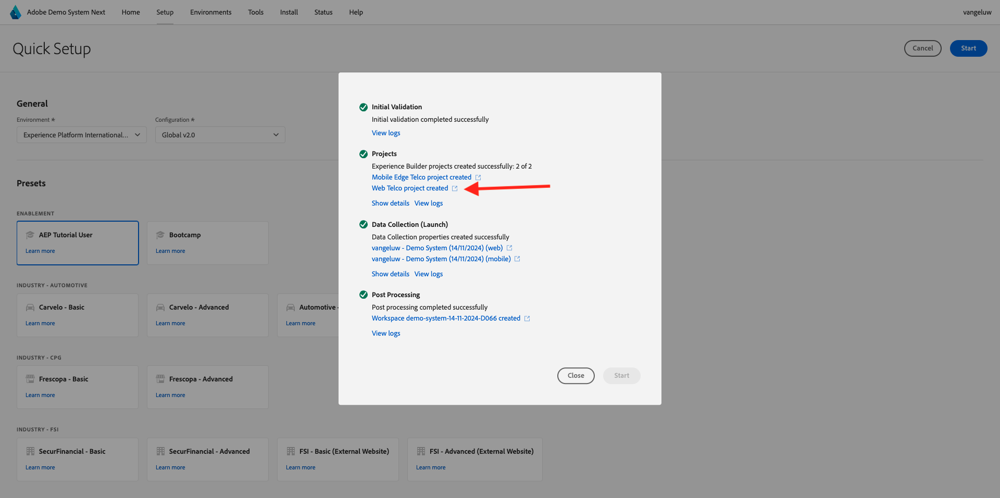

# Website verwenden

## Option 1: Fortsetzung der vorherigen Übung

>[!NOTE]
>
>Wenn Sie den unten angezeigten Bildschirm nicht mehr geöffnet haben, gehen Sie stattdessen zu Option 2 .

Nach der vorherigen Übung hatten Sie dieses Ergebnis. Klicken Sie auf , um das für Sie erstellte **Web Telco-Projekt** zu öffnen.

Dann wirst du das sehen. Klicken Sie auf **Integrationen**.

Wählen Sie auf der Seite **Integrationen** die Eigenschaft &quot;Datenerfassung&quot;aus, die in der vorherigen Übung erstellt wurde. Klicken Sie dazu auf **Umgebung auswählen**.

Klicken Sie auf **Auswählen** in der Eigenschaft &quot;Datenerfassung&quot;, die im vorherigen Schritt erstellt wurde und den Namen `--aepUserLdap - Demo System (DD/MM/YYYY) (web)` trägt.

Dann wirst du das sehen. Klicken Sie auf **Ausführen** , um die Demowebsite zu öffnen.

Sie werden dann Ihre Demowebsite öffnen sehen. Wählen Sie die URL aus und kopieren Sie sie in die Zwischenablage.

Öffnen Sie ein neues Inkognito-Browserfenster.

Fügen Sie die URL Ihrer Demo-Website ein, die Sie im vorherigen Schritt kopiert haben. Sie werden dann aufgefordert, sich mit Ihrer Adobe ID anzumelden.

Wählen Sie Ihren Kontotyp aus und schließen Sie den Anmeldevorgang ab.

Sie sehen dann Ihre Website in einem Inkognito-Browser-Fenster geladen. Für jede Demonstration müssen Sie ein neues Inkognito-Browser-Fenster verwenden, um Ihre Demo-Website-URL zu laden.

## Option 2: Mit einem neuen Inkognito-Browser-Fenster beginnen

Falls Sie Ihr Browser-Fenster versehentlich geschlossen haben oder für zukünftige Sitzungen, können Sie auch auf Ihr Website-Projekt zugreifen, indem Sie [https://dsn.adobe.com/](https://dsn.adobe.com/) aufrufen. Nach der Anmeldung bei Ihrer Adobe ID sehen Sie dies. Klicken Sie auf die drei Punkte **..** im Website-Projekt und klicken Sie dann auf **Bearbeiten**.

Sie können nun den unten stehenden Fluss zum Zugriff auf die Website ausführen. Klicken Sie auf **Integrationen**.

Wählen Sie auf der Seite **Integrationen** die Eigenschaft &quot;Datenerfassung&quot;aus, die in der vorherigen Übung erstellt wurde. Klicken Sie dazu auf **Umgebung auswählen**.

Klicken Sie auf **Auswählen** in der Eigenschaft &quot;Datenerfassung&quot;, die im vorherigen Schritt erstellt wurde und den Namen `--aepUserLdap - Demo System (DD/MM/YYYY) (web)` trägt.

Dann wirst du das sehen. Klicken Sie auf **Ausführen** , um die Demowebsite zu öffnen.

Sie werden dann Ihre Demowebsite öffnen sehen. Wählen Sie die URL aus und kopieren Sie sie in die Zwischenablage.

Öffnen Sie ein neues Inkognito-Browserfenster.

Fügen Sie die URL Ihrer Demo-Website ein, die Sie im vorherigen Schritt kopiert haben. Sie werden dann aufgefordert, sich mit Ihrer Adobe ID anzumelden.

Wählen Sie Ihren Kontotyp aus und schließen Sie den Anmeldevorgang ab.

Sie sehen dann Ihre Website in einem Inkognito-Browser-Fenster geladen. Für jede Demonstration müssen Sie ein neues Inkognito-Browser-Fenster verwenden, um Ihre Demo-Website-URL zu laden.

Nächster Schritt: [Verwenden der mobilen App](./ex5.md)

[Zurück zu den ersten Schritten](./getting-started.md)

[Zu allen Modulen zurückkehren](./../../../overview.md)
