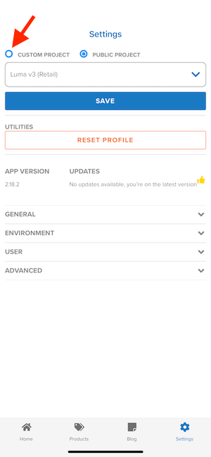

# 0.5 Mobile App verwenden

## 0.5.1 App herunterladen

Wechseln Sie auf Ihrem Computer zu &quot;[https://bit.ly/dx-demo-app](https://bit.ly/dx-demo-app)&quot;. Dann wirst du das sehen.

Verwenden Sie die App **Kamera** auf Ihrem Smartphone, um die App für das Betriebssystem Ihres Geräts zu installieren. Für diese Aktivierung müssen Sie die **Version 2.x** installieren, die die Adobe Experience Platform Mobile SDKs verwendet.

>[!NOTE]
>
>Nachdem Sie die App zum ersten Mal auf einem iOS-Gerät installiert haben, erhalten Sie möglicherweise eine Fehlermeldung, wenn Sie versuchen, die App zu öffnen, in der steht: **Nicht vertrauenswürdiger Enterprise-Entwickler**. Um dies zu beheben, müssen Sie zu &quot;**Einstellungen > Allgemein > Geräteverwaltung > Adobe Systems Inc.**&quot;gehen und auf &quot;**Trust Adobe Systems Inc.**&quot;klicken.

Sobald die App installiert ist, finden Sie sie auf dem Startbildschirm Ihres Geräts. Klicken Sie auf das Symbol, um die App zu öffnen.

Wenn Sie die App zum ersten Mal verwenden, werden Sie aufgefordert, sich mit Ihrer Adobe ID anzumelden. Schließen Sie den Anmeldevorgang ab.

Nach der Anmeldung wird eine Benachrichtigung angezeigt, in der Sie um Ihre Berechtigung zum Senden von Benachrichtigungen ersucht werden. Wir senden Benachrichtigungen als Teil des Tutorials. Klicken Sie daher auf **Zulassen**.

Sie sehen dann die Startseite der App. Wechseln Sie zu **Einstellungen**.

In den Einstellungen wird angezeigt, dass derzeit ein **öffentliches Projekt** in die App geladen ist. Klicken Sie auf **Benutzerdefiniertes Projekt**.

Sie können jetzt ein benutzerdefiniertes Projekt laden. Klicken Sie auf den QR-Code, um Ihr Projekt einfach zu laden.

Nach Übung 0.1 hatten Sie dieses Ergebnis. Klicken Sie auf , um das für Sie erstellte Projekt **Mobile Retail** zu öffnen.

Falls Sie Ihr Browser-Fenster versehentlich geschlossen haben oder für zukünftige Demo- oder Aktivierungssitzungen, können Sie auch auf Ihr Website-Projekt zugreifen, indem Sie [https://builder.adobedemo.com/projects](https://builder.adobedemo.com/projects) aufrufen. Nach der Anmeldung bei Ihrer Adobe ID sehen Sie dies. Klicken Sie auf Ihr Mobile-App-Projekt, um es zu öffnen.

Dann wirst du das sehen. Klicken Sie auf **Integrationen**.

Sie müssen die Datenerfassungseigenschaft für Mobilgeräte auswählen, die in Übung 0.1 erstellt wurde. Klicken Sie anschließend auf **Ausführen**.

Dann sehen Sie dieses Popup, das einen QR-Code enthält. Scannen Sie diesen QR-Code aus der Mobile App heraus.

Anschließend wird Ihre Projekt-ID in der App angezeigt. Anschließend können Sie auf **Speichern** klicken.

Gehen Sie in der App zurück zu **Home** . Ihre App kann jetzt verwendet werden.

Sie haben jetzt Modul 0 abgeschlossen.

[Zurück zu Modul 0](./getting-started.md)

[Zu allen Modulen zurückkehren](./../../../overview.md)
