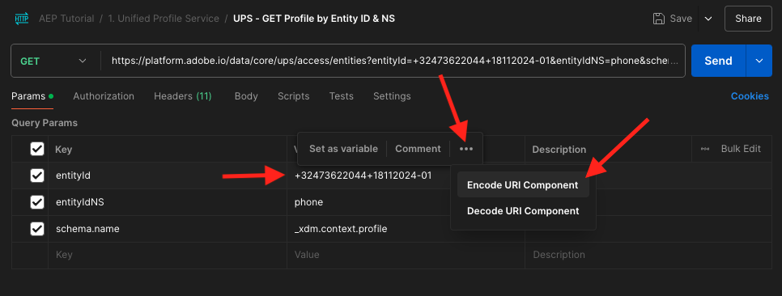
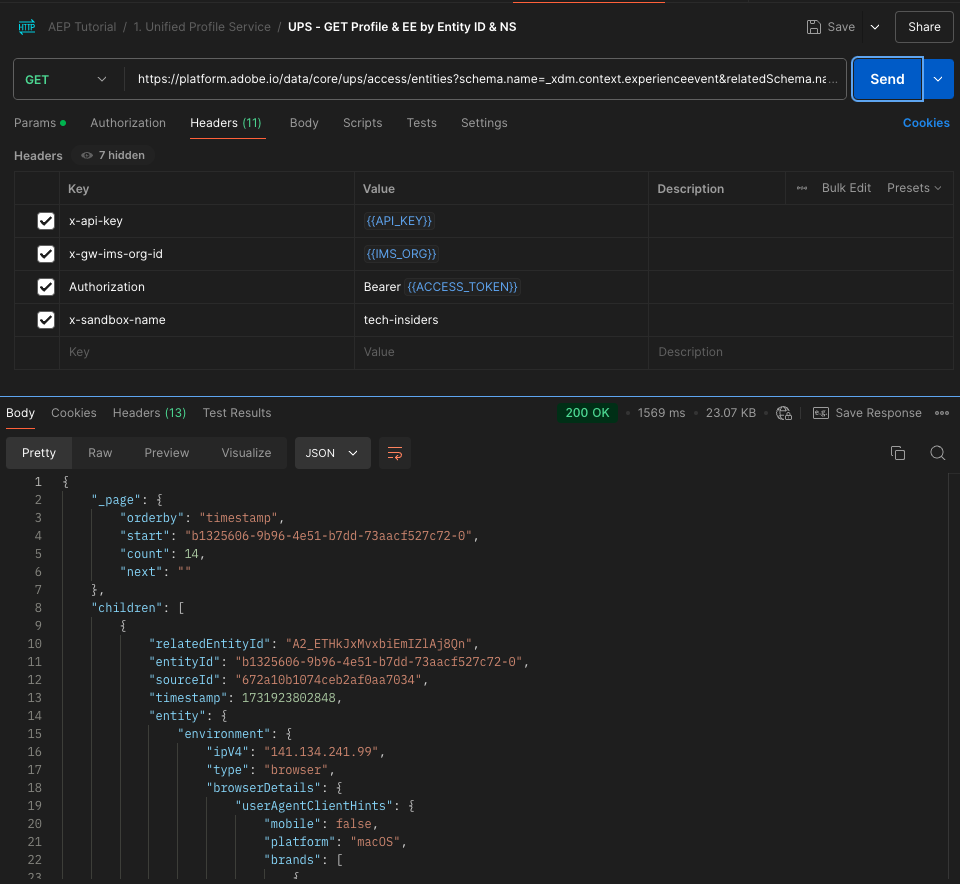

# 2.1.3 Visualisieren Ihres eigenen Echtzeit-Kundenprofils - API

In dieser Übung verwenden Sie Postman und Adobe I/O, um die APIs von Adobe Experience Platform abzufragen und Ihr eigenes Echtzeit-Kundenprofil anzuzeigen.

## Kontext

Im Echtzeit-Kundenprofil werden alle Profildaten zusammen mit Ereignisdaten sowie vorhandene Zielgruppenzugehörigkeiten angezeigt. Die angezeigten Daten können von überall, aus Adobe-Anwendungen und externen Lösungen stammen. Dies ist die leistungsfähigste Ansicht in Adobe Experience Platform, dem Erlebnissystem für Aufzeichnungen.

Das Echtzeit-Kundenprofil kann von allen Adobe-Anwendungen, aber auch von externen Lösungen wie Callcentern oder In-Store-Clienteling-Apps genutzt werden. Dazu müssen diese externen Lösungen mit den APIs von Adobe Experience Platform verbunden werden.

## Ihre Kennungen

Im Profil-Viewer-Bereich auf der Website können Sie mehrere Identitäten finden. Jede Identität ist mit einem Namespace verknüpft.


Auf dem Röntgenpanel können wir 4 verschiedene Kombinationen von IDs und Namespaces sehen:

| Identität | Namespace |
|:-------------:| :---------------:|
| Experience Cloud-ID (ECID) | 79943948563923140522865572770524243489 |
| Experience Cloud-ID (ECID) | 70559351147248820114888181867542007989 |
| E-Mail-ID | woutervangeluwe+18112024-01@gmail.com |
| Mobiltelefonnummer-ID | +32473622044+18112024-01 |

Diese Kennungen für den nächsten Schritt speichern.

## Konfigurieren des Adobe I/O-Projekts

In dieser Übung verwenden Sie Adobe I/O sehr intensiv, um Abfragen zu den APIs von Platform durchzuführen. Gehen Sie wie folgt vor, um Adobe I/O einzurichten.

Wechseln Sie zu [https://developer.adobe.com/console/home](https://developer.adobe.com/console/home)


Wählen Sie die richtige Adobe Experience Platform-Instanz oben rechts im Bildschirm aus. Ihre Instanz ist `--aepImsOrgName--`. Klicken Sie **Neues Projekt erstellen**.


Wählen Sie **+ Zu Projekt hinzufügen** dann **API** aus.


Sie sehen dann Folgendes:


Wählen Sie **Experience Platform-API** und klicken Sie auf **Weiter**.


Das wirst du jetzt sehen. Geben Sie einen Namen für Ihre Berechtigung ein: `--aepUserLdap-- - OAuth credential`. Klicken Sie auf **Weiter**.


Als Nächstes müssen Sie ein Produktprofil auswählen, das definiert, welche Berechtigungen für diese Integration verfügbar sind.

Wählen Sie die erforderlichen Produktprofile aus.

>[!NOTE]
>
> Produktprofilnamen variieren in Ihrer Adobe Experience Platform-Instanz, da sie instanzspezifisch sind. Sie müssen mindestens ein Produktprofil mit den entsprechenden Zugriffsrechten auswählen, die in der Benutzeroberfläche &quot;Adobe Admin Console&quot; und „AEP-Berechtigungen“ eingerichtet sind.

Klicken Sie **Konfigurierte API speichern**.


Ihre Adobe I/O-Integration ist jetzt bereit.


Klicken Sie auf **Für Postman herunterladen** und anschließend auf **OAuth Server-zu-Server**, um eine Postman-Umgebung herunterzuladen (warten Sie, bis die Umgebung heruntergeladen wurde. Dies kann einige Sekunden dauern).


Ihr IO-Projekt hat derzeit einen generischen Namen. Sie müssen Ihrer Integration einen Anzeigenamen geben. Klicken Sie auf **Projekt X** (oder einen ähnlichen Namen) wie angegeben


Klicken Sie **Projekt bearbeiten**.


Geben Sie einen Namen und eine Beschreibung für Ihre Integration ein: `--aepUserLdap-- AEP Tutorial`.

Klicken Sie auf **Speichern**.


Ihre Adobe I/O-Integration ist jetzt abgeschlossen.


>[!NOTE]
>
>In einem zusätzlichen Schritt wird sichergestellt, dass dieses Adobe I/O-Projekt Zugriff auf die Berechtigungseinstellungen von Adobe Experience Platform hat. Die API-Anmeldeinformationen Ihres Projekts müssen der Benutzeroberfläche „Berechtigungen“ von Adobe Experience Platform hinzugefügt werden, für die Systemadministrator-Zugriffsrechte erforderlich sind. Die Schritte sind unten dokumentiert. Möglicherweise müssen Sie sich jedoch an Ihren Systemadministrator wenden, damit diese Informationen verarbeitet werden, falls Sie nicht über die erforderlichen Zugriffsrechte verfügen.

## AEP-Berechtigungen für API-Anmeldedaten

Zu [Adobe Experience Platform](https://experience.adobe.com/platform). Nach dem Login landen Sie auf der Homepage von Adobe Experience Platform.

Gehen Sie **Berechtigungen**, zu **Rollen** und klicken Sie auf das entsprechende Produktprofil.

>[!NOTE]
>
> Produktprofilnamen variieren in Ihrer Adobe Experience Platform-Instanz, da sie instanzspezifisch sind. Sie müssen mindestens ein Produktprofil mit den entsprechenden Zugriffsrechten auswählen, die in der Benutzeroberfläche &quot;Adobe Admin Console&quot; und „AEP-Berechtigungen“ eingerichtet sind.


Klicken Sie auf **API-Anmeldeinformationen**.


Klicken Sie auf **+ API-Anmeldeinformationen hinzufügen**.


Wählen Sie das neu erstellte Adobe I/O-Projekt aus und klicken Sie auf **Speichern**.


## Authentifizierung beim Adobe I/O

>[!IMPORTANT]
>
>Wenn Sie Adobe-Mitarbeiter sind, befolgen Sie bitte die Anweisungen hier zur Verwendung von [PostBuster](./../../../postbuster.md).

Navigieren Sie zu [https://www.postman.com/downloads/](https://www.postman.com/downloads/).

Laden Sie die entsprechende Version von Postman für Ihr Betriebssystem herunter und installieren Sie sie.


Starten Sie die Anwendung nach der Installation von Postman.

In Postman gibt es zwei Konzepte: Umgebungen und Sammlungen.

- Die Umgebung enthält alle Ihre Umgebungsvariablen, die mehr oder weniger konsistent sind. In der -Umgebung finden Sie Dinge wie die IMS-Org unserer Platform-Umgebung zusammen mit Sicherheitsberechtigungen wie Ihren privaten Schlüssel und andere. Die Umgebungsdatei ist die Datei, die Sie während des Adobe I/O-Setups in der vorherigen Übung heruntergeladen haben. Sie hat folgenden Namen: **`oauth_server_to_server.postman_environment.json`**.

- Die Sammlung enthält eine Reihe von API-Anfragen, die Sie verwenden können. Wir werden 2 Kollektionen verwenden
   - 1 Sammlung zur Authentifizierung beim Adobe I/O
   - 1 Sammlung für die Übungen in diesem Modul
   - 1 Sammlung für die Übungen im Real-Time CDP-Modul zur Zielerstellung

Bitte laden Sie die Datei [postman.zip](./../../../assets/postman/postman_profile.zip) auf Ihren lokalen Desktop herunter.

In dieser **postman.zip**-Datei finden Sie die folgenden Dateien:

- `Adobe IO - OAuth.postman_collection.json`
- `AEP Tutorial.postman_collection.json`
- `Destination_Authoring_API.json`

Entpacken Sie die Datei **postman.zip** und speichern Sie diese drei Dateien in einem Ordner auf Ihrem Desktop, zusammen mit der heruntergeladenen Postman-Umgebung von Adobe I/O. Sie müssen die folgenden vier Dateien in diesem Ordner haben:


Zurück zu Postman. Klicken Sie **Importieren**.


Klicken Sie auf **Dateien**.


Navigieren Sie zu dem Ordner auf Ihrem Desktop, in den Sie die vier heruntergeladenen Dateien extrahiert haben. Wählen Sie diese vier Dateien gleichzeitig aus und klicken Sie auf **Öffnen**.


Nachdem Sie auf **Öffnen** geklickt haben, zeigt Ihnen Postman einen Überblick über die Umgebung und die Sammlungen, die Sie importieren möchten. Klicken Sie **Importieren**.


Jetzt verfügen Sie über alle Funktionen in Postman, die Sie benötigen, um über APIs mit Adobe Experience Platform zu interagieren.

Zunächst müssen Sie sicherstellen, dass Sie ordnungsgemäß authentifiziert sind. Um authentifiziert zu werden, müssen Sie ein Zugriffs-Token anfordern.

Stellen Sie sicher, dass Sie die richtige Umgebung ausgewählt haben, bevor Sie eine Anfrage ausführen. Sie können die aktuell ausgewählte Umgebung überprüfen, indem Sie die Dropdown-Liste Umgebung oben rechts überprüfen.

Die ausgewählte Umgebung sollte einen Namen haben, der `--aepUserLdap-- OAuth Credential` diesem ähnelt.


Ihre Postman-Umgebung und Sammlungen sind jetzt konfiguriert und funktionieren. Sie können sich jetzt von Postman auf Adobe I/O authentifizieren.

Wählen Sie in der Sammlung **Adobe-IO - OAuth** die Anfrage mit dem Namen **POST - Zugriffs-Token abrufen**. Klicken Sie auf **Senden**.


Nach einigen Sekunden sollte eine Antwort im Abschnitt **Hauptteil** von Postman angezeigt werden:


Wenn Ihre Konfiguration erfolgreich war, sollte eine ähnliche Antwort mit den folgenden Informationen angezeigt werden:

| Schlüssel | Wert |
|:-------------:| :---------------:| 
| token_type | **Bearer** |
| access_token | **eyJhbGciOiJSU…jrNZ6mdaQ** |
| expires_in | **86399** |

Adobe I/O hat Ihnen ein **Bearer**-Token mit einem bestimmten Wert (dem sehr langen Zugriffs-Token) und einem Gültigkeitsfenster gegeben.

Das Token, das wir erhalten haben, ist jetzt 24 Stunden lang gültig. Wenn Sie also nach 24 Stunden Postman zur Authentifizierung bei Adobe I/O verwenden möchten, müssen Sie ein neues Token generieren, indem Sie diese Anfrage erneut ausführen.

## Echtzeit-Kundenprofil-API, Schema: Profil

Jetzt können Sie Ihre erste Anfrage an die Echtzeit-Kundenprofil-APIs von Platform senden.

Suchen Sie in Postman die Sammlung **AEP-Tutorial**.


in **1. Unified Profile Service** klicken Sie auf die erste Anfrage mit dem Namen **UPS - GET Profile by Entity ID &amp; NS**.


Für diese Anfrage gibt es drei erforderliche Variablen:

| Schlüssel | Wert | Definition |
|:-------------:| :---------------:| :---------------:| 
| entityId | **id** | die spezifische Kunden-ID |
| entityIdNS | **namespace** | Der spezifische Namespace, der für die ID gilt |
| schema.name | **_xdm.context.profile** | Das spezifische Schema, für das Sie Informationen erhalten möchten |

Wenn Sie also die APIs von Adobe Experience Platform bitten möchten, Ihnen alle Profilinformationen für Ihre eigene ECID zurückzugeben, müssen Sie die Anfrage wie folgt konfigurieren:

| Schlüssel | Wert |
|:-------------:| :---------------:| 
| entityId | **yourECID** |
| entityIdNS | **ECID** |
| schema.name | **_xdm.context.profile** |


Sie sollten auch die Felder **Kopfzeile** - Ihrer Anfrage überprüfen. Navigieren Sie zu **Kopfzeilen**. Sie sehen dann Folgendes:


>[!NOTE]
>
>Sie müssen den Namen der von Ihnen verwendeten Adobe Experience Platform-Sandbox angeben. Ihr x-sandbox-name sollte `--aepSandboxName--` sein.

| Schlüssel | Wert |
| ----------- | ----------- |
| x-sandbox-name | `--aepSandboxName--` |


Nachdem Sie den Sandbox-Namen überprüft haben, klicken Sie auf **Senden**, um Ihre Anfrage an Platform zu senden.

Sie sollten sofort eine Antwort von Platform erhalten, die Ihnen so etwas zeigt:


Dies ist die vollständige Antwort von Platform:

```javascript
{
    "A2_ETHkJxMvxbiEmIZlAj8Qn": {
        "entityId": "A2_ETHkJxMvxbiEmIZlAj8Qn",
        "mergePolicy": {
            "id": "64e4b0ed-dfc3-4084-8e67-643e977168d7"
        },
        "sources": [
            "672a10cdb015162aefedfc0f",
            "672a10b1a05e282aee19737c"
        ],
        "tags": [
            "0938B898-469A-4513-8E86-87464307120F:va7",
            "3ba34930-405e-4b31-aafa-bac22d35203e:va7"
        ],
        "identityGraph": [
            "G7z3JAFBY4I6Rzg",
            "A2_ETHkJxMvxbiEmIZlAj8Qn",
            "BkFvK4QcJpSPByuDGF4UAS0wMQ",
            "BUF9zMKLrXq72p4HpbsHv1SDGF4UAS0wMUBnbWFpbC5jb20",
            "A29btmFXmrfrYbXQWISCT9ZD"
        ],
        "entity": {
            "_experienceplatform": {
                "identification": {
                    "core": {
                        "ecid": "79943948563923140522865572770524243489",
                        "phoneNumber": "+32473622044+18112024-01",
                        "email": "woutervangeluwe+18112024-01@gmail.com"
                    }
                }
            },
            "userAccount": {
                "ID": "3688250"
            },
            "pushNotificationDetails": [
                {
                    "denylisted": false,
                    "token": "2E0945F186CE5ED8CBFD1EB519A8CF38BA2B28A67FB381D45AA15EE37D289214",
                    "identity": {
                        "namespace": {
                            "code": "ECID"
                        },
                        "id": "70559351147248820114888181867542007989"
                    },
                    "platform": "apns",
                    "appID": "com.adobe.demosystem.dxdemo"
                }
            ],
            "personalEmail": {
                "address": "woutervangeluwe+18112024-01@gmail.com"
            },
            "_repo": {
                "createDate": "2024-11-18T10:39:12.296Z"
            },
            "extSourceSystemAudit": {
                "lastUpdatedDate": "2024-11-19T07:46:52.001Z"
            },
            "testProfile": true,
            "mobilePhone": {
                "number": "+32473622044"
            },
            "consents": {
                "metadata": {
                    "time": "2024-11-19T07:46:52.001Z"
                },
                "idSpecific": {
                    "ECID": {
                        "70559351147248820114888181867542007989": {
                            "collect": {
                                "val": "y"
                            }
                        }
                    }
                }
            },
            "person": {
                "name": {
                    "lastName": "Van Geluwe",
                    "firstName": "Wouter"
                }
            },
            "userActivityRegions": {
                "IRL1": {
                    "captureTimestamp": "2024-11-19T07:46:51.239Z"
                }
            },
            "identityMap": {
                "ecid": [
                    {
                        "id": "70559351147248820114888181867542007989"
                    },
                    {
                        "id": "79943948563923140522865572770524243489"
                    }
                ],
                "email": [
                    {
                        "id": "woutervangeluwe+18112024-01@gmail.com"
                    }
                ],
                "phone": [
                    {
                        "id": "+32473622044+18112024-01"
                    }
                ],
                "userid": [
                    {
                        "id": "3688250"
                    }
                ]
            }
        },
        "lastModifiedAt": "2024-11-19T07:47:23Z"
    }
}
```

Dies sind derzeit alle in Platform verfügbaren Profildaten für diese ECID.

Es ist nicht erforderlich, die ECID zu verwenden, um Profildaten aus dem Echtzeit-Kundenprofil von Platform anzufordern. Sie können eine beliebige ID in einem beliebigen Namespace verwenden, um diese Daten anzufordern.

Gehen wir zurück zu Postman und tun so, als wären wir das Callcenter, und senden eine Anfrage an Platform, wobei der Namespace von **Phone** und Ihre Mobiltelefonnummer angegeben werden.

Wenn Sie also die APIs von Platform bitten möchten, Ihnen alle Profilinformationen für ein bestimmtes Telefon zurückzugeben, müssen Sie die Anfrage wie folgt konfigurieren:

| Schlüssel | Wert |
|:-------------:| :---------------:| 
| entityId | **Ihre Telefonnummer** |
| entityIdNS | **Telefon** (ECID per Telefon ersetzen) |
| schema.name | **_xdm.context.profile** |

Wenn Ihre Telefonnummer Sonderzeichen wie **+** enthält, müssen Sie Ihre vollständige Telefonnummer auswählen, einen Rechtsklick durchführen und auf **EncodeURIComponent** klicken.



Sie erhalten dann Folgendes:


Sie sollten auch die Felder **Kopfzeile** - Ihrer Anfrage überprüfen. Navigieren Sie zu **Kopfzeilen**. Sie sehen dann Folgendes:


>[!NOTE]
>
>Sie müssen den Namen der von Ihnen verwendeten Adobe Experience Platform-Sandbox angeben. Ihr x-sandbox-name sollte `--aepSandboxName--` sein.

| Schlüssel | Wert |
| ----------- | ----------- |
| x-sandbox-name | `--aepSandboxName--` |


Klicken Sie auf **Senden** und überprüfen Sie die Antwort. Sie sehen, dass es genauso ist wie zuvor, als Sie die ECID als Identität verwendet haben.


Gehen wir genauso bei Ihrer E-Mail-Adresse vor, indem wir den Namespace von **E-Mail** und Ihre E-Mail-Adresse angeben.

Wenn Sie also die APIs von Platform bitten möchten, Ihnen alle Profilinformationen für eine bestimmte E-Mail-Adresse zurückzugeben, müssen Sie die Anfrage wie folgt konfigurieren:

| Schlüssel | Wert |
|:-------------:| :---------------:| 
| entityId | **IhreE-Mail** |
| entityIdNS | **email** (Telefon durch E-Mail ersetzen) |
| schema.name | **_xdm.context.profile** |

Wenn Ihre E-Mail-Adresse Sonderzeichen wie **+** enthält, müssen Sie Ihre vollständige E-Mail-Adresse auswählen, einen Rechtsklick durchführen und auf **EncodeURIComponent** klicken.


Sie erhalten dann Folgendes:


Sie sollten auch die Felder **Kopfzeile** - Ihrer Anfrage überprüfen. Navigieren Sie zu **Kopfzeilen**. Sie sehen dann Folgendes:

>[!NOTE]
>
>Sie müssen den Namen der von Ihnen verwendeten Adobe Experience Platform-Sandbox angeben. Ihr x-sandbox-name sollte `--aepSandboxName--` sein.


| Schlüssel | Wert |
| ----------- | ----------- |
| x-sandbox-name | `--aepSandboxName--` |

Klicken Sie auf **Senden** und überprüfen Sie die Antwort. Sie sehen erneut, dass es mit der ECID und der Telefonnummer identisch ist.


Dies ist eine sehr wichtige Art von Flexibilität, die Marken angeboten wird. Dies bedeutet, dass jede Umgebung eine Anfrage an Platform senden kann, indem sie ihre eigene ID und ihren eigenen Namespace verwendet, ohne die Komplexität mehrerer Namespaces und IDs verstehen zu müssen.

Zum Beispiel:

- Das Callcenter kann über den Namespace Daten von Platform anfordern **Telefon**
- Das Treuesystem kann Daten von Platform mithilfe des Namespace (E-Mail **anfordern**
- Online-Anwendungen können den Namespace (**)**

Das Callcenter weiß nicht unbedingt, welche Art von Kennung im Treuesystem verwendet wird, und das Treuesystem weiß nicht unbedingt, welche Art von Kennung von Online-Anwendungen verwendet wird. Jedes einzelne System kann die Informationen, die es hat, nutzen und verstehen, um die benötigten Informationen zu erhalten, wenn es sie braucht.

## Echtzeit-Kundenprofil-API, Schema: Profil und ExperienceEvent

Nachdem wir die APIs von Platform erfolgreich nach Profildaten abgefragt haben, wollen wir nun dasselbe mit ExperienceEvent-Daten tun.

Suchen Sie in Postman die Sammlung **AEP-Tutorial**.


in **1. Unified Profile Service** wählen Sie die zweite Anfrage mit dem Namen **UPS - GET Profile &amp; EE by Entity ID &amp; NS**.


Für diese Anfrage gibt es vier erforderliche Variablen:

| Schlüssel | Wert | Definition |
|:-------------:| :---------------:|  :---------------:| 
| schema.name | **_xdm.context.experienceevent** | Das spezifische Schema, für das Sie Informationen erhalten möchten. In diesem Fall suchen wir nach Daten, die dem ExperienceEvent-Schema zugeordnet sind. |
| relatedSchema.name | **_xdm.context.profile** | Beim Suchen nach Daten, die dem ExperienceEvent-Schema zugeordnet sind, müssen wir eine Identität angeben, für die wir diese Daten erhalten möchten. Das Schema, das Zugriff auf die Identität hat, ist das Profil-Schema, daher ist das zugehörige Schema hier das Profil-Schema. |
| relatedEntityId | **id** | die spezifische Kunden-ID |
| relatedEntityIdNS | **namespace** | Der spezifische Namespace, der für die ID gilt |

Wenn Sie also die APIs von Platform bitten möchten, Ihnen alle Profilinformationen für Ihre eigene ECID zurückzugeben, müssen Sie die Anfrage wie folgt konfigurieren:

| Schlüssel | Wert |
|:-------------:| :---------------:| 
| schema.name | **_xdm.context.experienceevent** |
| relatedSchema.name | **_xdm.context.profile** |
| relatedEntityId | **yourECID** |
| relatedEntityIdNS | **ECID** |


Sie sollten auch die Felder **Kopfzeile** - Ihrer Anfrage überprüfen. Navigieren Sie zu **Kopfzeilen**. Sie sehen dann Folgendes:


>[!NOTE]
>
>Sie müssen den Namen der von Ihnen verwendeten Adobe Experience Platform-Sandbox angeben. Ihr x-sandbox-name sollte `--aepSandboxName--` sein.

| Schlüssel | Wert |
| ----------- | ----------- |
| x-sandbox-name | `--aepSandboxName--` |

Klicken Sie **Senden**, um Ihre Anfrage an Platform zu senden.

Sie sollten sofort eine Antwort von Platform erhalten, die Ihnen so etwas zeigt:



Nachfolgend finden Sie die vollständige Antwort von Platform. In diesem Beispiel gibt es acht ExperienceEvents, die mit der ECID dieses Kunden verknüpft sind. Sehen Sie sich das unten an, um die verschiedenen Variablen in der Anfrage anzuzeigen, da das, was Sie unten sehen, die direkte Folge Ihrer Konfiguration in Launch in vorherigen Übungen ist.

Wenn der Röntgenbereich ExperienceEvent-Informationen anzeigt, verwendet er die folgende Payload, um Informationen wie den Produktnamen (suchen Sie in der folgenden Payload nach productName) und die Produktbild-URL (suchen Sie in der folgenden Payload nach productImageUrl) zu analysieren und abzurufen.

```javascript
{
    "_page": {
        "orderby": "timestamp",
        "start": "b1325606-9b96-4e51-b7dd-73aacf527c72-0",
        "count": 14,
        "next": ""
    },
    "children": [
        {
            "relatedEntityId": "A2_ETHkJxMvxbiEmIZlAj8Qn",
            "entityId": "b1325606-9b96-4e51-b7dd-73aacf527c72-0",
            "sourceId": "672a10b1074ceb2af0aa7034",
            "timestamp": 1731923802848,
            "entity": {
                "environment": {
                    "ipV4": "141.134.241.99",
                    "type": "browser",
                    "browserDetails": {
                        "userAgentClientHints": {
                            "mobile": false,
                            "platform": "macOS",
                            "brands": [
                                {
                                    "brand": "Chromium",
                                    "version": "130"
                                },
                                {
                                    "brand": "Google Chrome",
                                    "version": "130"
                                },
                                {
                                    "brand": "Not?A_Brand",
                                    "version": "99"
                                }
                            ]
                        },
                        "userAgent": "Mozilla/5.0 (Macintosh; Intel Mac OS X 10_15_7) AppleWebKit/537.36 (KHTML, like Gecko) Chrome/130.0.0.0 Safari/537.36",
                        "viewportHeight": 992,
                        "viewportWidth": 1920
                    }
                },
                "web": {
                    "webPageDetails": {
                        "name": "Home",
                        "viewName": "Home",
                        "pageViews": {
                            "value": 1
                        },
                        "URL": "https://dsn.adobe.com/web/vangeluw-QIMU"
                    },
                    "webReferrer": {
                        "URL": "https://auth.services.adobe.com/"
                    }
                },
                "_experienceplatform": {
                    "interactionDetails": {
                        "core": {
                            "channel": "web"
                        }
                    },
                    "demoEnvironment": {
                        "brandName": "vangeluw-QIMU"
                    },
                    "identification": {
                        "core": {
                            "ecid": "79943948563923140522865572770524243489"
                        }
                    }
                },
                "implementationDetails": {
                    "name": "https://ns.adobe.com/experience/alloy/reactor",
                    "version": "2.24.0+2.27.0",
                    "environment": "browser"
                },
                "identityMap": {
                    "ECID": [
                        {
                            "id": "79943948563923140522865572770524243489",
                            "authenticatedState": "ambiguous",
                            "primary": true
                        }
                    ]
                },
                "eventType": "web.webpagedetails.pageViews",
                "_id": "b1325606-9b96-4e51-b7dd-73aacf527c72-0",
                "placeContext": {
                    "localTime": "2024-11-18T10:56:42.848+01:00",
                    "localTimezoneOffset": -60
                },
                "device": {
                    "screenOrientation": "landscape",
                    "screenWidth": 1920,
                    "screenHeight": 1080
                },
                "timestamp": "2024-11-18T09:56:42.848Z"
            },
            "lastModifiedAt": "2024-11-18T09:56:45Z"
        },
    "_links": {
        "next": {
            "href": ""
        }
    }
}
```

Dies sind derzeit alle in Platform für diese ECID verfügbaren ExperienceEvent-Daten.

Es ist nicht erforderlich, die ECID zu verwenden, um ExperienceEvent-Daten aus dem Echtzeit-Profil von Adobe Experience Platform anzufordern. Sie können eine beliebige ID in einem beliebigen Namespace verwenden, um diese Daten anzufordern.

Nächster Schritt: [2.1.4 Erstellen einer Zielgruppe - Benutzeroberfläche](./ex4.md)

[Zurück zum Modul 2.1](./real-time-customer-profile.md)

[Zurück zu „Alle Module“](../../../overview.md)
