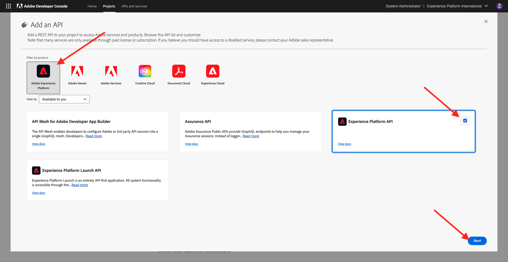
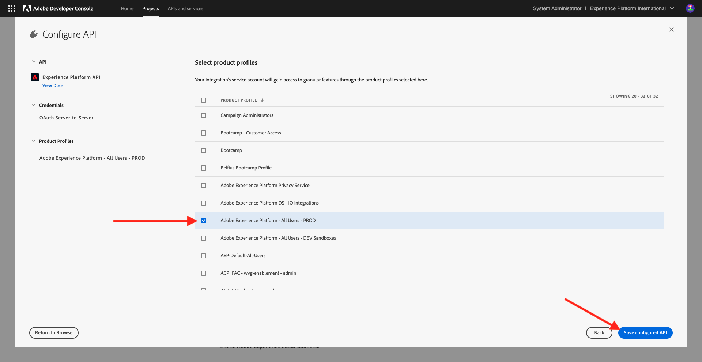

# 2.1.3 Visualisieren Sie Ihr eigenes Echtzeit-Kundenprofil - API

In dieser Übung verwenden Sie Postman und Adobe I/O, um Adobe Experience Platform-APIs abzufragen und Ihr eigenes Echtzeit-Kundenprofil anzuzeigen.

## Kontext

Im Echtzeit-Kundenprofil werden alle Profildaten zusammen mit Ereignisdaten sowie vorhandenen Segmentmitgliedschaften angezeigt. Die angezeigten Daten können von überall kommen, von Adobe-Anwendungen und externen Lösungen. Dies ist die leistungsstärkste Ansicht in Adobe Experience Platform, dem Erlebnissystem der Aufzeichnungen.

Das Echtzeit-Kundenprofil kann von allen Adobe-Applikationen, aber auch von externen Lösungen wie Call Center oder In-store-Clienteling-Apps genutzt werden. Dazu müssen diese externen Lösungen mit den Adobe Experience Platform-APIs verbunden werden.

## Ihre Kennungen

Im Bedienfeld &quot;Profil-Viewer&quot;auf der Website finden Sie mehrere Identitäten. Jede Identität ist mit einem Namespace verknüpft.


Im Röntgen-Bedienfeld können wir vier verschiedene Kombinationen von IDs und Namespaces sehen:

| Identität | Namespace |
|:-------------:| :---------------:|
| Experience Cloud ID (ECID) | 79943948563923140522865572770524243489 |
| Experience Cloud ID (ECID) | 70559351147248820114888181867542007989 |
| Email ID | woutervangeluwe+18112024-01@gmail.com |
| Mobiltelefonnummer | +32473622044+18112024-01 |

Merken Sie sich diese IDs für den nächsten Schritt.

## Adobe I/O-Projekt konfigurieren

In dieser Übung werden Sie Adobe I/O ziemlich intensiv verwenden, um die APIs von Platform abzufragen. Führen Sie die folgenden Schritte aus, um Adobe I/O einzurichten.

Wechseln Sie zu [https://developer.adobe.com/console/home](https://developer.adobe.com/console/home)


Wählen Sie oben rechts auf Ihrem Bildschirm die richtige Adobe Experience Platform-Instanz aus. Ihre Instanz ist `--aepImsOrgName--`. Klicken Sie auf **Neues Projekt erstellen**.


Wählen Sie **+ Zum Projekt hinzufügen** und dann **API** aus.


Daraufhin sehen Sie Folgendes:


Klicken Sie auf das Symbol **Adobe Experience Platform** .
/images/api2.png)

Wählen Sie **Experience Platform-API** und klicken Sie auf **Weiter**.



Das wirst du jetzt sehen. Geben Sie einen Namen für Ihre Berechtigung ein: `--aepUserLdap-- - OAuth credential`. Klicken Sie auf **Weiter**.


Als Nächstes müssen Sie ein Produktprofil auswählen, das definiert, welche Berechtigungen für diese Integration verfügbar sind.

Wählen Sie die erforderlichen Produktprofile aus.

>[!NOTE]
>
> Produktprofilnamen variieren in Ihrer Adobe Experience Platform-Instanz, da sie Instanzspezifikationen sind. Sie müssen mindestens ein Produktprofil mit den entsprechenden Zugriffsrechten auswählen, die in der Benutzeroberfläche für Adobe Admin Console und AEP-Berechtigungen eingerichtet sind.

Klicken Sie auf **Konfigurierte API speichern**.



Ihre Adobe I/O-Integration ist jetzt bereit.


Klicken Sie auf die Schaltfläche &quot;**Für Postman herunterladen**&quot;und dann auf &quot;**OAuth Server-to-Server**&quot;, um eine Postman-Umgebung herunterzuladen (warten Sie, bis die Umgebung heruntergeladen wurde. Dies kann einige Sekunden dauern).


Ihr IO-Projekt hat derzeit einen generischen Namen. Sie müssen Ihrer Integration einen benutzerfreundlichen Namen geben. Klicken Sie auf **Projekt X** (oder einen ähnlichen Namen), wie angegeben


Klicken Sie auf **Projekt bearbeiten**.


Geben Sie einen Namen und eine Beschreibung für Ihre Integration ein: `--aepUserLdap-- AEP Tutorial`.

Klicken Sie auf **Speichern**.


Ihre Adobe I/O-Integration ist jetzt abgeschlossen.


>[!NOTE]
>
>Es gibt einen weiteren Schritt, um sicherzustellen, dass dieses Adobe I/O-Projekt Zugriff auf die Berechtigungseinstellungen von Adobe Experience Platform hat. Die API-Berechtigung Ihres Projekts muss der Benutzeroberfläche &quot;Berechtigungen&quot;von Adobe Experience Platform hinzugefügt werden, für die Systemadministratorzugriffsrechte erforderlich sind. Die Schritte werden nachfolgend beschrieben. Sie müssen sich jedoch möglicherweise an Ihren Systemadministrator wenden, um diese Verarbeitung für Sie durchzuführen, falls Sie nicht über die erforderlichen Zugriffsrechte verfügen.

## AEP-Berechtigungen für API-Anmeldedaten

Wechseln Sie zu [Adobe Experience Platform](https://experience.adobe.com/platform). Nach der Anmeldung landen Sie auf der Startseite von Adobe Experience Platform.

Wechseln Sie zu **Berechtigungen**, zu **Rollen** und klicken Sie auf das relevante Produktprofil.

>[!NOTE]
>
> Produktprofilnamen variieren in Ihrer Adobe Experience Platform-Instanz, da sie Instanzspezifikationen sind. Sie müssen mindestens ein Produktprofil mit den entsprechenden Zugriffsrechten auswählen, die in der Benutzeroberfläche für Adobe Admin Console und AEP-Berechtigungen eingerichtet sind.


Klicken Sie auf **API-Anmeldeinformationen**.


Klicken Sie auf **+ API-Anmeldeinformationen hinzufügen**.


Wählen Sie das neu erstellte Adobe I/O-Projekt aus und klicken Sie auf **Speichern**.


## Postman-Authentifizierung für Adobe I/O

Wechseln Sie zu [https://www.postman.com/downloads/](https://www.postman.com/downloads/).

Laden Sie die entsprechende Version von Postman für Ihr Betriebssystem herunter und installieren Sie sie.


Starten Sie nach der Installation von Postman das Programm.

In Postman gibt es zwei Konzepte: Umgebungen und Sammlungen.

- Die Umgebung enthält all Ihre Umgebungsvariablen, die mehr oder weniger konsistent sind. In der Umgebung finden Sie Dinge wie IMSOrg unserer Platform-Umgebung, neben Sicherheitsberechtigungen wie Ihren privaten Schlüssel und andere. Die Umgebungsdatei ist diejenige, die Sie während des Adobe I/O-Setups in der vorherigen Übung heruntergeladen haben. Sie hat den folgenden Namen: **`oauth_server_to_server.postman_environment.json`**.

- Die Sammlung enthält eine Reihe von API-Anfragen, die Sie verwenden können. Wir werden zwei Sammlungen verwenden
   - 1 Sammlung für Authentifizierung an Adobe I/0
   - 1 Sammlung für die Übungen in diesem Modul
   - 1 Sammlung für die Übungen im Real-Time CDP-Modul, für Destination Authoring

Bitte laden Sie die Datei [postman.zip](./../../../assets/postman/postman_profile.zip) auf Ihren lokalen Desktop herunter.

In dieser Datei **postman.zip** finden Sie die folgenden Dateien:

- `Adobe IO - OAuth.postman_collection.json`
- `AEP Tutorial.postman_collection.json`
- `Destination_Authoring_API.json`

Dekomprimieren Sie die Datei &quot;**postman.zip**&quot;und speichern Sie diese 3 Dateien in einem Ordner auf Ihrem Desktop, zusammen mit der von Adobe I/O heruntergeladenen Postman-Umgebung. Sie müssen diese 4 Dateien in diesem Ordner haben:


Gehen Sie zurück zu Postman. Klicken Sie auf **Importieren**.


Klicken Sie auf **files**.


Navigieren Sie zum Ordner auf Ihrem Desktop, in den Sie die 4 heruntergeladenen Dateien extrahiert haben. Wählen Sie diese 4 Dateien gleichzeitig aus und klicken Sie auf **Öffnen**.


Nachdem Sie auf **Öffnen** geklickt haben, wird Ihnen in Postman ein Überblick über die Umgebung und Sammlungen angezeigt, die Sie importieren möchten. Klicken Sie auf **Importieren**.


Sie haben jetzt alles, was Sie in Postman benötigen, um über die APIs mit Adobe Experience Platform zu interagieren.

Zunächst müssen Sie sicherstellen, dass Sie ordnungsgemäß authentifiziert sind. Um authentifiziert zu werden, müssen Sie ein Zugriffstoken anfordern.

Stellen Sie sicher, dass Sie die richtige Umgebung ausgewählt haben, bevor Sie eine Anforderung ausführen. Sie können die aktuell ausgewählte Umgebung überprüfen, indem Sie die Dropdown-Liste Umgebung oben rechts überprüfen.

Die ausgewählte Umgebung sollte einen ähnlichen Namen haben wie dieser: `--aepUserLdap-- OAuth Credential`.


Ihre Postman-Umgebung und -Sammlungen sind jetzt konfiguriert und funktionieren. Sie können sich jetzt von Postman zu Adobe I/O authentifizieren.

Wählen Sie in der Kollektion **Adobe IO - OAuth** die Anforderung mit dem Namen **POST - Zugriffstoken abrufen** aus. Klicken Sie auf **Senden**.


Nach einigen Sekunden sollte eine Antwort im Abschnitt **Hauptteil** von Postman angezeigt werden:


Wenn Ihre Konfiguration erfolgreich war, sollte eine ähnliche Antwort mit den folgenden Informationen angezeigt werden:

| Schlüssel | Wert |
|:-------------:| :---------------:| 
| token_type | **bearer** |
| access_token | **eyJhbGciOiJSU...jrNZ6mdaQ** |
| expires_in | **86399** |

Adobe I/O hat Ihnen ein **bearer**-Token mit einem bestimmten Wert (dem sehr langen access_token) und einem Ablauffenster gegeben.

Das Token, das wir erhalten haben, gilt nun für 24 Stunden. Das bedeutet, dass Sie nach 24 Stunden ein neues Token generieren müssen, indem Sie diese Anfrage erneut ausführen, wenn Sie Postman zur Authentifizierung bei Adobe I/O verwenden möchten.

## Echtzeit-Kundenprofil-API, Schema: Profil

Jetzt können Sie Ihre erste Anfrage an die Echtzeit-Kundenprofil-APIs von Platform senden.

Suchen Sie in Postman die Sammlung &quot;**AEP-Tutorial**&quot;.


In **1. Unified Profile Service** klicken Sie auf die erste Anforderung mit dem Namen **UPS - GET Profile by Entity ID &amp; NS**.


Für diese Anfrage sind drei erforderliche Variablen erforderlich:

| Schlüssel | Wert | Definition |
|:-------------:| :---------------:| :---------------:| 
| entityId | **id** | die spezifische Kunden-ID |
| entityIdNS | **namespace** | den spezifischen Namespace, der für die ID gilt |
| schema.name | **_xdm.context.profile** | das spezifische Schema, für das Sie Informationen erhalten möchten |

Wenn Sie also die APIs von Adobe Experience Platform bitten möchten, Ihnen alle Profilinformationen für Ihre eigene ECID zurückzugeben, müssen Sie die Anfrage wie folgt konfigurieren:

| Schlüssel | Wert |
|:-------------:| :---------------:| 
| entityId | **yourECID** |
| entityIdNS | **ecid** |
| schema.name | **_xdm.context.profile** |


Sie sollten auch die Felder **Kopfzeile** - Ihrer Anforderung überprüfen. Wechseln Sie zu **Kopfzeilen**. Daraufhin sehen Sie Folgendes:


>[!NOTE]
>
>Sie müssen den Namen der verwendeten Adobe Experience Platform-Sandbox angeben. Ihr x-sandbox-name sollte `--aepSandboxName--` sein.

| Schlüssel | Wert |
| ----------- | ----------- |
| x-sandbox-name | `--aepSandboxName--` |


Nachdem Sie den Sandbox-Namen aktiviert haben, klicken Sie auf **Senden** , um Ihre Anfrage an Platform zu senden.

Sie sollten eine sofortige Antwort von Platform erhalten, die Ihnen Folgendes zeigt:


Dies ist die vollständige Antwort von Platform:

```javascript
{
    "A2_ETHkJxMvxbiEmIZlAj8Qn": {
        "entityId": "A2_ETHkJxMvxbiEmIZlAj8Qn",
        "mergePolicy": {
            "id": "64e4b0ed-dfc3-4084-8e67-643e977168d7"
        },
        "sources": [
            "672a10cdb015162aefedfc0f",
            "672a10b1a05e282aee19737c"
        ],
        "tags": [
            "0938B898-469A-4513-8E86-87464307120F:va7",
            "3ba34930-405e-4b31-aafa-bac22d35203e:va7"
        ],
        "identityGraph": [
            "G7z3JAFBY4I6Rzg",
            "A2_ETHkJxMvxbiEmIZlAj8Qn",
            "BkFvK4QcJpSPByuDGF4UAS0wMQ",
            "BUF9zMKLrXq72p4HpbsHv1SDGF4UAS0wMUBnbWFpbC5jb20",
            "A29btmFXmrfrYbXQWISCT9ZD"
        ],
        "entity": {
            "_experienceplatform": {
                "identification": {
                    "core": {
                        "ecid": "79943948563923140522865572770524243489",
                        "phoneNumber": "+32473622044+18112024-01",
                        "email": "woutervangeluwe+18112024-01@gmail.com"
                    }
                }
            },
            "userAccount": {
                "ID": "3688250"
            },
            "pushNotificationDetails": [
                {
                    "denylisted": false,
                    "token": "2E0945F186CE5ED8CBFD1EB519A8CF38BA2B28A67FB381D45AA15EE37D289214",
                    "identity": {
                        "namespace": {
                            "code": "ECID"
                        },
                        "id": "70559351147248820114888181867542007989"
                    },
                    "platform": "apns",
                    "appID": "com.adobe.demosystem.dxdemo"
                }
            ],
            "personalEmail": {
                "address": "woutervangeluwe+18112024-01@gmail.com"
            },
            "_repo": {
                "createDate": "2024-11-18T10:39:12.296Z"
            },
            "extSourceSystemAudit": {
                "lastUpdatedDate": "2024-11-19T07:46:52.001Z"
            },
            "testProfile": true,
            "mobilePhone": {
                "number": "+32473622044"
            },
            "consents": {
                "metadata": {
                    "time": "2024-11-19T07:46:52.001Z"
                },
                "idSpecific": {
                    "ECID": {
                        "70559351147248820114888181867542007989": {
                            "collect": {
                                "val": "y"
                            }
                        }
                    }
                }
            },
            "person": {
                "name": {
                    "lastName": "Van Geluwe",
                    "firstName": "Wouter"
                }
            },
            "userActivityRegions": {
                "IRL1": {
                    "captureTimestamp": "2024-11-19T07:46:51.239Z"
                }
            },
            "identityMap": {
                "ecid": [
                    {
                        "id": "70559351147248820114888181867542007989"
                    },
                    {
                        "id": "79943948563923140522865572770524243489"
                    }
                ],
                "email": [
                    {
                        "id": "woutervangeluwe+18112024-01@gmail.com"
                    }
                ],
                "phone": [
                    {
                        "id": "+32473622044+18112024-01"
                    }
                ],
                "userid": [
                    {
                        "id": "3688250"
                    }
                ]
            }
        },
        "lastModifiedAt": "2024-11-19T07:47:23Z"
    }
}
```

Dies sind derzeit alle in Platform für diese ECID verfügbaren Profildaten.

Sie müssen die ECID nicht verwenden, um Profildaten vom Echtzeit-Kundenprofil von Platform anzufordern. Sie können zur Anforderung dieser Daten eine beliebige ID in einem Namespace verwenden.

Gehen wir zurück zu Postman und tun so, als wären wir das Callcenter. Senden Sie eine Anfrage an Platform, in der Sie den Namespace von **Telefon** und Ihre Mobiltelefonnummer angeben.

Wenn Sie also die Platform-APIs bitten möchten, Ihnen alle Profilinformationen für ein bestimmtes Telefon zurückzugeben, müssen Sie die Anfrage wie folgt konfigurieren:

| Schlüssel | Wert |
|:-------------:| :---------------:| 
| entityId | **Ihre Telefonnummer** |
| entityIdNS | **phone** (Ersetzen Sie ecid durch phone) |
| schema.name | **_xdm.context.profile** |

Wenn Ihre Telefonnummer Sonderzeichen wie **+** enthält, müssen Sie Ihre vollständige Telefonnummer auswählen, mit der rechten Maustaste klicken und auf **EncodeURIComponent** klicken.


Dann haben Sie Folgendes:


Sie sollten auch die Felder **Kopfzeile** - Ihrer Anforderung überprüfen. Wechseln Sie zu **Kopfzeilen**. Daraufhin sehen Sie Folgendes:


>[!NOTE]
>
>Sie müssen den Namen der verwendeten Adobe Experience Platform-Sandbox angeben. Ihr x-sandbox-name sollte `--aepSandboxName--` sein.

| Schlüssel | Wert |
| ----------- | ----------- |
| x-sandbox-name | `--aepSandboxName--` |


Klicken Sie auf **Senden** und überprüfen Sie die Antwort. Sie sehen, dass sie mit der ECID als Identität übereinstimmt.


Nehmen wir dasselbe für Ihre E-Mail-Adresse vor, indem wir den Namespace von **email** und Ihre E-Mail-Adresse angeben.

Wenn Sie also die APIs von Platform bitten möchten, Ihnen alle Profilinformationen für eine bestimmte E-Mail-Adresse zurückzugeben, müssen Sie die Anfrage wie folgt konfigurieren:

| Schlüssel | Wert |
|:-------------:| :---------------:| 
| entityId | **youremail** |
| entityIdNS | **email** (ersetzen Sie Phone durch E-Mail) |
| schema.name | **_xdm.context.profile** |

Wenn Ihre E-Mail-Adresse Sonderzeichen wie **+** enthält, müssen Sie Ihre vollständige E-Mail-Adresse auswählen, mit der rechten Maustaste klicken und auf **EncodeURIComponent** klicken.


Dann haben Sie Folgendes:


Sie sollten auch die Felder **Kopfzeile** - Ihrer Anforderung überprüfen. Wechseln Sie zu **Kopfzeilen**. Daraufhin sehen Sie Folgendes:

>[!NOTE]
>
>Sie müssen den Namen der verwendeten Adobe Experience Platform-Sandbox angeben. Ihr x-sandbox-name sollte `--aepSandboxName--` sein.


| Schlüssel | Wert |
| ----------- | ----------- |
| x-sandbox-name | `--aepSandboxName--` |

Klicken Sie auf **Senden** und überprüfen Sie die Antwort. Mit ECID und Telefonnummer stellen Sie erneut fest, dass die Antwort die gleiche ist wie zuvor.


Dies ist eine sehr wichtige Art von Flexibilität, die Marken angeboten wird. Das bedeutet, dass jede Umgebung eine Anfrage mit ihrer eigenen ID und ihrem eigenen Namespace an Platform senden kann, ohne die Komplexität mehrerer Namespaces und IDs verstehen zu müssen.

Beispiel:

- Das Callcenter kann mithilfe des Namespace **phone** Daten von Platform anfordern
- Das Treuesystem kann mithilfe des Namespace **email** Daten von Platform anfordern
- Online-Anwendungen können den Namespace **ecid** verwenden.

Das Callcenter weiß nicht unbedingt, welche Art von Kennung im Treueprogramm-System verwendet wird, und das Treuesystem weiß nicht unbedingt, welche Art von Kennung von Online-Anwendungen verwendet wird. Jedes einzelne System kann die Informationen verwenden, die es besitzt und versteht, um die benötigten Informationen zu erhalten, wenn es sie benötigt.

## Echtzeit-Kundenprofil-API, Schema: Profil und ExperienceEvent

Nachdem wir die Platform-APIs erfolgreich für Profildaten abgefragt haben, sollten wir nun dasselbe mit ExperienceEvent-Daten tun.

Suchen Sie in Postman die Sammlung &quot;**AEP-Tutorial**&quot;.


In **1. Unified Profile Service**: Wählen Sie die zweite Anforderung mit dem Namen **UPS - GET Profile &amp; EE by Entity ID &amp; NS** aus.


Für diese Anfrage sind vier erforderliche Variablen erforderlich:

| Schlüssel | Wert | Definition |
|:-------------:| :---------------:|  :---------------:| 
| schema.name | **_xdm.context.experienceEvent** | das spezifische Schema, für das Sie Informationen erhalten möchten. In diesem Fall suchen wir nach Daten, die dem ExperienceEvent-Schema zugeordnet sind. |
| relatedSchema.name | **_xdm.context.profile** | Während wir nach Daten suchen, die dem ExperienceEvent-Schema zugeordnet sind, müssen wir eine Identität angeben, für die wir diese Daten empfangen möchten. Das Schema, das Zugriff auf die Identität hat, ist das Profil-Schema, daher ist das relatedSchema hier das Profil-Schema. |
| relatedEntityId | **id** | spezifische Kunden-ID |
| relatedEntityIdNS | **namespace** | den spezifischen Namespace, der für die ID gilt |

Wenn Sie also die APIs von Platform bitten möchten, Ihnen alle Profilinformationen für Ihren eigenen ecid zurückzugeben, müssen Sie die Anfrage wie folgt konfigurieren:

| Schlüssel | Wert |
|:-------------:| :---------------:| 
| schema.name | **_xdm.context.experienceEvent** |
| relatedSchema.name | **_xdm.context.profile** |
| relatedEntityId | **yourECID** |
| relatedEntityIdNS | **ecid** |


Sie sollten auch die Felder **Kopfzeile** - Ihrer Anforderung überprüfen. Wechseln Sie zu **Kopfzeilen**. Daraufhin sehen Sie Folgendes:


>[!NOTE]
>
>Sie müssen den Namen der verwendeten Adobe Experience Platform-Sandbox angeben. Ihr x-sandbox-name sollte `--aepSandboxName--` sein.

| Schlüssel | Wert |
| ----------- | ----------- |
| x-sandbox-name | `--aepSandboxName--` |

Klicken Sie auf **Senden** , um Ihre Anfrage an Platform zu senden.

Sie sollten eine sofortige Antwort von Platform erhalten, die Ihnen Folgendes zeigt:


Unten finden Sie die vollständige Antwort von Platform. In diesem Beispiel sind acht ExperienceEvents mit der ECID dieses Kunden verknüpft. Sehen Sie sich die folgenden Variablen an, um die verschiedenen Variablen für die Anforderung anzuzeigen, da die folgende Abbildung die direkte Folge Ihrer Konfiguration in Launch in vorherigen Übungen ist.

Wenn das Röntgen-Bedienfeld ExperienceEvent-Informationen anzeigt, verwendet es die folgende Payload, um Informationen wie Produktname (suchen Sie in der unten stehenden Payload nach productName) und Produktbild-URL (suchen Sie in der unten stehenden Payload nach productImageUrl ) zu analysieren und abzurufen.

```javascript
{
    "_page": {
        "orderby": "timestamp",
        "start": "b1325606-9b96-4e51-b7dd-73aacf527c72-0",
        "count": 14,
        "next": ""
    },
    "children": [
        {
            "relatedEntityId": "A2_ETHkJxMvxbiEmIZlAj8Qn",
            "entityId": "b1325606-9b96-4e51-b7dd-73aacf527c72-0",
            "sourceId": "672a10b1074ceb2af0aa7034",
            "timestamp": 1731923802848,
            "entity": {
                "environment": {
                    "ipV4": "141.134.241.99",
                    "type": "browser",
                    "browserDetails": {
                        "userAgentClientHints": {
                            "mobile": false,
                            "platform": "macOS",
                            "brands": [
                                {
                                    "brand": "Chromium",
                                    "version": "130"
                                },
                                {
                                    "brand": "Google Chrome",
                                    "version": "130"
                                },
                                {
                                    "brand": "Not?A_Brand",
                                    "version": "99"
                                }
                            ]
                        },
                        "userAgent": "Mozilla/5.0 (Macintosh; Intel Mac OS X 10_15_7) AppleWebKit/537.36 (KHTML, like Gecko) Chrome/130.0.0.0 Safari/537.36",
                        "viewportHeight": 992,
                        "viewportWidth": 1920
                    }
                },
                "web": {
                    "webPageDetails": {
                        "name": "Home",
                        "viewName": "Home",
                        "pageViews": {
                            "value": 1
                        },
                        "URL": "https://dsn.adobe.com/web/vangeluw-QIMU"
                    },
                    "webReferrer": {
                        "URL": "https://auth.services.adobe.com/"
                    }
                },
                "_experienceplatform": {
                    "interactionDetails": {
                        "core": {
                            "channel": "web"
                        }
                    },
                    "demoEnvironment": {
                        "brandName": "vangeluw-QIMU"
                    },
                    "identification": {
                        "core": {
                            "ecid": "79943948563923140522865572770524243489"
                        }
                    }
                },
                "implementationDetails": {
                    "name": "https://ns.adobe.com/experience/alloy/reactor",
                    "version": "2.24.0+2.27.0",
                    "environment": "browser"
                },
                "identityMap": {
                    "ECID": [
                        {
                            "id": "79943948563923140522865572770524243489",
                            "authenticatedState": "ambiguous",
                            "primary": true
                        }
                    ]
                },
                "eventType": "web.webpagedetails.pageViews",
                "_id": "b1325606-9b96-4e51-b7dd-73aacf527c72-0",
                "placeContext": {
                    "localTime": "2024-11-18T10:56:42.848+01:00",
                    "localTimezoneOffset": -60
                },
                "device": {
                    "screenOrientation": "landscape",
                    "screenWidth": 1920,
                    "screenHeight": 1080
                },
                "timestamp": "2024-11-18T09:56:42.848Z"
            },
            "lastModifiedAt": "2024-11-18T09:56:45Z"
        },
    "_links": {
        "next": {
            "href": ""
        }
    }
}
```

Dies sind derzeit alle verfügbaren ExperienceEvent-Daten in Platform für diese ECID.

Sie müssen die ECID nicht verwenden, um ExperienceEvent-Daten vom Echtzeit-Profil von Adobe Experience Platform anzufordern. Sie können zur Anforderung dieser Daten eine beliebige ID in einem Namespace verwenden.

Nächster Schritt: [2.1.4 Segment erstellen - UI](./ex4.md)

[Zurück zu Modul 2.1](./real-time-customer-profile.md)

[Zu allen Modulen zurückkehren](../../../overview.md)
