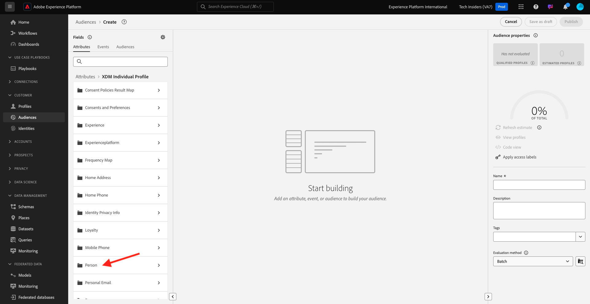
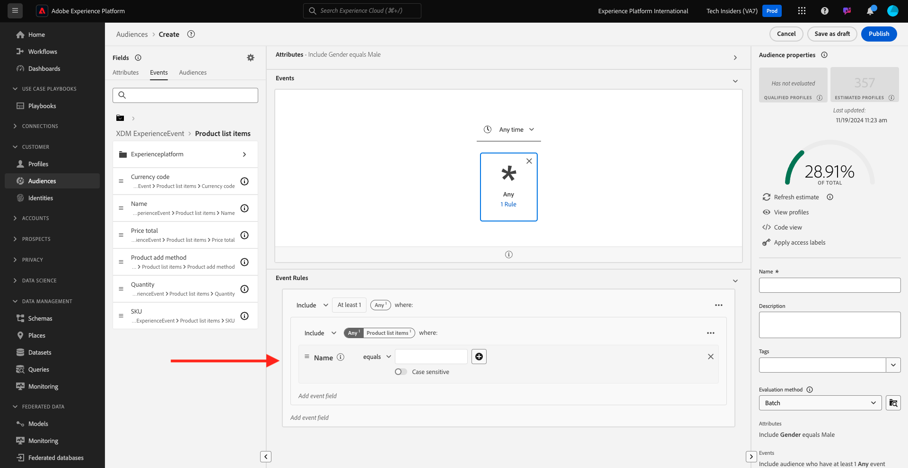

# 2.1.4 Segment erstellen - Benutzeroberfläche

In dieser Übung erstellen Sie ein Segment, indem Sie den Segmentaufbau von Adobe Experience Platform verwenden.

## Geschichte

Wechseln Sie zu [Adobe Experience Platform](https://experience.adobe.com/platform). Nach der Anmeldung landen Sie auf der Startseite von Adobe Experience Platform.


Bevor Sie fortfahren, müssen Sie eine **Sandbox** auswählen. Die auszuwählende Sandbox heißt ``--aepSandboxId--``. Klicken Sie dazu in der blauen Zeile oben auf Ihrem Bildschirm auf den Text **[!UICONTROL Produktions-Prod]** . Nachdem Sie die entsprechende [!UICONTROL Sandbox] ausgewählt haben, sehen Sie die Bildschirmänderung und befinden sich nun in Ihrer dedizierten [!UICONTROL Sandbox].


Navigieren Sie im Menü auf der linken Seite zu **Segmente**. Auf dieser Seite sehen Sie eine Übersicht über alle vorhandenen Segmente. Klicken Sie auf die Schaltfläche **+ Segment erstellen** , um mit der Erstellung eines neuen Segments zu beginnen.


Sobald Sie sich im neuen Segment Builder befinden, sehen Sie sofort die Menüoption **Attribute** und den Verweis auf **XDM Individual Profile** .


Da XDM die Sprache ist, die das Erlebnisgeschäft steuert, ist XDM auch die Grundlage für den Segment-Builder. Alle Daten, die in Platform erfasst werden, sollten XDM zugeordnet werden. Daher werden alle Daten Teil desselben Datenmodells, unabhängig davon, woher diese Daten stammen. Dies bietet Ihnen einen großen Vorteil beim Erstellen von Segmenten. So können Sie in dieser einzigen Segment Builder-Benutzeroberfläche Daten aus jedem beliebigen Ursprung im selben Workflow kombinieren. In Segment Builder erstellte Segmente können zur Aktivierung an Lösungen wie Adobe Target, Adobe Campaign und Adobe Audience Manager gesendet werden.

Erstellen wir ein Segment, das alle **male** -Kunden umfasst.

Um zum Geschlechterattribut zu gelangen, müssen Sie XDM verstehen und kennen.

Geschlecht ist ein Attribut von Person, das unter Attribute zu finden ist. Um dorthin zu gelangen, klicken Sie zunächst auf **XDM Individual Profile**. Dann wirst du das sehen. Wählen Sie im Fenster **XDM Individual Profile** die Option **Person** aus.



Dann wirst du das sehen. In **Person** können Sie das Attribut **Geschlecht** finden. Ziehen Sie das Attribut Geschlecht in den Segment Builder.


Jetzt können Sie aus den vorausgefüllten Optionen das spezifische Geschlecht auswählen. In diesem Fall wählen wir **Männlich**.


Nach Auswahl von **Männlich** können Sie eine Schätzung der Segmentpopulation erhalten, indem Sie die Schaltfläche **Schätzung aktualisieren** drücken. Dies ist für einen Business-Anwender sehr hilfreich, damit er die Auswirkungen bestimmter Attribute auf die resultierende Segmentgröße sehen kann.


Daraufhin wird eine Schätzung wie die folgende angezeigt:


Als Nächstes sollten Sie Ihr Segment etwas verfeinern. Sie müssen ein Segment aller männlichen Kunden erstellen, die das Produkt **Proteus Fitness Jackshirt (Orange)** angesehen haben.

Um dieses Segment zu erstellen, müssen Sie ein Erlebnisereignis hinzufügen. Sie können alle Erlebnisereignisse finden, indem Sie in der Menüleiste **Felder** auf das Symbol **Ereignisse** klicken.


Als Nächstes sehen Sie den Knoten **XDM ExperienceEvents** der obersten Ebene. Klicken Sie auf **XDM ExperienceEvent**.


Wechseln Sie zu **Produktlistenelemente**.


Wählen Sie **Name** aus und ziehen Sie das Objekt **Name** aus dem linken Menü auf die Arbeitsfläche des Segmentaufbaus und legen Sie es in den Abschnitt **Ereignisse**.


Daraufhin sehen Sie Folgendes:



Der Vergleichsparameter sollte **gleich** sein und im Eingabefeld **MONTANA WIND JACKET** eingeben.


Jedes Mal, wenn Sie ein Element zum Segment Builder hinzufügen, können Sie auf die Schaltfläche **Schätzung aktualisieren** klicken, um eine neue Schätzung der Population in Ihrem Segment zu erhalten.

Bisher haben Sie nur die Benutzeroberfläche zum Erstellen Ihres Segments verwendet, aber es gibt auch eine Code-Option zum Erstellen eines Segments.

Beim Erstellen eines Segments stellen Sie tatsächlich eine Profile Query Language (PQL)-Abfrage zusammen. Um den PQL-Code zu visualisieren, können Sie auf den Umschalter **Codeansicht** oben rechts im Segment Builder klicken.


Jetzt können Sie die vollständige PQL-Anweisung sehen:

```sql
person.gender in ["male"] and CHAIN(xEvent, timestamp, [C0: WHAT(productListItems.exists(name.equals("MONTANA WIND JACKET", false)))])
```

Sie können auch eine Vorschau der Kundenprofile anzeigen, die Teil dieses Segments sind, indem Sie auf **Profile anzeigen** klicken.


Geben wir schließlich Ihrem Segment einen Namen und speichern es.

Verwenden Sie als Namenskonvention:

- `--demoProfileLdap-- - Male customers with interest in Montana Wind Jacket`


Klicken Sie dann auf die Schaltfläche **Speichern und schließen** , um Ihr Segment zu speichern. Danach gelangen Sie zurück zur Übersichtsseite &quot;Segment&quot;.


Sie können jetzt mit der nächsten Übung fortfahren und ein Segment über die API erstellen.

Nächster Schritt: [2.1.5 Segment erstellen - API](./ex5.md)

[Zurück zu Modul 2.1](./real-time-customer-profile.md)

[Zu allen Modulen zurückkehren](../../../overview.md)
