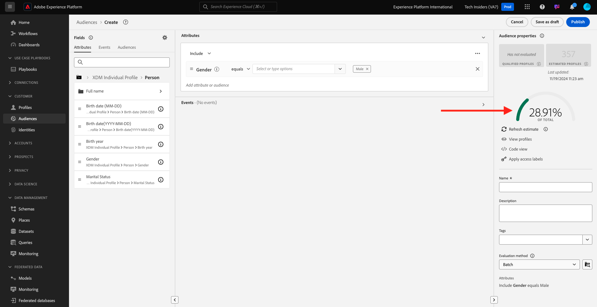
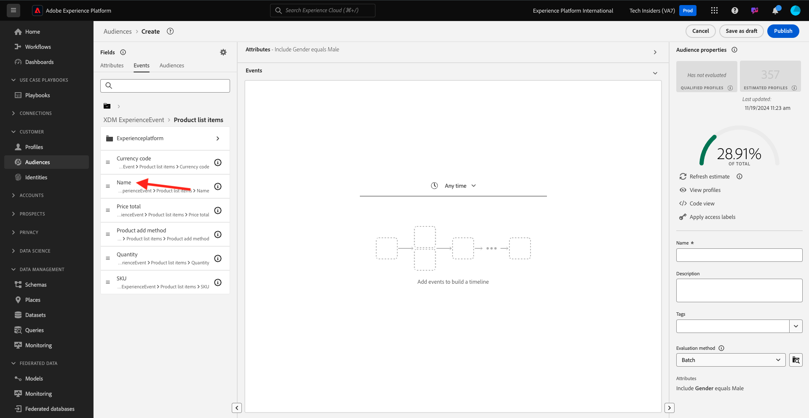

# 2.1.4 Erstellen einer Zielgruppe - Benutzeroberfläche

In dieser Übung erstellen Sie eine Zielgruppe, indem Sie Adobe Experience Platforms Audience Builder verwenden.

Wechseln Sie zu [Adobe Experience Platform](https://experience.adobe.com/platform). Nach der Anmeldung landen Sie auf der Startseite von Adobe Experience Platform.


Bevor Sie fortfahren, müssen Sie eine **Sandbox** auswählen. Die auszuwählende Sandbox heißt ``--aepSandboxName--``. Nachdem Sie die entsprechende [!UICONTROL Sandbox] ausgewählt haben, sehen Sie die Bildschirmänderung und befinden sich nun in Ihrer dedizierten [!UICONTROL Sandbox].


Navigieren Sie im Menü auf der linken Seite zu **Zielgruppen**. Auf dieser Seite können Sie eine Übersicht über alle vorhandenen Zielgruppen anzeigen. Klicken Sie auf die Schaltfläche **+ Audience erstellen** , um mit der Erstellung einer neuen Audience zu beginnen.


Wählen Sie **Regel erstellen** und klicken Sie auf **Erstellen**.


Sobald Sie sich im neuen Audience Builder befinden, sehen Sie sofort die Menüoption **Attribute** und den Verweis auf **XDM Individual Profile** .


Da XDM die Sprache ist, die das Erlebnisgeschäft steuert, ist XDM auch die Grundlage für den Audience Builder. Alle Daten, die in Platform erfasst werden, sollten XDM zugeordnet werden. Daher werden alle Daten Teil desselben Datenmodells, unabhängig davon, woher diese Daten stammen. Dies bietet Ihnen einen großen Vorteil beim Erstellen von Zielgruppen, da Sie in dieser einzigen Benutzeroberfläche des Zielgruppen-Builders Daten aus verschiedenen Quellen im selben Workflow kombinieren können. Mit Audience Builder erstellte Zielgruppen können zur Aktivierung an Lösungen wie Adobe Target, Adobe Campaign und Adobe Audience Manager gesendet werden.

Erstellen wir eine Zielgruppe, die alle **male** -Kunden umfasst.

Um zum Geschlechterattribut zu gelangen, müssen Sie XDM verstehen und kennen.

Geschlecht ist ein Attribut von Person, das unter Attribute zu finden ist. Um dorthin zu gelangen, klicken Sie zunächst auf **XDM Individual Profile**. Dann wirst du das sehen. Wählen Sie im Fenster **XDM Individual Profile** die Option **Person** aus.


Dann wirst du das sehen. In **Person** können Sie das Attribut **Geschlecht** finden. Ziehen Sie das Attribut Geschlecht in den Audience Builder.


Jetzt können Sie aus den vorausgefüllten Optionen das spezifische Geschlecht auswählen. In diesem Fall wählen wir **Männlich**.


Nach Auswahl von **Männlich** können Sie eine Schätzung der Audience-Population abrufen, indem Sie die Schaltfläche **Schätzung aktualisieren** drücken. Dies ist für einen Business-Anwender sehr hilfreich, damit er die Auswirkungen bestimmter Attribute auf die resultierende Zielgruppengröße sehen kann.


Daraufhin wird eine Schätzung wie die folgende angezeigt:



Als Nächstes sollten Sie Ihre Audience etwas verfeinern. Sie müssen eine Zielgruppe aller männlichen Kunden erstellen, die das Produkt **iPhone 15 Pro** angesehen haben.

Um diese Zielgruppe zu erstellen, müssen Sie ein Erlebnisereignis hinzufügen. Sie können alle Erlebnisereignisse finden, indem Sie in der Menüleiste **Felder** auf das Symbol **Ereignisse** klicken. Als Nächstes sehen Sie den Knoten **XDM ExperienceEvents** der obersten Ebene. Klicken Sie auf **XDM ExperienceEvent**.


Wechseln Sie zu **Produktlistenelemente**.


Wählen Sie **Name** aus und ziehen Sie das Objekt **Name** aus dem linken Menü auf die Arbeitsfläche des Zielgruppen-Builders und legen Sie es in den Abschnitt **Ereignisse**.



Daraufhin sehen Sie Folgendes:


Der Vergleichsparameter sollte **gleich** sein und im Eingabefeld **iPhone 15 Pro** eingeben.


Jedes Mal, wenn Sie ein Element zum Audience Builder hinzufügen, können Sie auf die Schaltfläche **Schätzung aktualisieren** klicken, um eine neue Schätzung der Population in Ihrer Audience zu erhalten.

Bisher haben Sie nur die Benutzeroberfläche zum Erstellen Ihrer Zielgruppe verwendet, aber es gibt auch eine Code-Option zum Erstellen einer Zielgruppe.

Beim Erstellen einer Zielgruppe stellen Sie tatsächlich eine Profile Query Language (PQL)-Abfrage zusammen. Um den PQL-Code zu visualisieren, können Sie rechts oben im Audience Builder auf den Umschalter **Codeansicht** klicken.


Jetzt können Sie die vollständige PQL-Anweisung sehen:

```sql
person.gender in ["male"] and CHAIN(xEvent, timestamp, [C0: WHAT(productListItems.exists(name.equals("iPhone 15 Pro", false)))])
```

Sie können auch eine Vorschau der Kundenprofile anzeigen, die Teil dieser Zielgruppe sind, indem Sie auf **Profile anzeigen** klicken.


Geben wir schließlich der Audience einen Namen,
Setzen Sie die **Auswertungsmethode** auf **Streaming** und klicken Sie auf **Publish**.

Verwenden Sie als Namenskonvention:

- `--aepUserLdap-- - Male customers with interest in iPhone 15 Pro`


Sie gelangen zurück zur Übersichtsseite &quot;Zielgruppe&quot;.


Nächster Schritt: [2.1.5 Rufen Sie Ihr Echtzeit-Kundenprofil in Aktion im Callcenter auf.](./ex5.md)

[Zurück zu Modul 2.1](./real-time-customer-profile.md)

[Zu allen Modulen zurückkehren](../../../overview.md)
