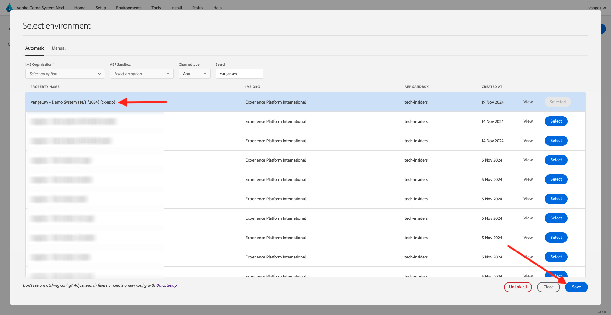

# 2.1.5 Echtzeit-Kundenprofil in Aktion im Callcenter anzeigen

In dieser Übung ist es das Ziel, Sie durch die Journey zu führen und wie ein echter Kunde zu handeln.

Auf dieser Website haben wir Adobe Experience Platform implementiert. Jede Aktion wird als Erlebnisereignis betrachtet und in Echtzeit an Adobe Experience Platform gesendet, wodurch das Echtzeit-Kundenprofil verbessert wird.

In einer früheren Übung haben Sie als anonymer Kunde begonnen, der die Site besuchte, und nach einigen Schritten wurden Sie zu einem bekannten Kunden.

Wenn derselbe Kunde schließlich sein Telefon abruft und Ihr Callcenter anruft, ist es wichtig, dass die Informationen aus anderen Kanälen sofort verfügbar sind, damit das Callcenter-Erlebnis relevant und personalisiert werden kann.

## Verwenden der CX-App

Wechseln Sie zu [https://dsn.adobe.com](https://dsn.adobe.com). Nach der Anmeldung bei Ihrer Adobe ID sehen Sie dies. Klicken Sie in Ihrem CX-App-Projekt auf die drei Punkte **...** und dann auf **Bearbeiten** , um es zu öffnen.

Wechseln Sie in Ihrem CX-App-Projekt zu **Integrationen**. Klicken Sie auf **Umgebung auswählen**.

Wählen Sie die Eigenschaft Adobe Experience Platform-Datenerfassung aus, die in Erste Schritte erstellt wurde. Sie müssen die Eigenschaft auswählen, deren Name **(cx-app)** enthält.

Dann wirst du das sehen. Klicken Sie auf **Ausführen**.

Als Nächstes müssen Sie eine Ihrer Identitäten und den entsprechenden Namespace auswählen und auf das **Suchsymbol** klicken.

| Identität | Namespace |
|:-------------:| :---------------:|
| Experience Cloud ID (ECID) | 79943948563923140522865572770524243489 |
| Experience Cloud ID (ECID) | 70559351147248820114888181867542007989 |
| Email ID | woutervangeluwe+18112024-01@gmail.com |
| Mobiltelefonnummer | +32473622044+18112024-01 |

Wenn der Kunde Ihr Callcenter anruft, kann die Telefonnummer zur Identifizierung des Kunden verwendet werden. In dieser Übung verwenden Sie also die Telefonnummer, um das Kundenprofil in der CX-App abzurufen.

Sie sehen nun die Informationen, die idealerweise im Callcenter angezeigt werden würden, sodass die Angestellten des Call-Centers alle relevanten Informationen sofort beim Kontakt mit einem Kunden zur Verfügung haben.

Nächster Schritt: [Zusammenfassung und Vorteile](./summary.md)

[Zurück zu Modul 2.1](./real-time-customer-profile.md)

[Zu allen Modulen zurückkehren](../../../overview.md)
