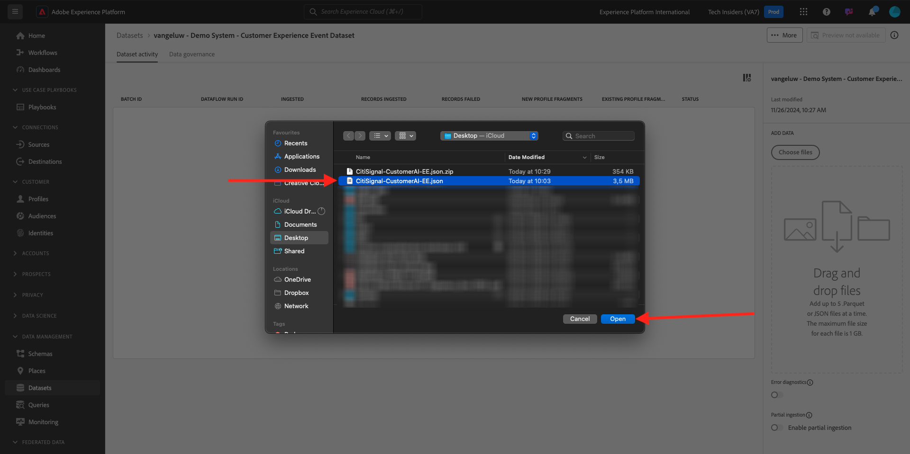

# 2.2.1 Customer AI - Datenvorbereitung (Aufnahme)

Damit Intelligent Services Einblicke aus Ihren Marketing-Ereignisdaten gewinnen kann, müssen die Daten semantisch angereichert und in einer Standardstruktur verwaltet werden. Intelligent Services nutzt dazu Adobe Experience-Datenmodell (XDM)-Schemas (XDM).
Insbesondere müssen alle Datensätze, die in Intelligent Services verwendet werden, dem XDM-Schema **Consumer Experience Event** entsprechen.

## 2.2.1.1 Schema erstellen

In dieser Übung erstellen Sie ein Schema, das das **Consumer Experience Event Mixin** enthält, das für den **Customer AI** Intelligent Service erforderlich ist.

Melden Sie sich bei Adobe Experience Platform an, indem Sie diese URL verwenden: [https://experience.adobe.com/platform](https://experience.adobe.com/platform).

Nach der Anmeldung landen Sie auf der Startseite von Adobe Experience Platform.

Bevor Sie fortfahren, müssen Sie eine **Sandbox** auswählen. Die auszuwählende Sandbox heißt ``--module10sandbox--``. Klicken Sie dazu in der blauen Zeile oben auf Ihrem Bildschirm auf den Text **[!UICONTROL Produktions-Prod]** . Nachdem Sie die entsprechende Sandbox ausgewählt haben, wird die Bildschirmänderung angezeigt und Sie befinden sich jetzt in Ihrer dedizierten Sandbox.

Klicken Sie im linken Menü auf **Schemas** und gehen Sie zu **Durchsuchen**. Klicken Sie auf **Schema erstellen**.

Wählen Sie im Popup **XDM ExperienceEvent** aus.

Dann wirst du das sehen.

Suchen Sie nach den folgenden **Mixins**, die Sie diesem Schema hinzufügen möchten, und wählen Sie sie aus:

- Erlebnisereignis für Verbraucher

  

- Details zur Endbenutzer-ID

  

Klicken Sie auf **Feldgruppen hinzufügen**.

Dann wirst du das sehen. Wählen Sie das Mixin **ID-Details für Endbenutzer** aus.

Navigieren Sie zum Feld **endUserIDs ._experience.emailid.id**.

Im rechten Menü für das Feld **endUserIDs._experience.emailid.id**, scrollen Sie nach unten und aktivieren Sie das Kontrollkästchen für **Identität**, aktivieren Sie das Kontrollkästchen für **Primäre Identität** und wählen Sie den **Identitäts-Namespace** von **E-Mail** aus.

Navigieren Sie zum Feld **endUserIDs ._experience.mcid.id**. Aktivieren Sie das Kontrollkästchen für **Identität** und wählen Sie den **Identitäts-Namespace** von **ECID** aus. Klicken Sie auf **Übernehmen**.

Geben Sie Ihrem Schema jetzt einen Namen.

Als Name für unser Schema verwenden Sie Folgendes:

- `--demoProfileLdap-- - Demo System - Customer Experience Event`

Beispiel: Für ldap **vangeluw** sollte dies der Name des Schemas sein:

- **vangeluw - Demosystem - Customer Experience Event**

Das sollte dir so etwas geben. Klicken Sie auf die Schaltfläche **+ Hinzufügen** , um neue **Mixins** hinzuzufügen.

Wählen Sie den Namen Ihres Schemas aus. Sie sollten Ihr Schema nun für **Profil** aktivieren, indem Sie auf den Umschalter **Profil** klicken.

Dann wirst du das sehen. Klicken Sie auf **Aktivieren**.

Du solltest das jetzt haben. Klicken Sie auf **Speichern** , um Ihr Schema zu speichern.

## 2.2.1.2 Datensatz erstellen

Klicken Sie im linken Menü auf **Datensätze** und gehen Sie zu **Durchsuchen**. Klicken Sie auf **Datensatz erstellen**.

Klicken Sie auf **Datensatz aus Schema erstellen**.

Wählen Sie im nächsten Bildschirm den Datensatz aus, den Sie in der vorherigen Übung erstellt haben, nämlich **[!UICONTROL ldap - Demo System - Customer Experience Event]**. Klicken Sie auf **Weiter**.

Verwenden Sie als Namen für Ihren Datensatz `--demoProfileLdap-- - Demo System - Customer Experience Event Dataset`. Klicken Sie auf **Fertigstellen**.

Ihr Datensatz wurde jetzt erstellt. Aktivieren Sie den Umschalter **Profil** .

Klicken Sie auf **Aktivieren**.

Sie sollten jetzt Folgendes haben:

Sie können jetzt mit der Erfassung von Kundenerlebnis-Ereignisdaten beginnen und mit der Verwendung des Customer AI-Dienstes beginnen.

## 2.2.1.3 Erlebnisereignis-Testdaten herunterladen

Sobald das **Schema** und **Datensatz** konfiguriert sind, können Sie jetzt Erlebnisereignisdaten erfassen. Da Customer AI Daten über **2 Quartale mindestens** benötigt, müssen Sie extern vorbereitete Daten erfassen.

Die für die Erlebnisereignisse vorbereiteten Daten müssen den Anforderungen und dem Schema des [XDM-Mixins für Erlebnisereignisse für Verbraucher](https://github.com/adobe/xdm/blob/797cf4930d5a80799a095256302675b1362c9a15/docs/reference/context/experienceevent-consumer.schema.md) entsprechen.

Laden Sie die Datei mit Beispieldaten von diesem Speicherort herunter: [https://dashboard.adobedemo.com/data](https://dashboard.adobedemo.com/data). Klicken Sie auf die Schaltfläche **Herunterladen** .

Wenn Sie nicht auf den obigen Link zugreifen können, können Sie die Datei auch von diesem Speicherort herunterladen: [https://aepmodule10.s3-us-west-2.amazonaws.com/retail-v1-dec2020-xl.json.zip](https://aepmodule10.s3-us-west-2.amazonaws.com/retail-v1-dec2020-xl.json.zip).

Sie haben jetzt eine Datei mit dem Namen **retail-v1-dec2020-xl.json.zip** heruntergeladen. Platzieren Sie die Datei auf dem Desktop des Computers und dekomprimieren Sie sie. Danach wird eine Datei mit dem Namen **retail-v1.json** angezeigt. Sie werden diese Datei in der nächsten Übung benötigen.

## 2.2.1.4 Erlebnisereignis-Testdaten erfassen

Wechseln Sie in Adobe Experience Platform zu **Datensätze** und öffnen Sie den Datensatz mit dem Namen **[!UICONTROL ldap - Demo System - Customer Experience Event Datensatz]**.

Klicken Sie in Ihrem Datensatz auf **Dateien auswählen** , um Daten hinzuzufügen.

Wählen Sie im Popup die Datei &quot;**retail-v1.json**&quot;aus und klicken Sie auf &quot;**Open**&quot;.

Anschließend werden die importierten Daten angezeigt und ein neuer Batch wird im Status **Laden** erstellt. Navigieren Sie nicht von dieser Seite weg, bis die Datei hochgeladen wurde.

Nach dem Hochladen der Datei wird der Batch-Status von **Laden** in **Verarbeitung** geändert.

Die Aufnahme und Verarbeitung der Daten kann 10-20 Minuten dauern.

Sobald die Datenerfassung erfolgreich war, ändert sich der Batch-Status in **Erfolg**.

Nächster Schritt: [2.2.2 Customer AI - Erstellen einer neuen Instanz (Konfigurieren)](./ex2.md)

[Zurück zu Modul 2.2](./intelligent-services.md)

[Zu allen Modulen zurückkehren](./../../../overview.md)
