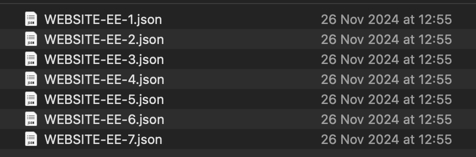

# 2.2.1 Kunden-KI - Datenvorbereitung (Aufnahme)

Damit Intelligent Services Einblicke aus Ihren Marketing-Ereignisdaten gewinnen kann, müssen die Daten semantisch angereichert und in einer Standardstruktur verwaltet werden. Intelligent Services nutzt Adobe-Datenmodell (XDM)-Schemata, um dies zu erreichen.
Insbesondere müssen alle Datensätze, die in Intelligent Services verwendet werden, dem XDM-Schema **Consumer Experience Event** entsprechen.

## Schema erstellen

In dieser Übung erstellen Sie ein Schema, das das Mixin **Consumer Experience Event** enthält, das für den **Customer AI** Intelligent Service erforderlich ist.

Melden Sie sich über die folgende URL bei Adobe Experience Platform an: [https://experience.adobe.com/platform](https://experience.adobe.com/platform).

Nach dem Login landen Sie auf der Homepage von Adobe Experience Platform.

Bevor Sie fortfahren, müssen Sie eine **Sandbox“**. Die auszuwählende Sandbox hat den Namen ``--aepSandboxName--``. Nach Auswahl der entsprechenden Sandbox wird der Bildschirm geändert und Sie befinden sich nun in Ihrer dedizierten Sandbox.

Klicken Sie im linken Menü auf **Schemata** und gehen Sie zu **Durchsuchen**. Klicken Sie **Schema erstellen**.

Wählen Sie im Popup die Option **Manuell** und klicken Sie auf **Auswählen**.

Wählen Sie als Nächstes **Erlebnisereignis** aus und klicken Sie auf **Weiter**.

Sie müssen jetzt einen Namen für Ihr Schema angeben. Verwenden Sie als Namen für unser Schema Folgendes: `--aepUserLdap-- - Demo System - Customer Experience Event` und klicken Sie auf **Beenden**.

Sie werden es dann sehen. Klicken Sie unter **auf**+ Hinzufügen.

Suchen und wählen Sie die folgenden **Feldergruppen**, um zu diesem Schema hinzuzufügen:

- Erlebnisereignis für Verbraucher

- IdentityMap

Klicken Sie **Feldergruppen hinzufügen**.

Sie werden es dann sehen. Wählen Sie anschließend den Namen Ihres Schemas aus. Sie sollten jetzt Ihr Schema für das **Profil** aktivieren, indem Sie auf den Umschalter **Profil** klicken.

Sie werden es dann sehen. Aktivieren Sie das Kontrollkästchen für **Daten für dieses Schema enthalten eine primäre Identität im identityMap -Feld.**. Klicken Sie **Aktivieren**.

Du solltest das jetzt haben. Klicken Sie auf **Speichern**, um Ihr Schema zu speichern.

## Datensatz erstellen

Klicken Sie im linken Menü auf **Datensätze** und gehen Sie zu **Durchsuchen**. Klicken Sie **Datensatz erstellen**.

Klicken Sie **Datensatz aus Schema erstellen**.

Wählen Sie im nächsten Bildschirm den Datensatz aus, den Sie in der vorherigen Übung erstellt haben. Dieser heißt **[!UICONTROL ldap - Demosystem - Kundenerlebnisereignis]**. Klicken Sie auf **Weiter**.

Verwenden Sie `--aepUserLdap-- - Demo System - Customer Experience Event Dataset` als Namen für Ihren Datensatz. Klicken Sie auf **Fertigstellen**.

Ihr Datensatz wird jetzt erstellt. Aktivieren Sie den **Profil**-Umschalter.

Klicken Sie **Aktivieren**.

Sie sollten jetzt Folgendes haben:

Sie können jetzt mit der Aufnahme von Kundenerlebnisereignisdaten beginnen und den Kunden-KI-Service verwenden.

## Herunterladen von Testdaten für Experience Event

Sobald **Schema** und **Datensatz** konfiguriert sind, können Sie jetzt Erlebnisereignisdaten aufnehmen. Da Kunden-KI spezifische Datenanforderungen erfordert, müssen Sie extern vorbereitete Daten aufnehmen.

Die in dieser Übung für die Erlebnisereignisse vorbereiteten Daten müssen den Anforderungen und dem Schema der Feldergruppe [Consumer Experience Event XDM“ ](https://github.com/adobe/xdm/blob/797cf4930d5a80799a095256302675b1362c9a15/docs/reference/context/experienceevent-consumer.schema.md).

Bitte laden Sie die ZIP-Datei mit Demodaten von diesem Speicherort herunter: [https://tech-insiders.s3.us-west-2.amazonaws.com/CUSTOM-CAI-EVENTS-WEB.zip](https://tech-insiders.s3.us-west-2.amazonaws.com/CUSTOM-CAI-EVENTS-WEB.zip).

Sie haben jetzt eine Datei mit dem Namen &quot;**-CAI-EVENTS-WEB.zip“**. Platzieren Sie die Datei auf dem Desktop Ihres Computers und entpacken Sie sie. Danach wird ein Ordner mit dem Namen **CUSTOM-CAI-EVENTS-WEB** angezeigt.

In diesem Ordner finden Sie mehrere sequenzielle JSON-Dateien, die alle in der nächsten Übung aufgenommen werden müssen.

## Aufnehmen von Testdaten für Erlebnisereignisse

Gehen Sie in Adobe Experience Platform zu **Datensätze** und öffnen Sie Ihren Datensatz mit dem Namen **[!UICONTROL ldap - Demosystem - Kundenerlebnisereignis-Datensatz]**.

Klicken Sie in Ihrem Datensatz auf **Dateien auswählen**, um Daten hinzuzufügen.

Wählen Sie im Popup die Dateien **WEBSITE-EE-1.json** bis **WEBSITE-EE-5.json** aus und klicken Sie auf **Öffnen**.

Wiederholen Sie diesen Aufnahmevorgang für die Dateien **WEBSITE-EE-6.json** und **WEBSITE-EE-7.json**.

Anschließend sehen Sie, wie die Daten importiert werden und ein neuer Batch wird im Status **Wird geladen** erstellt. Navigieren Sie nicht weg von dieser Seite, bis die Datei hochgeladen wurde.

Nach dem Hochladen der Datei sehen Sie die Änderung des Batch-Status von **Wird geladen** in **Verarbeitung**.

Die Aufnahme und Verarbeitung der Daten kann 10-20 Minuten dauern.

Sobald die Datenaufnahme erfolgreich war, ändert sich der Batch-Status der verschiedenen Uploads in **Erfolg**.

Nächster Schritt: [2.2.2 Kunden-KI - Neue Instanz erstellen (Konfigurieren)](./ex2.md)

[Zurück zum Modul 2.2](./intelligent-services.md)

[Zurück zu „Alle Module“](./../../../overview.md)
