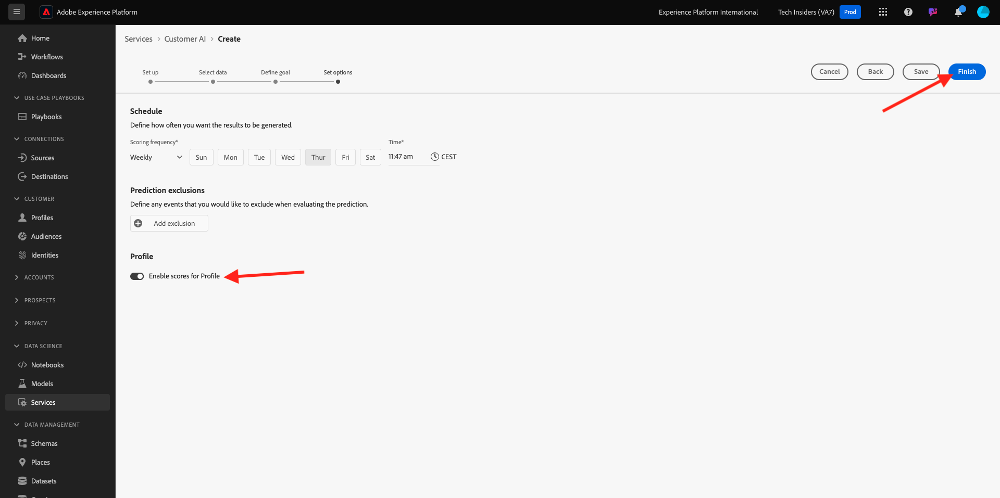
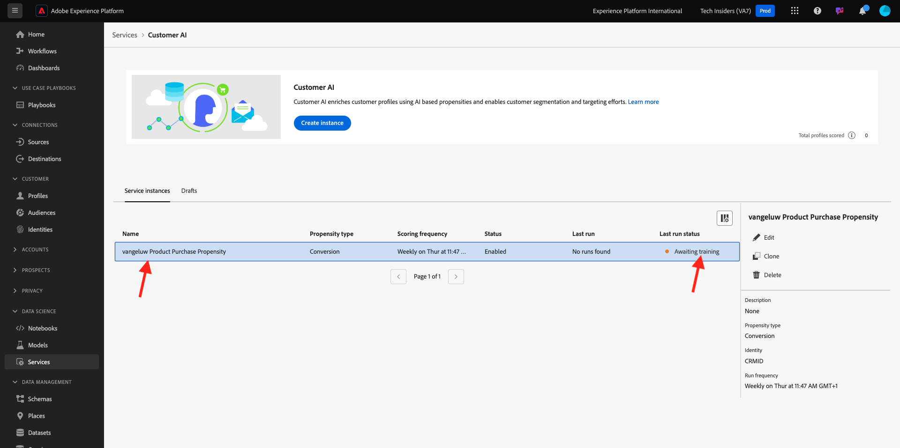

# 2.2.2 Kunden-KI - Neue Instanz erstellen (Konfigurieren)

Customer AI analysiert vorhandene Kundenerlebnis-Ereignisdaten, um Tendenzwerte für Abwanderung oder Konversion vorherzusagen. Durch das Erstellen einer neuen Kunden-KI-Instanz können Marketing-Experten Ziele und Maßnahmen definieren.

## Einrichten einer neuen Kunden-KI-Instanz

Klicken Sie in Adobe Experience Platform **Menü** Dienste“ auf der linken Seite. Der Browser für **Dienste** erscheint und zeigt alle Dienste an, die Ihnen zur Verfügung stehen. Klicken Sie in der Karte für Kunden-KI auf **Öffnen**.

Klicken Sie auf **Instanz erstellen**.

Sie werden es dann sehen.

Geben Sie die erforderlichen Details für die Kunden-KI-Instanz ein:

- Name: use `--aepUserLdap-- Product Purchase Propensity`
- Beschreibung: Verwenden Sie **Prognostizieren der Wahrscheinlichkeit, dass Kunden ein Produkt kaufen**
- Neigungstyp: wählen Sie **Konversion**

Klicken Sie **Speichern und fortfahren**.

Sie werden es dann sehen. Wählen Sie den Datensatz aus, den Sie in der vorherigen Übung mit dem Namen `--demoProfileLdap - Demo System - Customer Experience Event Dataset` erstellt haben. Klicken Sie auf **Hinzufügen**.

Sie werden es dann sehen. Sie müssen das Feld **Identität** definieren. Klicken Sie **Keine**.

Wählen Sie im Popup die Option **Identitätszuordnung (identityMap)** und wählen Sie dann den Namespace **Demo System - CRMID (crmId)**. Klicken Sie anschließend auf **Speichern**.

Klicken Sie **Speichern und fortfahren**.

Wählen Sie **Wird auftreten** in Ihrem spezifischen Datensatz aus und definieren Sie das Feld **commerce.purchases.value** als Zielvariable.

Stellen Sie als Nächstes Ihren Zeitplan auf **Wöchentlich** und legen Sie die Uhrzeit so nah wie möglich an Ihrer aktuellen Zeit fest. Stellen Sie sicher, dass der Umschalter **Scores für Profil aktivieren** aktiviert ist. Klicken Sie **Speichern und fortfahren**.

Nach der Konfiguration der Instanz wird sie in der Liste des Kunden-KI-Service angezeigt. Sie können außerdem eine Vorschau der Zusammenfassung der Einrichtungs- und Ausführungsdetails anzeigen, indem Sie auf die Zeile der Kunden-KI-Instanz klicken. Im Zusammenfassungsfenster werden auch Fehlerdetails angezeigt, falls Fehler gefunden wurden.

>[!NOTE]
>
>Sie können jede Definition oder jedes Attribut ändern, solange der Status Ihrer Kunden-KI-Instanz entweder **Training steht aus** oder **Fehler**

Sobald Ihr Modell ausgeführt wurde, sehen Sie dies.

Nächster Schritt: [2.2.3 Kunden-KI - Scoring-Dashboard und Segmentierung (Prognose und Aktion)](./ex3.md)

[Zurück zum Modul 2.2](./intelligent-services.md)

[Zurück zu „Alle Module“](./../../../overview.md)
