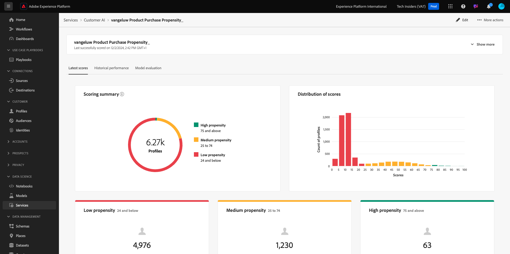

# 2.2.3 Kunden-KI - Scoring-Dashboard und Segmentierung (Prognose und Maßnahmen ergreifen)

Sobald Ihre Customer AI-Instanz einen Modelldurchgang abgeschlossen hat, können Sie den Tendenzwert visualisieren, der ausgewertet wird, um vorherzusagen, dass eine Kundin oder ein Kunde in den nächsten 30 Tagen einen Kauf tätigt.

>[!NOTE]
>
>Nur eine Customer AI-Instanz mit dem Status **Erfolg** ermöglicht eine Vorschau der Einblicke des Service.

## Tendenzvorhersage

Sehen wir uns nun die prognostizierte Neigung an, die vom Kunden-KI-Instanzmodell generiert wird. Klicken Sie auf den Instanznamen, um das Dashboard anzuzeigen.

Das Dashboard der Kundinnen- und Kunden-KI zeigt die Zusammenfassung der Bewertung, die Verteilung der Population und die Einflussfaktoren für das Modell an, das ausgewertet werden soll.

Bewegen Sie den Mauszeiger über die Einflussfaktoren, um die weitere Aufschlüsselung der Datenverteilung anzuzeigen.

## Geschäftliche Aktionen

### Kunden segmentieren

Im Dashboard der Kundinnen- und Kunden-KI können Sie Segmente mit einem Klick definieren. Klicken Sie auf den **Segment erstellen** auf den Neigungs -Karten.

Sie werden sehen, dass automatisch eine Segmentdefinition erstellt wird.

Benennen Sie Ihr Segment entsprechend dieser Namenskonvention: `--aepUserLdap-- - Customer AI High Propensity`. Klicken Sie auf **Veröffentlichen**.

Sie können dieses Segment jetzt für das Targeting verwenden, indem Sie beispielsweise Real-Time CDP, Journey Optimizer und Adobe Target verwenden.

## Bereinigen

Um sicherzustellen, dass keine unnötigen Demodaten in Ihrer Umgebung aufbewahrt werden, stellen Sie sicher, dass Sie den Datensatz `--aepUserLdap-- - Demo System - Customer Experience Event Dataset` löschen, nachdem Sie diese Übung erfolgreich abgeschlossen haben. Wenn Sie die Demodaten nicht löschen, hat dies Auswirkungen auf die Kosten für Ihre AEP-Instanz.

Nächster Schritt: [Zusammenfassung und Vorteile](./summary.md)

[Zurück zum Modul 2.2](./intelligent-services.md)

[Zurück zu „Alle Module“](./../../../overview.md)
