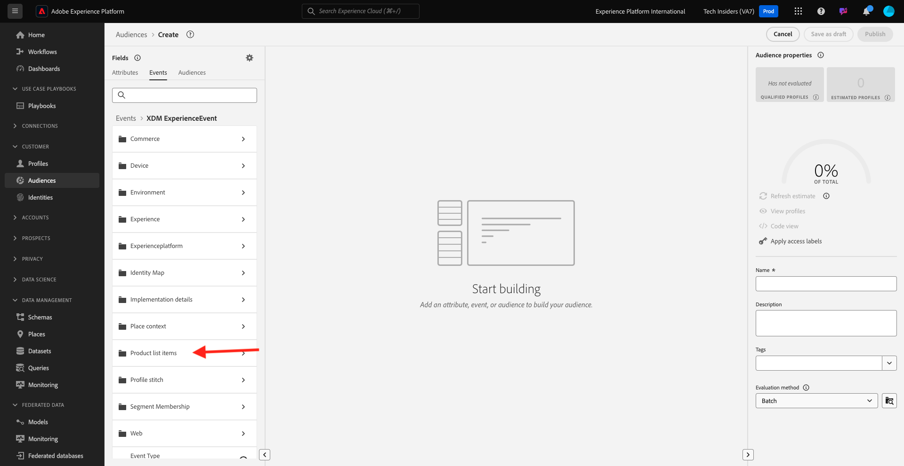

# 2.3.1 Erstellen einer Zielgruppe

In dieser Übung erstellen Sie eine Zielgruppe, indem Sie den Audience Builder von Adobe Experience Platform verwenden.

## Kontext

Die Reaktion auf das Interesse eines Kunden muss in Echtzeit erfolgen. Eine Möglichkeit, auf das Kundenverhalten in Echtzeit zu reagieren, besteht darin, eine Zielgruppe zu verwenden, sofern die Zielgruppe in Echtzeit qualifiziert ist. In dieser Übung müssen Sie eine Zielgruppe erstellen, unter Berücksichtigung der tatsächlichen Aktivitäten auf der Website, die wir verwendet haben.

## Identifizieren des Verhaltens, auf das Sie reagieren möchten

Wechseln Sie zu [https://dsn.adobe.com](https://dsn.adobe.com). Nach der Anmeldung bei Ihrer Adobe ID sehen Sie dies. Klicken Sie auf die drei Punkte **..** im Website-Projekt und dann auf **Ausführen** , um es zu öffnen.

Sie werden dann Ihre Demowebsite öffnen sehen. Wählen Sie die URL aus und kopieren Sie sie in die Zwischenablage.

Öffnen Sie ein neues Inkognito-Browserfenster.

Fügen Sie die URL Ihrer Demo-Website ein, die Sie im vorherigen Schritt kopiert haben. Sie werden dann aufgefordert, sich mit Ihrer Adobe ID anzumelden.

Wählen Sie Ihren Kontotyp aus und schließen Sie den Anmeldevorgang ab.

Sie sehen dann Ihre Website in einem Inkognito-Browser-Fenster geladen. Für jede Übung müssen Sie ein neues Inkognito-Browser-Fenster verwenden, um Ihre Demo-Website-URL zu laden.

In diesem Beispiel möchten Sie auf einen bestimmten Kunden reagieren, der ein bestimmtes Produkt anzeigt.
Gehen Sie auf der Homepage **Citi Signal** zu **Telefone und Geräte** und klicken Sie auf das Produkt **Galaxy S24**.

Wenn also jemand die Produktseite für **Galaxy S24** besucht, möchten Sie in der Lage sein, Maßnahmen zu ergreifen. Als Erstes müssen Sie eine Audience definieren.

## Erstellen der Zielgruppe

Wechseln Sie zu [Adobe Experience Platform](https://experience.adobe.com/platform). Nach der Anmeldung landen Sie auf der Startseite von Adobe Experience Platform.

Bevor Sie fortfahren, müssen Sie eine **Sandbox** auswählen. Die auszuwählende Sandbox heißt ``--aepSandboxName--``. Nachdem Sie die entsprechende [!UICONTROL Sandbox] ausgewählt haben, sehen Sie die Bildschirmänderung und befinden sich nun in Ihrer dedizierten [!UICONTROL Sandbox].

Navigieren Sie im Menü auf der linken Seite zu **Zielgruppen** und gehen Sie dann zu **Durchsuchen** , wo Sie einen Überblick über alle vorhandenen Zielgruppen erhalten. Klicken Sie auf die Schaltfläche **Zielgruppe erstellen** , um mit der Erstellung einer neuen Zielgruppe zu beginnen.

Wählen Sie **Regel erstellen** und klicken Sie auf **Erstellen**.

Wie oben erwähnt, müssen Sie eine Zielgruppe aus allen Kunden erstellen, die das Produkt **Galaxy S24** angesehen haben.

Um diese Zielgruppe zu erstellen, müssen Sie ein Ereignis hinzufügen. Sie können alle Ereignisse finden, indem Sie in der Menüleiste **Zielgruppen** auf das Symbol **Ereignisse** klicken.

Als Nächstes sehen Sie den Knoten **XDM ExperienceEvent** der obersten Ebene.

Um Kunden zu finden, die das Produkt **Galaxy S24** besucht haben, klicken Sie auf **XDM ExperienceEvent**.

Scrollen Sie nach unten zu **Produktlistenelementen** und klicken Sie darauf.

Wählen Sie &quot;**Name**&quot;aus und ziehen Sie das Objekt &quot;**Name**&quot;aus dem linken Menü &quot;**Produktlistenelemente**&quot;auf die Arbeitsfläche des Zielgruppen-Builders in den Abschnitt &quot;**Ereignisse**&quot;.

Der Vergleichsparameter sollte **gleich** sein und im Eingabefeld `Galaxy S24` eingeben.

Ihre **Ereignisregeln** sollten jetzt wie folgt aussehen: Jedes Mal, wenn Sie ein Element zum Audience Builder hinzufügen, können Sie auf die Schaltfläche **Schätzung aktualisieren** klicken, um eine neue Schätzung der Population in Ihrer Audience zu erhalten.

Benennen Sie Ihre Audience und legen Sie die **Auswertungsmethode** auf **Edge** fest.

Verwenden Sie als Namenskonvention:

- `--aepUserLdap-- - Interest in Galaxy S24`

Klicken Sie anschließend auf die Schaltfläche **Publish** , um Ihre Audience zu speichern.

Sie gelangen nun zurück zur Übersichtsseite der Zielgruppe.

Nächster Schritt: [2.3.2 Überprüfen Sie, wie das DV360-Ziel mit Zielen konfiguriert wird](./ex2.md)

[Zurück zu Modul 2.3](./real-time-cdp-build-a-segment-take-action.md)

[Zu allen Modulen zurückkehren](../../../overview.md)
