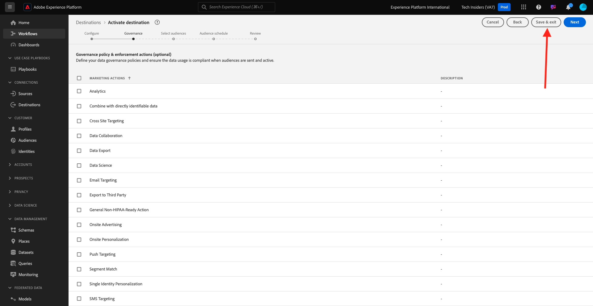

# 2.3.2 Konfigurieren eines Advertising-Ziels wie Google DV360

>[!IMPORTANT]
>
>Der folgende Inhalt ist teilweise als FYI gedacht - Wenn ein solches Ziel bereits in Ihrer Instanz vorhanden ist, müssen Sie **NOT** ein neues Ziel für DV360 konfigurieren. Das Ziel wurde in diesem Fall bereits erstellt und kann in der nächsten Übung verwendet werden.

Wechseln Sie zu [Adobe Experience Platform](https://experience.adobe.com/platform). Nach der Anmeldung landen Sie auf der Startseite von Adobe Experience Platform.

Bevor Sie fortfahren, müssen Sie eine **Sandbox** auswählen. Die auszuwählende Sandbox heißt ``--aepSandboxName--``. Nachdem Sie die entsprechende [!UICONTROL Sandbox] ausgewählt haben, sehen Sie die Bildschirmänderung und befinden sich nun in Ihrer dedizierten [!UICONTROL Sandbox].

Wechseln Sie im linken Menü zu **Ziele** und gehen Sie dann zu **Katalog**. Daraufhin wird der **Zielkatalog** angezeigt.

Klicken Sie in **Ziele** auf **Google Display &amp; Video 360** und dann auf **+ Set Up**.

Dann wirst du das sehen. Klicken Sie auf **Mit Ziel verbinden**.

Im nächsten Bildschirm können Sie Ihr Ziel auf Google DV360 konfigurieren.

Geben Sie einen Wert in die Felder **Name** und **Beschreibung** ein.

Das Feld **Konto-ID** ist die **Advertiser-ID** des DV360-Kontos. Sie finden dies hier:

Der **Kontotyp** sollte auf **Advertiser einladen** eingestellt sein.

Jetzt hast du das. Klicken Sie auf **Weiter**.

>[!NOTE]
>
>Google muss eine Adobe auf die Zulassungsliste setzen, damit Adobe Experience Platform Daten an Google DV360 senden kann. Wenden Sie sich an Ihren Google-Kundenbetreuer, um diesen Datenfluss zu aktivieren.

Nachdem Sie das Ziel erstellt haben, sehen Sie dies. Sie können optional eine Data Governance-Richtlinie auswählen. Klicken Sie anschließend auf **Speichern und beenden**.

Daraufhin wird eine Liste der verfügbaren Ziele angezeigt.
In der nächsten Übung verbinden Sie die in der vorherigen Übung erstellte Zielgruppe mit dem Google DV360-Ziel.

Nächster Schritt: [2.3.3 Aktion ausführen: Senden Sie Ihre Audience an DV360](./ex3.md)

[Zurück zu Modul 2.3](./real-time-cdp-build-a-segment-take-action.md)

[Zu allen Modulen zurückkehren](../../../overview.md)
