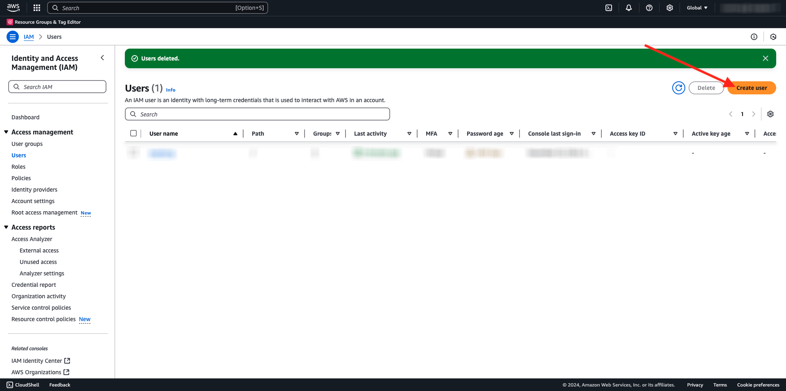

# 2.3.4 Aktion durchführen: Senden Sie Ihre Audience an ein S3-Ziel

Adobe Experience Platform kann auch Audiences für E-Mail-Marketing-Ziele wie Salesforce Marketing Cloud, Oracle Eloqua, Oracle Responsys und Adobe Campaign freigeben.

Sie können FTP oder SFTP als Teil der dedizierten Ziele für jedes dieser E-Mail-Marketing-Ziele verwenden oder AWS S3 verwenden, um Kundenlisten zwischen Adobe Experience Platform und diesen E-Mail-Marketing-Zielen auszutauschen.

In diesem Modul konfigurieren Sie ein solches Ziel, indem Sie einen AWS S3-Bucket verwenden.

## S3-Behälter erstellen

Wechseln Sie zu [https://console.aws.amazon.com](https://console.aws.amazon.com) und melden Sie sich an.

>[!NOTE]
>
>Wenn Sie noch kein AWS-Konto haben, erstellen Sie bitte mit Ihrer persönlichen E-Mail-Adresse ein neues AWS-Konto.

Nach der Anmeldung werden Sie zur **AWS Management Console** weitergeleitet.

Suchen Sie in der Suchleiste nach **s3**. Klicken Sie auf das erste Suchergebnis: **S3 - Skalierbarer Speicher in der Cloud**.

Dann sehen Sie die Homepage von **Amazon S3**. Klicken Sie auf **Behälter erstellen**.

Verwenden Sie im Bildschirm **Behälter erstellen** den Namen `aepmodulertcdp--aepUserLdap--`

Behalten Sie alle anderen Standardeinstellungen bei. Scrollen Sie nach unten und klicken Sie auf **Bucket erstellen**.

Sie werden sehen, wie Ihr Bucket erstellt wird und zur Amazon S3-Homepage weitergeleitet wird.

## Festlegen von Berechtigungen für den Zugriff auf Ihren S3-Behälter

Der nächste Schritt besteht darin, den Zugriff auf Ihren S3-Bucket einzurichten.

Gehen Sie dazu zu [https://console.aws.amazon.com/iam/home](https://console.aws.amazon.com/iam/home).

Der Zugriff auf AWS-Ressourcen wird über die Amazon Identity and Access Management (IAM) gesteuert.

Sie werden jetzt diese Seite sehen.

Klicken Sie im linken Menü auf **Benutzer**. Daraufhin wird der Bildschirm **Benutzer** angezeigt. Klicken Sie auf **Benutzer erstellen**.

Konfigurieren Sie dann Ihren Benutzer:

- Benutzername: use `s3_--aepUserLdap--_rtcdp`

Klicken Sie auf **Weiter**.

Dann sehen Sie diesen Berechtigungsbildschirm. Klicken Sie auf **Richtlinien direkt anhängen**.

Geben Sie den Suchbegriff **s3** ein, um alle zugehörigen S3-Richtlinien anzuzeigen. Wählen Sie die Richtlinie **AmazonS3FullAccess** aus. Scrollen Sie nach unten und klicken Sie auf **Weiter**.

Überprüfen Sie Ihre Konfiguration. Klicken Sie auf **Benutzer erstellen**.

Dann wirst du das sehen. Klicken Sie auf **Benutzer anzeigen**.

Klicken Sie auf **Sicherheitsberechtigungen** und dann auf **Zugriffsschlüssel erstellen**.

Wählen Sie **Anwendung, die außerhalb von AWS ausgeführt wird**. Scrollen Sie nach unten und klicken Sie auf **Weiter**.

Klicken Sie auf **Zugriffsschlüssel erstellen**

Dann wirst du das sehen. Klicken Sie auf **Anzeigen** , um Ihren geheimen Zugriffsschlüssel anzuzeigen:

Ihr **geheimer Zugriffsschlüssel** wird jetzt angezeigt.

>[!IMPORTANT]
>
>Speichern Sie Ihre Anmeldedaten in einer Textdatei auf Ihrem Computer.
>
> - Zugriffsschlüssel-ID: ...
> - Geheimer Zugriffsschlüssel: ...
>
> Wenn Sie auf **Fertig** klicken, werden Sie Ihre Anmeldedaten nie mehr sehen!

Klicken Sie auf **Fertig**.

Sie haben jetzt erfolgreich einen AWS S3-Bucket erstellt und einen Benutzer mit Zugriffsberechtigungen für diesen Bucket erstellt.

## Konfigurieren des Ziels in Adobe Experience Platform

Wechseln Sie zu [Adobe Experience Platform](https://experience.adobe.com/platform). Nach der Anmeldung landen Sie auf der Startseite von Adobe Experience Platform.

Bevor Sie fortfahren, müssen Sie eine **Sandbox** auswählen. Die auszuwählende Sandbox heißt ``--aepSandboxName--``. Nachdem Sie die entsprechende [!UICONTROL Sandbox] ausgewählt haben, sehen Sie die Bildschirmänderung und befinden sich nun in Ihrer dedizierten [!UICONTROL Sandbox].

Wechseln Sie im linken Menü zu **Ziele** und gehen Sie dann zu **Katalog**. Daraufhin wird der **Zielkatalog** angezeigt.

Klicken Sie auf **Cloud-Speicher** und dann auf der Karte **Amazon S3** auf die Schaltfläche **Einrichten** (oder je nach Umgebung auf **Zielgruppen aktivieren** ).

Wählen Sie als Kontotyp **Zugriffsschlüssel** aus. Bitte verwenden Sie die S3-Anmeldeinformationen, die Ihnen im vorherigen Schritt zugewiesen wurden:

| Zugriffsschlüssel-ID | Geheimer Zugriffsschlüssel |
|:-----------------------:| :-----------------------:|
| AKIA... | 7Icm... |

Klicken Sie auf **Mit Ziel verbinden**.

Daraufhin wird eine visuelle Bestätigung angezeigt, dass dieses Ziel jetzt verbunden ist.

Sie müssen Details zum S3-Bucket angeben, damit Adobe Experience Platform eine Verbindung zum S3-Bucket herstellen kann.

Verwenden Sie als Namenskonvention Folgendes:

| Zugriffsschlüssel-ID | Geheimer Zugriffsschlüssel |
|:-----------------------:| :-----------------------:|
| Name | `AWS - S3 - --aepUserLdap--` |
| Beschreibung | `AWS - S3 - --aepUserLdap--` |
| Behältername | `aepmodulertcdp--aepUserLdap--` |
| Ordnerpfad | /now |

Wählen Sie **Zielgruppen** aus.

Wählen Sie für **Dateityp** **CSV** aus und lassen Sie die Standardeinstellungen unverändert.

Scrollen Sie nach unten. Wählen Sie für **Komprimierungsformat** die Option **Ohne**. Klicken Sie auf **Weiter**.

Sie können jetzt optional eine Data Governance-Richtlinie an Ihr neues Ziel anhängen. Klicken Sie auf **Weiter**.

Suchen Sie in der Zielgruppenliste nach der Zielgruppe, die Sie in der vorherigen Übung erstellt haben, `--aepUserLdap-- - Interest in Galaxy S24` und wählen Sie sie aus. Klicken Sie auf **Weiter**.

Dann wirst du das sehen. Bei Bedarf können Sie den Zeitplan und den Dateinamen bearbeiten, indem Sie auf das Symbol **Bleistift** klicken. Klicken Sie auf **Weiter**.

Sie können jetzt Profilattribute für den Export in AWS S3 auswählen. Klicken Sie auf **Neues Feld hinzufügen** und stellen Sie sicher, dass das Feld `--aepTenantId--.identification.core.ecid` hinzugefügt und als **Deduplizierungsschlüssel** markiert ist.

Optional können Sie beliebig viele weitere Profilattribute hinzufügen.

Nachdem Sie alle Felder hinzugefügt haben, klicken Sie auf **Weiter**.

Überprüfen Sie Ihre Konfiguration. Klicken Sie auf **Beenden** , um die Konfiguration abzuschließen.

Sie sind dann wieder auf dem Bildschirm Zielaktivierung und sehen, wie Ihre Zielgruppe zu diesem Ziel hinzugefügt wurde.

Wenn Sie weitere Zielgruppenexporte hinzufügen möchten, können Sie auf **Zielgruppen aktivieren** klicken, um den Prozess neu zu starten und weitere Zielgruppen hinzuzufügen.

Nächster Schritt: [2.3.5 Aktion ausführen: Senden Sie Ihre Audience an Adobe Target](./ex5.md)

[Zurück zu Modul 2.3](./real-time-cdp-build-a-segment-take-action.md)

[Zu allen Modulen zurückkehren](../../../overview.md)
