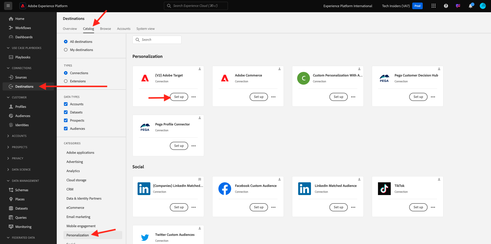
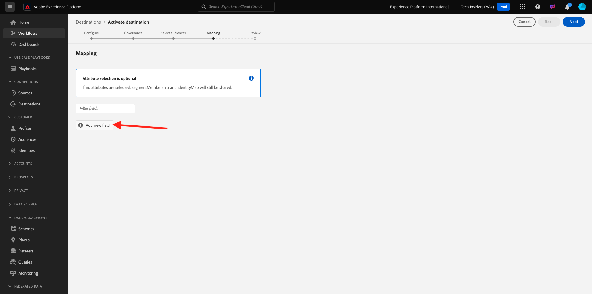
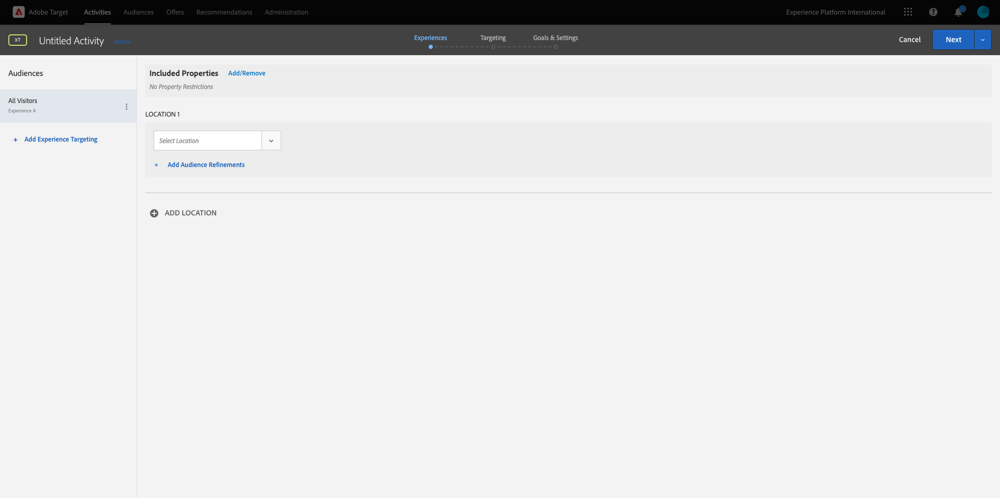
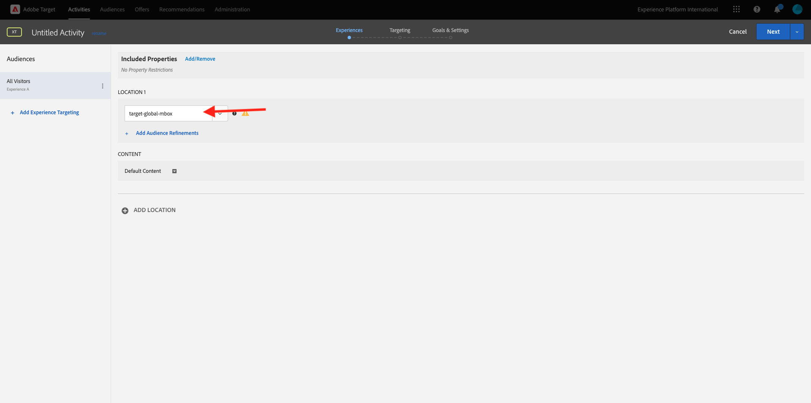
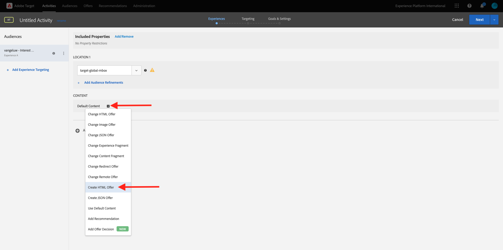
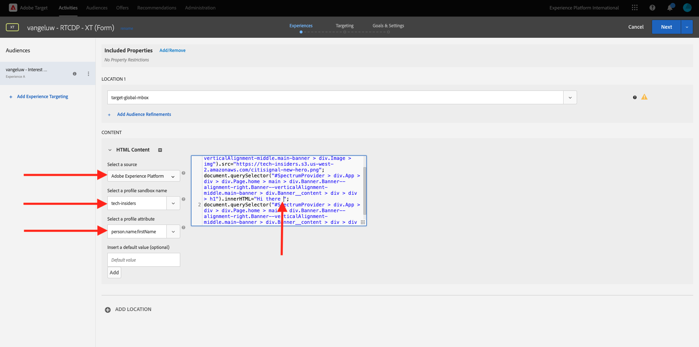
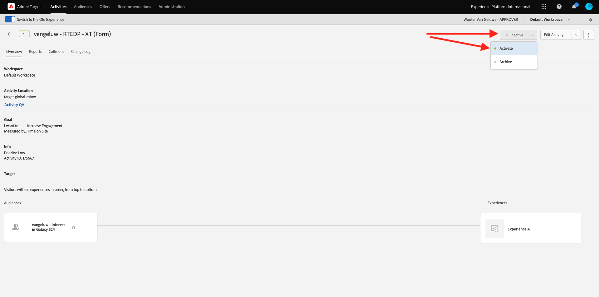

# 2.3.5 Aktion durchführen: Senden Sie Ihre Audience an Adobe Target

Wechseln Sie zu [Adobe Experience Platform](https://experience.adobe.com/platform). Nach der Anmeldung landen Sie auf der Startseite von Adobe Experience Platform.


Bevor Sie fortfahren, müssen Sie eine **Sandbox** auswählen. Die auszuwählende Sandbox heißt ``--aepSandboxName--``. Nachdem Sie die entsprechende [!UICONTROL Sandbox] ausgewählt haben, sehen Sie die Bildschirmänderung und befinden sich nun in Ihrer dedizierten [!UICONTROL Sandbox].


## Überprüfen des Datenspeichers

Das Adobe Target-Ziel in Real-Time CDP ist mit dem Datastream verbunden, der zur Aufnahme von Daten in das Adobe-Edge-Netzwerk verwendet wird. Wenn Sie Ihr Adobe Target-Ziel einrichten möchten, müssen Sie zunächst überprüfen, ob Ihr Datenspeicher bereits für Adobe Target aktiviert ist. Ihr Datastram wurde in [Übung 0.2 Erstellen Sie Ihren Datenspeicher](./../../../modules/gettingstarted/gettingstarted/ex2.md) konfiguriert und erhielt den Namen `--aepUserLdap-- - Demo System Datastream`.

Scrollen Sie im linken Menü nach unten und klicken Sie auf **Datastreams**. Suchen Sie in Datastreams nach Ihrem Datastream mit dem Namen `--aepUserLdap-- - Demo System Datastream`. Klicken Sie auf Ihren Datenspeicher, um ihn zu öffnen.


Klicken Sie dann neben **Adobe Experience Platform** auf **...** und dann auf **Bearbeiten**.


Aktivieren Sie die Kontrollkästchen für sowohl **Edge-Segmentierung** als auch **Personalization-Ziele**. Klicken Sie auf **Speichern**.


Klicken Sie anschließend auf **+ Service hinzufügen**.


Wählen Sie den Dienst **Adobe Target** aus. Klicken Sie auf **Speichern**.


Ihr Datastream ist jetzt für Adobe Target konfiguriert.


## Einrichten des Adobe Target-Ziels

Adobe Target ist als Ziel von Real-Time CDP verfügbar. Um Ihre Adobe Target-Integration einzurichten, gehen Sie zu **Ziele**, zu **Katalog**.

Klicken Sie im Menü **Kategorien** auf **Personalization** . Dann sehen Sie die Zielkarte **(v2) Adobe Target** .



Klicken Sie auf **Mit Ziel verbinden**.


Dann wirst du das sehen. Sie müssen Ihr eigenes Adobe Target-Ziel erstellen. Befolgen Sie diese Richtlinien:

- Name: Verwenden Sie den Namen `--aepUserLdap-- - Adobe Target v2  (Web)`.
- Datastream-ID: Sie müssen den Datastream auswählen, den Sie in [Übung 0.2 Erstellen Sie Ihren Datastream](./../../../modules/gettingstarted/gettingstarted/ex2.md) konfiguriert haben. Der Name Ihres Datastreams sollte: `--aepUserLdap-- - Demo System Datastream` lauten.
- Workspace: Dies bezieht sich auf Adobe Target-Arbeitsbereiche. Wenn Sie keinen bestimmten Arbeitsbereich verwenden müssen, wählen Sie **Standard-Workspace** aus.

Klicken Sie auf **Weiter**.


Sie können jetzt optional eine Data Governance-Richtlinie auswählen. Klicken Sie auf **Weiter**.


Wählen Sie in der Liste der verfügbaren Zielgruppen die Zielgruppe aus, die Sie in der vorherigen Übung erstellt haben [Erstellen einer Zielgruppe](./ex1.md), die den Namen `--aepUserLdap-- - Interest in Galaxy S24` trägt. Klicken Sie dann auf **Weiter**.


Auf dem Bildschirm **Zuordnung** können Sie Profilattribute zuordnen, um sie in Adobe Target verfügbar zu machen. Auf diese Weise können Sie eine zusätzliche Ebene der Personalisierung auf Ihrer Website hinzufügen. Klicken Sie auf **Neues Feld hinzufügen**.



Wählen Sie für das neue Feld das Feld **person.name.firstName** aus. Klicken Sie auf **Speichern**.


Dann wirst du das haben. Klicken Sie auf **Weiter**.


Klicken Sie auf **Fertigstellen**.


Ihre Audience ist jetzt für Adobe Target aktiviert.


>[!IMPORTANT]
>
>Wenn Sie Ihr Adobe Target-Ziel gerade in Real-Time CDP erstellt haben, kann es bis zu einer Stunde dauern, bis das Ziel aktiv ist. Dies ist eine einmalige Wartezeit aufgrund der Einrichtung der Backend-Konfiguration. Sobald die anfängliche Wartezeit von einer Stunde und die Backend-Konfiguration abgeschlossen sind, stehen neu hinzugefügte Zielgruppen, die an das Adobe Target-Ziel gesendet werden, für das Targeting in Echtzeit zur Verfügung.

## Konfigurieren der formularbasierten Adobe Target-Aktivität

Nachdem Ihre Real-Time CDP-Audience für den Versand an Adobe Target konfiguriert wurde, können Sie Ihre Erlebnis-Targeting-Aktivität in Adobe Target konfigurieren. In dieser Übung konfigurieren Sie eine formularbasierte Aktivität.

Rufen Sie die Adobe Experience Cloud-Homepage auf, indem Sie zu [https://experiencecloud.adobe.com/](https://experiencecloud.adobe.com/) navigieren. Klicken Sie auf **Ziel** , um es zu öffnen.


Auf der Startseite von **Adobe Target** werden alle vorhandenen Aktivitäten angezeigt. Klicken Sie auf **Aktivität erstellen** und dann auf **Erlebnis-Targeting**.


Wählen Sie **Web**, **Form** und **Keine Eigenschaftenbeschränkungen** aus. Klicken Sie auf **Erstellen**.


Sie befinden sich jetzt im formularbasierten Aktivitäts-Composer.



Wählen Sie für das Feld **POSITION 1** **target-global-mbox** aus.



Die Standardzielgruppe ist derzeit **Alle Besucher**. Klicken Sie auf die Punkte **3 Punkt** neben **Alle Besucher** und klicken Sie auf **Zielgruppe ändern**.


Jetzt wird die Liste der verfügbaren Zielgruppen angezeigt. Die zuvor erstellte und an Adobe Target gesendete Adobe Experience Platform-Zielgruppe ist jetzt Teil dieser Liste. Wählen Sie die zuvor in Adobe Experience Platform erstellte Audience aus. Klicken Sie auf **Zielgruppe zuweisen**.


Ihre Adobe Experience Platform-Zielgruppe ist jetzt Teil dieser Erlebnis-Targeting-Aktivität.


Ändern wir nun das Hero Image auf der Startseite der Website. Klicken Sie auf , um die Dropdown-Liste neben **Standardinhalt** zu öffnen, und klicken Sie auf **HTML-Angebot erstellen**.



Fügen Sie den folgenden Code ein.

```javascript
<script>document.querySelector("#SpectrumProvider > div.App > div > div.Page.home > main > div.Banner.Banner--alignment-right.Banner--verticalAlignment-middle.main-banner > div.Image > img").src="https://tech-insiders.s3.us-west-2.amazonaws.com/citisignal-new-hero.png"; document.querySelector("#SpectrumProvider > div.App > div > div.Page.home > main > div.Banner.Banner--alignment-right.Banner--verticalAlignment-middle.main-banner > div.Banner__content > div > div > h1").innerHTML="Hi there ";
document.querySelector("#SpectrumProvider > div.App > div > div.Page.home > main > div.Banner.Banner--alignment-right.Banner--verticalAlignment-middle.main-banner > div.Banner__content > div > div > div > div > p").innerHTML="What about 10% off of your next Galaxy S24 smartphone?";
</script>
```


Als Nächstes müssen Sie ein Personalisierungstoken aus den Profilattributen von Adobe Experience Platform hinzufügen. Denken Sie daran, dass Sie bei der Aktivierung der Zielgruppe für Adobe Target auch das Feld **person.name.firstName** auswählen, das für Adobe Target freigegeben werden soll. Um das Feld abzurufen, wählen Sie die Quelle **Adobe Experience Platform** aus, wählen Sie Ihre Sandbox (die den Wert `--aepSandboxName--` haben soll) und dann das Attribut **person.name.firstName** aus.



Bevor Sie auf die Schaltfläche **Hinzufügen** klicken, gehen Sie zu der Zeile, in der Sie `... > h1").innerHTML="Hi there ";` sehen, und setzen Sie den Cursor in die Klammern nach dem Wort `there`, wie in diesem Beispiel:

`... > h1").innerHTML="Hi there ";`

Klicken Sie dann auf die Schaltfläche **Hinzufügen** , um das Token hinzuzufügen, wodurch der Code wie folgt aktualisiert wird:

`... > h1").innerHTML="Hi there ${aep.person.name.firstName}";`

Klicken Sie auf **Weiter**.


Anschließend sehen Sie die Übersicht Ihres Erlebnisses mit dem neuen Bild für Ihre ausgewählte Zielgruppe. Klicken Sie auf **Weiter**.


Klicken Sie oben links auf den Titel Ihrer Aktivität, um sie wie folgt umzubenennen: `--aepUserLdap-- - RTCDP - XT (Form)`


Wechseln Sie auf der Seite **Ziele und Einstellungen** - zu **Zielmetriken**. Setzen Sie das Primäre Ziel auf **Interaktion** - **Besuchszeit pro Site**. Klicken Sie auf **Speichern und schließen**.


Sie befinden sich nun auf der Seite **Aktivitätsübersicht** . Sie müssen Ihre Aktivität weiterhin aktivieren. Klicken Sie auf das Feld **Inaktiv** und wählen Sie **Aktivieren** aus.



Sie erhalten dann eine visuelle Bestätigung, dass Ihre Aktivität jetzt live ist.


Ihre Aktivität ist jetzt live und kann auf der Demo-Website getestet werden.

>[!IMPORTANT]
>
>Wenn Sie Ihr Adobe Target-Ziel gerade in Real-Time CDP erstellt haben, kann es bis zu einer Stunde dauern, bis das Ziel aktiv ist. Dies ist eine einmalige Wartezeit aufgrund der Einrichtung der Backend-Konfiguration. Sobald die anfängliche Wartezeit von einer Stunde und die Backend-Konfiguration abgeschlossen sind, sind neu hinzugefügte Edge-Zielgruppen, die an das Adobe Target-Ziel gesendet werden, für das Targeting in Echtzeit verfügbar.

Wenn Sie nun zu Ihrer Demo-Website zurückkehren und die Produktseite für Galaxy S24 besuchen, qualifizieren Sie sich dann für die von Ihnen erstellte Zielgruppe und die Adobe Target-Aktivität wird auf der Startseite in Echtzeit angezeigt.


Nächster Schritt: [2.3.6 Externe Zielgruppen](./ex6.md)

[Zurück zu Modul 2.3](./real-time-cdp-build-a-segment-take-action.md)

[Zu allen Modulen zurückkehren](../../../overview.md)
