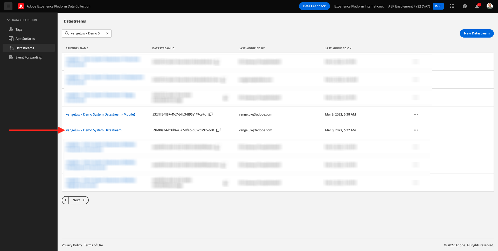
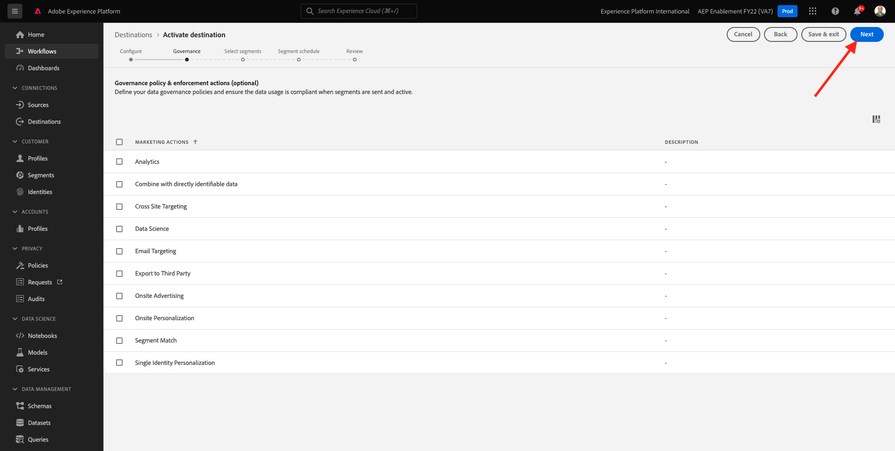

# 2.3.5 Aktion durchführen: Segment an Adobe Target senden

Wechseln Sie zu [Adobe Experience Platform](https://experience.adobe.com/platform). Nach der Anmeldung landen Sie auf der Startseite von Adobe Experience Platform.


Bevor Sie fortfahren, müssen Sie eine **Sandbox** auswählen. Die auszuwählende Sandbox heißt ``--aepSandboxName--``. Klicken Sie dazu in der blauen Zeile oben auf Ihrem Bildschirm auf den Text **[!UICONTROL Produktions-Prod]** . Nachdem Sie die entsprechende [!UICONTROL Sandbox] ausgewählt haben, sehen Sie die Bildschirmänderung und befinden sich nun in Ihrer dedizierten [!UICONTROL Sandbox].


## 2.3.5.1 Datensatz überprüfen

Das Adobe Target-Ziel in Real-Time CDP ist mit dem Datastream verbunden, der zur Aufnahme von Daten in das Adobe-Edge-Netzwerk verwendet wird. Wenn Sie Ihr Adobe Target-Ziel einrichten möchten, müssen Sie zunächst überprüfen, ob Ihr Datenspeicher bereits für Adobe Target aktiviert ist. Ihr Datastram wurde in [Übung 0.2 Erstellen Sie Ihren Datenspeicher](./../../../modules/gettingstarted/gettingstarted/ex2.md) konfiguriert und erhielt den Namen `--aepUserLdap-- - Demo System Datastream`.

Wechseln Sie zu [https://experience.adobe.com/#/data-collection/](https://experience.adobe.com/#/data-collection/) und klicken Sie dann auf **Datastreams** oder **Datastreams (Beta)**.


Wählen Sie oben rechts auf Ihrem Bildschirm den Namen Ihrer Sandbox aus, der `--aepSandboxName--` lauten soll.


Suchen Sie in Datastreams nach Ihrem Datastream mit dem Namen `--aepUserLdap-- - Demo System Datastream`. Klicken Sie auf Ihren Datenspeicher, um ihn zu öffnen.



Klicken Sie dann neben **Adobe Experience Platform** auf **...** und dann auf **Bearbeiten**.


Aktivieren Sie die Kontrollkästchen für sowohl **Edge-Segmentierung** als auch **Personalization-Ziele**. Klicken Sie auf **Speichern**.


Klicken Sie anschließend auf **+ Service hinzufügen**.


Wählen Sie den Dienst **Adobe Target** aus. Klicken Sie auf **Speichern**.


Ihr Datastream ist jetzt für Adobe Target konfiguriert.


## 2.3.5.2 Adobe Target-Ziel konfigurieren

Adobe Target ist als Ziel von Real-Time CDP verfügbar. Um Ihre Adobe Target-Integration einzurichten, gehen Sie zu **Ziele**, zu **Katalog**.


Klicken Sie im Menü **Kategorien** auf **Personalization** . Dann sehen Sie die Zielkarte **Adobe Target**. Klicken Sie auf **Segmente aktivieren** (oder **je nach Umgebung einrichten**).


Abhängig von Ihrer Umgebung müssen Sie möglicherweise auf **+ Neues Ziel konfigurieren** klicken, um Ihr Ziel zu erstellen.


Dann wirst du das sehen.


Im Bildschirm **Neues Ziel konfigurieren** müssen Sie zwei Dinge konfigurieren:

- Name: Verwenden Sie den Namen &quot;`--aepUserLdap-- - Adobe Target (Web)`&quot;, der wie folgt aussehen sollte: **vangeluw - Adobe Target (Web)**.
- Datastream-ID: Sie müssen den Datastream auswählen, den Sie in [Übung 0.2 Erstellen Sie Ihren Datastream](./../../../modules/gettingstarted/gettingstarted/ex2.md) konfiguriert haben. Der Name Ihres Datastreams sollte: `--aepUserLdap-- - Demo System Datastream` lauten.

Klicken Sie auf **Weiter**.


Im nächsten Bildschirm können Sie optional eine Governance-Richtlinie auswählen. Es ist nicht erforderlich, einen auszuwählen. In diesem Fall müssen Sie keinen auswählen. Klicken Sie daher auf **Erstellen**.



Ihr Ziel wird jetzt erstellt und in der Liste angezeigt. Wählen Sie Ihr Ziel aus und klicken Sie auf **Weiter** , um mit dem Senden von Segmenten an Ihr Ziel zu beginnen.


Wählen Sie in der Liste der verfügbaren Segmente das Segment aus, das Sie in [Übung 6.1 Erstellen eines Segments](./ex1.md) erstellt haben, das den Namen `--aepUserLdap-- - Interest in PROTEUS FITNESS JACKSHIRT` trägt. Klicken Sie dann auf **Weiter**.


Klicken Sie auf der nächsten Seite auf **Weiter**.


Klicken Sie auf **Fertigstellen**.


Ihr Segment ist jetzt für Adobe Target aktiviert.


>[!IMPORTANT]
>
>Wenn Sie Ihr Adobe Target-Ziel gerade in Real-Time CDP erstellt haben, kann es bis zu einer Stunde dauern, bis das Ziel aktiv ist. Dies ist eine einmalige Wartezeit aufgrund der Einrichtung der Backend-Konfiguration. Sobald die anfängliche Wartezeit von einer Stunde und die Backend-Konfiguration abgeschlossen sind, sind neu hinzugefügte Edge-Segmente, die an das Adobe Target-Ziel gesendet werden, für das Targeting in Echtzeit verfügbar.

## 2.3.5.3 Konfigurieren der formularbasierten Adobe Target-Aktivität

Nachdem Ihr Real-Time CDP-Segment für den Versand an Adobe Target konfiguriert wurde, können Sie Ihre Erlebnis-Targeting-Aktivität in Adobe Target konfigurieren. In dieser Übung konfigurieren Sie eine formularbasierte Aktivität.

Rufen Sie die Adobe Experience Cloud-Homepage auf, indem Sie zu [https://experiencecloud.adobe.com/](https://experiencecloud.adobe.com/) navigieren. Klicken Sie auf **Ziel** , um es zu öffnen.


Auf der Startseite von **Adobe Target** werden alle vorhandenen Aktivitäten angezeigt.


Klicken Sie auf **+ Aktivität erstellen** , um eine neue Aktivität zu erstellen.


Wählen Sie **Erlebnis-Targeting** aus.


Wählen Sie **Formular** und dann **Keine Eigenschaftenbeschränkungen** aus. Klicken Sie auf **Weiter**.


Sie befinden sich jetzt im formularbasierten Aktivitäts-Composer.


Wählen Sie für das Feld **POSITION 1** **target-global-mbox** aus.


Die Standardzielgruppe ist derzeit **Alle Besucher**. Klicken Sie auf die Punkte **3 Punkt** neben **Alle Besucher** und klicken Sie auf **Zielgruppe ändern**.


Jetzt wird die Liste der verfügbaren Zielgruppen angezeigt. Das Adobe Experience Platform-Segment, das Sie zuvor erstellt und an Adobe Target gesendet haben, ist jetzt Teil dieser Liste. Wählen Sie das Segment aus, das Sie zuvor in Adobe Experience Platform erstellt haben. Klicken Sie auf **Zielgruppe zuweisen**.


Ihr Adobe Experience Platform-Segment ist jetzt Teil dieser Erlebnis-Targeting-Aktivität.


Ändern wir nun das Hero Image auf der Startseite der Website. Klicken Sie auf , um die Dropdown-Liste neben **Standardinhalt** zu öffnen, und klicken Sie auf **HTML-Angebot erstellen**.


Fügen Sie den folgenden Code ein. Klicken Sie dann auf **Weiter**.

```javascript
<script>document.querySelector("#home > div > div > div > div > div.banner_img.d-none.d-lg-block > img").src="https://parsefiles.back4app.com/hgJBdVOS2eff03JCn6qXXOxT5jJFzialLAHJixD9/ff92fdc3885972c0090ad5419e0ef4d4_Luma - Product - Proteus - Hero Banner.png"; document.querySelector(".banner_text > *").remove()</script>
```


Anschließend sehen Sie das neue Erlebnis mit dem neuen Bild für Ihre ausgewählte Zielgruppe.


Klicken Sie auf den Titel Ihrer Aktivität in der oberen linken Ecke, um sie umzubenennen.


Für den Namen verwenden Sie bitte:

- `--aepUserLdap-- - RTCDP - XT (Form)`


Klicken Sie auf **Weiter**.


Wechseln Sie auf der Seite **Ziele und Einstellungen** - zu **Zielmetriken**.


Setzen Sie das Primäre Ziel auf **Interaktion** - **Besuchszeit pro Site**.


Klicken Sie auf **Speichern und schließen**.


Sie befinden sich nun auf der Seite **Aktivitätsübersicht** . Sie müssen Ihre Aktivität weiterhin aktivieren.


Klicken Sie auf das Feld **Inaktiv** und wählen Sie **Aktivieren** aus.


Sie erhalten dann eine visuelle Bestätigung, dass Ihre Aktivität jetzt live ist.


Ihre Aktivität ist jetzt live und kann auf der Demo-Website getestet werden.

>[!IMPORTANT]
>
>Wenn Sie Ihr Adobe Target-Ziel gerade in Real-Time CDP erstellt haben, kann es bis zu einer Stunde dauern, bis das Ziel aktiv ist. Dies ist eine einmalige Wartezeit aufgrund der Einrichtung der Backend-Konfiguration. Sobald die anfängliche Wartezeit von einer Stunde und die Backend-Konfiguration abgeschlossen sind, sind neu hinzugefügte Edge-Segmente, die an das Adobe Target-Ziel gesendet werden, für das Targeting in Echtzeit verfügbar.

Wenn Sie nun zu Ihrer Demo-Website zurückkehren und die Produktseite für PROTEUS FITNESS JACKSHIRT besuchen, qualifizieren Sie sich sofort für das von Ihnen erstellte Segment und die Adobe Target-Aktivität wird auf der Startseite in Echtzeit angezeigt.


Nächster Schritt: [2.3.6 Externe Zielgruppen](./ex6.md)

[Zurück zu Modul 2.3](./real-time-cdp-build-a-segment-take-action.md)

[Zu allen Modulen zurückkehren](../../../overview.md)
