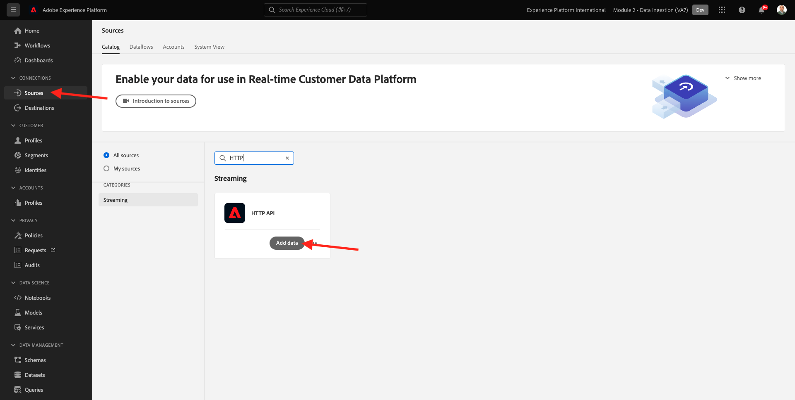
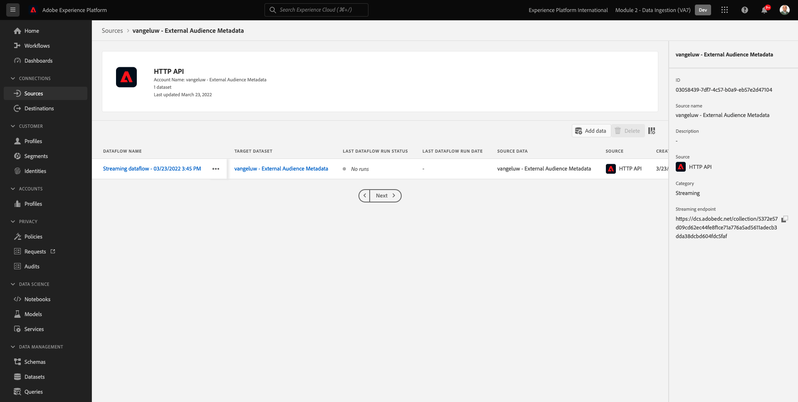
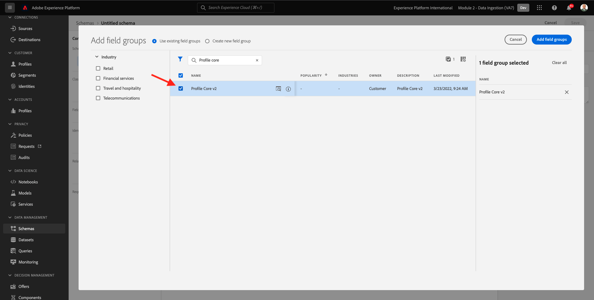
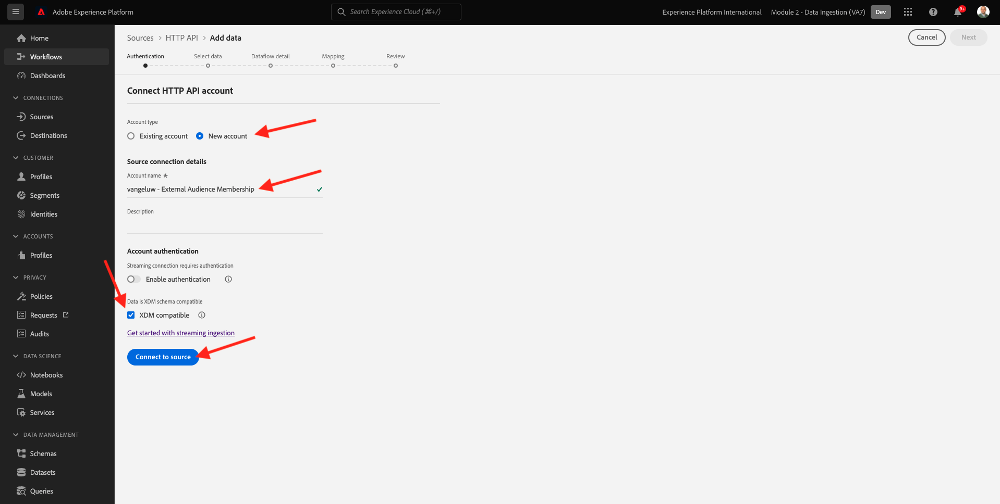
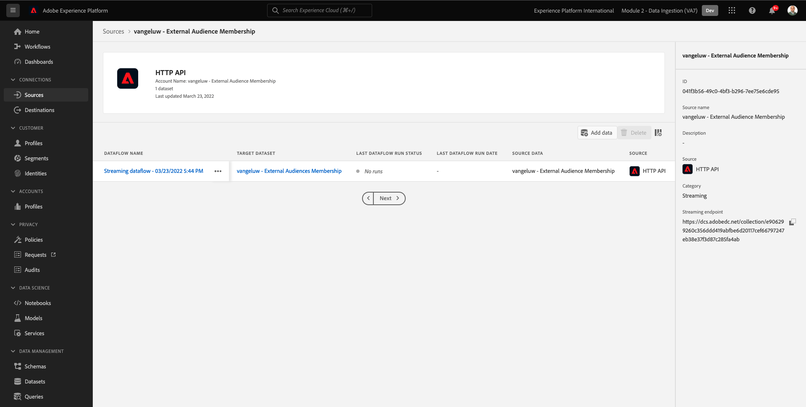
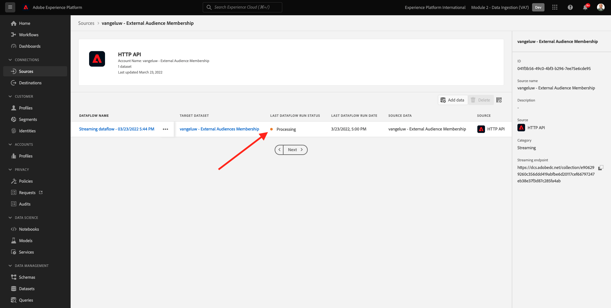

# 2.3.6 Externe Zielgruppen

In vielen Fällen möchte Ihr Unternehmen vorhandene Segmente aus anderen Anwendungen verwenden, um das Kundenprofil in Adobe Experience Platform anzureichern.
Diese externen Zielgruppen wurden möglicherweise auf der Grundlage eines Datenwissenschaftsmodells oder mithilfe externer Datenplattformen definiert.

Mit der Funktion für externe Zielgruppen in Adobe Experience Platform können Sie sich auf die Erfassung externer Zielgruppen und deren Aktivierung konzentrieren, ohne die entsprechende Segmentdefinition in Adobe Experience Platform detailliert neu definieren zu müssen.

Der Gesamtprozess gliedert sich in drei Hauptschritte:

- Importieren Sie die Metadaten der externen Zielgruppe: Mit diesem Schritt werden die Metadaten der externen Zielgruppe, z. B. der Zielgruppenname, in Adobe Experience Platform aufgenommen.
- Weisen Sie dem Kundenprofil die Mitgliedschaft in einer externen Zielgruppe zu: Dieser Schritt soll das Kundenprofil mit dem Attribut für die Mitgliedschaft in einem externen Segment anreichern.
- Erstellen Sie die Segmente in Adobe Experience Platform: Dieser Schritt dient der Erstellung umsetzbarer Segmente basierend auf der Mitgliedschaft in externen Zielgruppen.

## 2.3.6.1 Metadaten

Wechseln Sie zu [Adobe Experience Platform](https://experience.adobe.com/platform). Nach der Anmeldung landen Sie auf der Startseite von Adobe Experience Platform.


>[!IMPORTANT]
>
>Die Sandbox, die für diese Übung verwendet werden soll, ist ``--module2sandbox--``!

Bevor Sie fortfahren, müssen Sie eine **Sandbox** auswählen. Die auszuwählende Sandbox heißt ``--module2sandbox--``. Klicken Sie dazu in der blauen Zeile oben auf Ihrem Bildschirm auf den Text **[!UICONTROL Produktions-Prod]** . Nachdem Sie die entsprechende [!UICONTROL Sandbox] ausgewählt haben, sehen Sie die Bildschirmänderung und befinden sich nun in Ihrer dedizierten [!UICONTROL Sandbox].


Während die Segmentdaten die Bedingung definieren, dass ein Profil Teil eines Segments sein soll, sind die Segmentmetadaten Informationen zum Segment, wie z. B. Name, Beschreibung und Status des Segments. Da die Metadaten externer Zielgruppen in Adobe Experience Platform gespeichert werden, müssen Sie einen Identitäts-Namespace verwenden, um die Metadaten in Adobe Experience Platform zu erfassen.

## 2.3.6.1.1 Identity-Namespace für externe Zielgruppen

Ein Identitäts-Namespace wurde bereits für die Verwendung mit **externen Zielgruppen** erstellt.
Um die bereits erstellte Identität anzuzeigen, gehen Sie zu **Identitäten** und suchen Sie nach **External**. Klicken Sie auf das Element &quot;Externe Zielgruppen&quot;.

Bitte beachten Sie:

- Das Identitätssymbol **externalaudiences** wird in den nächsten Schritten verwendet, um auf die Identität externer Zielgruppen zu verweisen.
- Der Typ **Personenfremde Kennung** wird für diesen Identitäts-Namespace verwendet, da dieser Namespace nicht zur Identifizierung von Kundenprofilen, sondern von Segmenten dient.


## 2.3.6.1.2 Schema für externe Zielgruppen-Metadaten erstellen

Die Metadaten der externen Zielgruppen basieren auf dem **Segmentdefinitionsschema**. Weitere Informationen finden Sie im [XDM Github-Repository](https://github.com/adobe/xdm/blob/master/docs/reference/classes/segmentdefinition.schema.md).

Gehen Sie im linken Menü zu Schemas. Klicken Sie auf **+ Schema erstellen** und dann auf **Durchsuchen**.


Um eine Klasse zuzuweisen, suchen Sie nach **Segmentdefinition**. Wählen Sie die Klasse **Segmentdefinition** aus und klicken Sie auf **Klasse zuweisen**.


Dann wirst du das sehen. Klicken Sie auf **Abbrechen**.


Dann wirst du das sehen. Wählen Sie das Feld **_id** aus. Scrollen Sie im rechten Menü nach unten und aktivieren Sie die Kontrollkästchen **Identität** und **Primäre Identität** . Wählen Sie den Identitäts-Namespace **Externe Zielgruppen** aus. Klicken Sie auf **Übernehmen**.


Wählen Sie anschließend den Schemanamen **Unbenanntes Schema** aus. Ändern Sie den Namen in &quot;`--demoProfileLdap-- - External Audiences Metadata`&quot;.


Aktivieren Sie den Umschalter **Profil** und bestätigen Sie Ihre Eingabe. Klicken Sie abschließend auf **Speichern**.


## 2.3.6.1.3 Datensatz &quot;Externe Zielgruppen-Metadaten&quot;erstellen

Wechseln Sie in **Schemas** zu **Durchsuchen**. Suchen Sie nach dem Schema `--demoProfileLdap-- - External Audiences Metadata` , das Sie im vorherigen Schritt erstellt haben, und klicken Sie darauf. Klicken Sie anschließend auf **Datensatz aus Schema erstellen**.


Geben Sie für das Feld **Name** den Wert `--demoProfileLdap-- - External Audience Metadata` ein. Klicken Sie auf **Datensatz erstellen**.


Dann wirst du das sehen. Vergessen Sie nicht, den Umschalter **Profil** zu aktivieren!


## 2.3.6.1.4 HTTP-API-Source-Verbindung erstellen

Als Nächstes müssen Sie den HTTP API Source Connector konfigurieren, mit dem Sie die Metadaten in den Datensatz aufnehmen.

Wechseln Sie zu **Quellen**. Geben Sie im Suchfeld **HTTP** ein. Klicken Sie auf **Daten hinzufügen**.



Folgende Angaben sind erforderlich:

- **Kontotyp**: Wählen Sie **Neues Konto** aus.
- **Kontoname**: `--demoProfileLdap-- - External Audience Metadata` eingeben
- Aktivieren Sie das Kontrollkästchen **XDM-kompatibles Kontrollkästchen** .

Klicken Sie anschließend auf **Mit Quelle verbinden**.


Dann wirst du das sehen. Klicken Sie auf **Weiter**.


Wählen Sie **Vorhandenen Datensatz** aus und suchen Sie im Dropdown-Menü den Datensatz `--demoProfileLdap-- - External Audience Metadata` und wählen Sie ihn aus.

Überprüfen Sie die **Datenfluss-Details** und klicken Sie dann auf **Weiter**.


Dann wirst du das sehen.

Der Schritt **Zuordnung** des Assistenten ist leer, da Sie eine XDM-konforme Payload in den HTTP API Source Connector aufnehmen, sodass keine Zuordnung erforderlich ist. Klicken Sie auf **Weiter**.


Im Schritt **Überprüfen** können Sie optional die Verbindung und die Zuordnungsdetails überprüfen. Klicken Sie auf **Fertigstellen**.


Dann wirst du das sehen.



## 2.3.6.1.5 Aufnahme externer Zielgruppen-Metadaten

Klicken Sie auf der Registerkarte &quot;Übersicht über Source Connector&quot;auf **...** und klicken Sie dann auf **Schema-Payload kopieren**.


Öffnen Sie Ihre Text Editor-Anwendung auf Ihrem Computer und fügen Sie die Payload ein, die Sie soeben kopiert haben, was so aussieht. Als Nächstes müssen Sie das Objekt **xdmEntity** in dieser Payload aktualisieren.


Das Objekt **xdmEntity** muss durch den folgenden Code ersetzt werden. Kopieren Sie den folgenden Code und fügen Sie ihn in Ihre Textdatei ein, indem Sie das Objekt **xdmEntity** im Texteditor ersetzen.

```
"xdmEntity": {
    "_id": "--demoProfileLdap---extaudience-01",
    "description": "--demoProfileLdap---extaudience-01 description",
    "segmentIdentity": {
      "_id": "--demoProfileLdap---extaudience-01",
      "namespace": {
        "code": "externalaudiences"
      }
    },
    "segmentName": "--demoProfileLdap---extaudience-01 name",
    "segmentStatus": "ACTIVE",
    "version": "1.0"
  }
```

Daraufhin sollte Folgendes angezeigt werden:


Öffnen Sie als Nächstes ein neues **Terminal** -Fenster. Kopieren Sie den gesamten Text in Ihren Texteditor und fügen Sie ihn in das Terminal-Fenster ein.


Klicken Sie anschließend auf **Enter**.

Im Terminal-Fenster sehen Sie dann eine Bestätigung Ihrer Datenerfassung:


Aktualisieren Sie den Bildschirm Ihres HTTP-API-Source-Connectors, auf dem jetzt angezeigt wird, dass Daten verarbeitet werden:


## 2.3.6.1.6 Metadatenerfassung für externe Zielgruppen überprüfen

Nach Abschluss der Verarbeitung können Sie mithilfe von Query Service die Datenverfügbarkeit im Datensatz überprüfen.

Gehen Sie im rechten Menü zu **Datensätze** und wählen Sie den zuvor erstellten Datensatz `--demoProfileLdap-- - External Audience Metadata` aus.


Gehen Sie im rechten Menü zu Abfragen und klicken Sie auf **Abfrage erstellen**.


Geben Sie den folgenden Code ein und drücken Sie dann **UMSCHALT + EINGABETASTE**:

```
select * from --demoProfileLdap--_external_audience_metadata
```

In den Abfrageergebnissen sehen Sie die Metadaten der externen Audience, die Sie erfasst haben.


## 2.3.6.2 Segmentzugehörigkeit

Mit den verfügbaren externen Zielgruppen-Metadaten können Sie jetzt die Segmentzugehörigkeit für ein bestimmtes Kundenprofil erfassen.

Sie müssen jetzt einen Profildatensatz vorbereiten, der mit dem Schema der Segmentmitgliedschaft angereichert wird. Weitere Informationen finden Sie im [XDM Github-Repository](https://github.com/adobe/xdm/blob/master/docs/reference/datatypes/segmentmembership.schema.md).

## 2.3.6.2.1 Schema für die Mitgliedschaft in externen Zielgruppen erstellen

Gehen Sie im rechten Menü zu **Schemas**. Klicken Sie auf **Schema erstellen** und dann auf **XDM Individual Profile**.


Suchen Sie im Popup **Feldgruppen hinzufügen** nach **Profil-Core**. Wählen Sie die Feldergruppe **Profil-Core v2** aus.



Suchen Sie anschließend im Popup **Feldgruppen hinzufügen** nach **Segmentmitgliedschaft**. Wählen Sie die Feldergruppe **Details der Segmentmitgliedschaft** aus. Klicken Sie anschließend auf **Feldergruppen hinzufügen**.


Dann wirst du das sehen. Navigieren Sie zum Feld `--aepTenantId--.identification.core`. Klicken Sie auf das Feld **crmId** . Scrollen Sie im rechten Menü nach unten und aktivieren Sie die Kontrollkästchen **Identität** und **Primäre Identität** . Wählen Sie für den **Identity-Namespace** **Demo-System - CRMID** aus.

Klicken Sie auf **Übernehmen**.


Wählen Sie als Nächstes den Schemanamen **Unbenanntes Schema**. Geben Sie im Feld Anzeigename den Wert `--demoProfileLdap-- - External Audiences Membership` ein.


Aktivieren Sie als Nächstes den Umschalter **Profil** und bestätigen Sie. Klicken Sie auf **Speichern**.


## 2.3.6.2.2 Datensatz zur Mitgliedschaft in externen Zielgruppen erstellen

Wechseln Sie in **Schemas** zu **Durchsuchen**. Suchen Sie nach dem Schema `--demoProfileLdap-- - External Audiences Membership` , das Sie im vorherigen Schritt erstellt haben, und klicken Sie darauf. Klicken Sie anschließend auf **Datensatz aus Schema erstellen**.


Geben Sie für das Feld **Name** den Wert `--demoProfileLdap-- - External Audiences Membership` ein. Klicken Sie auf **Datensatz erstellen**.


Dann wirst du das sehen. Vergessen Sie nicht, den Umschalter **Profil** zu aktivieren!


## 2.3.6.2.3 HTTP-API-Source-Verbindung erstellen


Als Nächstes müssen Sie den HTTP API Source Connector konfigurieren, mit dem Sie die Metadaten in den Datensatz aufnehmen.

Wechseln Sie zu **Quellen**. Geben Sie im Suchfeld **HTTP** ein. Klicken Sie auf **Daten hinzufügen**.


Folgende Angaben sind erforderlich:

- **Kontotyp**: Wählen Sie **Neues Konto** aus.
- **Kontoname**: `--demoProfileLdap-- - External Audience Membership` eingeben
- Aktivieren Sie das Kontrollkästchen **XDM-kompatibles Kontrollkästchen** .

Klicken Sie anschließend auf **Mit Quelle verbinden**.



Dann wirst du das sehen. Klicken Sie auf **Weiter**.


Wählen Sie **Vorhandenen Datensatz** aus und suchen Sie im Dropdown-Menü den Datensatz `--demoProfileLdap-- - External Audiences Membership` und wählen Sie ihn aus.

Überprüfen Sie die **Datenfluss-Details** und klicken Sie dann auf **Weiter**.


Dann wirst du das sehen.

Der Schritt **Zuordnung** des Assistenten ist leer, da Sie eine XDM-konforme Payload in den HTTP API Source Connector aufnehmen, sodass keine Zuordnung erforderlich ist. Klicken Sie auf **Weiter**.


Im Schritt **Überprüfen** können Sie optional die Verbindung und die Zuordnungsdetails überprüfen. Klicken Sie auf **Fertigstellen**.


Dann wirst du das sehen.



## 2.3.6.2.4 Aufnahme von Daten zur Mitgliedschaft in externen Zielgruppen

Klicken Sie auf der Registerkarte &quot;Übersicht über Source Connector&quot;auf **...** und klicken Sie dann auf **Schema-Payload kopieren**.


Öffnen Sie Ihre Text Editor-Anwendung auf Ihrem Computer und fügen Sie die Payload ein, die Sie soeben kopiert haben, was so aussieht. Als Nächstes müssen Sie das Objekt **xdmEntity** in dieser Payload aktualisieren.


Das Objekt **xdmEntity** muss durch den folgenden Code ersetzt werden. Kopieren Sie den folgenden Code und fügen Sie ihn in Ihre Textdatei ein, indem Sie das Objekt **xdmEntity** im Texteditor ersetzen.

```
  "xdmEntity": {
    "_id": "--demoProfileLdap---profile-test-01",
    "_experienceplatform": {
      "identification": {
        "core": {
          "crmId": "--demoProfileLdap---profile-test-01"
        }
      }
    },
    "personID": "--demoProfileLdap---profile-test-01",
    "segmentMembership": {
      "externalaudiences": {
        "--demoProfileLdap---extaudience-01": {
          "status": "realized",
          "lastQualificationTime": "2022-03-05T00:00:00Z"
        }
      }
    }
  }
```

Daraufhin sollte Folgendes angezeigt werden:


Öffnen Sie als Nächstes ein neues **Terminal** -Fenster. Kopieren Sie den gesamten Text in Ihren Texteditor und fügen Sie ihn in das Terminal-Fenster ein.


Klicken Sie anschließend auf **Enter**.

Im Terminal-Fenster sehen Sie dann eine Bestätigung Ihrer Datenerfassung:


Aktualisieren Sie den Bildschirm Ihres HTTP-API-Source-Connectors, auf dem nach einigen Minuten die Verarbeitung der Daten angezeigt wird:



## 2.3.6.2.5 Aufnahme externer Zielgruppen validieren

Nach Abschluss der Verarbeitung können Sie mithilfe von Query Service die Datenverfügbarkeit im Datensatz überprüfen.

Gehen Sie im rechten Menü zu **Datensätze** und wählen Sie den zuvor erstellten Datensatz `--demoProfileLdap-- - External Audiences Membership ` aus.


Gehen Sie im rechten Menü zu Abfragen und klicken Sie auf **Abfrage erstellen**.


Geben Sie den folgenden Code ein und drücken Sie dann **UMSCHALT + EINGABETASTE**:

```
select * from --demoProfileLdap--_external_audiences_membership
```

In den Abfrageergebnissen sehen Sie die Metadaten der externen Audience, die Sie erfasst haben.


## 2.3.6.3 Segment erstellen

Jetzt sind Sie bereit, Maßnahmen für die externen Zielgruppen zu ergreifen.
In Adobe Experience Platform erfolgt die Aktion durch das Erstellen von Segmenten, das Füllen der jeweiligen Zielgruppen und das Teilen dieser Zielgruppen mit den Zielen.
Jetzt erstellen Sie ein Segment mit der zuvor erstellten externen Zielgruppe.

Gehen Sie im linken Menü zu **Segmente** und klicken Sie auf **Segment erstellen**.


Wechseln Sie zu **Zielgruppen**. Dann wirst du das sehen. Klicken Sie auf **Externe Zielgruppen**.


Wählen Sie die zuvor erstellte externe Zielgruppe mit dem Namen `--demoProfileLdap---extaudience-01` aus. Ziehen Sie die Zielgruppe auf die Arbeitsfläche.


Geben Sie Ihrem Segment einen Namen und verwenden Sie `--demoProfileLdap-- - extaudience-01`. Klicken Sie auf **Speichern und schließen**.


Dann wirst du das sehen. Sie werden auch feststellen, dass das Profil, für das Sie die Segmentmitgliedschaft aufgenommen haben, jetzt in der Liste der **Beispielprofile** angezeigt wird.


Ihr Segment ist jetzt bereit und kann zur Aktivierung an ein Ziel gesendet werden.

## 2.3.6.4 Kundenprofil visualisieren

Sie können jetzt auch die Segmentqualifizierung in Ihrem Kundenprofil visualisieren. Wechseln Sie zu **Profile**, verwenden Sie den Identitäts-Namespace **Demo System - CRMID**, geben Sie die Identität `--demoProfileLdap---profile-test-01` an, die Sie im Rahmen von Übung 6.6.2.4 verwendet haben, und klicken Sie auf **Anzeigen**. Klicken Sie anschließend auf die **Profil-ID** , um das Profil zu öffnen.


Navigieren Sie zu **Segmentmitgliedschaft** , wo Ihre externe Zielgruppe angezeigt wird.


Nächster Schritt: [2.3.7 Destinations SDK](./ex7.md)

[Zurück zu Modul 2.3](./real-time-cdp-build-a-segment-take-action.md)

[Zu allen Modulen zurückkehren](../../../overview.md)
