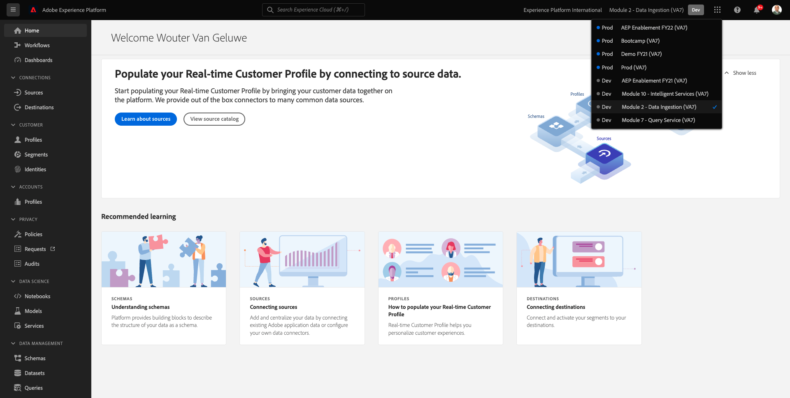
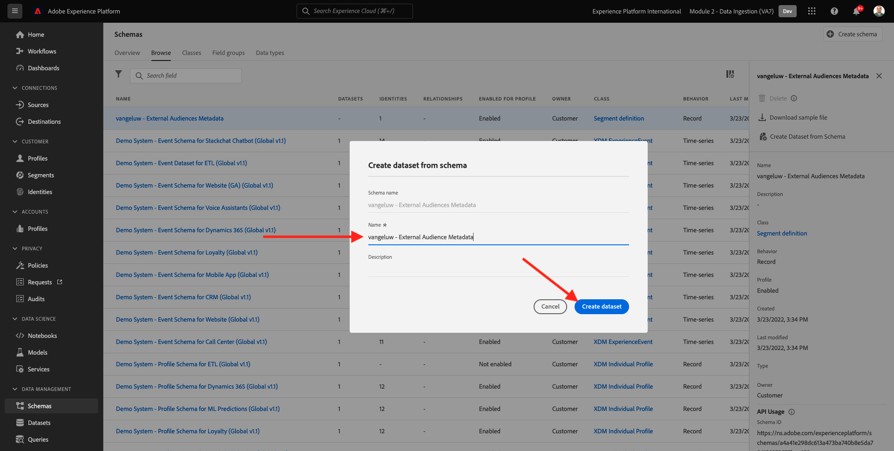
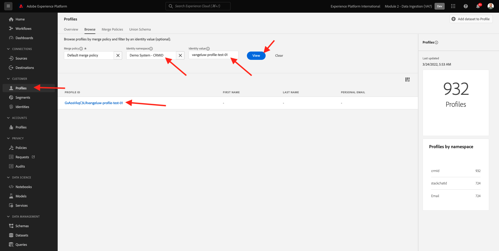

# 2.3.6 Externe Zielgruppen

In vielen Fällen möchte Ihr Unternehmen möglicherweise bestehende Zielgruppen aus anderen Programmen verwenden, um das Kundenprofil in Adobe Experience Platform anzureichern.
Diese externen Zielgruppen wurden möglicherweise auf der Grundlage eines Datenwissenschaftsmodells oder unter Verwendung externer Datenplattformen definiert.

Mit der Funktion für externe Zielgruppen in Adobe Experience Platform können Sie sich auf die Aufnahme externer Zielgruppen und deren Aktivierung konzentrieren, ohne die entsprechende Zielgruppendefinition in Adobe Experience Platform im Detail neu definieren zu müssen.

Der Gesamtprozess gliedert sich in drei Hauptschritte:

- Importieren der Metadaten der externen Zielgruppe: Dieser Schritt soll die Metadaten der externen Zielgruppe, wie z. B. den Zielgruppennamen, in Adobe Experience Platform aufnehmen.
- Weisen Sie dem Kundenprofil die externe Zielgruppenzugehörigkeit zu: Dieser Schritt soll das Kundenprofil mit dem Attribut für die Zugehörigkeit zu externen Zielgruppen anreichern.
- Erstellen Sie die Zielgruppen in Adobe Experience Platform: Dieser Schritt soll basierend auf der Zugehörigkeit zu externen Zielgruppen verwertbare Zielgruppen erstellen.

## Metadaten

Zu [Adobe Experience Platform](https://experience.adobe.com/platform). Nach dem Login landen Sie auf der Homepage von Adobe Experience Platform.


>[!IMPORTANT]
>
>Die für diese Übung zu verwendende Sandbox ist ``--aepSandboxName--``!

Bevor Sie fortfahren, müssen Sie eine **Sandbox“**. Die auszuwählende Sandbox hat den Namen ``--aepSandboxName--``. Nach Auswahl der entsprechenden [!UICONTROL Sandbox] wird der Bildschirm geändert und Sie befinden sich nun in Ihrer dedizierten [!UICONTROL Sandbox].



Während die Zielgruppendaten die Bedingung für ein Profil definieren, um Teil einer Zielgruppe zu sein, sind die Zielgruppen-Metadaten Informationen über die Zielgruppe, wie z. B. der Name, die Beschreibung und der Status der Zielgruppe. Da die Metadaten der externen Zielgruppen in Adobe Experience Platform gespeichert werden, müssen Sie einen Identity-Namespace verwenden, um die Metadaten in Adobe Experience Platform aufzunehmen.

## 2.3.6.1.1 Identity-Namespace für externe Zielgruppen

Es wurde bereits ein Identity-Namespace zur Verwendung mit &quot;**Audiences“**.
Um die bereits erstellte Identität anzuzeigen, gehen Sie zu **Identitäten** und suchen Sie nach **Extern**. Klicken Sie auf das Element „Externe Zielgruppen“.

Hinweis:

- Das Identitätssymbol **externe Zielgruppen** wird in den nächsten Schritten verwendet, um auf die Identität der externen Zielgruppen zu verweisen.
- Der **Nicht-Personen-ID**-Typ wird für diesen Identity-Namespace verwendet, da dieser Namespace nicht zur Identifizierung von Kundenprofilen, sondern von Zielgruppen vorgesehen ist.


## 2.3.6.1.2 Erstellen des Metadatenschemas für externe Zielgruppen

Die Metadaten der externen Zielgruppen basieren auf dem **Zielgruppendefinitionsschema**. Weitere Informationen finden Sie im [XDM GitHub-Repository](https://github.com/adobe/xdm/blob/master/docs/reference/classes/segmentdefinition.schema.md).

Gehen Sie im linken Menü zu Schemata . Klicken Sie auf **+ Schema erstellen** dann auf **Durchsuchen**.


Um eine Klasse zuzuweisen, suchen Sie nach **Zielgruppendefinition**. Wählen Sie die Klasse **Zielgruppendefinition** und klicken Sie auf **Klasse zuweisen**.


Sie werden es dann sehen. Klicken Sie **Abbrechen**.


Sie werden es dann sehen. Wählen Sie das Feld **_id** aus. Scrollen Sie im rechten Menü nach unten und aktivieren Sie die Kontrollkästchen **Identität** und **Primäre**. Wählen Sie den **-Namespace** Externe Zielgruppen“ aus. Klicken Sie auf **Übernehmen**.


Wählen Sie als Nächstes den Schemanamen **Nicht benanntes Schema** aus. Ändern Sie den Namen in `--aepUserLdap-- - External Audiences Metadata`.


Aktivieren Sie den **Profil**-Umschalter und bestätigen Sie ihn. Klicken Sie abschließend auf **Speichern**.


## 2.3.6.1.3 Erstellen des Metadatensatzes Externe Zielgruppen

Navigieren **in** Schemata **zu**. Suchen Sie nach dem `--aepUserLdap-- - External Audiences Metadata` Schema, das Sie im vorherigen Schritt erstellt haben, und klicken Sie darauf. Klicken Sie anschließend auf **Datensatz aus Schema erstellen**.


Geben Sie für **Feld** Name`--aepUserLdap-- - External Audience Metadata` ein. Klicken Sie **Datensatz erstellen**.



Sie werden es dann sehen. Vergessen Sie nicht, den Umschalter **Profil** zu aktivieren.


## 2.3.6.1.4 Erstellen einer Source-Verbindung für die HTTP-API

Als Nächstes müssen Sie die HTTP-API Source Connector konfigurieren, mit der Sie die Metadaten in den Datensatz aufnehmen.

Navigieren Sie zu **Quellen**. Geben Sie im Suchfeld &quot;**&quot;**. Klicken Sie **Daten hinzufügen**.


Folgende Angaben sind erforderlich:

- **Kontotyp**: wählen Sie **Neues Konto**
- **Kontoname**: `--aepUserLdap-- - External Audience Metadata` eingeben
- Aktivieren Sie das Kontrollkästchen **XDM-kompatibel**

Klicken Sie anschließend auf **Mit Quelle verbinden**.


Sie werden es dann sehen. Klicken Sie auf **Weiter**.


Wählen Sie **Vorhandener Datensatz** aus und suchen Sie im Dropdown-Menü nach dem `--aepUserLdap-- - External Audience Metadata` und wählen Sie ihn aus.

Überprüfen Sie **Datenflussdetails** und klicken Sie dann auf **Weiter**.


Sie werden es dann sehen.

Der **Zuordnungsschritt** des Assistenten ist leer, da Sie eine XDM-konforme Payload in den HTTP-API-Source-Connector aufnehmen, sodass keine Zuordnung erforderlich ist. Klicken Sie auf **Weiter**.


Im Schritt **Überprüfen** können Sie optional die Verbindung und die Zuordnungsdetails überprüfen. Klicken Sie auf **Fertigstellen**.


Sie werden es dann sehen.


## 2.3.6.1.5 Aufnahme von Metadaten externer Zielgruppen

Klicken Sie auf der Registerkarte Übersicht über den Source-Connector auf **…** und dann auf **Schema-Payload kopieren**.


Öffnen Sie Ihre Texteditor-Anwendung auf Ihrem Computer und fügen Sie die soeben kopierte Payload ein, die wie folgt aussieht. Als Nächstes müssen Sie das Objekt **xdmEntity** in dieser Payload aktualisieren.


Das Objekt **xdmEntity** muss durch den folgenden Code ersetzt werden. Kopieren Sie den folgenden Code und fügen Sie ihn in Ihre Textdatei ein, indem Sie das **xdmEntity**-Objekt im Texteditor ersetzen.

```
"xdmEntity": {
    "_id": "--aepUserLdap---extaudience-01",
    "description": "--aepUserLdap---extaudience-01 description",
    "segmentIdentity": {
      "_id": "--aepUserLdap---extaudience-01",
      "namespace": {
        "code": "externalaudiences"
      }
    },
    "segmentName": "--aepUserLdap---extaudience-01 name",
    "segmentStatus": "ACTIVE",
    "version": "1.0"
  }
```

Sie sollten dies dann sehen:


Öffnen Sie anschließend ein neues **Terminal**-Fenster. Kopieren Sie den gesamten Text in Ihrem Texteditor und fügen Sie ihn in das Terminal-Fenster ein.


Klicken Sie als Nächstes auf **Eingabetaste**.

Anschließend wird im Terminal-Fenster eine Bestätigung für die Datenaufnahme angezeigt:


Aktualisieren Sie den Bildschirm des HTTP-API-Source-Connectors, auf dem die Daten jetzt verarbeitet werden:


## 2.3.6.1.6 Validieren der Metadatenaufnahme externer Zielgruppen

Wenn die Verarbeitung abgeschlossen ist, können Sie die Datenverfügbarkeit im Datensatz mithilfe von Query Service überprüfen.

Wechseln Sie im rechten Menü zu **Datensätze** und wählen Sie den zuvor erstellten `--aepUserLdap-- - External Audience Metadata` aus.


Gehen Sie im rechten Menü zu Abfragen und klicken Sie auf **Abfrage erstellen**.


Geben Sie den folgenden Code ein und drücken Sie dann **UMSCHALT + EINGABETASTE**:

```
select * from --aepUserLdap--_external_audience_metadata
```

In den Abfrageergebnissen sehen Sie die Metadaten der externen Zielgruppe, die Sie aufgenommen haben.


## Zielgruppen-Zugehörigkeit

Mit den verfügbaren externen Zielgruppen-Metadaten können Sie jetzt die Zielgruppenzugehörigkeit für ein bestimmtes Kundenprofil aufnehmen.

Jetzt müssen Sie einen Profildatensatz vorbereiten, der mit dem Zielgruppenzugehörigkeitsschema angereichert wurde. Weitere Informationen finden Sie im [XDM GitHub-Repository](https://github.com/adobe/xdm/blob/master/docs/reference/datatypes/segmentmembership.schema.md).

### Erstellen des Zugehörigkeitsschemas zu externen Zielgruppen

Gehen Sie im rechten Menü zu **Schemata**. Klicken Sie auf **Schema erstellen** und dann auf **Individuelles XDM-Profil**.


Suchen Sie im **Feldergruppen hinzufügen**-Popup nach **Profile Core**. Wählen Sie die Feldergruppe **Profile Core v2** aus.


Suchen Sie dann im Popup **Feldergruppen hinzufügen** nach **Segmentzugehörigkeit**. Wählen Sie die **Details zur Segmentzugehörigkeit** aus. Klicken Sie anschließend auf **Feldergruppen hinzufügen**.


Sie werden es dann sehen. Navigieren Sie zur `--aepTenantId--.identification.core`. Klicken Sie auf **crmId**-Feld. Scrollen Sie im rechten Menü nach unten und aktivieren Sie die Kontrollkästchen **Identität** und **Primäre Identität**. Wählen Sie für **Identity** Namespace **Demosystem - CRMID** aus.

Klicken Sie auf **Übernehmen**.


Wählen Sie als Nächstes den Schemanamen **Nicht benanntes Schema** aus. Geben Sie im Feld Anzeigename `--aepUserLdap-- - External Audiences Membership` ein.


Aktivieren Sie als Nächstes den **Profil** und bestätigen Sie ihn. Klicken Sie auf **Speichern**.


### Erstellen des Datensatzes für die Zugehörigkeit zu externen Zielgruppen

Navigieren **in** Schemata **zu**. Suchen Sie nach dem `--aepUserLdap-- - External Audiences Membership` Schema, das Sie im vorherigen Schritt erstellt haben, und klicken Sie darauf. Klicken Sie anschließend auf **Datensatz aus Schema erstellen**.


Geben Sie für **Feld** Name`--aepUserLdap-- - External Audiences Membership` ein. Klicken Sie **Datensatz erstellen**.


Sie werden es dann sehen. Vergessen Sie nicht, den Umschalter **Profil** zu aktivieren.


### Erstellen einer Source-Verbindung für die HTTP-API


Als Nächstes müssen Sie die HTTP-API Source Connector konfigurieren, mit der Sie die Metadaten in den Datensatz aufnehmen.

Navigieren Sie zu **Quellen**. Geben Sie im Suchfeld &quot;**&quot;**. Klicken Sie **Daten hinzufügen**.


Folgende Angaben sind erforderlich:

- **Kontotyp**: wählen Sie **Neues Konto**
- **Kontoname**: `--aepUserLdap-- - External Audience Membership` eingeben
- Aktivieren Sie das Kontrollkästchen **XDM-kompatibel**

Klicken Sie anschließend auf **Mit Quelle verbinden**.


Sie werden es dann sehen. Klicken Sie auf **Weiter**.


Wählen Sie **Vorhandener Datensatz** aus und suchen Sie im Dropdown-Menü nach dem `--aepUserLdap-- - External Audiences Membership` und wählen Sie ihn aus.

Überprüfen Sie **Datenflussdetails** und klicken Sie dann auf **Weiter**.


Sie werden es dann sehen.

Der **Zuordnungsschritt** des Assistenten ist leer, da Sie eine XDM-konforme Payload in den HTTP-API-Source-Connector aufnehmen, sodass keine Zuordnung erforderlich ist. Klicken Sie auf **Weiter**.


Im Schritt **Überprüfen** können Sie optional die Verbindung und die Zuordnungsdetails überprüfen. Klicken Sie auf **Fertigstellen**.


Sie werden es dann sehen.


### Aufnahme von Daten zur Zugehörigkeit zu externen Audiences

Klicken Sie auf der Registerkarte Übersicht über den Source-Connector auf **…** und dann auf **Schema-Payload kopieren**.


Öffnen Sie Ihre Texteditor-Anwendung auf Ihrem Computer und fügen Sie die soeben kopierte Payload ein, die wie folgt aussieht. Als Nächstes müssen Sie das Objekt **xdmEntity** in dieser Payload aktualisieren.


Das Objekt **xdmEntity** muss durch den folgenden Code ersetzt werden. Kopieren Sie den folgenden Code und fügen Sie ihn in Ihre Textdatei ein, indem Sie das **xdmEntity**-Objekt im Texteditor ersetzen.

```
  "xdmEntity": {
    "_id": "--aepUserLdap---profile-test-01",
    "_experienceplatform": {
      "identification": {
        "core": {
          "crmId": "--aepUserLdap---profile-test-01"
        }
      }
    },
    "personID": "--aepUserLdap---profile-test-01",
    "segmentMembership": {
      "externalaudiences": {
        "--aepUserLdap---extaudience-01": {
          "status": "realized",
          "lastQualificationTime": "2022-03-05T00:00:00Z"
        }
      }
    }
  }
```

Sie sollten dies dann sehen:


Öffnen Sie anschließend ein neues **Terminal**-Fenster. Kopieren Sie den gesamten Text in Ihrem Texteditor und fügen Sie ihn in das Terminal-Fenster ein.


Klicken Sie als Nächstes auf **Eingabetaste**.

Anschließend wird im Terminal-Fenster eine Bestätigung für die Datenaufnahme angezeigt:


Aktualisieren Sie den Bildschirm für den HTTP-API-Source-Connector. Dort werden Sie nach einigen Minuten sehen, dass Daten verarbeitet werden:


### Aufnahme der Mitgliedschaft in externen Zielgruppen validieren

Wenn die Verarbeitung abgeschlossen ist, können Sie die Datenverfügbarkeit im Datensatz mithilfe von Query Service überprüfen.

Wechseln Sie im rechten Menü zu **Datensätze** und wählen Sie den zuvor erstellten `--aepUserLdap-- - External Audiences Membership ` aus.


Gehen Sie im rechten Menü zu Abfragen und klicken Sie auf **Abfrage erstellen**.


Geben Sie den folgenden Code ein und drücken Sie dann **UMSCHALT + EINGABETASTE**:

```
select * from --aepUserLdap--_external_audiences_membership
```

In den Abfrageergebnissen sehen Sie die Metadaten der externen Zielgruppe, die Sie aufgenommen haben.


## Erstellen eines Segments

Jetzt können Sie Aktionen für die externen Zielgruppen durchführen.
In Adobe Experience Platform erfolgt die Aktion durch Erstellen von Segmenten, Ausfüllen der entsprechenden Zielgruppen und Freigeben dieser Zielgruppen für die Ziele.
Im Folgenden erstellen Sie ein Segment unter Verwendung der soeben erstellten externen Zielgruppe.

Wechseln Sie im linken Menü zu **Segmente** und klicken Sie auf **Segment erstellen**.


Gehen Sie zu **Zielgruppen**. Sie werden es dann sehen. Klicken Sie **Externe Zielgruppen**.


Wählen Sie die zuvor erstellte externe Zielgruppe mit dem Namen `--aepUserLdap---extaudience-01` aus. Ziehen Sie die Zielgruppe per Drag-and-Drop auf die Arbeitsfläche.


Benennen Sie Ihr Segment. Verwenden Sie `--aepUserLdap-- - extaudience-01`. Klicken Sie **Speichern und schließen**.


Sie werden es dann sehen. Sie werden auch feststellen, dass das Profil, für das Sie die Segmentzugehörigkeit aufgenommen haben, jetzt in der Liste der **Beispielprofile“**.


Ihr Segment ist jetzt bereit und kann zur Aktivierung an ein Ziel gesendet werden.

## Visualisieren Ihres Kundenprofils

Sie können jetzt auch die Segmentqualifikation in Ihrem Kundenprofil visualisieren. Wechseln Sie zu **Profile**, verwenden Sie den Identity-Namespace **Demosystem -**) und geben Sie die `--aepUserLdap---profile-test-01` an, die Sie im Rahmen der 6.6.2.4 verwendet haben, und klicken Sie auf **Anzeigen**. Klicken Sie anschließend auf **Profil-ID**, um das Profil zu öffnen.



Navigieren Sie **Segmentzugehörigkeit**, wo Ihre externe Zielgruppe angezeigt wird.


Nächster Schritt: [2.3.7 Ziele SDK](./ex7.md)

[Zurück zum Modul 2.3](./real-time-cdp-build-a-segment-take-action.md)

[Zurück zu „Alle Module“](../../../overview.md)
