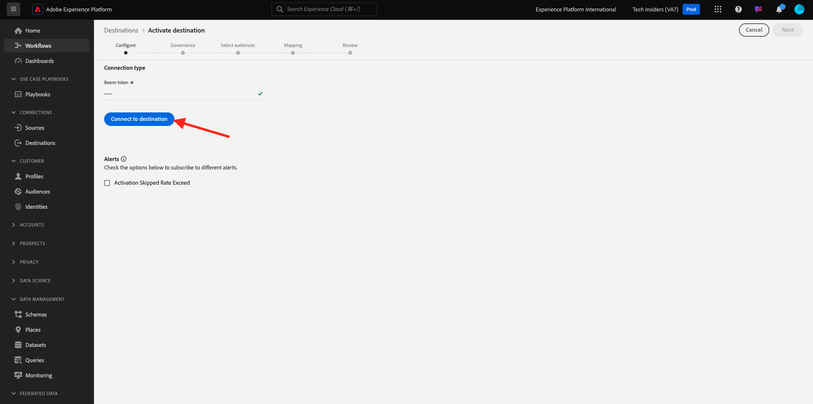
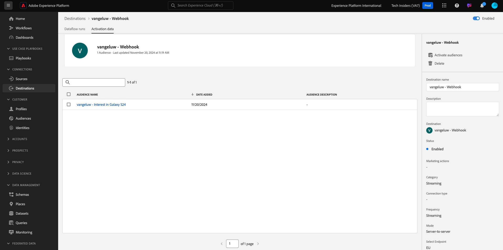

# 2.3.7 Destinations SDK

## Einrichten des Adobe I/O-Projekts

In dieser Übung verwenden Sie erneut Adobe I/O, um Adobe Experience Platform-APIs abzufragen. Wenn Sie Ihr Adobe I/O-Projekt noch nicht konfiguriert haben, gehen Sie zurück zu [Übung 3 in Modul 2.1](../module2.1/ex3.md) und befolgen Sie die Anweisungen dort.

## Postman-Authentifizierung für Adobe I/O

In dieser Übung verwenden Sie Postman erneut, um Adobe Experience Platform-APIs abzufragen. Wenn Sie Ihre Postman-Anwendung noch nicht konfiguriert haben, gehen Sie zurück zu [Übung 3 in Modul 2.1](../module2.1/ex3.md) und befolgen Sie die Anweisungen dort.

## Endpunkt und Format definieren

Für diese Übung benötigen Sie einen Endpunkt, der so konfiguriert werden muss, dass bei Qualifizierung eines Segments das Qualifikationsereignis an diesen Endpunkt gestreamt werden kann. In dieser Übung verwenden Sie einen Beispielendpunkt mit [https://webhook.site/](https://webhook.site/). Gehen Sie zu [https://webhook.site/](https://webhook.site/), wo Sie etwas Ähnliches sehen. Klicken Sie auf **In die Zwischenablage kopieren** , um die URL zu kopieren. Sie müssen diese URL in der nächsten Übung angeben. Die URL in diesem Beispiel lautet `https://webhook.site/e0eb530c-15b4-4a29-8b50-e40877d5490a`.


Was das Format anbelangt, so verwenden wir eine Standardvorlage, die Segmentqualifikationen oder Nicht-Qualifikationen zusammen mit Metadaten wie Kundenkennungen streamt. Vorlagen können angepasst werden, um die Erwartungen bestimmter Endpunkte zu erfüllen. In dieser Übung verwenden wir jedoch eine Standardvorlage, was zu einer Payload wie dieser führt, die an den Endpunkt gestreamt wird.

```json
{
  "profiles": [
    {
      "identities": [
        {
          "type": "ecid",
          "id": "64626768309422151580190219823409897678"
        }
      ],
      "AdobeExperiencePlatformSegments": {
        "add": [
          "f58c723c-f1e5-40dd-8c79-7bb4ab47f041"
        ],
        "remove": []
      }
    }
  ]
}
```

## Erstellen einer Server- und Vorlagenkonfiguration

Der erste Schritt zum Erstellen Ihres eigenen Ziels in Adobe Experience Platform besteht darin, einen Server und eine Vorlagenkonfiguration zu erstellen.

Wechseln Sie dazu zu **Ziel-Authoring-API**, zu **Ziel-Server und Vorlagen** und klicken Sie auf , um die Anfrage **POST - Erstellen einer Zielserverkonfiguration** zu öffnen. Dann wirst du das sehen. Unter **Kopfzeilen** müssen Sie den Wert für den Schlüssel **x-sandbox-name** manuell aktualisieren und auf `--aepSandboxName--` festlegen. Wählen Sie den Wert **{{SANDBOX_NAME}}** aus.


Ersetzen Sie sie durch `--aepSandboxName--`.


Navigieren Sie als Nächstes zu **Hauptteil**. den Platzhalter **{{body}}** auswählen.


Sie müssen jetzt den Platzhalter **{{body}}** durch den folgenden Code ersetzen:

```json
{
    "name": "Custom HTTP Destination",
    "destinationServerType": "URL_BASED",
    "urlBasedDestination": {
        "url": {
            "templatingStrategy": "PEBBLE_V1",
            "value": "yourURL"
        }
    },
    "httpTemplate": {
        "httpMethod": "POST",
        "requestBody": {
            "templatingStrategy": "PEBBLE_V1",
            "value": "{\n    \"profiles\": [\n    \n        {\n            \"identities\": [\n            \n            \n                \n                {\n                    \"type\": \"{{ namespace }}\",\n                    \"id\": \"{{ identity.id }}\"\n                },\n                ,\n            \n            ],\n            \"AdobeExperiencePlatformSegments\": {\n                \"add\": [\n                \n                    \"{{ segment.key }}\",\n                \n                ],\n                \"remove\": [\n                {#- Alternative syntax for filtering segments by status: -#}\n                \n                    \"{{ segment.key }}\",\n                \n                ]\n            }\n        },\n    \n    ]\n}"
        },
        "contentType": "application/json"
    }
}
```

Nach dem Einfügen des obigen Codes müssen Sie das Feld **urlBasedDestination.url.value** manuell aktualisieren und es auf die URL des Webhooks setzen, den Sie im vorherigen Schritt erstellt haben, nämlich `https://webhook.site/e0eb530c-15b4-4a29-8b50-e40877d5490a` in diesem Beispiel.


Nach dem Aktualisieren des Felds **urlBasedDescription.url.value** sollte es wie folgt aussehen. Klicken Sie auf **Senden**.


Nachdem Sie auf **Senden** geklickt haben, wird Ihre Servervorlage erstellt und als Teil der Antwort wird ein Feld namens **instanceId** angezeigt. Schreiben Sie es auf, wie Sie es im nächsten Schritt benötigen werden. In diesem Beispiel lautet die **instanceId**
2.`eb0f436f-dcf5-4993-a82d-0fcc09a6b36c`


## Zielkonfiguration erstellen

Wechseln Sie in Postman unter **Ziel-Authoring-API** zu **Zielkonfigurationen** und klicken Sie auf , um die Anfrage **POST - Zielkonfiguration erstellen** zu öffnen. Dann wirst du das sehen. Unter **Kopfzeilen** müssen Sie den Wert für den Schlüssel **x-sandbox-name** manuell aktualisieren und auf `--aepSandboxName--` festlegen. Wählen Sie den Wert **{{SANDBOX_NAME}}** aus.


Ersetzen Sie sie durch `--aepSandboxName--`.


Navigieren Sie als Nächstes zu **Hauptteil**. den Platzhalter **{{body}}** auswählen.


Sie müssen jetzt den Platzhalter **{{body}}** durch den folgenden Code ersetzen:

```json
{
    "name": "--aepUserLdap-- - Webhook",
    "description": "Exports segment qualifications and identities to a custom webhook via Destination SDK.",
    "status": "TEST",
    "customerAuthenticationConfigurations": [
        {
            "authType": "BEARER"
        }
    ],
    "customerDataFields": [
        {
            "name": "endpointsInstance",
            "type": "string",
            "title": "Select Endpoint",
            "description": "We could manage several instances across the globe for REST endpoints that our customers are provisioned for. Select your endpoint in the dropdown list.",
            "isRequired": true,
            "enum": [
                "US",
                "EU",
                "APAC",
                "NZ"
            ]
        }
    ],
    "uiAttributes": {
        "documentationLink": "https://experienceleague.adobe.com/docs/experience-platform/destinations/home.html?lang=en",
        "category": "streaming",
        "connectionType": "Server-to-server",
        "frequency": "Streaming"
    },
    "identityNamespaces": {
        "ecid": {
            "acceptsAttributes": true,
            "acceptsCustomNamespaces": false
        }
    },
    "segmentMappingConfig": {
        "mapExperiencePlatformSegmentName": true,
        "mapExperiencePlatformSegmentId": true,
        "mapUserInput": false
    },
    "aggregation": {
        "aggregationType": "BEST_EFFORT",
        "bestEffortAggregation": {
            "maxUsersPerRequest": "1000",
            "splitUserById": false
        }
    },
    "schemaConfig": {
        "profileRequired": false,
        "segmentRequired": true,
        "identityRequired": true
    },
    "destinationDelivery": [
        {
            "authenticationRule": "NONE",
            "destinationServerId": "yourTemplateInstanceID"
        }
    ]
}
```


Nach dem Einfügen des obigen Codes müssen Sie das Feld **destinationDelivery manuell aktualisieren. destinationServerId** verwenden, müssen Sie dafür die **instanceId** der Ziel-Server-Vorlage festlegen, die Sie im vorherigen Schritt erstellt haben und in diesem Beispiel `eb0f436f-dcf5-4993-a82d-0fcc09a6b36c` lautete. Klicken Sie als Nächstes auf **Senden**.


Dann sehen Sie diese Antwort.


Ihr Ziel wird jetzt in Adobe Experience Platform erstellt. Lass uns dorthin gehen und es überprüfen.

Wechseln Sie zu [Adobe Experience Platform](https://experience.adobe.com/platform). Nach der Anmeldung landen Sie auf der Startseite von Adobe Experience Platform.


Bevor Sie fortfahren, müssen Sie eine **Sandbox** auswählen. Die auszuwählende Sandbox heißt ``--aepSandboxName--``. Klicken Sie dazu in der blauen Zeile oben auf Ihrem Bildschirm auf den Text **[!UICONTROL Produktions-Prod]** . Nachdem Sie die entsprechende [!UICONTROL Sandbox] ausgewählt haben, sehen Sie die Bildschirmänderung und befinden sich nun in Ihrer dedizierten [!UICONTROL Sandbox].


Navigieren Sie im linken Menü zu **Ziele**, klicken Sie auf **Katalog** und scrollen Sie nach unten zur Kategorie **Streaming**. Ihr werdet dort jetzt euer Ziel sehen.


## Segment mit Ziel verknüpfen

Klicken Sie in **Ziele** > **Katalog** auf **Einrichten** Ihres Ziels, um Segmente zu Ihrem neuen Ziel hinzuzufügen.


Geben Sie ein Platzhalter-Träger-Token ein, z. B. **1234**. Klicken Sie auf **Mit Ziel verbinden**.



Dann wirst du das sehen. Verwenden Sie als Namen für Ihr Ziel `--aepUserLdap-- - Webhook`. Wählen Sie einen Endpunkt der Wahl aus, in diesem Beispiel **EU**. Klicken Sie auf **Weiter**.


Sie können optional eine Data Governance-Richtlinie auswählen. Klicken Sie auf **Weiter**.


Wählen Sie das zuvor erstellte Segment mit dem Namen `--aepUserLdap-- - Interest in PROTEUS FITNESS JACKSHIRT` aus. Klicken Sie auf **Weiter**.


Dann wirst du das sehen. Stellen Sie sicher, dass Sie das **SOURCE-FELD** `--aepTenantId--.identification.core.ecid` dem Feld `Identity: ecid` zuordnen. Klicken Sie auf **Weiter**.


Klicken Sie auf **Fertigstellen**.


Ihr Ziel ist jetzt live, neue Segmentqualifikationen werden jetzt an Ihren benutzerdefinierten Webhook gestreamt.



## Testen der Segmentaktivierung

Wechseln Sie zu [https://builder.adobedemo.com/projects](https://builder.adobedemo.com/projects). Nach der Anmeldung bei Ihrer Adobe ID sehen Sie dies. Klicken Sie auf Ihr Website-Projekt, um es zu öffnen.


Sie können nun den unten stehenden Fluss zum Zugriff auf die Website ausführen. Klicken Sie auf **Integrationen**.


Wählen Sie auf der Seite **Integrationen** die Datenerfassungseigenschaft aus, die in Übung 0.1 erstellt wurde.


Sie werden dann Ihre Demowebsite öffnen sehen. Wählen Sie die URL aus und kopieren Sie sie in die Zwischenablage.


Öffnen Sie ein neues Inkognito-Browserfenster.


Fügen Sie die URL Ihrer Demo-Website ein, die Sie im vorherigen Schritt kopiert haben. Sie werden dann aufgefordert, sich mit Ihrer Adobe ID anzumelden.


Wählen Sie Ihren Kontotyp aus und schließen Sie den Anmeldevorgang ab.


Sie sehen dann Ihre Website in einem Inkognito-Browser-Fenster geladen. Für jede Demonstration müssen Sie ein neues Inkognito-Browser-Fenster verwenden, um Ihre Demo-Website-URL zu laden.


Gehen Sie von der Startseite **Luma** zu **Men** und klicken Sie auf das Produkt **PROTEUS FITNESS JACKSHIRT**.


Sie haben jetzt die Produktseite für **PROTEUS FITNESS JACKSHIRT** besucht, was bedeutet, dass Sie sich jetzt für das Segment qualifizieren, das Sie zuvor in dieser Übung erstellt haben.


Wenn Sie den Profil-Viewer öffnen und zu **Segmente** gehen, wird das Segment als qualifiziert angezeigt.


Kehren Sie jetzt zu Ihrem offenen Webhook auf [https://webhook.site/](https://webhook.site/) zurück, wo eine neue eingehende Anfrage angezeigt werden sollte, die von Adobe Experience Platform stammt und das Segmentqualifikationsereignis enthält.


Nächster Schritt: [Zusammenfassung und Vorteile](./summary.md)

[Zurück zu Modul 2.3](./real-time-cdp-build-a-segment-take-action.md)

[Zu allen Modulen zurückkehren](../../../overview.md)
