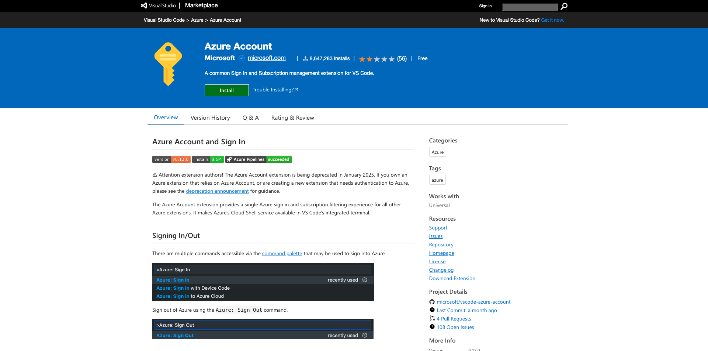

# 2.4.1 Umgebung konfigurieren

## Erstellen eines Azure-Abonnements

>[!NOTE]
>
>Wenn Sie bereits über ein Azure-Abonnement verfügen, können Sie diesen Schritt überspringen. Fahren Sie in diesem Fall mit der nächsten Übung fort.

Gehen Sie zu [https://portal.azure.com](https://portal.azure.com) und melden Sie sich mit Ihrem Azure-Konto an. Wenn Sie noch keine haben, verwenden Sie bitte Ihre persönliche E-Mail-Adresse, um Ihr Azure-Konto zu erstellen.


Nach erfolgreicher Anmeldung wird der folgende Bildschirm angezeigt:


Klicken Sie auf das Menü links und wählen Sie **Alle Ressourcen**. Der Azure-Anmeldebildschirm wird angezeigt, wenn Sie noch kein Abonnement haben. Wählen Sie in diesem Fall **Starten Sie mit einer freien Azure-Testversion**.


Füllen Sie das Azure-Anmeldeformular aus, stellen Sie Ihr Mobiltelefon und Ihre Kreditkarte zur Aktivierung bereit (Sie haben eine kostenlose Tier für 30 Tage und Sie werden nicht belastet, es sei denn, Sie aktualisieren).

Wenn der Abonnementprozess abgeschlossen ist, können Sie Folgendes tun:


## Installieren von Visual Code Studio

Sie werden Microsoft Visual Code Studio verwenden, um Ihr Azure-Projekt zu verwalten. Sie können es über [diesen Link](https://code.visualstudio.com/download) herunterladen. Befolgen Sie die Installationsanweisungen für Ihr bestimmtes Betriebssystem auf derselben Website.

## Installieren von Visual Code-Erweiterungen

Installieren Sie Azure Functions for Visual Studio Code von [https://marketplace.visualstudio.com/items?itemName=ms-azuretools.vscode-azurefunctions](https://marketplace.visualstudio.com/items?itemName=ms-azuretools.vscode-azurefunctions). Klicken Sie auf die Schaltfläche Installieren :


Installieren Sie Azure Account und Sign-In für Visual Studio Code von [https://marketplace.visualstudio.com/items?itemName=ms-vscode.azure-account](https://marketplace.visualstudio.com/items?itemName=ms-vscode.azure-account). Klicken Sie auf die Schaltfläche Installieren :



## Installieren von node.js

>[!NOTE]
>
>Wenn Sie node.js bereits installiert haben, können Sie diesen Schritt überspringen. Fahren Sie in diesem Fall mit der nächsten Übung fort.

### macOS

Stellen Sie sicher, dass [Homebrew](https://brew.sh/) zuerst installiert ist. Befolgen Sie die Anweisungen [hier](https://brew.sh/).


Nachdem Sie Homebrew installiert haben, führen Sie diesen Befehl aus:

```javascript
brew install node
```

### Windows

Laden Sie den [Windows Installer](https://nodejs.org/en/#home-downloadhead) direkt von der Website [nodejs.org](https://nodejs.org/en/) herunter.

## &quot;node.js&quot;-Version überprüfen

Für dieses Modul muss node.js , Version 18 installiert sein. Jede andere Version von node.js kann Probleme mit dieser Übung verursachen.

Bevor Sie fortfahren, überprüfen Sie bitte jetzt Ihre Version von node.js.

Führen Sie diesen Befehl aus, um Ihre node.js-Version zu überprüfen:

```javascript
node -v
```

Wenn Ihre Version unter oder über 18 liegt, müssen Sie ein Upgrade oder ein Downgrade durchführen.

### Aktualisieren/Herunterladen der node.js-Version auf macOS

Stellen Sie sicher, dass das Paket **n** installiert ist.

Führen Sie folgenden Befehl aus, um das Paket **n** zu installieren:

```javascript
sudo npm install -g n
```

Wenn Ihre Version unter oder über Version 12 liegt, führen Sie diesen Befehl aus, um ein Upgrade oder ein Downgrade durchzuführen:

```javascript
sudo n 18
```

### Aktualisieren/Herunterladen der node.js-Version unter Windows

Deinstallieren Sie node.js über Windows > Systemsteuerung > Programme hinzufügen oder entfernen.

Installieren der erforderlichen Version von der Website [nodejs.org](https://nodejs.org/en/) aus.

## NPM-Paket installieren: Anfrage

Sie müssen das Paket **request** im Rahmen der node.js-Einrichtung installieren.

Führen Sie folgenden Befehl aus, um das Paket **request** zu installieren:

```javascript
npm install request
```

## Installieren Sie die Azure Functions Core Tools:

```
brew tap azure/functions
brew install azure-functions-core-tools@4
```

Nächster Schritt: [2.4.2 Konfigurieren der Microsoft Azure EventHub-Umgebung](./ex2.md)

[Zurück zu Modul 2.4](./segment-activation-microsoft-azure-eventhub.md)

[Zu allen Modulen zurückkehren](./../../../overview.md)
