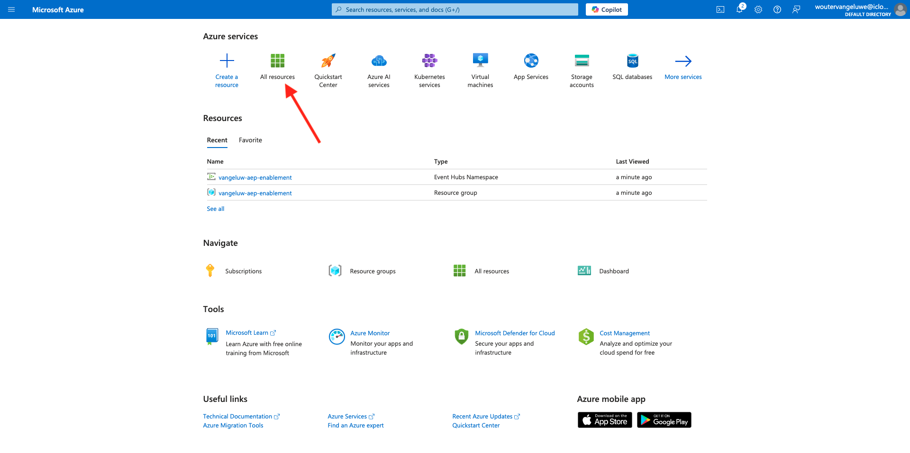
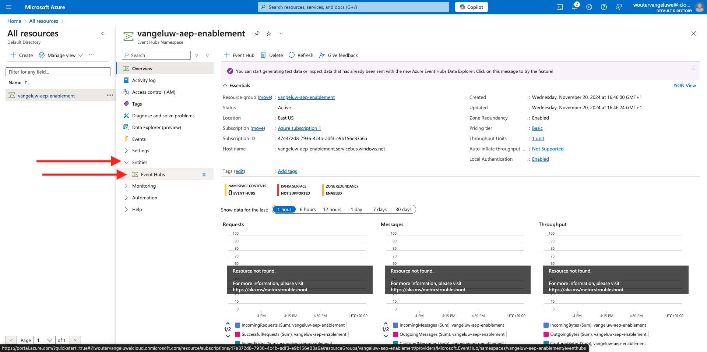
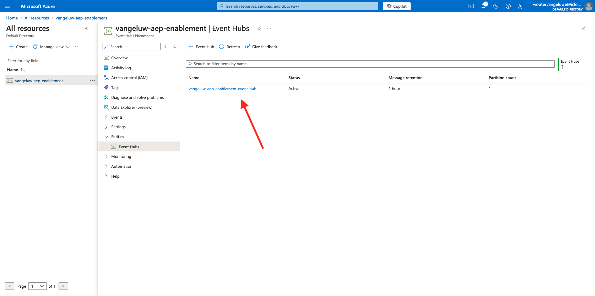

# 2.4.2 Konfigurieren der Microsoft Azure EventHub-Umgebung

Azure Event Hubs ist ein hochskalierbarer Publish-Subscribe-Service, der Millionen von Ereignissen pro Sekunde aufnehmen und in mehrere Anwendungen streamen kann. Auf diese Weise können Sie die enormen Datenmengen, die von Ihren verbundenen Geräten und Anwendungen erzeugt werden, verarbeiten und analysieren.

## Was sind Azure Event Hubs?

Azure Event Hubs ist eine Big Data-Streaming-Plattform und ein Dienst zur Erfassung von Ereignissen. Es kann Millionen von Ereignissen pro Sekunde empfangen und verarbeiten. An einen Ereignis-Hub gesendete Daten können mithilfe eines beliebigen Echtzeit-Analytics-Anbieters oder von Batch-/Speicheradaptern umgewandelt und gespeichert werden.

Ereignis-Hubs stellen die **Haustür** für eine Ereignis-Pipeline dar, die in Lösungsarchitekturen häufig als Ereignisaufnahme bezeichnet wird. Ein Ereignisaufruf ist eine Komponente oder ein Dienst, die bzw. der zwischen Ereignis-Herausgebern (wie Adobe Experience Platform RTCDP) und Ereigniskonsumenten sitzt, um die Produktion eines Ereignisstreams von der Nutzung dieser Ereignisse zu trennen. Event Hubs bietet eine einheitliche Streaming-Plattform mit Zeitaufbewahrungspuffer, wodurch Ereignisproduzenten von Ereigniskonsumenten abgekoppelt werden.

## Erstellen eines Ereignis-Hubs-Namespace

Wechseln Sie zu [https://portal.azure.com/#home](https://portal.azure.com/#home) und wählen Sie **Ressource erstellen** aus.

Geben Sie im Ressourcenbildschirm **Ereignis** in die Suchleiste ein. Suchen Sie die Karte **Ereignis-Hubs** , klicken Sie auf **Erstellen** und klicken Sie dann auf **Ereignis-Hubs**.

Wenn Sie in Azure zum ersten Mal eine Ressource erstellen, müssen Sie eine neue **Ressourcengruppe** erstellen. Wenn Sie bereits über eine Ressourcengruppe verfügen, können Sie diese auswählen (oder eine neue erstellen).

Klicken Sie auf **Neu erstellen** und benennen Sie Ihre Gruppe `--aepUserLdap---aep-enablement`. Klicken Sie auf **OK**.

Füllen Sie die übrigen Felder wie angegeben aus:

- Namespace : Definieren Sie Ihren Namespace. Er muss eindeutig sein. Verwenden Sie das folgende Muster `--aepUserLdap---aep-enablement`
- Standort: Wählen Sie einen beliebigen Standort aus.
- Preisklasse: **Einfach**
- Durchsatzeinheiten: **1**

Klicken Sie auf **Überprüfen und erstellen**.

Klicken Sie auf **Erstellen**.

Die Bereitstellung Ihrer Ressourcengruppe kann 1-2 Minuten dauern. Nach erfolgreichem Abschluss wird der folgende Bildschirm angezeigt:

## Einrichten des Ereignis-Hub in Azure

Wechseln Sie zu [https://portal.azure.com/#home](https://portal.azure.com/#home) und wählen Sie **Alle Ressourcen** aus.

Klicken Sie in der Liste der Ressourcen auf Ihren `--aepUserLdap---aep-enablement` Ereignis-Hubs-Namespace:

Wechseln Sie im Detailbildschirm von `--aepUserLdap---aep-enablement` zu **Entitäten** und klicken Sie auf **Ereignis-Hubs**:

Klicken Sie auf **+ Event Hub**.

Verwenden Sie `--aepUserLdap---aep-enablement-event-hub` als Namen und klicken Sie auf **Überprüfen und Erstellen**.

Klicken Sie auf **Erstellen**.

In **Ereignis-Hub** unter Ihrem Ereignis-Hub-Namespace wird nun Ihr **Ereignis-Hub** aufgelistet.

## Einrichten Ihres Azure Storage-Kontos

Um Ihre Azure Event Hub-Funktion in späteren Übungen zu debuggen, müssen Sie im Rahmen der Einrichtung Ihres Visual Studio Code-Projekts ein Azure Storage-Konto bereitstellen. Sie erstellen jetzt dieses Azure Storage-Konto.

Wechseln Sie zu &quot;[https://portal.azure.com/#home](https://portal.azure.com/#home)&quot;und wählen Sie &quot;**Erstellen einer Ressource**&quot;.

Geben Sie **Speicherkonto** in die Suche ein, suchen Sie die Karte für **Speicherkonto** und klicken Sie auf **Speicherkonto**.

Geben Sie Ihre **Ressourcengruppe** (erstellt zu Beginn dieser Übung), verwenden Sie `--aepUserLdap--aepstorage` als Namen Ihres Speicherkontos und wählen Sie **Lokal redundanter Speicher (LRS)** aus, und klicken Sie dann auf **Überprüfen und erstellen**.

Klicken Sie auf **Erstellen**.

Die Erstellung unseres Speicherkontos dauert einige Sekunden:

Wenn Sie fertig sind, wird auf Ihrem Bildschirm die Schaltfläche **Gehe zu Ressource** angezeigt.

Klicken Sie auf **Home**.

Ihr Speicherkonto ist jetzt unter **Letzte Ressourcen** sichtbar.

Nächster Schritt: [2.4.3 Konfigurieren Sie Ihr Azure Event Hub-Ziel in Adobe Experience Platform](./ex3.md)

[Zurück zu Modul 2.4](./segment-activation-microsoft-azure-eventhub.md)

[Zu allen Modulen zurückkehren](./../../../overview.md)
