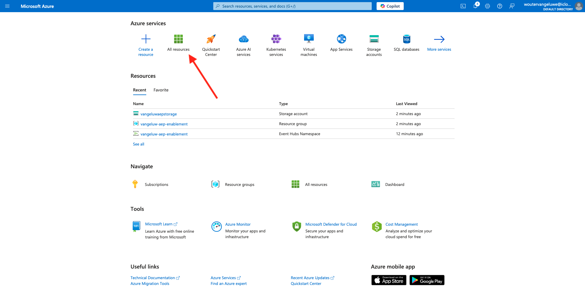
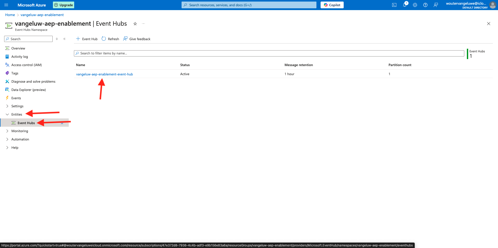

# 2.4.3 Konfigurieren des Azure Event Hub-Ziels in Adobe Experience Platform

## Identifizieren der erforderlichen Azure-Verbindungsparameter

Zum Konfigurieren eines Event Hub-Ziels in Adobe Experience Platform benötigen Sie Folgendes:

- Ereignis-Hubs-Namespace
- Ereignis-Hub
- Azure SAS-Schlüsselname
- Azure-SAS-Schlüssel

Event Hub- und EventHub-Namespace wurden in der vorherigen Übung definiert: [Einrichten von Event Hub in Azure](./ex2.md)

### Ereignis-Hubs-Namespace

Um die oben genannten Informationen in Azure Portal zu suchen, navigieren Sie zu [https://portal.azure.com/#home](https://portal.azure.com/#home). Stellen Sie sicher, dass Sie das richtige Azure-Konto verwenden.

Klicken Sie in Ihrem Azure-Portal auf **Alle Ressourcen** :

Suchen Sie Ihren **Ereignis-Hubs-Namespace** in der Liste und klicken Sie darauf.

Der Name Ihres **Ereignis-Hubs-Namespace** ist jetzt deutlich sichtbar. Sie sollte dem Wert `--aepUserLdap---aep-enablement` ähneln.

### Ereignis-Hub

Klicken Sie auf Ihrer Seite **Ereignis-Hubs-Namespace** auf **Entitäten > Ereignis-Hub** , um eine Liste der Ereignis-Hub zu erhalten, die in Ihrem Ereignis-Hub-Namespace definiert sind. Wenn Sie die in der vorherigen Übung verwendeten Namenskonventionen befolgt haben, finden Sie einen Ereignis-Hub mit dem Namen `--aepUserLdap---aep-enablement-event-hub`. Notieren Sie sich das, Sie werden es in der nächsten Übung brauchen.

### SAS-Schlüsselname

Klicken Sie auf der Seite **Ereignis-Hubs-Namespace** auf **Einstellungen > Freigegebene Zugriffsrichtlinien**. Daraufhin wird eine Liste der Richtlinien für den freigegebenen Zugriff angezeigt. Der SAS-Schlüssel, nach dem wir suchen, ist **RootManageSharedAccessKey**, der Name des **SAS-Schlüssels. Schreib es auf.

### SAS-Schlüsselwert

Klicken Sie anschließend auf **RootManageSharedAccessKey** , um den SAS-Schlüsselwert abzurufen. Drücken Sie dann das Symbol **In die Zwischenablage kopieren** , um die **Primäre Taste**, in diesem Fall `pqb1jEC0KLazwZzIf2gTHGr75Z+PdkYgv+AEhObbQEY=`, zu kopieren.

### Zielwertzusammenfassung

An dieser Stelle sollten Sie alle Werte identifiziert haben, die zum Definieren des Azure Event Hub-Ziels in der Echtzeit-Kundendatenplattform von Adobe Experience Platform erforderlich sind.

| Zielattribut-Name | Zielattributwert | Beispielwert |
|---|---|---|
| sasKeyName | SAS-Schlüsselname | RootManageSharedAccessKey |
| sasKey | SAS-Schlüsselwert | pqb1jEC0KLazwZzIf2gTHGr75Z+PdkYgv+AEhObbQEY= |
| Namespace | Ereignis-Hubs-Namespace | `--aepUserLdap---aep-enablement` |
| eventHubName | Ereignis-Hub | `--aepUserLdap---aep-enablement-event-hub` |

## Erstellen eines Azure Event Hub-Ziels in Adobe Experience Platform

Melden Sie sich bei Adobe Experience Platform an, indem Sie diese URL verwenden: [https://experience.adobe.com/platform](https://experience.adobe.com/platform).

Nach der Anmeldung landen Sie auf der Startseite von Adobe Experience Platform.

Bevor Sie fortfahren, müssen Sie eine **Sandbox** auswählen. Die auszuwählende Sandbox heißt ``--aepSandboxName--``. Nachdem Sie die entsprechende Sandbox ausgewählt haben, wird die Bildschirmänderung angezeigt und Sie befinden sich jetzt in Ihrer dedizierten Sandbox.

Wechseln Sie zu **Ziele** und gehen Sie dann zu **Katalog**. Wählen Sie **Cloud-Speicher**, gehen Sie zu **Azure Event Hub** und klicken Sie auf **Einrichten**.

Wählen Sie **Standardauthentifizierung** aus. Füllen Sie die Verbindungsdetails aus, die Sie in der vorherigen Übung erfasst haben. Klicken Sie anschließend auf **Mit Ziel verbinden**.

Wenn Ihre Anmeldedaten korrekt waren, sehen Sie eine Bestätigung: **Verbunden**.

Geben Sie nun den Namen und die Beschreibung im Format `--aepUserLdap---aep-enablement` ein. Geben Sie den **eventHubName** ein (siehe vorherige Übung, sieht wie folgt aus: `--aepUserLdap---aep-enablement-event-hub`) und klicken Sie auf **Weiter**.

Sie können optional eine Data Governance-Richtlinie auswählen. Klicken Sie auf **Speichern und beenden**.

Ihr Ziel wurde jetzt in Adobe Experience Platform erstellt und verfügbar gemacht.

Nächster Schritt: [2.4.4 Erstellen einer Zielgruppe](./ex4.md)

[Zurück zu Modul 2.4](./segment-activation-microsoft-azure-eventhub.md)

[Zu allen Modulen zurückkehren](./../../../overview.md)
