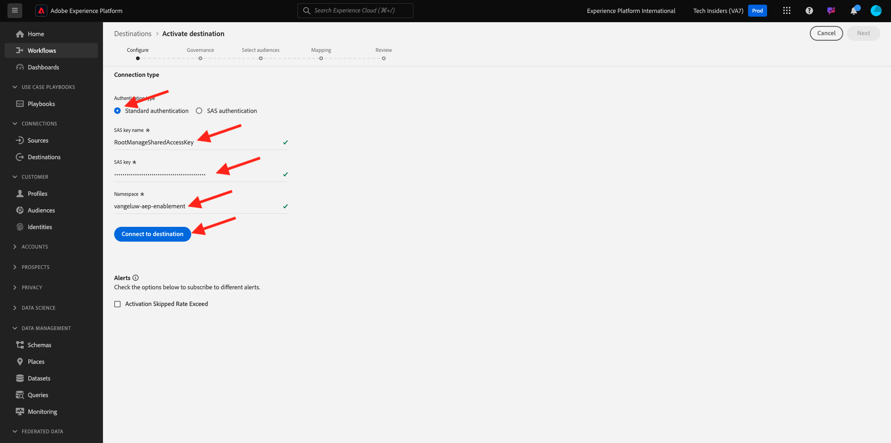

# 2.4.3 Konfigurieren des Azure Event Hub-Ziels in Adobe Experience Platform

## Identifizieren erforderlicher Azure-Verbindungsparameter

Zum Konfigurieren eines Event Hub-Ziels in Adobe Experience Platform benötigen Sie Folgendes:

- Namespace von Event Hubs
- Ereignis-Hub
- Azure SAS-Schlüsselname
- Azure SAS-Schlüssel

Event Hub und EventHub-Namespace wurden in der vorherigen Übung definiert: [Einrichten von Event Hub in Azure](./ex2.md)

### Namespace der Ereignis-Hubs

Um die oben genannten Informationen im Azure-Portal zu suchen, navigieren Sie zu [https://portal.azure.com/#home](https://portal.azure.com/#home). Stellen Sie sicher, dass Sie das richtige Azure-Konto verwenden.

Klicken Sie **Alle Ressourcen** in Ihrem Azure-Portal:

Suchen Sie Ihren **Event Hubs-Namespace** in der Liste und klicken Sie darauf.

Der Name Ihres **Event Hubs-Namespace** ist jetzt deutlich sichtbar. Es sollte ähnlich wie `--aepUserLdap---aep-enablement` sein.

### Ereignis-Hub

Klicken Sie auf Ihrer Seite **Event Hubs-** Namespace) auf **Entitäten > Ereignis-Hubs**, um eine Liste der in Ihrem Event Hubs-Namespace definierten Ereignis-Hubs zu erhalten. Wenn Sie die in der vorherigen Übung verwendeten Benennungskonventionen befolgt haben, finden Sie einen Ereignis-Hub mit dem Namen `--aepUserLdap---aep-enablement-event-hub`. Notieren Sie sich das. Sie benötigen es in der nächsten Übung.

### SAS-Schlüsselname

Klicken Sie auf **Seite „Namespace** Ereignis-Hubs“ auf **Einstellungen > Richtlinien für gemeinsamen Zugriff**. Es wird eine Liste mit Richtlinien für den gemeinsamen Zugriff angezeigt. Der gesuchte SAS-Schlüssel ist **RootManageSharedAccessKey**, der **SAS-Schlüsselname. Schreib es auf.

### SAS-Schlüsselwert

Klicken Sie anschließend auf **RootManageSharedAccessKey**, um den SAS-Schlüsselwert abzurufen. und drücken Sie das Symbol **In Zwischenablage kopieren**, um die Primäre **** Taste zu kopieren, in diesem Fall `pqb1jEC0KLazwZzIf2gTHGr75Z+PdkYgv+AEhObbQEY=`.

### Zusammenfassung der Zielwerte

An dieser Stelle sollten Sie alle Werte identifiziert haben, die zum Definieren des Azure Event Hub-Ziels in Adobe Experience Platform Real-time CDP erforderlich sind.

| Zielattributname | Zielattributwert | Beispielwert |
|---|---|---|
| sasKeyName | SAS-Schlüsselname | RootManageSharedAccessKey |
| sasKey | SAS-Schlüsselwert | pqb1jEC0KLazwZzIf2gTHGr75Z+PdkYgv+AEhObbQEY= |
| Namespace | Namespace der Ereignis-Hubs | `--aepUserLdap---aep-enablement` |
| eventHubName | Ereignis-Hub | `--aepUserLdap---aep-enablement-event-hub` |

## Erstellen eines Azure Event Hub-Ziels in Adobe Experience Platform

Melden Sie sich über die folgende URL bei Adobe Experience Platform an: [https://experience.adobe.com/platform](https://experience.adobe.com/platform).

Nach dem Login landen Sie auf der Homepage von Adobe Experience Platform.

Bevor Sie fortfahren, müssen Sie eine **Sandbox“**. Die auszuwählende Sandbox hat den Namen ``--aepSandboxName--``. Nach Auswahl der entsprechenden Sandbox wird der Bildschirm geändert und Sie befinden sich nun in Ihrer dedizierten Sandbox.

Gehen Sie zu **Ziele** und dann zu **Katalog**. Wählen Sie **Cloud-Speicher**, gehen Sie zu **Azure Event** und klicken Sie auf **Einrichten**.

Wählen Sie **Standardauthentifizierung** aus. Füllen Sie die Verbindungsdetails aus, die Sie in der vorherigen Übung erfasst haben. Klicken Sie anschließend auf **Mit Ziel verbinden**.

Wenn Ihre Anmeldeinformationen korrekt waren, wird eine Bestätigung angezeigt: **Verbunden**.

Nun müssen Sie den Namen und die Beschreibung im `--aepUserLdap---aep-enablement` Format eingeben. Geben Sie **eventHubName** ein (siehe vorherige Übung, es sieht wie folgt aus: `--aepUserLdap---aep-enablement-event-hub`) und klicken Sie auf **Weiter**.

Sie können optional eine Data Governance-Richtlinie auswählen. Klicken Sie auf **Speichern und beenden**.

Ihr Ziel ist jetzt in Adobe Experience Platform erstellt und verfügbar.

Nächster Schritt: [2.4.4 Erstellen einer Zielgruppe](./ex4.md)

[Zurück zum Modul 2.4](./segment-activation-microsoft-azure-eventhub.md)

[Zurück zu „Alle Module“](./../../../overview.md)
