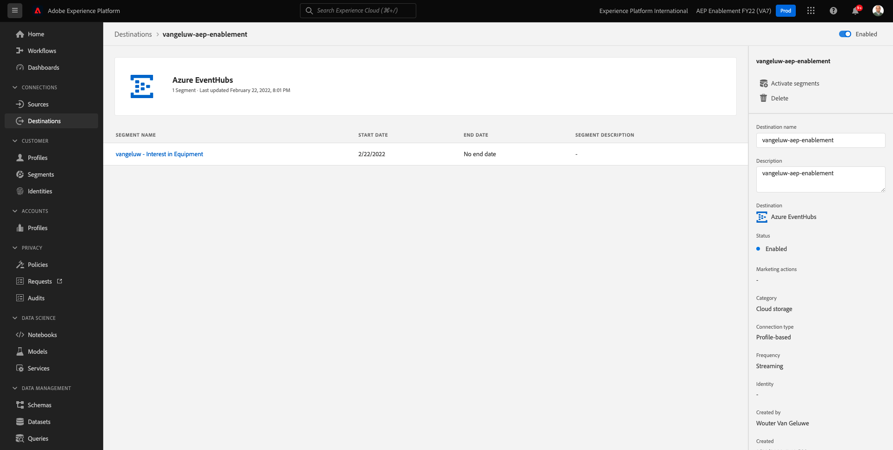

# 2.4.4 Segment aktivieren

## 2.4.4.1 Segment zum Azure Event Hub-Ziel hinzufügen

In dieser Übung fügen Sie Ihr Segment `--aepUserLdap-- - Interest in Equipment` zu Ihrem `--aepUserLdap---aep-enablement` Azure Event Hub-Ziel hinzu.

Melden Sie sich bei Adobe Experience Platform an, indem Sie diese URL verwenden: [https://experience.adobe.com/platform](https://experience.adobe.com/platform).

Nach der Anmeldung landen Sie auf der Startseite von Adobe Experience Platform.

Bevor Sie fortfahren, müssen Sie eine **Sandbox** auswählen. Die auszuwählende Sandbox heißt ``--aepSandboxName--``. Nachdem Sie die entsprechende Sandbox ausgewählt haben, wird die Bildschirmänderung angezeigt und Sie befinden sich jetzt in Ihrer dedizierten Sandbox.

Wechseln Sie zu **Ziele** und klicken Sie dann auf **Durchsuchen**. Daraufhin werden alle verfügbaren Ziele angezeigt. Suchen Sie Ihr Ziel und klicken Sie auf das Symbol **+** , wie unten angegeben.

Dann wirst du das sehen. Suchen Sie mithilfe Ihrer LDAP nach Ihrem Segment und wählen Sie `--aepUserLdap-- - Interest in Equipment` aus der Segmentliste aus.

Klicken Sie auf **Weiter**.

Die Echtzeit-Kundendatenplattform von Adobe Experience Platform kann eine Payload an zwei Zieltypen, Segmentziele und Profilziele bereitstellen.

Segmentziele erhalten eine vordefinierte Segmentqualifikations-Payload, die später besprochen wird. Eine solche Payload enthält **all** die Segmentqualifikationen für ein bestimmtes Profil. Selbst für Segmente, die nicht in der Aktivierungsliste des Ziels enthalten sind. Ein Beispiel für ein solches Segmentziel sind **Azure Event Hub** und **AWS Kinesis**.

Mit profilbasierten Zielen können Sie beliebige Attribute (firstName, lastName, ...) aus dem XDM Profile Union Schema auswählen und in die Aktivierungs-Payload aufnehmen. Ein Beispiel für ein solches Ziel ist das **E-Mail-Marketing**.

Da Ihr Azure Event Hub-Ziel ein **Segment** -Ziel ist, wählen Sie beispielsweise das Feld `--aepTenantId--.identification.core.ecid` aus.

Klicken Sie auf **Neues Feld hinzufügen**, klicken Sie auf Schema durchsuchen und wählen Sie das Feld `--aepTenantId--identification.core.ecid` aus (löschen Sie alle anderen Felder, die automatisch angezeigt werden).

Klicken Sie auf **Weiter**.

Klicken Sie auf **Fertigstellen**.

Ihr Segment ist jetzt für Ihr Microsoft Event Hub-Ziel aktiviert.

Nächster Schritt: [2.4.5 Erstellen Sie Ihr Microsoft Azure-Projekt](./ex5.md)

[Zurück zu Modul 2.4](./segment-activation-microsoft-azure-eventhub.md)

[Zu allen Modulen zurückkehren](./../../../overview.md)
