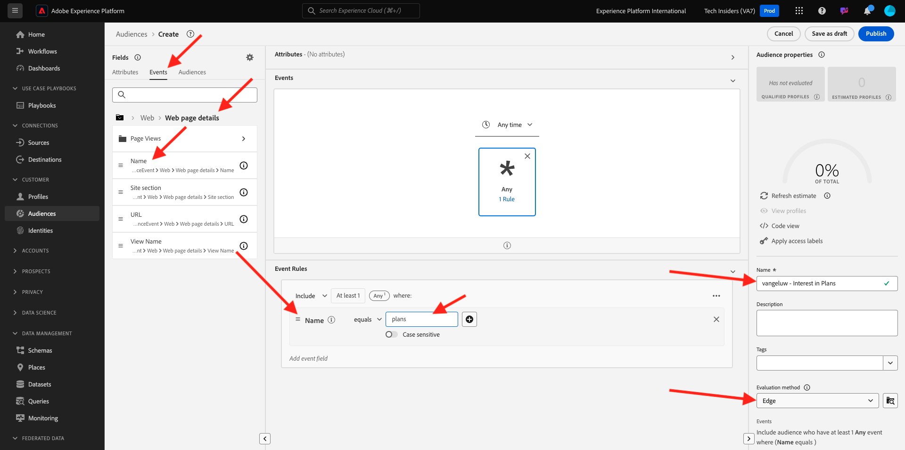

# 2.4.4 Erstellen einer Zielgruppe

## Einführung

Sie erstellen eine einfache Zielgruppe:

- **Interesse an Plänen** , für die sich Kunden qualifizieren, wenn sie die Seite **Pläne** der Demowebsite von CitiSignal besuchen.

### Gut zu wissen

Die Echtzeit-Kundendatenplattform Trigger eine Aktivierung an ein Ziel, wenn Sie sich für eine Zielgruppe qualifizieren, die Teil der Aktivierungsliste dieses Ziels ist. In diesem Fall enthält die Payload der Zielgruppenqualifizierung, die an dieses Ziel gesendet wird, **alle Zielgruppen, für die Ihr Kundenprofil qualifiziert ist**.

Ziel dieses Moduls ist es, zu zeigen, dass die Zielgruppenqualifikation Ihres Kundenprofils nahezu in Echtzeit an Ihr Event Hub-Ziel gesendet wird.

### Zielgruppenstatus

Eine Zielgruppenqualifizierung in Adobe Experience Platform hat immer die Eigenschaft **status** und kann eine der folgenden sein:

- **realisiert**: Dies bedeutet eine neue Zielgruppenqualifikation
- **exited**: Dies bedeutet, dass das Profil nicht mehr für die Zielgruppe qualifiziert ist.

## Audience erstellen

Melden Sie sich bei Adobe Experience Platform an, indem Sie diese URL verwenden: [https://experience.adobe.com/platform](https://experience.adobe.com/platform).

Nach der Anmeldung landen Sie auf der Startseite von Adobe Experience Platform.

Bevor Sie fortfahren, müssen Sie eine **Sandbox** auswählen. Die auszuwählende Sandbox heißt ``--aepSandboxName--``. Nachdem Sie die entsprechende Sandbox ausgewählt haben, wird die Bildschirmänderung angezeigt und Sie befinden sich jetzt in Ihrer dedizierten Sandbox.

Wechseln Sie zu **Zielgruppen**. Klicken Sie auf die Schaltfläche **+ Audience erstellen** .

Wählen Sie **Regel erstellen** und klicken Sie auf **Erstellen**.

Benennen Sie Ihre Zielgruppe mit &quot;`--aepUserLdap-- - Interest in Plans`&quot;, legen Sie die Auswertungsmethode auf &quot;**Edge**&quot;fest und fügen Sie den Seitennamen aus dem Erlebnisereignis hinzu.

Klicken Sie auf **Ereignisse** und ziehen Sie **XDM ExperienceEvent > Web > Web page details > Name** per Drag-and-Drop. Geben Sie **plans** als Wert ein:

Ziehen Sie **XDM ExperienceEvent > `--aepTenantId--` > demoEnvironment > brandName** in den Arbeitsbereich. Geben Sie `--aepUserLdap--` als Wert ein, setzen Sie den Vergleichsparameter auf **contains** und klicken Sie auf **Publish**:

Ihre Audience ist jetzt veröffentlicht.

Nächster Schritt: [2.4.5 Ihre Audience aktivieren](./ex5.md)

[Zurück zu Modul 2.4](./segment-activation-microsoft-azure-eventhub.md)

[Zu allen Modulen zurückkehren](./../../../overview.md)
