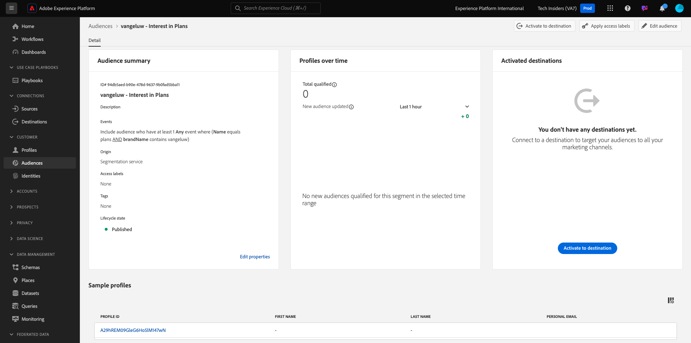

# 2.4.4 Erstellen einer Zielgruppe

## Einführung

Sie erstellen eine einfache Zielgruppe:

- **Interesse an Plänen** für die sich Kunden qualifizieren, wenn sie die Seite **Pläne** der Demo-Website von CitiSignal besuchen.

### Gut zu wissen

Die Real-Time CDP führt einen Trigger einer Aktivierung an ein Ziel durch, wenn Sie sich für eine Zielgruppe qualifizieren, die Teil der Aktivierungsliste dieses Ziels ist. In diesem Fall enthält die Payload der Zielgruppenqualifizierung, die an dieses Ziel gesendet wird, **alle Zielgruppen, für die Ihr Kundenprofil qualifiziert ist**.

Mit diesem Modul soll gezeigt werden, dass die Zielgruppenqualifizierung Ihres Kundenprofils nahezu in Echtzeit an Ihr Event Hub-Ziel gesendet wird.

### Zielgruppenstatus

Eine Zielgruppen-Qualifizierung in Adobe Experience Platform hat immer **status**-property und kann eine der folgenden sein:

- **Realisiert**: Dies zeigt eine neue Zielgruppen-Qualifizierung an
- **beendet**: Dies bedeutet, dass das Profil sich nicht mehr für die Zielgruppe qualifiziert

## Erstellen der Zielgruppe

Melden Sie sich über die folgende URL bei Adobe Experience Platform an: [https://experience.adobe.com/platform](https://experience.adobe.com/platform).

Nach dem Login landen Sie auf der Homepage von Adobe Experience Platform.

Bevor Sie fortfahren, müssen Sie eine **Sandbox“**. Die auszuwählende Sandbox hat den Namen ``--aepSandboxName--``. Nach Auswahl der entsprechenden Sandbox wird der Bildschirm geändert und Sie befinden sich nun in Ihrer dedizierten Sandbox.

Gehen Sie zu **Zielgruppen**. Klicken Sie auf die Schaltfläche **+ Zielgruppe erstellen**.

Wählen Sie **Regel erstellen** und klicken Sie auf **Erstellen**.

Benennen Sie Ihre `--aepUserLdap-- - Interest in Plans`, legen Sie für die Auswertungsmethode **Edge fest** fügen Sie den Seitennamen aus dem Erlebnisereignis hinzu.

Klicken Sie auf **Ereignisse** und ziehen Sie per Drag-and-Drop **XDM ExperienceEvent > Web > Web-Seitendetails > Name**. Geben Sie **plans** als Wert ein:

Drag-and-Drop **XDM ExperienceEvent > `--aepTenantId--` > demoEnvironment > brandName**. Geben Sie `--aepUserLdap--` als Wert ein, legen Sie den Vergleichsparameter auf **contains** fest und klicken Sie auf **Publish**:

Ihre Zielgruppe ist jetzt veröffentlicht.

Nächster Schritt: [2.4.5 Aktivieren Sie Ihre Audience](./ex5.md)

[Zurück zum Modul 2.4](./segment-activation-microsoft-azure-eventhub.md)

[Zurück zu „Alle Module“](./../../../overview.md)
