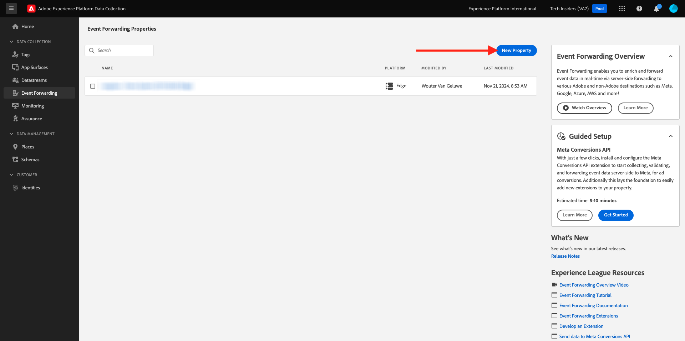
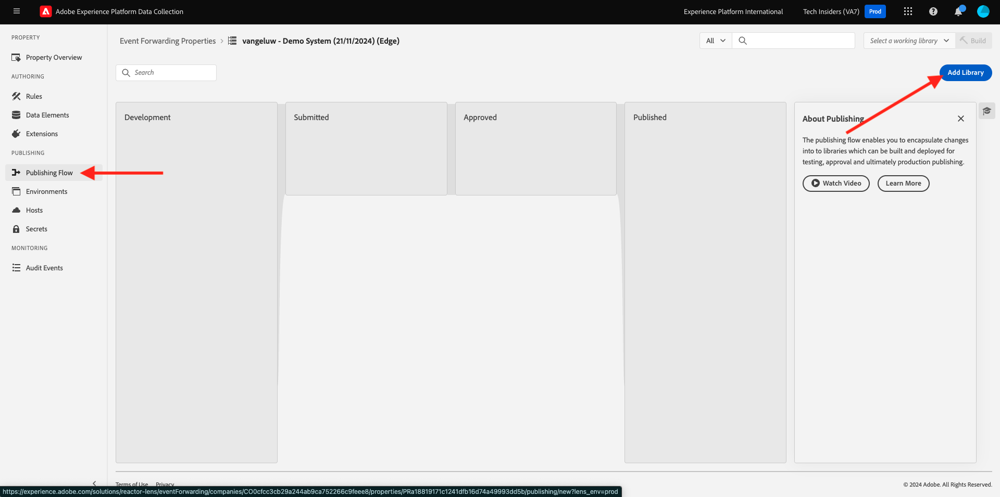

# 2.5.1 Erstellen einer Ereignisweiterleitungseigenschaft für die Adobe Experience Platform-Datenerfassung

## Was ist eine Ereignisweiterleitungseigenschaft der Adobe Experience Platform-Datenerfassung?

Wenn Daten mit der Adobe Experience Platform-Datenerfassung erfasst werden, werden sie in der Regel auf der **-Seite**. Die **Client-Seite** ist eine Umgebung wie eine Website oder eine Mobile App. In Erste Schritte und Datenerfassung wurde die Konfiguration einer Client-Eigenschaft für die Adobe Experience Platform-Datenerfassung eingehend erörtert, und Sie haben diese Client-Eigenschaft für die Adobe Experience Platform-Datenerfassung auf Ihrer Website und in Ihrer Mobile App implementiert, sodass dort Daten erfasst werden können, wenn ein Kunde mit der Website und der Mobile App interagiert.

Wenn diese Interaktionsdaten von der Adobe Experience Platform-Datenerfassungs-Client-Eigenschaft erfasst werden, wird von der Website oder der Mobile App eine Anfrage an Adobe Edge gesendet. Die Edge ist die Datenerfassungsumgebung der Adobe und der Einstiegspunkt für Clickstream-Daten in das Adobe-Ökosystem. Von der Edge werden diese erfassten Daten dann an Programme wie Adobe Experience Platform, Adobe Analytics, Adobe Audience Manager oder Adobe Target gesendet.

Durch das Hinzufügen einer Ereignisweiterleitungseigenschaft für die Datenerfassung von Adobe Experience Platform ist es jetzt möglich, eine Datenerfassungseigenschaft von Adobe Experience Platform zu konfigurieren, die auf in Edge eingehende Daten wartet. Wenn die Ereignisweiterleitungseigenschaft der Adobe Experience Platform-Datenerfassung, die in der Edge ausgeführt wird, eingehende Daten sieht, kann sie diese Daten verwenden und an einen anderen Ort weiterleiten. Dass anderswo nun auch ein externer Webhook sein kann, der kein Adobe ist, der es ermöglicht, diese Daten an beispielsweise Ihren Data Lake Ihrer Wahl, ein Decisioning-Programm oder ein anderes Programm zu senden, das die Möglichkeit hat, einen Webhook zu öffnen.

Die Konfiguration einer Ereignisweiterleitungseigenschaft der Adobe Experience Platform-Datenerfassung ist mit einer Client-seitigen Eigenschaft vertraut, wobei Datenelemente und Regeln wie bisher mit den Client-Eigenschaften der Adobe Experience Platform-Datenerfassung konfiguriert werden können. Die Art und Weise, wie auf Daten zugegriffen und diese verwendet werden, unterscheidet sich jedoch je nach Anwendungsfall geringfügig.

Erstellen wir zunächst die Ereignisweiterleitungseigenschaft der Adobe Experience Platform-Datenerfassung.

## Erstellen einer Ereignisweiterleitungs-Eigenschaft für die Datenerfassung in Adobe Experience Platform

Navigieren Sie zu [https://experience.adobe.com/#/data-collection/](https://experience.adobe.com/#/data-collection/). Klicken Sie im linken Menü auf **Ereignisweiterleitung**. Anschließend sehen Sie eine Übersicht über alle verfügbaren Properties der Ereignisweiterleitung für die Datenerfassung von Adobe Experience Platform. Klicken Sie auf **Schaltfläche „Eigenschaft erstellen**.

Wenn andere Ereignisweiterleitungs-Eigenschaften bereits erstellt wurden, sieht die Benutzeroberfläche alternativ etwas anders aus. Klicken Sie in diesem Fall auf **Neue Eigenschaft**.

Geben Sie jetzt einen Namen für die Ereignisweiterleitungseigenschaft der Adobe Experience Platform-Datenerfassung ein. Verwenden Sie `--aepUserLdap-- - Demo System (DD/MM/YYYY) (Edge)` als Namenskonvention. In diesem Beispiel lautet der Name beispielsweise **vangeluw - Demo System (22/02/2022) (Edge)**. Klicken Sie auf **Speichern**.

Sie sind dann wieder in der Liste der Eigenschaften für die Ereignisweiterleitung bei der Datenerfassung von Adobe Experience Platform. Klicken Sie auf , um die soeben erstellte Eigenschaft zu öffnen.

## Konfigurieren der Adobe Cloud Connector-Erweiterung

Navigieren Sie im linken Menü zu **Erweiterungen**. Sie werden sehen, dass die **Core**-Erweiterung bereits konfiguriert ist.

Navigieren Sie zu **Katalog**. Es wird die Erweiterung **Adobe-Cloud-Connector** neben vielen anderen angezeigt. Klicken Sie auf **Installieren**, um es zu installieren.

Die Erweiterung wird dann hinzugefügt. In diesem Schritt ist keine Konfiguration vorhanden. Sie werden zur Übersicht der installierten Erweiterungen zurückgeleitet.

## Bereitstellen der Ereignisweiterleitungseigenschaft für die Datenerfassung in Adobe Experience Platform

Navigieren Sie im linken Menü zu **Veröffentlichungsfluss**. Klicken Sie **Bibliothek hinzufügen**.

Geben Sie den Namen **Main** ein, wählen Sie die Umgebung **Entwicklung (Entwicklung)** und klicken Sie auf **+ Alle geänderten Ressourcen hinzufügen**.

Sie werden es dann sehen. Klicken Sie auf **Speichern und Build zur Entwicklung erstellen**.

Ihre Bibliothek wird dann erstellt, was 1-2 Minuten dauern kann.

Nächster Schritt: [2.5.2 Aktualisieren Sie Ihren Datenstrom, um Daten für Ihre Datenerfassungs-Ereignisweiterleitungseigenschaft verfügbar zu machen](./ex2.md)

[Zurück zum Modul 2.5](./aep-data-collection-ssf.md)

[Zurück zu „Alle Module“](./../../../overview.md)
