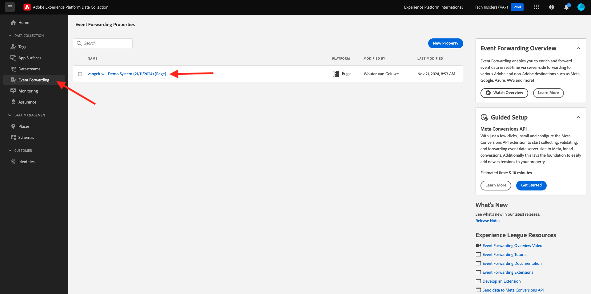
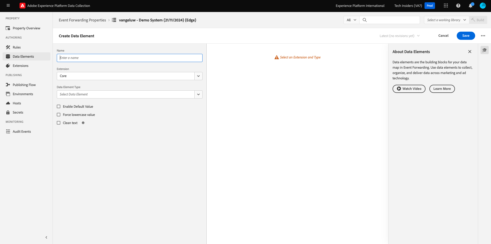
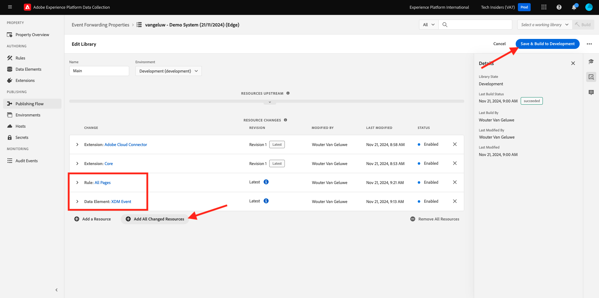

# 2.5.3 Benutzerdefinierten Webhook erstellen und konfigurieren

## 2.5.3.1 Benutzerdefinierten Webhook erstellen

Wechseln Sie zu [https://webhook.site/](https://webhook.site/). Sie sehen etwas wie das:

Sie sehen Ihre eindeutige URL, die wie folgt aussieht: `https://webhook.site/585126a1-41fc-4721-864b-d4aa8c268a1d`.

Diese Website hat jetzt diesen Webhook für Sie erstellt und Sie können diesen Webhook in Ihrem **[!DNL Event Forwarding property]** konfigurieren, um die Ereignisweiterleitung zu testen.

## 2.5.3.2 Eigenschaft für die Ereignisweiterleitung aktualisieren: Datenelement erstellen

Wechseln Sie zu [https://experience.adobe.com/#/data-collection/](https://experience.adobe.com/#/data-collection/) und gehen Sie zu **Ereignisweiterleitung**. Suchen Sie die Eigenschaft &quot;Ereignisweiterleitung&quot;und klicken Sie darauf, um sie zu öffnen.

Gehen Sie im linken Menü zu **Datenelemente**. Klicken Sie auf **Neues Datenelement erstellen**.

Anschließend wird ein neues Datenelement angezeigt, das konfiguriert werden soll.

Wählen Sie Folgendes aus:

- Geben Sie als **Name** **XDM-Ereignis** ein.
- Wählen Sie als **Erweiterung** **Core** aus.
- Wählen Sie als **Datenelementtyp** **Pfad** aus.
- Geben Sie als **Pfad** **arc.event.xdm** ein. Durch Eingabe dieses Pfads filtern Sie den Abschnitt **XDM** aus der Ereignis-Payload heraus, die von der Website oder App an die Adobe Edge gesendet wird.

Das wirst du jetzt haben. Klicken Sie auf **Speichern**.

>[!NOTE]
>
>Im obigen Pfad wird ein Verweis auf **arc** erstellt. **arc** steht für Adobe Resource Context und **arc** steht immer für das höchste verfügbare Objekt, das im serverseitigen Kontext verfügbar ist. Das Objekt **arc** kann mit den Adobe Experience Platform-Datenerfassungsserverfunktionen um Anreicherungen und Umwandlungen erweitert werden.
>
>Im obigen Pfad wird ein Verweis auf **event** erstellt. **event** steht für ein eindeutiges Ereignis, und der Adobe Experience Platform-Datenerfassungsserver wertet jedes Ereignis immer einzeln aus. Manchmal wird in der vom Web SDK Client Side gesendeten Payload ein Verweis auf **events** angezeigt, aber in Adobe Experience Platform Data Collection Server wird jedes Ereignis einzeln ausgewertet.

## 2.5.3.3 Eigenschaft des Adobe Experience Platform-Datenerfassungsservers aktualisieren: Regel erstellen

Gehen Sie im linken Menü zu **Regeln**. Klicken Sie auf **Neue Regel erstellen**.

Danach wird eine neue Regel zum Konfigurieren angezeigt. Geben Sie den **Namen**: **Alle Seiten** ein. Für diese Übung müssen Sie keine Bedingung konfigurieren. Stattdessen richten Sie eine Aktion ein. Klicken Sie auf die Schaltfläche **+ Hinzufügen** unter **Aktionen**.

Dann wirst du das sehen. Wählen Sie Folgendes aus:

- Wählen Sie die **Erweiterung**: **Adobe Cloud Connector** aus.
- Wählen Sie den **Aktionstyp**: **Fetch-Aufruf durchführen**.

Dadurch erhalten Sie den folgenden **Namen**: **Adobe Cloud-Connector - Abrufen des Abrufs**. Sie sollten jetzt Folgendes sehen:

Konfigurieren Sie als Nächstes Folgendes:

- Ändern Sie die Anfragemethode von GET in **POST** .
- Geben Sie die URL des benutzerdefinierten Webhooks ein, den Sie in einem der vorherigen Schritte auf der Website [https://webhook.site/](https://webhook.site/) erstellt haben, die wie folgt aussieht: `https://webhook.site/585126a1-41fc-4721-864b-d4aa8c268a1d`

Du solltest das jetzt haben. Navigieren Sie als Nächstes zu **Hauptteil**.

Dann wirst du das sehen. Klicken Sie auf das Datenelementsymbol, wie unten angegeben.

Wählen Sie im Popup das Datenelement **XDM Event** aus, das Sie im vorherigen Schritt erstellt haben. Klicken Sie auf **Auswählen**.

Dann wirst du das sehen. Klicken Sie auf **Änderungen beibehalten**.

Dann wirst du das sehen. Klicken Sie auf **Speichern**.

Sie haben Ihre erste Regel jetzt in einer Eigenschaft für die Ereignisweiterleitung konfiguriert. Wechseln Sie zu **Veröffentlichungsfluss** , um Ihre Änderungen zu veröffentlichen.
Öffnen Sie Ihre Entwicklungsbibliothek **Main**, indem Sie wie angegeben auf **Bearbeiten** klicken.

Klicken Sie auf die Schaltfläche **Alle geänderten Ressourcen hinzufügen** , nach der Ihre Regel und Ihr Datenelement in dieser Bibliothek angezeigt werden. Klicken Sie anschließend auf **Speichern und für Entwicklung erstellen**. Ihre Änderungen werden jetzt bereitgestellt.

Nach einigen Minuten werden Sie feststellen, dass die Implementierung abgeschlossen ist und getestet werden kann.

## 2.5.3.4 Konfiguration testen

Wechseln Sie zu [https://builder.adobedemo.com/projects](https://builder.adobedemo.com/projects). Nach der Anmeldung bei Ihrer Adobe ID sehen Sie dies. Klicken Sie auf Ihr Website-Projekt, um es zu öffnen.

Sie können nun den unten stehenden Fluss zum Zugriff auf die Website ausführen. Klicken Sie auf **Integrationen**.

Wählen Sie auf der Seite **Integrationen** die Datenerfassungseigenschaft aus, die in Übung 0.1 erstellt wurde.

Sie werden dann Ihre Demowebsite öffnen sehen. Wählen Sie die URL aus und kopieren Sie sie in die Zwischenablage.

Öffnen Sie ein neues Inkognito-Browserfenster.

Fügen Sie die URL Ihrer Demo-Website ein, die Sie im vorherigen Schritt kopiert haben. Sie werden dann aufgefordert, sich mit Ihrer Adobe ID anzumelden.

Wählen Sie Ihren Kontotyp aus und schließen Sie den Anmeldevorgang ab.

Sie sehen dann Ihre Website in einem Inkognito-Browser-Fenster geladen. Für jede Demonstration müssen Sie ein neues Inkognito-Browser-Fenster verwenden, um Ihre Demo-Website-URL zu laden.

Wenn Sie die Entwickleransicht des Browsers öffnen, können Sie Netzwerkanforderungen wie unten angegeben überprüfen. Wenn Sie den Filter **interact** verwenden, sehen Sie die Netzwerkanforderungen, die vom Adobe Experience Platform-Datenerfassungs-Client an die Adobe Edge gesendet werden.

Wenn Sie die Rohdaten-Payload auswählen, gehen Sie zu &quot;[https://jsonformatter.org/json-pretty-print](https://jsonformatter.org/json-pretty-print)&quot;und fügen Sie die Payload ein. Klicken Sie auf **Make Pretty**. Anschließend werden die JSON-Payload, das Objekt **events** und das Objekt **xdm** angezeigt. In einem der vorherigen Schritte haben Sie bei der Definition des Datenelements die Referenz **arc.event.xdm** verwendet, was dazu führt, dass Sie das Objekt **xdm** dieser Payload analysieren.

Wechseln Sie Ihre Ansicht zur Website [https://webhook.site/](https://webhook.site/) , die Sie in einem der vorherigen Schritte verwendet haben. Sie sollten jetzt eine ähnliche Ansicht wie diese haben, wobei Netzwerkanforderungen im linken Menü angezeigt werden. Sie sehen die **xdm**-Payload, die aus der oben gezeigten Netzwerkanforderung herausgefiltert wurde.

Scrollen Sie in der Payload nach unten, um den Seitennamen zu finden, der in diesem Fall **vangeluw-OCUC** ist (der Projektname Ihrer Demowebsite).

Wenn Sie jetzt über die Website navigieren, werden in Echtzeit zusätzliche Netzwerkanforderungen auf diesem benutzerdefinierten Webhook verfügbar sein.

Sie haben jetzt die serverseitige Weiterleitung von Web SDK-/XDM-Payloads an einen externen benutzerdefinierten Webhook konfiguriert. In den nächsten Übungen konfigurieren Sie einen ähnlichen Ansatz und senden dieselben Daten an Google- und AWS-Umgebungen.

Nächster Schritt: [2.5.4 Erstellen und Konfigurieren einer Google Cloud-Funktion](./ex4.md)

[Zurück zu Modul 2.5](./aep-data-collection-ssf.md)

[Zu allen Modulen zurückkehren](./../../../overview.md)
