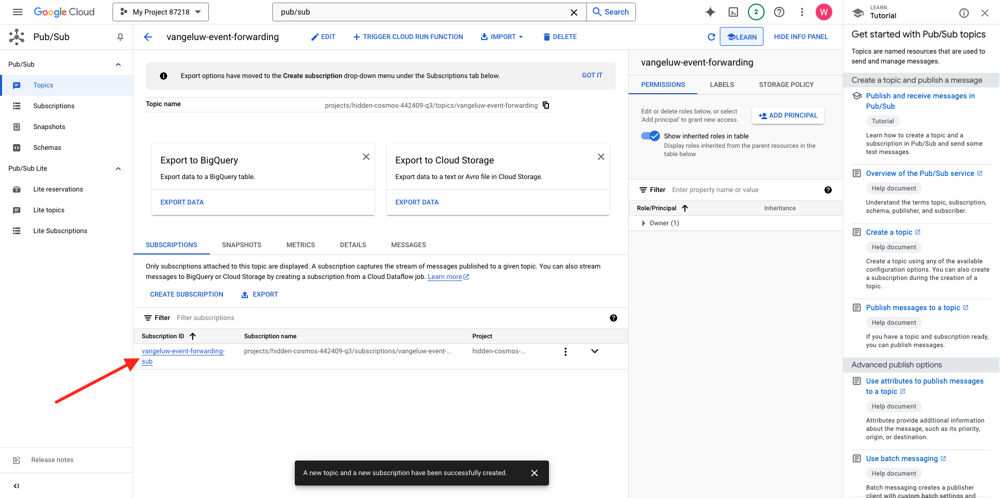
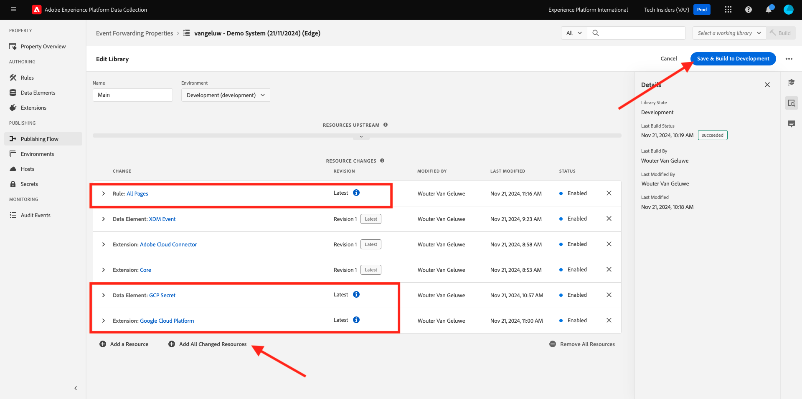

# 2.5.4 Google Cloud-Funktion erstellen und konfigurieren

## 2.5.4.1 Google-Cloud-Funktion erstellen

Wechseln Sie zu [https://console.cloud.google.com/](https://console.cloud.google.com/). Wechseln Sie zu **Cloud-Funktionen**.


Dann wirst du das sehen. Klicken Sie auf **FUNKTION ERSTELLEN**.


Dann wirst du das sehen.


Nehmen Sie die folgenden Optionen vor:

- **Funktionsname**: `--demoProfileLdap---event-forwarding`
- **Region**: Wählen Sie eine beliebige Region aus.
- **Trigger Type**: select **HTTP**
- **Authentifizierung**: Wählen Sie **Nicht authentifizierte Aufrufe zulassen** aus.

Du solltest das jetzt haben. Klicken Sie auf **SPEICHERN**.



Klicken Sie auf **NEXT**.


Daraufhin sehen Sie Folgendes:


Nehmen Sie die folgenden Optionen vor:

- **Laufzeit**: Wählen Sie **Node.js 16** (oder höher) aus.
- **Einstiegspunkt**: Geben Sie **helloAEP** ein.

Klicken Sie auf **API AKTIVIEREN** , um die **Cloud Build-API** zu aktivieren. Dann sehen Sie ein neues Fenster. Klicken Sie in diesem neuen Fenster erneut auf **AKTIVIEREN** .


Dann wirst du das sehen. Klicken Sie auf **Aktivieren**.


Sobald die **Cloud Build-API** aktiviert wurde, wird dies angezeigt.


Gehen Sie zurück zu Ihrer **Cloud-Funktion**.
Vergewissern Sie sich im Inline-Editor Ihrer Cloud-Funktion, dass der folgende Code vorhanden ist:

```javascript
/**
 * Responds to any HTTP request.
 *
 * @param {!express:Request} req HTTP request context.
 * @param {!express:Response} res HTTP response context.
 */
exports.helloAEP = (req, res) => {
  let message = req.query.message || req.body.message || 'Hello World!';
  res.status(200).send(message);
};
```

Klicken Sie anschließend auf **BEREITSTELLEN**.


Dann wirst du das sehen. Ihre Cloud-Funktion wird jetzt erstellt. Dies kann einige Minuten dauern.


Sobald Ihre Funktion erstellt und ausgeführt wurde, wird dies angezeigt. Klicken Sie auf den Namen Ihrer Funktion, um sie zu öffnen.


Dann wirst du das sehen. Wechseln Sie zu **TRIGGER**. Anschließend wird die **Trigger-URL** angezeigt, die Sie zum Definieren des Endpunkts im Server-seitigen Launch verwenden.


Kopieren Sie die Trigger-URL, die wie folgt aussieht: **https://europe-west1-dazzling-pillar-273812.cloudfunctions.net/vangeluw-event-forwarding**.

In den nächsten Schritten konfigurieren Sie Adobe Experience Platform Data Collection Server, um bestimmte Informationen über **Seitenansichten** an Ihre Google Cloud-Funktion zu streamen. Anstatt die gesamte Payload unverändert weiterzuleiten, senden Sie nur Elemente wie **ECID**, **Zeitstempel** und **Seitenname** an Ihre Google Cloud-Funktion.

Hier ist ein Beispiel für eine Payload, die Sie analysieren müssen, um die oben genannten Variablen herauszufiltern:

```json
{
  "events": [
    {
      "xdm": {
        "eventType": "web.webpagedetails.pageViews",
        "web": {
          "webPageDetails": {
            "URL": "https://builder.adobedemo.com/run/vangeluw-OCUC",
            "name": "vangeluw-OCUC",
            "viewName": "vangeluw-OCUC",
            "pageViews": {
              "value": 1
            }
          },
          "webReferrer": {
            "URL": "https://builder.adobedemo.com/run/vangeluw-OCUC/equipment"
          }
        },
        "device": {
          "screenHeight": 1080,
          "screenWidth": 1920,
          "screenOrientation": "landscape"
        },
        "environment": {
          "type": "browser",
          "browserDetails": {
            "viewportWidth": 1920,
            "viewportHeight": 451
          }
        },
        "placeContext": {
          "localTime": "2022-02-23T06:51:07.140+01:00",
          "localTimezoneOffset": -60
        },
        "timestamp": "2022-02-23T05:51:07.140Z",
        "implementationDetails": {
          "name": "https://ns.adobe.com/experience/alloy/reactor",
          "version": "2.8.0+2.9.0",
          "environment": "browser"
        },
        "_experienceplatform": {
          "identification": {
            "core": {
              "ecid": "08346969856929444850590365495949561249"
            }
          },
          "demoEnvironment": {
            "brandName": "vangeluw-OCUC"
          },
          "interactionDetails": {
            "core": {
              "channel": "web"
            }
          }
        }
      },
      "query": {
        "personalization": {
          "schemas": [
            "https://ns.adobe.com/personalization/html-content-item",
            "https://ns.adobe.com/personalization/json-content-item",
            "https://ns.adobe.com/personalization/redirect-item",
            "https://ns.adobe.com/personalization/dom-action"
          ],
          "decisionScopes": [
            "eyJ4ZG06YWN0aXZpdHlJZCI6Inhjb3JlOm9mZmVyLWFjdGl2aXR5OjE0YzA1MjM4MmUxYjY1MDUiLCJ4ZG06cGxhY2VtZW50SWQiOiJ4Y29yZTpvZmZlci1wbGFjZW1lbnQ6MTRiZjA5ZGM0MTkwZWJiYSJ9",
            "__view__"
          ]
        }
      }
    }
  ],
  "query": {
    "identity": {
      "fetch": [
        "ECID"
      ]
    }
  },
  "meta": {
    "state": {
      "domain": "adobedemo.com",
      "cookiesEnabled": true,
      "entries": [
        {
          "key": "kndctr_907075E95BF479EC0A495C73_AdobeOrg_identity",
          "value": "CiYwODM0Njk2OTg1NjkyOTQ0NDg1MDU5MDM2NTQ5NTk0OTU2MTI0OVIPCPn66KfyLxgBKgRJUkwx8AH5-uin8i8="
        },
        {
          "key": "kndctr_907075E95BF479EC0A495C73_AdobeOrg_consent_check",
          "value": "1"
        },
        {
          "key": "kndctr_907075E95BF479EC0A495C73_AdobeOrg_consent",
          "value": "general=in"
        }
      ]
    }
  }
}
```

Dies sind die Felder, die die Informationen enthalten, die analysiert werden müssen:

- ECID: **events.xdm._experienceplatform.identification.core.ecid**
- timestamp: **timestamp**
- Seitenname: **events.xdm.web.webPageDetails.name**

Gehen wir jetzt zum Adobe Experience Platform-Datenerfassungsserver, um die Datenelemente so zu konfigurieren, dass dies möglich ist.

## 2.5.4.2 Eigenschaft für die Ereignisweiterleitung aktualisieren: Datenelemente

Wechseln Sie zu [https://experience.adobe.com/#/data-collection/](https://experience.adobe.com/#/data-collection/) und gehen Sie zu **Ereignisweiterleitung**. Suchen Sie die Eigenschaft &quot;Ereignisweiterleitung&quot;und klicken Sie darauf, um sie zu öffnen.


Gehen Sie im linken Menü zu **Datenelemente**. Klicken Sie auf **Datenelement hinzufügen**.


Anschließend wird ein neues Datenelement angezeigt, das konfiguriert werden soll.


Wählen Sie Folgendes aus:

- Geben Sie als **Name** **customerECID** ein.
- Wählen Sie als **Erweiterung** **Core** aus.
- Wählen Sie als **Datenelementtyp** **Pfad** aus.
- Geben Sie als **Pfad** `arc.event.xdm.--aepTenantId--.identification.core.ecid` ein. Durch Eingabe dieses Pfads filtern Sie das Feld **ecid** aus der Ereignis-Payload aus, die von der Website oder App an die Adobe Edge gesendet wird.

>[!NOTE]
>
>In den obigen und darunter liegenden Pfaden wird auf **arc** verwiesen. **arc** steht für Adobe Resource Context und **arc** steht immer für das höchste verfügbare Objekt, das im serverseitigen Kontext verfügbar ist. Das Objekt **arc** kann mit den Adobe Experience Platform-Datenerfassungsserverfunktionen um Anreicherungen und Umwandlungen erweitert werden.
>
>In den oben und unten aufgeführten Pfaden wird auf **event** verwiesen. **event** steht für ein eindeutiges Ereignis, und der Adobe Experience Platform-Datenerfassungsserver wertet jedes Ereignis immer einzeln aus. Manchmal wird in der vom Web SDK Client Side gesendeten Payload ein Verweis auf **events** angezeigt, aber in Adobe Experience Platform Data Collection Server wird jedes Ereignis einzeln ausgewertet.

Das wirst du jetzt haben. Klicken Sie auf **Speichern**.


Klicken Sie auf **Datenelement hinzufügen**.


Anschließend wird ein neues Datenelement angezeigt, das konfiguriert werden soll.


Wählen Sie Folgendes aus:

- Geben Sie als **Name** **eventTimestamp** ein.
- Wählen Sie als **Erweiterung** **Core** aus.
- Wählen Sie als **Datenelementtyp** **Pfad** aus.
- Geben Sie als **Pfad** **arc.event.xdm.timestamp** ein. Durch Eingabe dieses Pfads filtern Sie das Feld **timestamp** aus der Ereignis-Payload heraus, die von der Website oder App an die Adobe Edge gesendet wird.

Das wirst du jetzt haben. Klicken Sie auf **Speichern**.


Klicken Sie auf **Datenelement hinzufügen**.


Anschließend wird ein neues Datenelement angezeigt, das konfiguriert werden soll.


Wählen Sie Folgendes aus:

- Geben Sie als **Name** **pageName** ein.
- Wählen Sie als **Erweiterung** **Core** aus.
- Wählen Sie als **Datenelementtyp** **Pfad** aus.
- Geben Sie als **Pfad** **arc.event.xdm.web.webPageDetails.name** ein. Durch Eingabe dieses Pfads filtern Sie das Feld **name** aus der Ereignis-Payload aus, die von der Website oder App an die Adobe Edge gesendet wird.

Das wirst du jetzt haben. Klicken Sie auf **Speichern**.


Sie haben jetzt die folgenden Datenelemente erstellt:


## 2.5.4.3 Eigenschaft für die Ereignisweiterleitung aktualisieren: Regel aktualisieren

Gehen Sie im linken Menü zu **Regeln**. In der vorherigen Übung haben Sie die Regel **Alle Seiten** erstellt. Klicken Sie auf diese Regel, um sie zu öffnen.


Dann wirst du das machen. Klicken Sie auf das Symbol **+** unter **Aktionen** , um eine neue Aktion hinzuzufügen.


Dann wirst du das sehen.


Wählen Sie Folgendes aus:

- Wählen Sie die **Erweiterung**: **Adobe Cloud Connector** aus.
- Wählen Sie den **Aktionstyp**: **Fetch-Aufruf durchführen**.

Dadurch erhalten Sie den folgenden **Namen**: **Adobe Cloud-Connector - Abrufen des Abrufs**. Sie sollten jetzt Folgendes sehen:


Konfigurieren Sie als Nächstes Folgendes:

- Ändern Sie das Anfrageprotokoll von GET in **POST**
- Geben Sie die URL der Google Cloud-Funktion ein, die Sie in einem der vorherigen Schritte erstellt haben, der wie folgt aussieht: **https://europe-west1-dazzling-pillar-273812.cloudfunctions.net/vangeluw-event-forwarding**

Du solltest das jetzt haben. Navigieren Sie als Nächstes zu **Hauptteil**.


Dann wirst du das sehen. Klicken Sie auf die Optionsschaltfläche für **JSON**.


Konfigurieren Sie den **Hauptteil** wie folgt:

| SCHLÜSSEL | WERT |
|--- |--- |
| customerECID | {{customerECID}} |
| pageName | {{pageName}} |
| eventTimestamp | {{eventTimestamp}} |

Dann wirst du das sehen. Klicken Sie auf **Änderungen beibehalten**.


Dann wirst du das sehen. Klicken Sie auf **Speichern**.


Sie haben Ihre vorhandene Regel jetzt in einer Adobe Experience Platform-Datenerfassungsservereigenschaft aktualisiert. Wechseln Sie zu **Veröffentlichungsfluss** , um Ihre Änderungen zu veröffentlichen. Öffnen Sie Ihre Entwicklungsbibliothek **Main**, indem Sie wie angegeben auf **Bearbeiten** klicken.


Klicken Sie auf die Schaltfläche **Alle geänderten Ressourcen hinzufügen** , nach der Ihre Regel und Ihr Datenelement in dieser Bibliothek angezeigt werden. Klicken Sie anschließend auf **Speichern und für Entwicklung erstellen**. Ihre Änderungen werden jetzt bereitgestellt.



Nach einigen Minuten werden Sie feststellen, dass die Implementierung abgeschlossen ist und getestet werden kann.


## 2.5.3.4 Konfiguration testen

Wechseln Sie zu [https://builder.adobedemo.com/projects](https://builder.adobedemo.com/projects). Nach der Anmeldung bei Ihrer Adobe ID sehen Sie dies. Klicken Sie auf Ihr Website-Projekt, um es zu öffnen.


Sie können nun den unten stehenden Fluss zum Zugriff auf die Website ausführen. Klicken Sie auf **Integrationen**.


Wählen Sie auf der Seite **Integrationen** die Datenerfassungseigenschaft aus, die in Übung 0.1 erstellt wurde.


Sie werden dann Ihre Demowebsite öffnen sehen. Wählen Sie die URL aus und kopieren Sie sie in die Zwischenablage.


Öffnen Sie ein neues Inkognito-Browserfenster.


Fügen Sie die URL Ihrer Demo-Website ein, die Sie im vorherigen Schritt kopiert haben. Sie werden dann aufgefordert, sich mit Ihrer Adobe ID anzumelden.


Wählen Sie Ihren Kontotyp aus und schließen Sie den Anmeldevorgang ab.


Sie sehen dann Ihre Website in einem Inkognito-Browser-Fenster geladen. Für jede Demonstration müssen Sie ein neues Inkognito-Browser-Fenster verwenden, um Ihre Demo-Website-URL zu laden.


Wenn Sie die Entwickleransicht des Browsers öffnen, können Sie Netzwerkanforderungen wie unten angegeben überprüfen. Wenn Sie den Filter **interact** verwenden, sehen Sie die Netzwerkanforderungen, die vom Adobe Experience Platform-Datenerfassungs-Client an die Adobe Edge gesendet werden.


Wechseln Sie Ihre Ansicht zu Ihrer Google Cloud-Funktion und gehen Sie zu **LOGS**. Sie sollten jetzt eine ähnliche Ansicht wie diese haben, wobei eine Reihe von Protokolleinträgen angezeigt wird. Jedes Mal, wenn die Ausführung der Funktion **gestartet wurde**, bedeutet dies, dass in Ihrer Google Cloud-Funktion eingehender Traffic empfangen wurde.


Aktualisieren wir Ihre Funktion ein wenig, um mit den eingehenden Daten zu arbeiten, und zeigen wir die Informationen an, die vom Adobe Experience Platform-Datenerfassungsserver empfangen wurden. Wechseln Sie zu **SOURCE** und klicken Sie auf **BEARBEITEN**.


Klicken Sie im nächsten Bildschirm auf **NEXT**.


Aktualisieren Sie Ihren Code wie folgt:

```javascript
/**
 * Responds to any HTTP request.
 *
 * @param {!express:Request} req HTTP request context.
 * @param {!express:Response} res HTTP response context.
 */
exports.helloAEP = (req, res) => {
  console.log('>>>>> Function has started. The following information was received from Event Forwarding:');
  console.log(req.body);

  let message = req.query.message || req.body.message || 'Hello World!';
  res.status(200).send(message);
};
```

Dann wirst du das haben. Klicken Sie auf **BEREITSTELLEN**.


Nach einigen Minuten wird Ihre Funktion erneut bereitgestellt. Klicken Sie auf Ihren Funktionsnamen, um ihn zu öffnen.


Navigieren Sie auf Ihrer Demo-Website zu einem Produkt, z. B. **DEIRDRE RELAXED-FIT CAPRI**.


Wechseln Sie Ihre Ansicht zu Ihrer Google Cloud-Funktion und gehen Sie zu **LOGS**. Sie sollten jetzt eine ähnliche Ansicht wie diese haben, wobei eine Reihe von Protokolleinträgen angezeigt wird.

Für jeden Seitenaufruf auf Ihrer Demowebsite sollte nun in den Protokollen Ihrer Google Cloud-Funktion ein neues Protokolleintrag angezeigt werden, in dem die empfangenen Informationen angezeigt werden.


Sie haben jetzt erfolgreich von der Adobe Experience Platform-Datenerfassung erfasste Daten in Echtzeit an einen Google Cloud-Funktionsendpunkt gesendet. Von dort können diese Daten von jeder beliebigen Google Cloud Platform-Anwendung verwendet werden, z. B. BigQuery für Speicherung und Reporting oder für Anwendungsfälle des maschinellen Lernens.

Nächster Schritt: [2.5.5 Ereignisse an das AWS-Ökosystem weiterleiten](./ex5.md)

[Zurück zu Modul 2.5](./aep-data-collection-ssf.md)

[Zu allen Modulen zurückkehren](./../../../overview.md)
