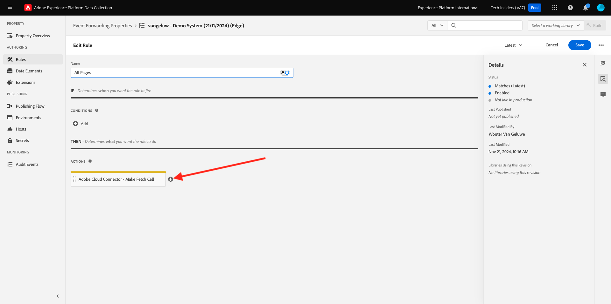

# 2.5.4 Ereignisse an GCP-Pub/Sub weiterleiten

>[!NOTE]
>
>Für diese Übung benötigen Sie Zugriff auf eine Google Cloud Platform-Umgebung. Wenn Sie noch keinen Zugriff auf GCP haben, erstellen Sie ein neues Konto mit Ihrer persönlichen E-Mail-Adresse.

## Google Cloud-Pub/Unterthema erstellen

Wechseln Sie zu [https://console.cloud.google.com/](https://console.cloud.google.com/). Geben Sie in der Suchleiste `pub/sub` ein. Klicken Sie auf das Suchergebnis **Pub/Sub - Globales Echtzeit-Messaging**.

Dann wirst du das sehen. Klicken Sie auf **THEMA ERSTELLEN**.

Dann wirst du das sehen. Verwenden Sie für Ihre Themen-ID `--aepUserLdap---event-forwarding`. Klicken Sie auf **Erstellen**.

Ihr Thema wird jetzt erstellt. Klicken Sie auf die **Abonnement-ID** des Themas.

Dann wirst du das sehen. Kopieren Sie den **Themennamen** in die Zwischenablage und speichern Sie ihn, wie Sie ihn in den nächsten Übungen benötigen.

Gehen wir jetzt zur Adobe Experience Platform-Ereignisweiterleitung für die Datenerfassung, um Ihre Eigenschaft für die Ereignisweiterleitung zu aktualisieren und Ereignisse an das Pub/Sub-Programm weiterzuleiten.

## Aktualisieren Sie Ihre Ereignisweiterleitungseigenschaft: Geheimnisse

**Geheimnisse** in den Eigenschaften für die Ereignisweiterleitung werden verwendet, um Anmeldeinformationen zu speichern, die für die Authentifizierung bei externen APIs verwendet werden. In diesem Beispiel müssen Sie ein Geheimnis konfigurieren, um Ihr OAuth-Token für die Google Cloud-Plattform zu speichern, das zur Authentifizierung bei der Verwendung von Pub/Sub zum Streamen von Daten an GCP verwendet wird.

Wechseln Sie zu [https://experience.adobe.com/#/data-collection/](https://experience.adobe.com/#/data-collection/) und gehen Sie zu **Geheimnisse**. Klicken Sie auf **Neues Geheimnis erstellen**.

Dann wirst du das sehen. Befolgen Sie diese Anweisungen:

- Name: use `--aepUserLdap---gcp-secret`
- Zielumgebung: Wählen Sie **Entwicklung** aus.
- Typ: **Google OAuth 2**
- Aktivieren Sie das Kontrollkästchen für **Pub/Sub**

Klicken Sie auf **Geheimnis erstellen**.

Nachdem Sie auf **Geheimnis erstellen** geklickt haben, wird ein Popup angezeigt, in dem Sie die Authentifizierung zwischen dem Geheimnis der Ereignisweiterleitungseigenschaft und Google einrichten können. Klicken Sie auf **Geheimnis erstellen und autorisieren `--aepUserLdap---gcp-secret` mit Google**.

Klicken Sie auf , um Ihr Google-Konto auszuwählen.

Klicken Sie auf **Weiter**.

>[!NOTE]
>
>Ihre Popup-Nachricht kann variieren. Bitte genehmigen/erlauben Sie den beantragten Zugriff, um die Übung fortzusetzen.

Nach erfolgreicher Authentifizierung wird dies angezeigt.

Ihr Geheimnis wurde jetzt erfolgreich konfiguriert und kann in einem Datenelement verwendet werden.

## Eigenschaft für die Ereignisweiterleitung aktualisieren: Datenelement

Um Ihr Geheimnis in Ihrer Ereignisweiterleitungseigenschaft zu verwenden, müssen Sie ein Datenelement erstellen, das den Wert des Geheimnisses speichert.

Wechseln Sie zu [https://experience.adobe.com/#/data-collection/](https://experience.adobe.com/#/data-collection/) und gehen Sie zu **Ereignisweiterleitung**. Suchen Sie die Eigenschaft &quot;Ereignisweiterleitung&quot;und klicken Sie darauf, um sie zu öffnen.

Gehen Sie im linken Menü zu **Datenelemente**. Klicken Sie auf **Datenelement hinzufügen**.

Konfigurieren Sie Ihr Datenelement wie folgt:

- Name: **GCP Secret**
- Erweiterung: **Core**
- Datenelementtyp: **geheim**
- Entwicklungs-Geheimnis: Wählen Sie das erstellte Geheimnis mit dem Namen `--aepUserLdap---gcp-secret` aus.

Klicken Sie auf **Speichern**.

## Eigenschaft für die Ereignisweiterleitung aktualisieren: Erweiterung

Wenn Ihr Geheimnis und Ihr Datenelement konfiguriert sind, können Sie jetzt die Erweiterung für die Google Cloud-Plattform in Ihrer Eigenschaft &quot;Ereignisweiterleitung&quot;einrichten.

Wechseln Sie zu [https://experience.adobe.com/#/data-collection/](https://experience.adobe.com/#/data-collection/), gehen Sie zu **Ereignisweiterleitung** und öffnen Sie Ihre Eigenschaft &quot;Ereignisweiterleitung&quot;.

Navigieren Sie als Nächstes zu **Erweiterungen**, zu **Katalog**. Klicken Sie auf die Erweiterung **Google Cloud Platform** und dann auf **Installieren**.

Dann wirst du das sehen. Klicken Sie auf das Symbol Datenelement .

Wählen Sie das Datenelement aus, das Sie in der vorherigen Übung erstellt haben und den Namen **GCP-Geheimnis** trägt. Klicken Sie auf **Auswählen**.

Dann wirst du das sehen. Klicken Sie auf **Speichern**.

## Aktualisieren der Ereignisweiterleitungseigenschaft: Aktualisieren einer Regel

Nachdem Ihre Google Cloud Platform-Erweiterung konfiguriert wurde, können Sie eine Regel definieren, um die Weiterleitung von Ereignisdaten an Ihr Pub-/Unterthema zu starten. Dazu müssen Sie Ihre Regel **Alle Seiten** aktualisieren, die Sie in einer der vorherigen Übungen erstellt haben.

Gehen Sie im linken Menü zu **Regeln**. In der vorherigen Übung haben Sie die Regel **Alle Seiten** erstellt. Klicken Sie auf diese Regel, um sie zu öffnen.

Dann wirst du das machen. Klicken Sie auf das Symbol **+** unter **Aktionen** , um eine neue Aktion hinzuzufügen.

Dann wirst du das sehen. Wählen Sie Folgendes aus:

- Wählen Sie die Erweiterung **Extension**: **Google Cloud Platform** aus.
- Wählen Sie den **Aktionstyp**: **Daten an Cloud-Pub/Sub senden** aus.

Geben Sie den folgenden **Namen** ein: **Google Cloud-Plattform - Daten an Cloud-Pub/Sub senden**. Sie sollten jetzt Folgendes sehen:

Jetzt müssen Sie das zuvor erstellte Pub-/Unterthema konfigurieren.

Den **Themennamen** finden Sie hier, kopieren Sie ihn.

Fügen Sie den **Themennamen** in Ihre Regelkonfiguration ein. Klicken Sie anschließend auf das Symbol Datenelement neben dem Feld **Daten (erforderlich)** .

Wählen Sie **XDM Event** und klicken Sie auf **Select**.

Dann wirst du das sehen. Klicken Sie auf **Änderungen beibehalten**.

Klicken Sie auf **Speichern**.

Dann wirst du das sehen.

## Veröffentlichen der Änderungen

Ihre Konfiguration ist jetzt abgeschlossen. Wechseln Sie zu **Veröffentlichungsfluss** , um Ihre Änderungen zu veröffentlichen. Öffnen Sie Ihre Entwicklungsbibliothek **Main**, indem Sie wie angegeben auf **Bearbeiten** klicken.

Klicken Sie auf die Schaltfläche **Alle geänderten Ressourcen hinzufügen** , nach der Ihre Regel und Ihr Datenelement in dieser Bibliothek angezeigt werden. Klicken Sie anschließend auf **Speichern und für Entwicklung erstellen**. Ihre Änderungen werden jetzt bereitgestellt.

Nach einigen Minuten werden Sie feststellen, dass die Implementierung abgeschlossen ist und getestet werden kann.

## Testen der Konfiguration

Wechseln Sie zu [https://dsn.adobe.com](https://dsn.adobe.com). Nach der Anmeldung bei Ihrer Adobe ID sehen Sie dies. Klicken Sie auf die drei Punkte **..** im Website-Projekt und dann auf **Ausführen** , um es zu öffnen.

Sie werden dann Ihre Demowebsite öffnen sehen. Wählen Sie die URL aus und kopieren Sie sie in die Zwischenablage.

Öffnen Sie ein neues Inkognito-Browserfenster.

Fügen Sie die URL Ihrer Demo-Website ein, die Sie im vorherigen Schritt kopiert haben. Sie werden dann aufgefordert, sich mit Ihrer Adobe ID anzumelden.

Wählen Sie Ihren Kontotyp aus und schließen Sie den Anmeldevorgang ab.

Sie sehen dann Ihre Website in einem Inkognito-Browser-Fenster geladen. Für jede Übung müssen Sie ein neues Inkognito-Browser-Fenster verwenden, um Ihre Demo-Website-URL zu laden.

Wechseln Sie Ihre Ansicht in Ihr Google Cloud-Pub/Sub und gehen Sie zu **NACHRICHTEN**. Klicken Sie auf **PULL** und nach einigen Sekunden werden einige Meldungen in der Liste angezeigt. Klicken Sie auf eine Nachricht, um ihren Inhalt zu visualisieren.

Sie können jetzt die XDM-Payload Ihres Ereignisses in Google Pub/Sub sehen. Sie haben jetzt erfolgreich von der Adobe Experience Platform-Datenerfassung erfasste Daten in Echtzeit an einen Google Cloud-Pub-/Sub-Endpunkt gesendet. Von dort können diese Daten von jeder beliebigen Google Cloud Platform-Anwendung verwendet werden, z. B. BigQuery für Speicherung und Reporting oder für Anwendungsfälle des maschinellen Lernens.

Nächster Schritt: [2.5.5 Ereignisse an AWS Kinesis und AWS S3 weiterleiten](./ex5.md)

[Zurück zu Modul 2.5](./aep-data-collection-ssf.md)

[Zu allen Modulen zurückkehren](./../../../overview.md)
