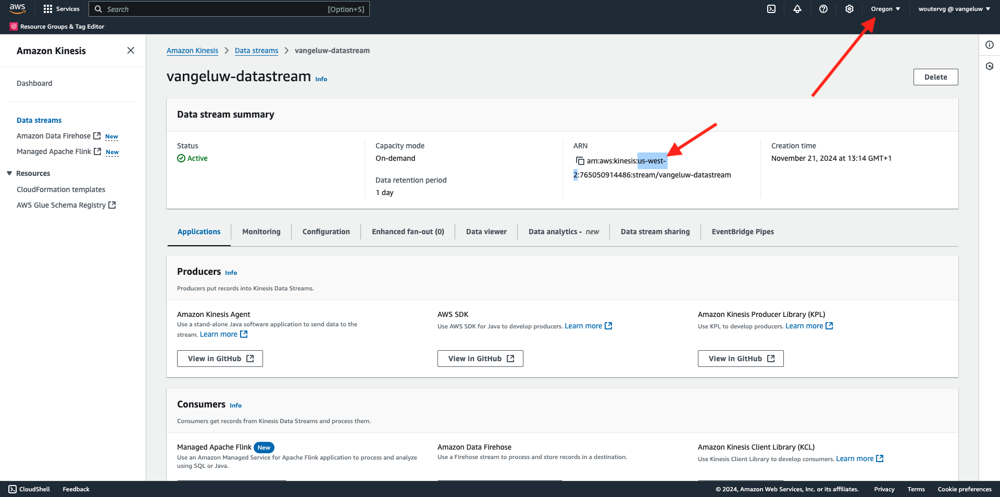

# 2.5.5 Weiterleiten von Ereignissen an AWS Kinesis und AWS S3

>[!IMPORTANT]
>
>Der Abschluss dieser Übung ist optional und erfordert die Nutzung von AWS Kinesis Kosten. AWS bietet ein Konto der freien Ebene, mit dem Sie viele Dienste ohne Kosten testen und konfigurieren können. AWS Kinesis ist jedoch nicht Teil dieses Kontos der freien Ebene. Um diese Übung zu implementieren und zu testen, sind also Kosten für die Nutzung von AWS Kinesis erforderlich.

## Gut zu wissen

Adobe Experience Platform unterstützt verschiedene Amazon-Dienste als Ziel.
Kinesis und S3 sind beide [Profilexportziele](https://experienceleague.adobe.com/docs/experience-platform/destinations/destination-types.html?lang=en) und können als Teil von Adobe Experience Platforms Real-Time CDP verwendet werden.
Sie können einfach hochwertige Segmentereignisse und zugehörige Profilattribute in Ihre Systeme Ihrer Wahl einspeisen.

In dieser Übung erfahren Sie, wie Sie Ihren eigenen Amazon Kinesis-Stream einrichten, um Ereignisdaten aus dem Adobe Experience Platform Edge-Ökosystem an ein Cloud-Speicher-Ziel wie Amazon S3 zu streamen. Dies ist nützlich, wenn Sie Erlebnisereignisse aus Web- und mobilen Eigenschaften erfassen und zur Analyse und operativen Berichterstellung in Ihren Datensatz übertragen möchten. Datalakes erfassen Daten in der Regel im Batch-Modus mit großen täglichen Dateiimporten. Sie stellen keinen öffentlichen HTTP-Endpunkt bereit, der in Verbindung mit der Ereignisweiterleitung verwendet werden könnte.

Wenn Sie die oben genannten Anwendungsfälle unterstützen, müssen gestreamte Daten gepuffert oder in eine Warteschlange gestellt werden, bevor sie in eine Datei geschrieben werden. Es muss darauf geachtet werden, dass die Datei nicht für den Schreibzugriff über mehrere Prozesse hinweg geöffnet wird. Diese Aufgabe an ein dediziertes System zu delegieren ist ideal, um eine gute Skalierung zu erreichen und gleichzeitig ein hohes Serviceniveau zu gewährleisten. Hier kommt Kinesis zur Rettung.

Amazon Kinesis Data Streams konzentriert sich auf die Erfassung und Speicherung von Datenströmen. Kinesis Data Firewalls dienen der Bereitstellung von Datenströmen an ausgewählte Ziele, z. B. S3-Behälter.

Im Rahmen dieser Übung...

- Grundlegende Einrichtung eines Kinesis-Datenstreams durchführen
- Erstellen Sie einen Firewalls-Versand-Stream und verwenden Sie den S3-Behälter als Ziel.
- Konfigurieren des Amazon API-Gateways als REST-API-Endpunkt zum Empfangen Ihrer Ereignisdaten
- Weiterleiten von Rohereignisdaten von Adobe Edge an Ihren Kinesis-Stream

## Konfigurieren des AWS S3-Buckets

Wechseln Sie zu [https://console.aws.amazon.com](https://console.aws.amazon.com) und melden Sie sich mit Ihrem Amazon-Konto an.

Nach der Anmeldung werden Sie zur **AWS Management Console** weitergeleitet.

Suchen Sie im Menü **Dienste suchen** nach **s3**. Klicken Sie auf das erste Suchergebnis: **S3 - Skalierbarer Speicher in der Cloud**.

Dann sehen Sie die Homepage von **Amazon S3**. Klicken Sie auf **Behälter erstellen**.

Im Bildschirm **Behälter erstellen** müssen Sie zwei Elemente konfigurieren:

- Name: Verwenden Sie den Namen `eventforwarding---aepUserLdap--`.

Behalten Sie alle anderen Standardeinstellungen bei. Scrollen Sie nach unten und klicken Sie auf **Bucket erstellen**.

Sie werden sehen, wie Ihr Bucket erstellt wird und zur Amazon S3-Homepage weitergeleitet wird.

## Konfigurieren des AWS Kinesis-Datenstreams

Suchen Sie im Menü **Dienste suchen** nach **Kinesis**. Klicken Sie auf das erste Suchergebnis: **Kinesis - Arbeiten mit Echtzeit-Streaming-Daten**.

Wählen Sie **Kinesis Data Streams** aus. Klicken Sie auf **Datenstrom erstellen**.

Verwenden Sie für den **Datenstrom-Namen** `--aepUserLdap---datastream`.

Die anderen Einstellungen müssen nicht geändert werden. Scrollen Sie nach unten und klicken Sie auf **Datenstrom erstellen**.

Dann wirst du das sehen. Sobald Ihr Datenstrom erfolgreich erstellt wurde, können Sie mit der nächsten Übung fortfahren.

## Konfigurieren des AWS Firewalls-Bereitstellungs-Streams

Suchen Sie im Menü **Dienste suchen** nach **Kinesis**. Klicken Sie auf **Kinesis Data Firewalls**.

Klicken Sie auf &quot;**Feuerlöschstrom erstellen**&quot;.

Wählen Sie für **Source** die Option **Amazon Kinesis Data Streams**. Wählen Sie für **Ziel** **Amazon S3** aus. Klicken Sie auf **Durchsuchen** , um Ihren Daten-Stream auszuwählen.

Wählen Sie Ihren Daten-Stream aus. Klicken Sie auf **Choose**.

Dann wirst du das sehen. Denken Sie an den **Firehis stream name** , da Sie ihn später benötigen werden.

Scrollen Sie nach unten, bis **Zieleinstellungen** angezeigt wird. Klicken Sie auf **Durchsuchen** , um Ihren S3-Behälter auszuwählen.

Wählen Sie Ihren S3-Behälter aus und klicken Sie auf **Choose**.

Dann wirst du so etwas sehen. Aktualisieren Sie die folgenden Einstellungen:

- Neues Trennzeichen: auf **Aktiviert** gesetzt
- Dynamische Partitionierung: auf **Nicht aktiviert** eingestellt

Scrollen Sie noch ein wenig nach unten und klicken Sie auf **Feuerlöschstream erstellen**

Nach einigen Minuten wird Ihr Fireschlauch-Stream erstellt und **aktiv**.

## IAM-Benutzer erstellen

Klicken Sie im linken AWS IAM-Menü auf **Benutzer**. Daraufhin wird der Bildschirm **Benutzer** angezeigt. Klicken Sie auf **Benutzer erstellen**.

Konfigurieren Sie dann Ihren Benutzer:

- Benutzername: use `--aepUserLdap--_kinesis_forwarding`

Klicken Sie auf **Weiter**.

Dann sehen Sie diesen Berechtigungsbildschirm. Klicken Sie auf **Richtlinien direkt anhängen**.

Geben Sie den Suchbegriff **kinesisfireschlauch** ein, um alle zugehörigen Richtlinien anzuzeigen. Wählen Sie die Richtlinie **AmazonKinesisFireschlauchFullAccess** aus. Scrollen Sie nach unten und klicken Sie auf **Weiter**.

Überprüfen Sie Ihre Konfiguration. Klicken Sie auf **Benutzer erstellen**.

Dann wirst du das sehen. Klicken Sie auf **Benutzer anzeigen**.

Klicken Sie auf **Berechtigungen hinzufügen** und klicken Sie auf **Inline-Richtlinie erstellen**.

Dann wirst du das sehen. Wählen Sie den Dienst **Kinesis** aus.

Wechseln Sie zu **Schreiben** und aktivieren Sie das Kontrollkästchen für **PutRecord**.

Scrollen Sie nach unten zu **Ressourcen** und wählen Sie **Alle** aus. Klicken Sie auf **Weiter**.

Nennen Sie Ihre Richtlinie wie folgt: **Kinesis_PutRecord** und klicken Sie auf **Richtlinie erstellen**.

Dann wirst du das sehen. Klicken Sie auf **Sicherheitsberechtigungen**.

Klicken Sie auf **Zugriffsschlüssel erstellen**.

Wählen Sie **Anwendung, die außerhalb von AWS ausgeführt wird**. Scrollen Sie nach unten und klicken Sie auf **Weiter**.

Klicken Sie auf **Zugriffsschlüssel erstellen**

Dann wirst du das sehen. Klicken Sie auf **Anzeigen** , um Ihren geheimen Zugriffsschlüssel anzuzeigen:

Ihr **geheimer Zugriffsschlüssel** wird jetzt angezeigt.

>[!IMPORTANT]
>
>Speichern Sie Ihre Anmeldedaten in einer Textdatei auf Ihrem Computer.
>
> - Zugriffsschlüssel-ID: ...
> - Geheimer Zugriffsschlüssel: ...
>
> Wenn Sie auf **Fertig** klicken, werden Sie Ihre Anmeldedaten nie mehr sehen!

Klicken Sie auf **Fertig**.

Sie haben jetzt erfolgreich einen IAM-Benutzer mit den entsprechenden Berechtigungen erstellt, die Sie beim Konfigurieren der AWS-Erweiterung in Ihrer Eigenschaft &quot;Event Forwarding&quot;angeben müssen.

## Eigenschaft für die Ereignisweiterleitung aktualisieren: Erweiterung

Wenn Ihr Geheimnis und Ihr Datenelement konfiguriert sind, können Sie jetzt die Erweiterung für die Google Cloud-Plattform in Ihrer Eigenschaft &quot;Ereignisweiterleitung&quot;einrichten.

Wechseln Sie zu [https://experience.adobe.com/#/data-collection/](https://experience.adobe.com/#/data-collection/), gehen Sie zu **Ereignisweiterleitung** und öffnen Sie Ihre Eigenschaft &quot;Ereignisweiterleitung&quot;.

Navigieren Sie als Nächstes zu **Erweiterungen**, zu **Katalog**. Klicken Sie auf die Erweiterung **AWS** und dann auf **Installieren**.

Geben Sie die IAM-Benutzeranmeldeinformationen ein, die Sie in der vorherigen Übung generiert haben. Klicken Sie auf **Speichern**.

Als Nächstes müssen Sie eine Regel konfigurieren, die die Weiterleitung von Ereignisdaten an Kinesis startet.

## Eigenschaft für die Ereignisweiterleitung aktualisieren: Regel

Gehen Sie im linken Menü zu **Regeln**. Klicken Sie auf , um die Regel **Alle Seiten** zu öffnen, die Sie in einer der vorherigen Übungen erstellt haben.

Dann wirst du das sehen. Klicken Sie auf das Symbol **+** , um eine neue Aktion hinzuzufügen.

Dann wirst du das sehen. Wählen Sie Folgendes aus:

- Wählen Sie die **Erweiterung**: **AWS**
- Wählen Sie den **Aktionstyp**: **Daten an Kinesis-Datenstream senden** aus.
- Name: **AWS - Senden von Daten an Kinesis Data Stream**

Sie sollten jetzt Folgendes sehen:

Konfigurieren Sie als Nächstes Folgendes:

- Streamname: `--aepUserLdap---datastream`
- AWS-Region: Überprüfen Sie Ihre Region in Ihrer AWS-Datenstream-Einrichtung.
- Partition Key: **0**

Ihre AWS-Region finden Sie hier:

Du solltest das jetzt haben. Klicken Sie anschließend auf das Datenelementsymbol für das Feld **Daten** .

Wählen Sie **XDM Event** und klicken Sie auf **Select**.

Dann wirst du das haben. Klicken Sie auf **Änderungen beibehalten**.

Dann wirst du das sehen. Klicken Sie auf **Speichern**.

Wechseln Sie zu **Veröffentlichungsfluss** , um Ihre Änderungen zu veröffentlichen.
Öffnen Sie Ihre Entwicklungsbibliothek, indem Sie auf **Main** klicken.

Klicken Sie auf die Schaltfläche **Alle geänderten Ressourcen hinzufügen** , nach der Ihre Regel- und Datenelementänderungen in dieser Bibliothek angezeigt werden. Klicken Sie anschließend auf **Speichern und für Entwicklung erstellen**. Ihre Änderungen werden jetzt bereitgestellt.

Nach einigen Minuten werden Sie feststellen, dass die Implementierung abgeschlossen ist und getestet werden kann.

## Testen der Konfiguration

Wechseln Sie zu [https://dsn.adobe.com](https://dsn.adobe.com). Nach der Anmeldung bei Ihrer Adobe ID sehen Sie dies. Klicken Sie auf die drei Punkte **..** im Website-Projekt und dann auf **Ausführen** , um es zu öffnen.

Sie werden dann Ihre Demowebsite öffnen sehen. Wählen Sie die URL aus und kopieren Sie sie in die Zwischenablage.

Öffnen Sie ein neues Inkognito-Browserfenster.

Fügen Sie die URL Ihrer Demo-Website ein, die Sie im vorherigen Schritt kopiert haben. Sie werden dann aufgefordert, sich mit Ihrer Adobe ID anzumelden.

Wählen Sie Ihren Kontotyp aus und schließen Sie den Anmeldevorgang ab.

Sie sehen dann Ihre Website in einem Inkognito-Browser-Fenster geladen. Für jede Übung müssen Sie ein neues Inkognito-Browser-Fenster verwenden, um Ihre Demo-Website-URL zu laden.

Wechseln Sie Ihre Ansicht zu **AWS**. Wenn Sie Ihren Datenstrom öffnen und auf die Registerkarte **Überwachung** wechseln, wird nun der eingehende Traffic angezeigt.

Wenn Sie dann Ihren Data Fireham-Stream öffnen und auf die Registerkarte **Überwachung** wechseln, wird auch der eingehende Traffic angezeigt.

Wenn Sie sich schließlich Ihren S3-Bucket ansehen, werden Sie feststellen, dass dort Dateien infolge Ihrer Datenerfassung erstellt werden.

Wenn Sie eine solche Datei herunterladen und sie mit einem Texteditor öffnen, sehen Sie, dass sie die XDM-Payload aus den weitergeleiteten Ereignissen enthält.

>[!IMPORTANT]
>
>Nachdem Ihr Setup erwartungsgemäß funktioniert hat, sollten Sie Ihren AWS Kinesis Data Stream und Data Firewalls umschalten, um zu vermeiden, dass Gebühren erhoben werden!

Nächster Schritt: [Zusammenfassung und Vorteile](./summary.md)

[Zurück zu Modul 2.5](./aep-data-collection-ssf.md)

[Zu allen Modulen zurückkehren](./../../../overview.md)
