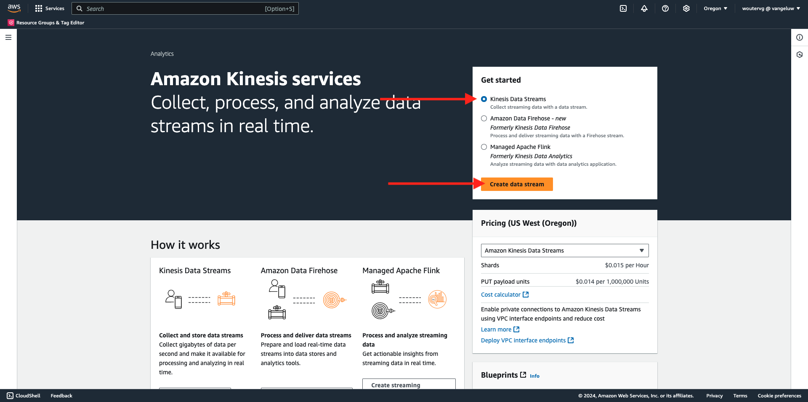
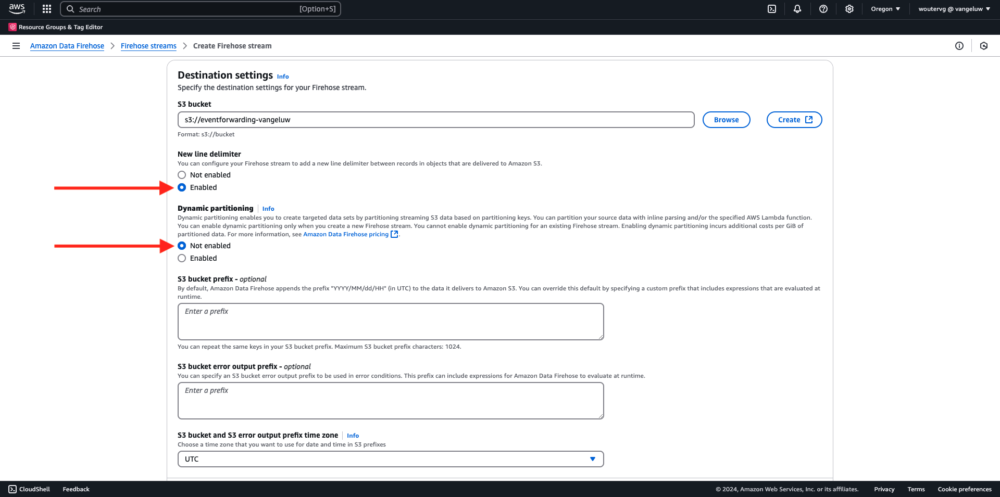
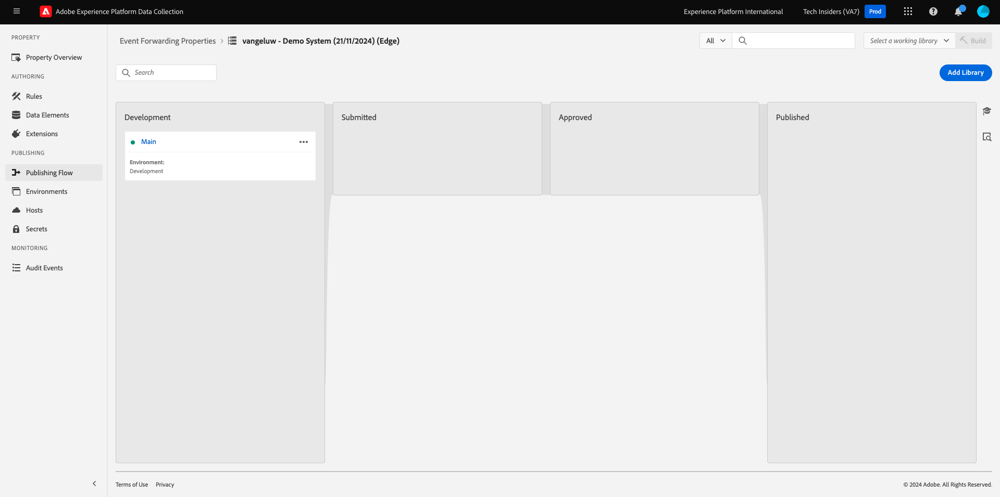

# 2.5.5 Weiterleiten von Ereignissen an das AWS-Ökosystem

>[!IMPORTANT]
>
>Der Abschluss dieser Übung ist optional und erfordert die Nutzung von AWS Kinesis Kosten. AWS bietet ein Konto der freien Ebene, mit dem Sie viele Dienste ohne Kosten testen und konfigurieren können. AWS Kinesis ist jedoch nicht Teil dieses Kontos der freien Ebene. Um diese Übung zu implementieren und zu testen, sind also Kosten für die Nutzung von AWS Kinesis erforderlich.

## Gut zu wissen

Adobe Experience Platform unterstützt verschiedene Amazon-Dienste als Ziel.
Kinesis und S3 sind beide [Profilexportziele](https://experienceleague.adobe.com/docs/experience-platform/destinations/destination-types.html?lang=en) und können als Teil von Adobe Experience Platforms Real-Time CDP verwendet werden.
Sie können einfach hochwertige Segmentereignisse und zugehörige Profilattribute in Ihre Systeme Ihrer Wahl einspeisen.

In diesem Hinweis erfahren Sie, wie Sie Ihren eigenen Amazon Kinesis-Stream einrichten, um Ereignisdaten aus dem Adobe Experience Platform Edge-Ökosystem an ein Cloud-Speicher-Ziel wie Amazon S3 zu streamen. Dies ist nützlich, wenn Sie Erlebnisereignisse aus Web- und mobilen Eigenschaften erfassen und zur Analyse und operativen Berichterstellung in Ihren Datensatz übertragen möchten. Datalakes erfassen Daten in der Regel im Batch-Modus mit großen täglichen Dateiimporten. Sie stellen keinen öffentlichen HTTP-Endpunkt bereit, der in Verbindung mit der Ereignisweiterleitung verwendet werden könnte.

Wenn Sie die oben genannten Anwendungsfälle unterstützen, müssen gestreamte Daten gepuffert oder in eine Warteschlange gestellt werden, bevor sie in eine Datei geschrieben werden. Es muss darauf geachtet werden, dass die Datei nicht für den Schreibzugriff über mehrere Prozesse hinweg geöffnet wird. Diese Aufgabe an ein dediziertes System zu delegieren ist ideal, um eine gute Skalierung zu erreichen und gleichzeitig ein hohes Serviceniveau zu gewährleisten. Hier kommt Kinesis zur Rettung.

Amazon Kinesis Data Streams konzentriert sich auf die Erfassung und Speicherung von Datenströmen. Kinesis Data Firewalls dienen der Bereitstellung von Datenströmen an ausgewählte Ziele, z. B. S3-Behälter.

Im Rahmen dieser Übung...

- Grundlegende Einrichtung eines Kinesis-Datenstreams durchführen
- Erstellen Sie einen Firewalls-Versand-Stream und verwenden Sie den S3-Behälter als Ziel.
- Konfigurieren des Amazon API-Gateways als REST-API-Endpunkt zum Empfangen Ihrer Ereignisdaten
- Weiterleiten von Rohereignisdaten von Adobe Edge an Ihren Kinesis-Stream

## 2.5.5.1 Konfigurieren des AWS S3-Buckets

Wechseln Sie zu [https://console.aws.amazon.com](https://console.aws.amazon.com) und melden Sie sich mit dem zuvor erstellten Amazon-Konto an.


Nach der Anmeldung werden Sie zur **AWS Management Console** weitergeleitet.


Suchen Sie im Menü **Dienste suchen** nach **s3**. Klicken Sie auf das erste Suchergebnis: **S3 - Skalierbarer Speicher in der Cloud**.


Dann sehen Sie die Homepage von **Amazon S3**. Klicken Sie auf **Behälter erstellen**.


Im Bildschirm **Behälter erstellen** müssen Sie zwei Elemente konfigurieren:

- Name: Verwenden Sie den Namen `eventforwarding---aepUserLdap--`. Beispiel: In dieser Übung lautet der Behältername **aepmodulertcdpvangeluw**
- Region: Region **EU (Frankfurt) eu-central-1**


Behalten Sie alle anderen Standardeinstellungen bei. Scrollen Sie nach unten und klicken Sie auf **Bucket erstellen**.


Sie werden sehen, wie Ihr Bucket erstellt wird und zur Amazon S3-Homepage weitergeleitet wird.


## 2.5.5.2 Konfigurieren des AWS Kinesis Data Streams

Suchen Sie im Menü **Dienste suchen** nach **Kinesis**. Klicken Sie auf das erste Suchergebnis: **Kinesis - Arbeiten mit Echtzeit-Streaming-Daten**.


Wählen Sie **Kinesis Data Streams** aus. Klicken Sie auf **Datenstrom erstellen**.



Verwenden Sie für den **Datenstrom-Namen** `--aepUserLdap---datastream`.


Die anderen Einstellungen müssen nicht geändert werden. Scrollen Sie nach unten und klicken Sie auf **Datenstrom erstellen**.


Dann wirst du das sehen. Sobald Ihr Datenstrom erfolgreich erstellt wurde, können Sie mit der nächsten Übung fortfahren.


## 2.5.5.3 Konfigurieren des AWS-Bereitstellungs-Streams für Firewalls

Suchen Sie im Menü **Dienste suchen** nach **Kinesis**. Klicken Sie auf **Kinesis Data Firewalls**.


Klicken Sie auf **Versand-Stream erstellen**.


Wählen Sie für **Source** die Option **Amazon Kinesis Data Streams**. Wählen Sie für **Ziel** **Amazon S3** aus. Klicken Sie auf **Durchsuchen** , um Ihren Daten-Stream auszuwählen.


Wählen Sie Ihren Daten-Stream aus. Klicken Sie auf **Choose**.


Dann wirst du das sehen. Merken Sie sich den **Name des Versand-Streams**, da Sie ihn später benötigen werden.


Scrollen Sie nach unten, bis **Zieleinstellungen** angezeigt wird. Klicken Sie auf **Durchsuchen** , um Ihren S3-Behälter auszuwählen.


Wählen Sie Ihren S3-Behälter aus und klicken Sie auf **Choose**.


Dann wirst du so etwas sehen. Aktualisieren Sie die folgenden Einstellungen:

- Dynamische Partitionierung: auf **Aktiviert** gesetzt
- Multi-Record Deaggregation: auf **Deabled** gesetzt
- Neues Trennzeichen: auf **Aktiviert** gesetzt
- Inline-Parsing für JSON: auf **Aktiviert** festlegen



Scrollen Sie ein wenig nach unten, dann sehen Sie das hier. Aktualisieren Sie die folgenden Einstellungen:

- Dynamische Partitionierungsschlüssel
   - Schlüsselname: **dynamicPartitioningKey**
   - JQ-Ausdruck: **.dynamicPartitioningKey**
- S3-Bucket-Präfix: Fügen Sie den folgenden Code hinzu:

```bash
!{partitionKeyFromQuery:dynamicPartitioningKey}/!{timestamp:yyyy}/!{timestamp:MM}/!{timestamp:dd}/!{timestamp:HH}/}
```

- Ausgabepräfix des S3-Bucket-Fehlers: auf **error** eingestellt


Scrollen Sie abschließend noch ein wenig nach unten und klicken Sie auf **Versandstream erstellen** .


Nach einigen Minuten wird Ihr Versand-Stream erstellt und **aktiv**.


## 2.5.5.4 AWS IAM-Rolle konfigurieren

Suchen Sie im Menü **Dienste suchen** nach **iam**. Klicken Sie auf **API Gateway**.


Klicken Sie auf **Rollen**.


Suchen Sie nach Ihrer Rolle **KinesisFirewalls** . Klicken Sie darauf, um es zu öffnen.


Klicken Sie auf den Namen Ihrer Berechtigungsrichtlinie , um sie zu öffnen.


Klicken Sie im sich öffnenden Bildschirm auf **Richtlinie bearbeiten**.


Stellen Sie unter **Kinesis** - **Aktionen** sicher, dass die **Write**-Berechtigungen für **PutRecord** aktiviert sind. Klicken Sie auf **Richtlinie überprüfen**.


Klicken Sie auf **Änderungen speichern**.


Du wirst dann wieder hier sein. Klicken Sie auf **Rollen**.


Suchen Sie nach Ihrer Rolle **KinesisFirewalls** . Klicken Sie darauf, um es zu öffnen.


Wechseln Sie zu **Vertrauensbeziehungen** und klicken Sie auf **Vertrauensrichtlinie bearbeiten**.


Überschreiben Sie die aktuelle Vertrauensrichtlinie, indem Sie diesen Code einfügen, um den vorhandenen Code zu ersetzen:

```json
{
	"Version": "2012-10-17",
	"Statement": [
		{
			"Effect": "Allow",
			"Principal": {
				"Service": [
                    "firehose.amazonaws.com",
                    "kinesis.amazonaws.com",
                    "apigateway.amazonaws.com"
                ]
			},
			"Action": "sts:AssumeRole"
		}
	]
}
```

Klicken Sie auf **Richtlinie aktualisieren**


Dann wirst du das sehen. Sie müssen im nächsten Schritt die **ARN** für diese Rolle angeben.


## 2.5.5.5 AWS API Gateway konfigurieren

Amazon API Gateway ist ein AWS-Dienst zum Erstellen, Veröffentlichen, Warten, Überwachen und Sichern von REST-, HTTP- und WebSocket-APIs beliebiger Größe. API-Entwickler können APIs erstellen, die auf AWS oder andere Webdienste zugreifen, sowie Daten, die in der AWS Cloud gespeichert sind.

Sie stellen den Kinesis-Datenstrom jetzt über einen HTTPS-Endpunkt im Internet bereit, der dann direkt von Adobe-Diensten wie der Ereignisweiterleitung genutzt werden kann.

Suchen Sie im Menü **Dienste suchen** nach **api Gateway**. Klicken Sie auf **API Gateway**.


Dann wirst du so etwas sehen. Klicken Sie auf **API erstellen**.


Klicken Sie auf der Karte **REST API** auf **Build** .


Dann wirst du das sehen. Füllen Sie die Einstellungen wie folgt aus:

- Wählen Sie das Protokoll aus: Wählen Sie **REST** aus.
- Neue API erstellen: Wählen Sie **Neue API** aus.
- Einstellungen:
   - API-Name: use `--aepUserLdap---eventforwarding`
   - Endpunkttyp: Wählen Sie **regional** aus.

Klicken Sie auf **API erstellen**.


Dann wirst du das sehen. Klicken Sie auf **Aktionen** und dann auf **Ressource erstellen**.


Dann wirst du das sehen. Setzen Sie **Ressourcenname** auf **stream**. Klicken Sie auf **Ressource erstellen**.


Dann wirst du das sehen. Klicken Sie auf **Aktionen** und dann auf **Methode erstellen**.


Wählen Sie im Dropdown-Menü **POST** aus und klicken Sie auf die Schaltfläche **v** .


Dann wirst du das sehen. Füllen Sie die Einstellungen wie folgt aus:

- Integrationstyp: **AWS-Dienst**
- AWS Region: Wählen Sie die Region aus, die vom Kinesis Data Stream verwendet wird, in diesem Fall: **us-west-2**
- AWS-Dienst: Wählen Sie **Kinesis** aus.
- AWS-Subdomäne: leer lassen
- HTTP-Methode: Auswählen von **POST**
- Aktionstyp: Wählen Sie **Aktionsnamen verwenden** aus
- Aktion: **PutRecord** eingeben
- Ausführungsrolle: Fügen Sie die **ARN** der Ausführungsrolle ein, die von Ihrem Kinesis Data Firewalls verwendet wird, wie in der vorherigen Übung beschrieben.
- Content Handling: Wählen Sie **Passthrough** aus
- Use Default Timeout: Aktivieren Sie das Kontrollkästchen

Klicken Sie auf **Speichern**.


Dann wirst du das sehen. Klicken Sie auf **Integrationsanforderung**.


Klicken Sie auf **HTTP-Header**.


Scrollen Sie nach unten und klicken Sie auf **Header hinzufügen**.


Setzen Sie **Name** auf **Content-Type**, legen Sie **Zugeordnet von** auf `'application/x-amz-json-1.1'` fest. Klicken Sie auf das Symbol **v** , um Ihre Änderungen zu speichern.


Dann wirst du das sehen. Wählen Sie für **Passthrough des Anrufs anfordern** die Option **Wenn keine Vorlagen definiert sind (empfohlen)**. Klicken Sie anschließend auf **Zuordnungsvorlage hinzufügen**.


Geben Sie unter **Content-Type** den Wert **application/json** ein. Klicken Sie auf das Symbol **v** , um Ihre Änderungen zu speichern.


Scrollen Sie nach unten, um ein Fenster mit dem Code-Editor zu finden. Fügen Sie den folgenden Code dorthin ein:

```json
{
  "StreamName": "$input.path('StreamName')",
  "Data": "$util.base64Encode($input.json('$.Data'))",
  "PartitionKey": "$input.path('$.PartitionKey')"
}
```

Klicken Sie auf **Speichern**.


Scrollen Sie dann nach oben und klicken Sie auf **&lt;- Methodenausführung** , um zurück zu gehen.


Klicken Sie auf **TEST**.


Scrollen Sie nach unten und fügen Sie diesen Code unter **Anforderungstext** ein. Klicken Sie auf **Testen**.

```json
{
  "Data": {
    "message": "Hello World",
    "dynamicPartitioningKey": "v2"
  },
  "PartitionKey": "1",
  "StreamName": "--aepUserLdap---datastream"
}
```


Daraufhin wird ein ähnliches Ergebnis angezeigt:


Dann wirst du das sehen. Klicken Sie auf **Aktionen** und dann auf **API bereitstellen**.


Wählen Sie für **Bereitstellungsetappe** die Option **Neue Phase**. Geben Sie als **Staging-Name** **prod** ein. Klicken Sie auf **Bereitstellen**.


Dann wirst du das sehen. Klicken Sie auf **Änderungen speichern**. FYI: Die URL im Bild ist die URL, an die Daten gesendet werden sollen (in diesem Beispiel: https://vv1i5vwg2k.execute-api.us-west-2.amazonaws.com/prod).


Sie können Ihre Einrichtung mithilfe der folgenden cURL-Anfrage testen. Sie müssen lediglich die folgende URL durch Ihre ersetzen, in diesem Beispiel `https://vv1i5vwg2k.execute-api.us-west-2.amazonaws.com/prod` und am Ende der URL `/stream` hinzufügen.

```json
curl --location --request POST 'https://vv1i5vwg2k.execute-api.us-west-2.amazonaws.com/prod/stream' \
--header 'Content-Type: application/json' \
--data-raw '{
    "Data": {
        "userid": "--aepUserLdap--@adobe.com",
        "firstName":"--aepUserLdap--",
        "offerName":"10% off on outdoor gears",
        "offerCode": "10OFF-SPRING",
        "dynamicPartitioningKey": "campaign"
    },
    "PartitionKey": "1",
    "StreamName": "--aepUserLdap---datastream"
}'
```

Fügen Sie den oben aktualisierten Code in ein Terminal-Fenster ein und drücken Sie die Eingabetaste. Diese Antwort wird Ihnen dann ähnlich der Antwort angezeigt, die Sie beim obigen Test sehen konnten.


## 2.5.5.6 Eigenschaft &quot;Ereignisweiterleitung&quot;aktualisieren

Sie können jetzt über das AWS API Gateway für Ihren AWS Kinesis-Datenstrom aktivieren, damit Sie Ihre Roh-Erlebnisereignisse jetzt in das AWS-Ökosystem senden können. Mithilfe von Real-Time CDP-Verbindungen und Ereignisweiterleitung können Sie jetzt auf einfache Weise die Ereignisweiterleitung zum neu erstellten AWS API Gateway-Endpunkt aktivieren.

### 2.5.5.6.1 Eigenschaft für die Ereignisweiterleitung aktualisieren: Datenelement erstellen

Wechseln Sie zu [https://experience.adobe.com/#/data-collection/](https://experience.adobe.com/#/data-collection/) und gehen Sie zu **Ereignisweiterleitung**. Suchen Sie die Eigenschaft &quot;Ereignisweiterleitung&quot;und klicken Sie darauf, um sie zu öffnen.


Gehen Sie im linken Menü zu **Datenelemente**. Klicken Sie auf **Datenelement hinzufügen**.


Anschließend wird ein neues Datenelement angezeigt, das konfiguriert werden soll.


Wählen Sie Folgendes aus:

- Geben Sie als **Name** **awsDataObject** ein.
- Wählen Sie als **Erweiterung** **Core** aus.
- Wählen Sie als **Datenelementtyp** **Benutzerdefinierter Code** aus.

Das wirst du jetzt haben. Klicken Sie auf **&lt;/> Editor öffnen**.


Fügen Sie im Editor den folgenden Code in Zeile 3 ein. Klicken Sie auf **Speichern**.

```javascript
const newObj = {...arc.event.xdm, dynamicPartitioningKey: "event_forwarding"}
return JSON.stringify(newObj);
```


>[!NOTE]
>
>Im obigen Pfad wird ein Verweis auf **arc** erstellt. **arc** steht für Adobe Resource Context und **arc** steht immer für das höchste verfügbare Objekt, das im serverseitigen Kontext verfügbar ist. Das Objekt **arc** kann mit den Adobe Experience Platform-Datenerfassungsserverfunktionen um Anreicherungen und Umwandlungen erweitert werden.
>
>Im obigen Pfad wird ein Verweis auf **event** erstellt. **event** steht für ein eindeutiges Ereignis, und der Adobe Experience Platform-Datenerfassungsserver wertet jedes Ereignis immer einzeln aus. Manchmal wird in der vom Web SDK Client Side gesendeten Payload ein Verweis auf **events** angezeigt, aber bei der Adobe Experience Platform-Ereignisweiterleitung für die Datenerfassung wird jedes Ereignis einzeln ausgewertet.

Du wirst dann wieder hier sein. Klicken Sie auf **Speichern** oder **In Bibliothek speichern**.


### 2.5.5.6.2 Adobe Experience Platform-Datenerfassungsservereigenschaft aktualisieren: Regel aktualisieren

Gehen Sie im linken Menü zu **Regeln**. Klicken Sie auf , um die Regel **Alle Seiten** zu öffnen, die Sie in einer der vorherigen Übungen erstellt haben.


Dann wirst du das sehen. Klicken Sie auf das Symbol **+** , um eine neue Aktion hinzuzufügen.


Dann wirst du das sehen. Wählen Sie Folgendes aus:

- Wählen Sie die **Erweiterung**: **Adobe Cloud Connector** aus.
- Wählen Sie den **Aktionstyp**: **Fetch-Aufruf durchführen**.

Dadurch erhalten Sie den folgenden **Namen**: **Adobe Cloud-Connector - Abrufen des Abrufs**. Sie sollten jetzt Folgendes sehen:


Konfigurieren Sie als Nächstes Folgendes:

- Ändern Sie die Anfragemethode von GET in **POST** .
- Geben Sie die URL des AWS API Gateway-Endpunkts ein, den Sie in einem der vorherigen Schritte erstellt haben und der wie folgt aussieht: `https://vv1i5vwg2k.execute-api.us-west-2.amazonaws.com/prod/stream`

Du solltest das jetzt haben. Navigieren Sie als Nächstes zu **Kopfzeilen**.


Fügen Sie unter Kopfzeilen eine neue Kopfzeile mit dem Schlüssel **Content-Type** und dem Wert **application/json** hinzu. Navigieren Sie als Nächstes zu **Hauptteil**.


Dann wirst du das sehen. Fügen Sie den folgenden Code in das Feld **Hauptteil (Rohtext)** ein. Klicken Sie auf **Änderungen beibehalten**.

```json
{
    "Data":{{awsDataObject}},
    "PartitionKey": "1",
    "StreamName": "--aepUserLdap---datastream"
}
```


Du wirst dann wieder hier sein sehen. Klicken Sie auf **Speichern** oder **In Bibliothek speichern**.


Sie haben Ihre erste Regel jetzt in einer Eigenschaft für die Ereignisweiterleitung konfiguriert. Wechseln Sie zu **Veröffentlichungsfluss** , um Ihre Änderungen zu veröffentlichen.
Öffnen Sie Ihre Entwicklungsbibliothek, indem Sie auf **Main** klicken.


Klicken Sie auf die Schaltfläche **Alle geänderten Ressourcen hinzufügen** , nach der Ihre Regel- und Datenelementänderungen in dieser Bibliothek angezeigt werden. Klicken Sie anschließend auf **Speichern und für Entwicklung erstellen**. Ihre Änderungen werden jetzt bereitgestellt.


Nach einigen Minuten werden Sie feststellen, dass die Implementierung abgeschlossen ist und getestet werden kann.



## 2.5.5.7 Konfiguration testen

Wechseln Sie zu [https://builder.adobedemo.com/projects](https://builder.adobedemo.com/projects). Nach der Anmeldung bei Ihrer Adobe ID sehen Sie dies. Klicken Sie auf Ihr Website-Projekt, um es zu öffnen.


Sie können nun den unten stehenden Fluss zum Zugriff auf die Website ausführen. Klicken Sie auf **Integrationen**.


Wählen Sie auf der Seite **Integrationen** die Datenerfassungseigenschaft aus, die in Übung 0.1 erstellt wurde.


Sie werden dann Ihre Demowebsite öffnen sehen. Wählen Sie die URL aus und kopieren Sie sie in die Zwischenablage.


Öffnen Sie ein neues Inkognito-Browserfenster.


Fügen Sie die URL Ihrer Demo-Website ein, die Sie im vorherigen Schritt kopiert haben. Sie werden dann aufgefordert, sich mit Ihrer Adobe ID anzumelden.


Wählen Sie Ihren Kontotyp aus und schließen Sie den Anmeldevorgang ab.


Sie sehen dann Ihre Website in einem Inkognito-Browser-Fenster geladen. Für jede Demonstration müssen Sie ein neues Inkognito-Browser-Fenster verwenden, um Ihre Demo-Website-URL zu laden.


Wenn Sie die Entwickleransicht des Browsers öffnen, können Sie Netzwerkanforderungen wie unten angegeben überprüfen. Wenn Sie den Filter **interact** verwenden, sehen Sie die Netzwerkanforderungen, die vom Adobe Experience Platform-Datenerfassungs-Client an die Adobe Edge gesendet werden.


Wenn Sie die Rohdaten-Payload auswählen, gehen Sie zu &quot;[https://jsonformatter.org/json-pretty-print](https://jsonformatter.org/json-pretty-print)&quot;und fügen Sie die Payload ein. Klicken Sie auf **Make Pretty**. Anschließend werden die JSON-Payload, das Objekt **events** und das Objekt **xdm** angezeigt. In einem der vorherigen Schritte haben Sie bei der Definition des Datenelements die Referenz **arc.event.xdm** verwendet, was dazu führt, dass Sie das Objekt **xdm** dieser Payload analysieren.


Wechseln Sie Ihre Ansicht zu **AWS**. Wenn Sie Ihren Datenstrom öffnen und auf die Registerkarte **Überwachung** wechseln, wird nun der eingehende Traffic angezeigt.


Wenn Sie dann Ihren Versand-Stream öffnen und in den Tab **Überwachung** wechseln, wird auch der eingehende Traffic angezeigt.


Wenn Sie sich schließlich Ihren S3-Bucket ansehen, werden Sie feststellen, dass dort Dateien infolge Ihrer Datenerfassung erstellt werden.


Wenn Sie eine solche Datei herunterladen und sie mit einem Texteditor öffnen, sehen Sie, dass sie die XDM-Payload aus den weitergeleiteten Ereignissen enthält.


Nächster Schritt: [Zusammenfassung und Vorteile](./summary.md)

[Zurück zu Modul 2.5](./aep-data-collection-ssf.md)

[Zu allen Modulen zurückkehren](./../../../overview.md)
