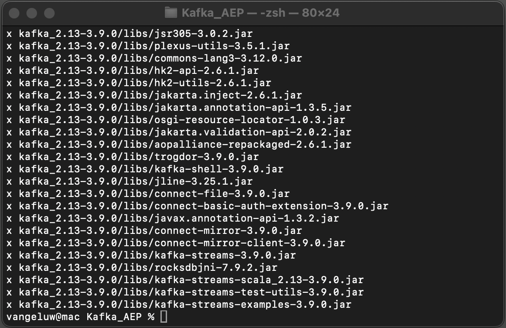
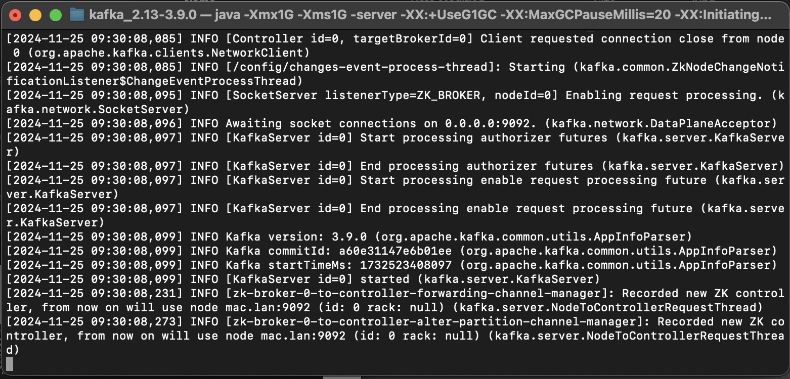

# 2.6.2 Installieren und Konfigurieren des Kafka-Clusters

## Apache Kafka herunterladen

Wechseln Sie zu [https://kafka.apache.org/downloads](https://kafka.apache.org/downloads) und laden Sie die neueste veröffentlichte Version herunter. Wählen Sie die neueste Binärversion aus, in diesem Fall **3.9.**. Ihr Download wird gestartet.

Erstellen Sie auf Ihrem Desktop einen Ordner mit dem Namen **Kafka_AEP** und legen Sie die heruntergeladene Datei in diesem Verzeichnis ab.

Öffnen Sie ein **Terminal**-Fenster, indem Sie mit der rechten Maustaste auf den Ordner klicken und **Neues Terminal unter Ordner** klicken.

Führen Sie diesen Befehl im Terminal-Fenster aus, um die heruntergeladene Datei zu entpacken:

`tar -xvf kafka_2.13-3.9.0.tgz`

>[!NOTE]
>
>Stellen Sie sicher, dass der obige Befehl der Version der heruntergeladenen Datei entspricht. Wenn Ihre Version aktueller ist, müssen Sie den obigen Befehl aktualisieren, damit er mit dieser Version übereinstimmt.

Sie sehen dann Folgendes:

Nach dem Dekomprimieren dieser Datei verfügen Sie nun über ein Verzeichnis wie dieses:

Und in diesem Verzeichnis sehen Sie diese Unterverzeichnisse:

Zurück zum Terminal-Fenster. Geben Sie den folgenden Befehl ein:

`cd kafka_2.13-3.9.0`

>[!NOTE]
>
>Stellen Sie sicher, dass der obige Befehl der Version der heruntergeladenen Datei entspricht. Wenn Ihre Version aktueller ist, müssen Sie den obigen Befehl aktualisieren, damit er mit dieser Version übereinstimmt.

Geben Sie als Nächstes die `bin/kafka-topics.sh` ein.

Sie sollten dann diese Antwort sehen. Dies bedeutet, dass Kafka ordnungsgemäß installiert ist und Java einwandfrei funktioniert. (Erinnerung: Sie müssen Java 23 JDK installiert haben, damit dies funktioniert! Mithilfe des Befehls `java -version` können Sie sehen, welche Java-Version installiert wurde.)

## Kafka starten

Um Kafka zu starten, müssen Sie Kafka Zookeeper und Kafka starten, in dieser Reihenfolge.

Öffnen Sie ein **Terminal**-Fenster, indem Sie mit der rechten Maustaste auf den Ordner **kafka_2.13-3.9.0** klicken und auf **Neues Terminal im Ordner** klicken.

Geben Sie diesen Befehl ein:

`bin/zookeeper-server-start.sh config/zookeeper.properties`

Sie sehen dann Folgendes:

Lassen Sie dieses Fenster geöffnet, während Sie diese Übungen durchlaufen!

Öffnen Sie ein weiteres **Terminal**-Fenster, indem Sie mit der rechten Maustaste auf den Ordner **kafka_2.13-3.9.0** und dann auf **Neues Terminal im Ordner** klicken.

Geben Sie diesen Befehl ein:

`bin/kafka-server-start.sh config/server.properties`

Sie sehen dann Folgendes:

Lassen Sie dieses Fenster geöffnet, während Sie diese Übungen durchlaufen!

## Kafka-Thema erstellen

Öffnen Sie ein **Terminal**-Fenster, indem Sie mit der rechten Maustaste auf den Ordner **kafka_2.13-3.9.0** klicken und auf **Neues Terminal im Ordner** klicken.

Geben Sie diesen Befehl ein, um ein neues Kafka-Thema mit dem Namen **aepTest** zu erstellen. Dieses Thema wird in dieser Übung zum Testen verwendet.

`bin/kafka-topics.sh --create --topic aeptest --bootstrap-server localhost:9092`

Daraufhin wird eine Bestätigung angezeigt:

Geben Sie diesen Befehl ein, um ein neues Kafka-Thema mit dem Namen **aep“**. Dieser Artikel wird vom Adobe Experience Platform Sink Connector verwendet, den Sie in den nächsten Übungen konfigurieren werden.

`bin/kafka-topics.sh --create --topic aep --bootstrap-server localhost:9092`

Daraufhin wird eine ähnliche Bestätigung angezeigt:

## Ereignisse erstellen

Wechseln Sie zurück zum Terminal-Fenster, in dem Sie Ihr erstes Kafka-Thema erstellt haben, und geben Sie den folgenden Befehl ein:

`bin/kafka-console-producer.sh --broker-list 127.0.0.1:9092 --topic aeptest`

Sie werden es dann sehen. Jede neue Zeile, gefolgt vom Drücken der Eingabetaste, führt dazu, dass eine neue Nachricht an das Thema (**) gesendet**.

Geben Sie `Hello AEP` ein und drücken Sie die Eingabetaste. Ihre erste Veranstaltung wurde jetzt an Ihre lokale Kafka-Instanz zum Thema **aepTest** gesendet.

Geben Sie `Hello AEP again.` ein und drücken Sie die Eingabetaste.

Geben Sie `AEP Data Collection is the best.` ein und drücken Sie die Eingabetaste.

Sie haben jetzt 3 Events zum Thema **aepTest** produziert. Diese Ereignisse können jetzt von einer Anwendung genutzt werden, die diese Daten möglicherweise benötigt.

Klicken Sie auf Ihrer Tastatur gleichzeitig auf `Control` und `C`, um den Produzenten zu schließen.

## Ereignisse verarbeiten

Geben Sie im selben Terminal-Fenster, in dem Sie Ereignisse generiert haben, den folgenden Befehl ein:

`bin/kafka-console-consumer.sh --bootstrap-server 127.0.0.1:9092 --topic aeptest --from-beginning`

Anschließend werden alle Nachrichten, die in der vorherigen Übung für das Thema &quot;**&quot; erstellt wurden** im Verbraucher angezeigt. So funktioniert Apache Kafka: Ein Produzent erstellt Ereignisse in einer Pipeline und ein Verbraucher nutzt diese Ereignisse.

Klicken Sie auf Ihrer Tastatur gleichzeitig auf `Control` und `C`, um den Produzenten zu schließen.

In dieser Übung haben Sie alle Grundlagen zum Einrichten eines lokalen Kafka-Clusters, zum Erstellen eines Kafka-Themas, zum Erstellen von Ereignissen und zum Konsumieren von Ereignissen durchlaufen.

Ziel dieses Moduls ist es, zu simulieren, was passieren würde, wenn ein echtes Unternehmen bereits einen Apache Kafka-Cluster implementiert hat und Daten von seinem Kafka-Cluster in Adobe Experience Platform streamen möchte.

Um eine solche Implementierung zu erleichtern, wurde ein Adobe Experience Platform Sink Connector erstellt, der mit Kafka Connect implementiert werden kann. Die Dokumentation zu diesem Adobe Experience Platform Sink Connector finden Sie hier: [https://github.com/adobe/experience-platform-streaming-connect](https://github.com/adobe/experience-platform-streaming-connect).

In den nächsten Übungen implementieren Sie alles, was Sie zur Verwendung dieses Adobe Experience Platform Sink Connectors benötigen, aus Ihrem eigenen lokalen Kafka-Cluster.

Schließen Sie das Terminal-Fenster.

Du hast diese Übung beendet.

Nächster Schritt: [2.6.3 HTTP-API-Endpunkt in Adobe Experience Platform konfigurieren](./ex3.md)

[Zurück zum Modul 2.6](./aep-apache-kafka.md)

[Zurück zu „Alle Module“](../../../overview.md)
