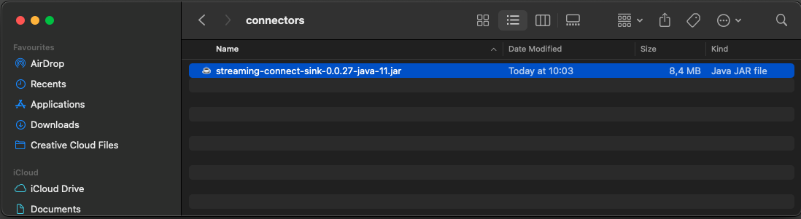
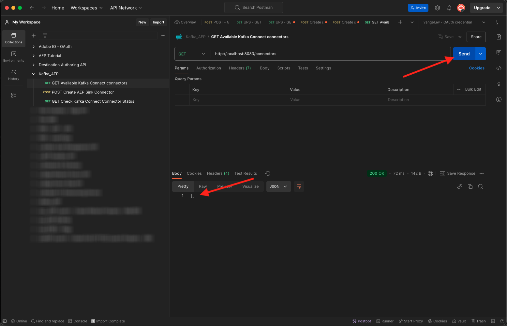
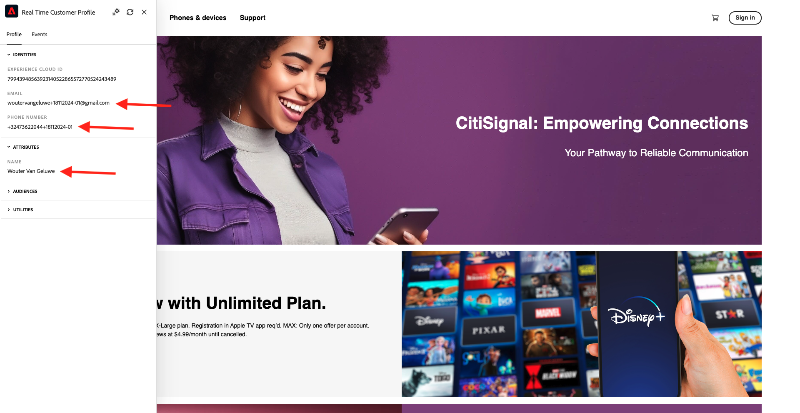

# 2.6.4 Installieren und Konfigurieren von Kafka Connect und Adobe Experience Platform Sink Connector

## 2.6.4.1 Adobe Experience Platform Sink Connector herunterladen

Rufen Sie [https://github.com/adobe/experience-platform-streaming-connect/releases](https://github.com/adobe/experience-platform-streaming-connect/releases) auf und laden Sie die neueste offizielle Version des Adobe Experience Platform Sink Connectors herunter.


Platzieren Sie die Download-Datei **streaming-connect-sink-0.0.14-java-11.jar** auf Ihren Desktop.


## 2.6.4.2 Kafka Connect konfigurieren

Wechseln Sie zum Ordner auf Ihrem Desktop mit dem Namen **Kafka_AEP** und navigieren Sie zum Ordner `kafka_2.13-3.1.0/config`.
Öffnen Sie in diesem Ordner die Datei **connect-distributed.properties** mit einem beliebigen Texteditor.


Navigieren Sie in Ihrem Texteditor zu den Zeilen 34 und 35 und stellen Sie sicher, dass Sie die Felder `key.converter.schemas.enable` und `value.converter.schemas.enable` auf `false` setzen.

```json
key.converter.schemas.enable=false
value.converter.schemas.enable=false
```

Speichern Sie Ihre Änderungen in dieser Datei.


Gehen Sie anschließend zurück zum Ordner &quot;`kafka_2.13-3.1.0`&quot;, erstellen Sie manuell einen neuen Ordner und nennen Sie ihn &quot;`connectors`&quot;.


Klicken Sie mit der rechten Maustaste auf den Ordner und klicken Sie auf **Neues Terminal im Ordner**.


Dann wirst du das sehen. Geben Sie den Befehl `pwd` ein, um den vollständigen Pfad für diesen Ordner abzurufen. Wählen Sie den vollständigen Pfad aus und kopieren Sie ihn in die Zwischenablage.


Gehen Sie zurück zum Texteditor, wechseln Sie zur Datei **connect-distributed.properties** und scrollen Sie zur letzten Zeile herunter (Zeile 86 im Screenshot). Sie sollten den Kommentar für die mit `# plugin.path=` beginnende Zeile aufheben und den vollständigen Pfad zum Ordner `connectors` einfügen. Das Ergebnis sollte in etwa wie folgt aussehen:

`plugin.path=/Users/woutervangeluwe/Desktop/Kafka_AEP/kafka_2.13-3.1.0/connectors`

Speichern Sie Ihre Änderungen in der Datei **connect-distribution.properties** und schließen Sie den Texteditor.


Kopieren Sie als Nächstes die neueste offizielle Version des Adobe Experience Platform Sink Connectors, die Sie in den Ordner `connectors` heruntergeladen haben. Die zuvor heruntergeladene Datei heißt **streaming-connect-sink-0.0.14-java-11.jar**, Sie können sie einfach in den Ordner `connectors` verschieben.



Als Nächstes öffnen Sie ein neues Terminal-Fenster auf der Ebene des Ordners **kafka_2.13-3.1.0** . Klicken Sie mit der rechten Maustaste auf diesen Ordner und klicken Sie auf **Neues Terminal im Ordner**.

Fügen Sie im Terminal-Fenster den folgenden Befehl ein: `bin/connect-distributed.sh config/connect-distributed.properties` und klicken Sie auf **Enter**. Mit diesem Befehl wird Kafka Connect gestartet und die Bibliothek des Adobe Experience Platform Sink Connectors geladen.


Nach ein paar Sekunden sehen Sie etwas wie Folgendes:


## 2.6.4.3 Adobe Experience Platform Sink-Connector mit Postman erstellen

Sie können jetzt mit Kafka Connect über Postman interagieren. Laden Sie dazu [diese Postman-Sammlung](./../../../assets/postman/postman_kafka.zip) herunter und entpacken Sie sie auf Ihren lokalen Computer auf dem Desktop. Sie verfügen dann über eine Datei mit dem Namen `Kafka_AEP.postman_collection.json`.


Sie müssen diese Datei in Postman importieren. Öffnen Sie dazu Postman, klicken Sie auf **Importieren**, ziehen Sie die Datei `Kafka_AEP.postman_collection.json` per Drag-and-Drop in das Popup-Fenster und klicken Sie auf **Importieren**.


Diese Kollektion finden Sie dann im linken Menü von Postman. Klicken Sie auf die erste Anforderung, **GET Verfügbare Kafka Connect-Connectoren** , um sie zu öffnen.


Dann wirst du das sehen. Klicken Sie auf die blaue Schaltfläche **Senden**, nach der eine leere Antwort `[]` angezeigt werden soll. Die leere Antwort ist darauf zurückzuführen, dass derzeit keine Kafka Connect-Connectoren definiert sind.



Um einen Connector zu erstellen, klicken Sie auf , um die zweite Anforderung in der Kafka-Sammlung zu öffnen: **POST AEP Sink Connector erstellen**. Dann wirst du das sehen. In Zeile 11, wo es &quot;**&quot;aep.endpoint&quot;: &quot;&quot;**&quot;heißt, müssen Sie die HTTP-API-Streaming-Endpunkt-URL einfügen, die Sie am Ende der Übung erhalten haben [15.3](./ex3.md). Die URL des HTTP-API-Streaming-Endpunkts sieht wie folgt aus: `https://dcs.adobedc.net/collection/d282bbfc8a540321341576275a8d052e9dc4ea80625dd9a5fe5b02397cfd80dc`.


Nach dem Einfügen sollte der Hauptteil Ihrer Anforderung wie folgt aussehen: Klicken Sie auf die blaue Schaltfläche **Senden** , um Ihren Connector zu erstellen. Sie erhalten eine sofortige Antwort von der Erstellung Ihres Connectors.


Klicken Sie auf die erste Anforderung, **GET Verfügbare Kafka Connect-Connectoren** , um sie erneut zu öffnen, und klicken Sie erneut auf die blaue Schaltfläche **Senden** . Sie werden sehen, dass ein Kafka Connect-Connector erstellt wurde.


Öffnen Sie als Nächstes die dritte Anforderung in der Kafka-Sammlung, **GET Überprüfen Sie den Kafka Connect-Connector-Status**. Klicken Sie auf die blaue Schaltfläche **Senden** . Daraufhin erhalten Sie eine Antwort wie die unten stehende, in der erklärt wird, dass der Connector ausgeführt wird.


## 2.6.4.4 Ereignis erstellen

Öffnen Sie ein neues Fenster **Terminal** , indem Sie mit der rechten Maustaste auf den Ordner **kafka_2.13-3.1.0** klicken und auf **Neues Terminal im Ordner** klicken.


Geben Sie den folgenden Befehl ein:

`bin/kafka-console-producer.sh --broker-list 127.0.0.1:9092 --topic aep`


Dann wirst du das sehen. Jede neue Zeile, gefolgt von der Schaltfläche &quot;Enter&quot;, führt dazu, dass eine neue Nachricht an das Thema **aep** gesendet wird.


Jetzt können Sie eine Nachricht senden, die vom Adobe Experience Platform Sink Connector genutzt wird und in Echtzeit in Adobe Experience Platform aufgenommen wird.

Lass uns ein kleines Demo machen, um das zu testen.

Wechseln Sie zu [https://builder.adobedemo.com/projects](https://builder.adobedemo.com/projects). Nach der Anmeldung bei Ihrer Adobe ID sehen Sie dies. Klicken Sie auf Ihr Website-Projekt, um es zu öffnen.


Klicken Sie auf der Seite **Screens** auf **Ausführen**.


Sie werden dann Ihre Demowebsite öffnen sehen. Wählen Sie die URL aus und kopieren Sie sie in die Zwischenablage.


Öffnen Sie ein neues Inkognito-Browserfenster.


Fügen Sie die URL Ihrer Demo-Website ein, die Sie im vorherigen Schritt kopiert haben. Sie werden dann aufgefordert, sich mit Ihrer Adobe ID anzumelden.


Wählen Sie Ihren Kontotyp aus und schließen Sie den Anmeldevorgang ab.


Sie sehen dann Ihre Website in einem Inkognito-Browser-Fenster geladen. Für jede Demonstration müssen Sie ein neues Inkognito-Browser-Fenster verwenden, um Ihre Demo-Website-URL zu laden.


Klicken Sie auf das Adobe-Logo-Symbol oben links im Bildschirm, um den Profilanzeige zu öffnen.


Sehen Sie sich das Bedienfeld &quot;Profil-Viewer&quot;und das Echtzeit-Kundenprofil mit der **Experience Cloud-ID** als primäre ID für diesen derzeit unbekannten Kunden an.


Gehen Sie zur Seite Registrieren/Anmelden . Klicken Sie auf **KONTO ERSTELLEN**.


Füllen Sie Ihre Details aus und klicken Sie auf **Registrieren** . Danach werden Sie zur vorherigen Seite weitergeleitet.


Öffnen Sie das Bedienfeld Profil-Viewer und wechseln Sie zum Echtzeit-Kundenprofil. Im Bedienfeld &quot;Profil-Viewer&quot;sollten alle Ihre personenbezogenen Daten angezeigt werden, z. B. Ihre neu hinzugefügten E-Mail- und Telefonkennungen.



Möglicherweise werden einige Erlebnisereignisse auf der Grundlage vergangener Aktivitäten angezeigt.


Ändern wir das und senden ein Callcenter-Erlebnisereignis von Kafka nach Adobe Experience Platform.

Nehmen Sie die folgende Beispielnutzlast für Erlebnisereignisse und kopieren Sie sie in einen Texteditor.

```json
{
  "header": {
    "datasetId": "61fe23fd242870194a6d779c",
    "imsOrgId": "--aepImsOrgID--",
    "source": {
      "name": "Launch"
    },
    "schemaRef": {
      "id": "https://ns.adobe.com/experienceplatform/schemas/b0190276c6e1e1e99cf56c99f4c07a6e517bf02091dcec90",
      "contentType": "application/vnd.adobe.xed-full+json;version=1"
    }
  },
  "body": {
    "xdmMeta": {
      "schemaRef": {
        "id": "https://ns.adobe.com/experienceplatform/schemas/b0190276c6e1e1e99cf56c99f4c07a6e517bf02091dcec90",
        "contentType": "application/vnd.adobe.xed-full+json;version=1"
      }
    },
    "xdmEntity": {
      "eventType": "callCenterInteractionKafka",
      "_id": "",
      "timestamp": "2022-02-23T09:54:12.232Z",
      "_experienceplatform": {
        "identification": {
          "core": {
            "phoneNumber": ""
          }
        },
        "interactionDetails": {
          "core": {
            "callCenterAgent": {
              "callID": "Support Contact - 3767767",
              "callTopic": "contract",
              "callFeeling": "negative"
            }
          }
        }
      }
    }
  }
}
```

Dann wirst du das sehen. Sie müssen zwei Felder manuell aktualisieren:

- **_id**: Setzen Sie es auf eine zufällige ID, etwa `--demoProfileLdap--1234`
- **timestamp**: Aktualisieren Sie den Zeitstempel auf das aktuelle Datum und die aktuelle Uhrzeit
- **phoneNumber**: Geben Sie die phoneNumber des Kontos ein, das gerade auf der Demowebsite erstellt wurde. Sie finden sie im Bedienfeld &quot;Profil-Viewer&quot;unter **Identitäten**.

Sie müssen auch diese Felder überprüfen und gegebenenfalls aktualisieren:
- **datasetId**: Sie müssen die Datensatz-ID für das Datensatz-Demo-System - Ereignis-Datensatz für Callcenter (Global v1.1) kopieren.
- **imsOrgID**: Ihre IMS-Organisations-ID ist `--aepImsOrgId--`

>[!NOTE]
>
>Das Feld **_id** muss für jede Datenerfassung eindeutig sein. Wenn Sie mehrere Ereignisse erzeugen, stellen Sie sicher, dass Sie das Feld **_id** jedes Mal auf einen neuen eindeutigen Wert aktualisieren.


Sie sollten dann etwas wie Folgendes haben:


Kopieren Sie dann Ihr gesamtes Erlebnisereignis in die Zwischenablage. Der Leerraum Ihrer JSON-Payload muss entfernt werden. Dazu verwenden wir ein Online-Tool. Wechseln Sie dazu zu [http://jsonviewer.stack.hu/](http://jsonviewer.stack.hu/) .


Fügen Sie Ihr Erlebnisereignis in den Editor ein und klicken Sie auf **Leerraum entfernen**.


Wählen Sie anschließend den gesamten Ausgabetext aus und kopieren Sie ihn in die Zwischenablage.


Kehren Sie zu Ihrem Terminal-Fenster zurück.


Fügen Sie die neue Payload ohne Leerzeichen in das Terminal-Fenster ein und klicken Sie auf **Enter**.


Gehen Sie anschließend zurück zu Ihrer Demo-Website und aktualisieren Sie die Seite. Es sollte nun in Ihrem Profil ein Erlebnisereignis unter **Andere Ereignisse** wie unten angezeigt werden:


>[!NOTE]
>
>Wenn Ihre Callcenter-Interaktionen im Profil-Viewer-Bedienfeld angezeigt werden sollen, müssen Sie die folgende Beschriftung hinzufügen und in Ihrem Projekt unter [https://builder.adobedemo.com/projects](https://builder.adobedemo.com/projects) filtern, indem Sie zur Registerkarte **Profil-Viewer** navigieren.


Du hast diese Übung beendet.

Nächster Schritt: [Zusammenfassung und Vorteile](./summary.md)

[Zurück zu Modul 2.6](./aep-apache-kafka.md)

[Zu allen Modulen zurückkehren](../../../overview.md)
