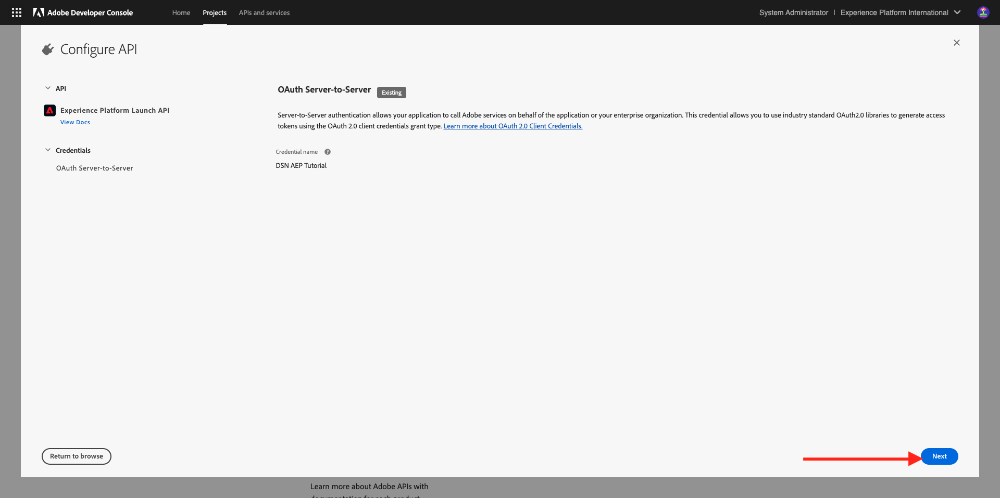

# Einrichten

>[!IMPORTANT]
>
>Diese Seite ist nur für Systemadministratorrollen vorgesehen. Sie benötigen Systemadministratorzugriffsrechte für Ihre spezifische Instanz, um die folgenden Schritte ausführen zu können. Wenn Sie kein Systemadministrator in Ihrer Adobe Experience Cloud-Organisation sind, wenden Sie sich an Ihren Systemadministrator und bitten Sie ihn um Genehmigung und Hilfe, bevor Sie mit einem der folgenden Schritte fortfahren.

## Übersicht

Um alle diese Tutorials praxisnah zu nutzen, müssen die folgenden Adobe Experience Cloud-Anwendungen in Ihrer IMS-Organisation bereitgestellt werden:

- Adobe Echtzeit-Kundendatenplattform
- Adobe Experience Platform – Datenerfassung
- Adobe Journey Optimizer
- Customer Journey Analytics
- Data Distiller
- Komposition föderierter Zielgruppen

Wenn für Ihre IMS-Organisation kein bestimmter Anwendungsdienst bereitgestellt wurde, können Sie diese spezifische Übung nicht direkt durchführen.

## Sandbox erstellen

Um das Tutorial in Ihrer eigenen AEP-Instanz durchzugehen, ist es ratsam, zunächst eine neue Entwicklungs-Sandbox einzurichten. Um eine neue Sandbox zu erstellen, gehen Sie zu [https://experience.adobe.com/platform](https://experience.adobe.com/platform), gehen Sie zu Sandboxes und gehen Sie dann zu **Durchsuchen**. Klicken Sie auf **Sandbox erstellen**.

Erstellen Sie Ihre Sandbox wie folgt:

- Typ: **Entwicklung**
- Name: **aep-tutorial**
- Titel: **AEP-Tutorial**

Klicken Sie auf **Erstellen**.

Ihre Sandbox wird jetzt erstellt. Nach ein paar Minuten wirst du das sehen.

## Berechtigungen einrichten

Wechseln Sie zu **Berechtigungen** und gehen Sie dann zu **Rollen**.

Klicken Sie auf , um die spezifische **Rolle** zu öffnen, die von den Lernenden verwendet wird, die dieses Tutorial durchlaufen werden. Klicken Sie auf **Rolle erstellen**.

Geben Sie Ihrer Rolle einen Namen wie **AEP-Tutorial** und klicken Sie auf **Bestätigen**.

Wählen Sie im Dropdown-Menü **Sandboxes** die soeben erstellte Sandbox aus und stellen Sie sicher, dass alle anderen Sandboxes entfernt werden (entfernen Sie auch **Prod**).

Fügen Sie die verschiedenen Ressourcen hinzu und legen Sie Berechtigungen fest. Stellen Sie sicher, dass keine Berechtigungen für **Sandbox-Administration** hinzugefügt werden.

Fügen Sie wie angegeben weitere Ressourcen hinzu und legen Sie Berechtigungen fest.

Fügen Sie wie angegeben weitere Ressourcen hinzu und legen Sie Berechtigungen fest. Klicken Sie auf **Speichern**. Klicken Sie dann auf **Close**.

## Einrichten von Adobe I/O

Navigieren Sie zu
[https://developer.adobe.com/console/integrations](https://developer.adobe.com/console/integrations). Stellen Sie sicher, dass Sie sich in der richtigen Instanz befinden. Klicken Sie auf **Neues Projekt erstellen**.

Klicken Sie auf **+ Zum Projekt hinzufügen** und dann auf **API**.

Klicken Sie auf **Adobe Experience Platform** und aktivieren Sie dann **Experience Platform-API**. Klicken Sie auf **Weiter**.

Verwenden Sie für den **Berechtigungsnamen** das **DSN AEP-Tutorial**. Klicken Sie auf **Weiter**.

Wählen Sie eines der verfügbaren Produktprofile aus. Dieses Produktprofil legt keine Berechtigungen für dieses Adobe I/O-Projekt fest. Dies wird in einem nächsten Schritt durchgeführt. Klicken Sie auf **Konfigurierte API speichern**.

Klicken Sie auf **+ Zum Projekt hinzufügen** und dann erneut auf **API**.

Klicken Sie auf **Adobe Experience Platform** und aktivieren Sie dann **Experience Platform Launch-API**. Klicken Sie auf **Weiter**.

Klicken Sie auf **Weiter**.

Wählen Sie ein Produktprofil aus, das die Erstellung und Verwaltung von Datenerfassungseigenschaften ermöglicht. Klicken Sie auf **Konfigurierte API speichern**.

Dann wirst du das sehen. Klicken Sie auf den aktuellen **Projekt XXX**-Namen.

Klicken Sie auf **Projekt bearbeiten**.

Geben Sie einen neuen **Projekttitel** ein, z. B. **DSN AEP-Tutorial**. Klicken Sie auf **Speichern**.

Ihr Adobe I/O-Projekt ist jetzt fertig.

## Adobe I/O-Projekt mit Rolle verknüpfen

Wechseln Sie zu **Berechtigungen**, zu **Rollen** und klicken Sie dann auf die zuvor erstellte neue Rolle.

Wechseln Sie zu **API-Anmeldeinformationen**. Klicken Sie auf **+ API-Anmeldeinformationen hinzufügen**.

Sie sehen dann die Adobe I/O-Berechtigung, die Sie im vorherigen Schritt erstellt haben. Wählen Sie es aus und klicken Sie auf **Speichern**.

Ihr Adobe I/O-Projekt ist jetzt mit den erforderlichen Berechtigungen für den Zugriff auf Adobe Experience Platform-APIs eingerichtet.

>[!IMPORTANT]
>
>Sie müssen mindestens 10 Minuten warten, bevor Sie mit den nächsten Schritten in Demo System Next fortfahren.

## Einrichten Ihrer Umgebung im Demo-System als Nächstes

Wechseln Sie zu [https://dsn.adobe.com/tools/org-admin](https://dsn.adobe.com/tools/org-admin). Klicken Sie auf **+ Organisation hinzufügen**.

Füllen Sie die erforderlichen Felder aus:

- Kennung der IMS-Organisation
- Name
- Mandantenkennung (keine **Unterstriche**)
- Region

Ihr Systemadministrator sollte Ihnen bei den Werten für diese Felder helfen können.

Klicken Sie auf **Speichern**.

Ihre Umgebung wird jetzt Teil der Liste sein. Suchen Sie sie in der Liste und klicken Sie auf das Symbol **link** .

Jetzt müssen Sie die Werte eingeben, die Sie als Teil der Anmeldedaten Ihres Adobe I/O-Projekts erstellt haben. Sie finden hier **Client-ID**, **Client-Geheimnis** und **Perimeter**:

**Technische Konto-ID**:

Kopieren Sie diese und fügen Sie sie hier ein. Klicken Sie auf **Speichern**.

Ihre DSN-Umgebung ist jetzt korrekt eingerichtet.

## Zugriff auf die DSN-Umgebung einrichten

Wechseln Sie zu [https://dsn.adobe.com/tools/environment-admin](https://dsn.adobe.com/tools/environment-admin). Wählen Sie die soeben erstellte IMS-Organisation aus, wählen Sie den Benutzer aus und klicken Sie auf **+ Zuweisen** unter **Sandboxes**.

Geben Sie den **Sandbox-Namen** ein, den Sie im ersten Schritt oben definiert haben. Sie sollte wie folgt aussehen:

- Name: **aep-tutorial**

Klicken Sie auf **Bestätigen**.

Ihre Sandbox ist jetzt für den ausgewählten Benutzer verfügbar.

## DSN-Schnelleinrichtung

Wechseln Sie zu [https://dsn.adobe.com/quick-setup](https://dsn.adobe.com/quick-setup). Öffnen Sie das Dropdown-Menü **Umgebung** und wählen Sie Ihre IMS-Organisation/Sandbox aus.

Wählen Sie für **Konfiguration** die Option **Global v2.0**.

Scrollen Sie nach unten zu **Branche - Telco** und wählen Sie **Citi Signal - Advanced** aus.

Scrollen Sie nach oben und klicken Sie auf **Start**.

Geben Sie einen **Titel** ein und klicken Sie auf **Start**.

>[!NOTE]
>
>Wenn keine standardmäßige Zusammenführungsrichtlinie in der Sandbox erstellt wurde, kann es zu Fehlern kommen. Warten Sie in diesem Fall entweder etwas länger, bis die Zusammenführungsrichtlinie automatisch erstellt wird, oder wechseln Sie manuell zu Adobe Experience Platform, zu Profile > Zusammenführungsrichtlinien und erstellen Sie eine neue standardmäßige Zusammenführungsrichtlinie.

Dann sehen Sie den Fortschritt der laufenden Installation, die einige Minuten dauern wird.

Sobald alles erfolgreich abgeschlossen ist, ist Ihre AEP-Instanz erfolgreich konfiguriert und kann von den Lernenden das Tutorial absolvieren.

>[!NOTE]
>
>Der Schritt Datenimport wird vom Tutorial nicht verwendet. Wenn dieser Schritt also fehlschlägt, sollten Sie sich keine Gedanken machen und fortfahren.

Wechseln Sie zu [https://experience.adobe.com/platform](https://experience.adobe.com/platform), zu **Datensätze**. Sie sollten jetzt eine ähnliche Liste von Datensätzen sehen, die alle vom DSN-Schnellsetup erstellt wurden.

>[!NOTE]
>
>Vielen Dank, dass Sie Ihre Zeit investieren, um alles über Adobe Experience Platform und seine Anwendungen zu erfahren. Wenn Sie Fragen haben, möchten Sie allgemeine Rückmeldungen von Vorschlägen zu künftigen Inhalten teilen, wenden Sie sich bitte direkt an Tech Insiders, indem Sie eine E-Mail an **techinsiders@adobe.com** senden.

[Zu allen Modulen zurückkehren](./overview.md)