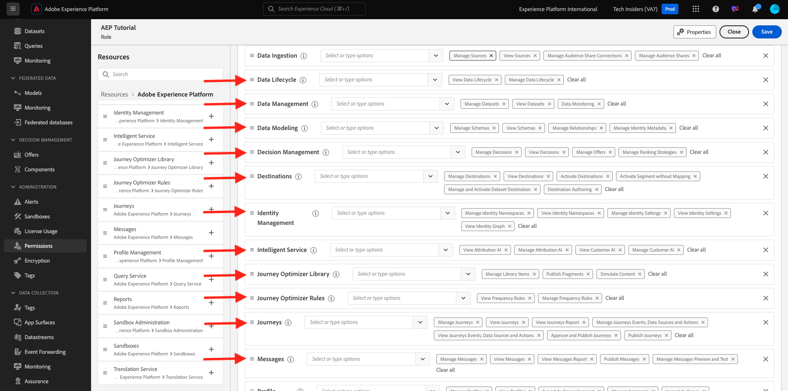
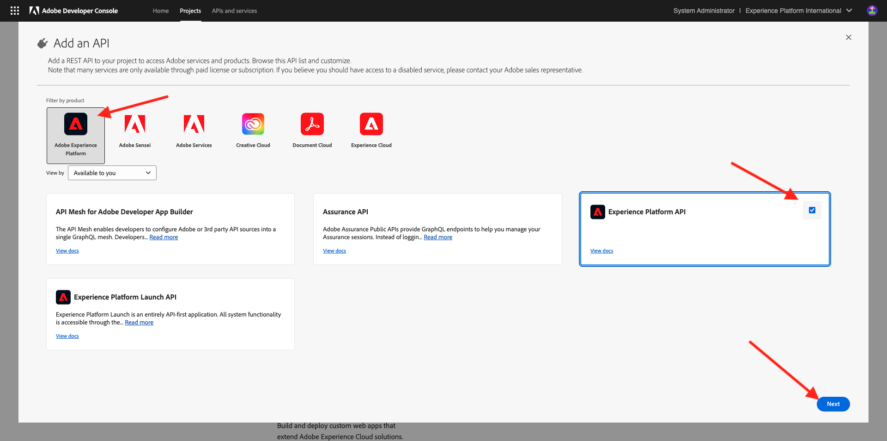
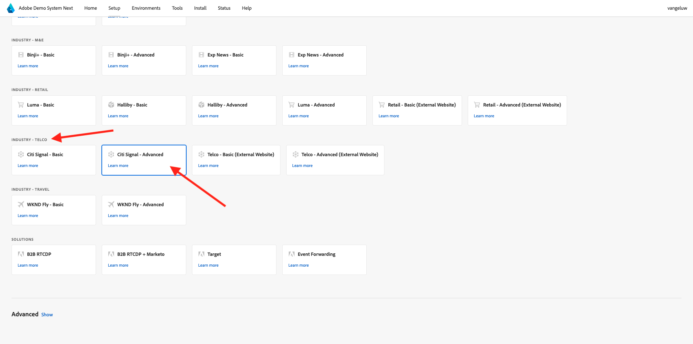

# Einrichten der Adobe Experience Platform-Instanz

>[!IMPORTANT]
>
>Diese Seite ist nur für Systemadministratorrollen vorgesehen. Sie benötigen Systemadministrator-Zugriffsrechte für Ihre spezifische Instanz, um die folgenden Schritte ausführen zu können. Wenn Sie kein Systemadministrator in Ihrer Adobe Experience Cloud-Organisation sind, wenden Sie sich an Ihren Systemadministrator und bitten Sie ihn um seine Genehmigung und Hilfe, bevor Sie mit einem der folgenden Schritte fortfahren.

## Übersicht

Um alle diese Tutorials praktisch nutzen zu können, müssen die folgenden Adobe Experience Cloud-Programme in Ihrer IMS-Organisation bereitgestellt werden:

- Adobe Real-Time CDP
- Adobe Experience Platform – Datenerfassung
- Adobe Journey Optimizer
- Customer Journey Analytics
- Data Distiller
- Komposition föderierter Zielgruppen

Wenn für Ihre IMS-Organisation kein bestimmter Programm-Service bereitgestellt wurde, können Sie diese spezifische Übung nicht praktisch durchführen.

## Erstellen einer Sandbox

Um das Tutorial in Ihrer eigenen Adobe Experience Platform-Instanz zu durchlaufen, empfiehlt es sich, zunächst eine neue Entwicklungs-Sandbox einzurichten. Um eine neue Sandbox zu erstellen, gehen Sie zu [https://experience.adobe.com/platform](https://experience.adobe.com/platform), gehen Sie zu Sandboxes und dann zu **Durchsuchen**. Klicken Sie **Sandbox erstellen**.

Erstellen Sie Ihre Sandbox wie folgt:

- Typ: **development**
- Name: **aep-tutorial**
- Titel: **Adobe Experience Platform-Tutorial**

Klicken Sie auf **Erstellen**.

Ihre Sandbox wird jetzt erstellt. Nach ein paar Minuten wirst du das sehen.

## Berechtigungen einrichten

Gehen Sie zu **Berechtigungen** und dann zu **Rollen**.

Klicken Sie hier, um die spezifische **Rolle** zu öffnen, die von den Lernenden verwendet wird, die dieses Tutorial durchlaufen. Klicken Sie **Rolle erstellen**.

Geben Sie Ihrer Rolle einen Namen wie **Adobe Experience Platform-Tutorial** und klicken Sie auf **Bestätigen**.

Wählen Sie im Dropdown **Menü** Sandboxes“ die soeben erstellte Sandbox aus und entfernen Sie alle anderen Sandboxes (auch &quot;**&quot;**).

Fügen Sie die verschiedenen Ressourcen hinzu und legen Sie Berechtigungen fest. Bitte stellen Sie sicher, dass Sie keine Berechtigungen für **Sandbox-Administration** hinzufügen.

Fügen Sie wie angegeben weitere Ressourcen hinzu und legen Sie Berechtigungen fest.

Fügen Sie wie angegeben weitere Ressourcen hinzu und legen Sie Berechtigungen fest. Klicken Sie auf **Speichern**. Klicken Sie dann auf **Schließen**.

## Adobe I/O einrichten

Gehe zu
[https://developer.adobe.com/console/integrations](https://developer.adobe.com/console/integrations). Stellen Sie sicher, dass Sie sich in der richtigen Instanz befinden. Klicken Sie **Neues Projekt erstellen**.

Klicken Sie auf **Zum Projekt hinzufügen** und dann auf **API**.

Klicken Sie auf **Adobe Experience Platform** und aktivieren Sie dann die **Experience Platform-API**. Klicken Sie auf **Weiter**.

Für den **Berechtigungsnamen** verwenden Sie das **DSN AEP-Tutorial**. Klicken Sie auf **Weiter**.

Wählen Sie eines der verfügbaren Produktprofile aus. Dieses Produktprofil bestimmt keine Berechtigungen für dieses Adobe I/O-Projekt. Dies wird in einem nächsten Schritt erfolgen. Klicken Sie auf **Konfigurierte API speichern**.

Klicken Sie **„Zum Projekt hinzufügen** und anschließend erneut **API**.

Klicken Sie auf **Adobe Experience Platform** und aktivieren Sie dann die **Experience Platform Launch-API**. Klicken Sie auf **Weiter**.

Klicken Sie auf **Weiter**.

Wählen Sie ein Produktprofil aus, das das Erstellen und Verwalten von Datenerfassungseigenschaften ermöglicht. Klicken Sie auf **Konfigurierte API speichern**.

Sie werden es dann sehen. Klicken Sie auf den Namen des **Projekt XXX**.

Klicken Sie **Projekt bearbeiten**.

Geben Sie einen neuen **Projekttitel** ein, z. B. **DSN Adobe Experience Platform-Tutorial**. Klicken Sie auf **Speichern**.

Ihr Adobe I/O-Projekt ist jetzt bereit.

## Adobe I/O-Projekt mit Rolle verknüpfen

Wechseln Sie zu **Berechtigungen**, zu **Rollen** und klicken Sie dann auf die neue Rolle, die Sie zuvor erstellt haben.

Navigieren Sie zu **API-Anmeldeinformationen**. Klicken Sie auf **+ API-Anmeldeinformationen hinzufügen**.

Anschließend werden die Adobe I/O-Anmeldedaten angezeigt, die Sie im vorherigen Schritt erstellt haben. Wählen Sie es aus und klicken Sie auf **Speichern**.

Ihr Adobe I/O-Projekt verfügt jetzt über die erforderlichen Berechtigungen, um auf Adobe Experience Platform-APIs zuzugreifen.

>[!IMPORTANT]
>
>Sie müssen mindestens 10 Minuten warten, bevor Sie mit den nächsten Schritten im Demo-System fortfahren.

## Einrichten der Umgebung im Demosystem Weiter

Navigieren Sie zu [https://dsn.adobe.com/tools/org-admin](https://dsn.adobe.com/tools/org-admin). Klicken Sie auf **+ Organisation**.

Füllen Sie die erforderlichen Felder aus:

- Kennung der IMS-Organisation
- Name
- Mandanten-ID (enthält keine **Unterstrich**)
- Region

Ihr Systemadministrator sollte Ihnen bei der Eingabe der Werte für diese Felder behilflich sein können.

Klicken Sie auf **Speichern**.

Ihre Umgebung wird jetzt in der Liste aufgeführt. Suchen Sie ihn in der Liste und klicken Sie auf das Symbol **Link**.

Nun müssen Sie die Werte eingeben, die Sie im Rahmen der Anmeldedaten für Ihr Adobe I/O-Projekt erstellt haben. Sie finden **Client-ID**, **Client-Geheimnis** und **Bereiche** hier:

**ID des technischen Kontos**:

Kopieren Sie diese hier und fügen Sie sie ein. Klicken Sie auf **Speichern**.

Ihre DSN-Umgebung ist jetzt korrekt eingerichtet.

## Einrichten des Zugriffs auf die DSN-Umgebung

Navigieren Sie zu [https://dsn.adobe.com/tools/environment-admin](https://dsn.adobe.com/tools/environment-admin). Wählen Sie die soeben erstellte IMS-Organisation aus, wählen Sie Ihre Benutzerin bzw. Ihren Benutzer aus und klicken Sie dann unter **Sandboxes** auf **+**.

Geben Sie den **Sandbox-Namen** ein, den Sie im ersten Schritt oben definiert haben. Er sollte wie folgt aussehen:

- Name: **aep-tutorial**

Klicken Sie auf **Bestätigen**.

Ihre Sandbox ist jetzt für den ausgewählten Benutzer verfügbar.

## DSN-Schnelleinrichtung

Navigieren Sie zu [https://dsn.adobe.com/quick-setup](https://dsn.adobe.com/quick-setup). Öffnen Sie das **Umgebung** Dropdown-Menü und wählen Sie Ihre IMS-Organisation/Sandbox aus.

Wählen **für** die Option **Global v2.0** aus.

Scrollen Sie nach unten zu **Branche - Telco** und wählen Sie **Citi Signal - Erweitert** aus.

Scrollen Sie nach oben und klicken Sie auf **Starten**.

Geben Sie einen **Titel** ein und klicken Sie auf **Starten**.

>[!NOTE]
>
>Es können Fehler auftreten, wenn keine standardmäßige Zusammenführungsrichtlinie in der Sandbox erstellt wurde. Warten Sie in diesem Fall entweder etwas länger, bis die Zusammenführungsrichtlinie automatisch erstellt wird, oder gehen Sie manuell zu Adobe Experience Platform, zu Profile > Zusammenführungsrichtlinien und erstellen Sie eine neue standardmäßige Zusammenführungsrichtlinie.

Sie sehen dann den Fortschritt der laufenden Installation, die einige Minuten dauern wird.

Sobald alles erfolgreich abgeschlossen ist, ist Ihre Adobe Experience Platform-Instanz erfolgreich konfiguriert und bereit für Lernende, das Tutorial zu absolvieren.

>[!NOTE]
>
>Der Schritt „Datenimport“ wird vom Tutorial nicht verwendet. Wenn dieser Schritt fehlschlägt, machen Sie sich keine Sorgen und setzen Sie den Vorgang fort.

Wechseln Sie zu [https://experience.adobe.com/platform](https://experience.adobe.com/platform), zu **Datensätze**. Es sollte nun eine ähnliche Liste von Datensätzen angezeigt werden, die alle durch die DSN-Schnelleinrichtung erstellt wurden.

>[!NOTE]
>
>Vielen Dank, dass Sie sich Zeit genommen haben, um alles über Adobe Experience Platform und seine Programme zu erfahren. Wenn Sie Fragen haben oder ein allgemeines Feedback zu künftigen Inhalten geben möchten, wenden Sie sich bitte direkt an Tech Insiders, indem Sie eine E-Mail an **techinsiders@adobe.com senden**.

{width="50px" align="left"}

>[!NOTE]
>
>Wenn Sie Fragen haben oder ein allgemeines Feedback zu künftigen Inhalten geben möchten, wenden Sie sich bitte direkt an Tech Insiders, indem Sie eine E-Mail an **techinsiders@adobe.com senden**.

[Zurück zu „Alle Module“](./overview.md)
