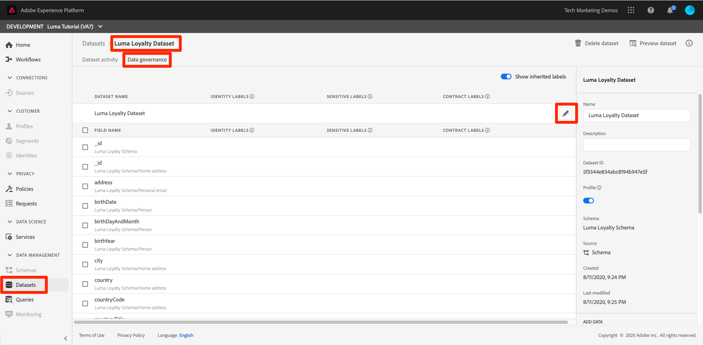

# Anwenden des Data Governance-Frameworks

<!--15min-->

In dieser Lektion wenden Sie das Data Governance-Framework auf die Daten an, die Sie in Ihre Sandbox aufgenommen haben.

Mit Data Governance in Adobe Experience Platform können Sie Kundendaten verwalten und bei der Verwendung von Daten die Einhaltung von Vorschriften, Einschränkungen und Richtlinien sicherstellen. Sie spielt in der Experience Platform auf verschiedenen Ebenen eine Schlüsselrolle, einschließlich der Steuerung der Datennutzung.

Bevor Sie mit den Übungen beginnen, sehen Sie sich diese kurzen Videos über Data Governance an:
>[!VIDEO](https://video.tv.adobe.com/v/36653?quality=12&learn=on)

>[!VIDEO](https://video.tv.adobe.com/v/29708?quality=12&learn=on)

<!--
## Permissions required

In the [Configure Permissions](configure-permissions.md) lesson, you set up all the access controls required to complete this lesson, specifically:

* Permission items **[!UICONTROL Data Governance]** > **[!UICONTROL Manage Usage Labels]**, **[!UICONTROL Manage Data Usage Policies]** and **[!UICONTROL View Data Usage Policies]**
* Permission items **[!UICONTROL Data Management]** > **[!UICONTROL View Datasets]** and **[!UICONTROL Manage Datasets]**
* Permission item **[!UICONTROL Sandboxes]** > `Luma Tutorial`
* User-role access to the `Luma Tutorial Platform` Product Profile
-->

## Geschäftsszenario

Luma verspricht Mitgliedern seines Treueprogramms, dass Treuedaten nicht an Dritte weitergegeben werden. Wir werden dieses Szenario im Rest der Lektion umsetzen.

## Data Governance-Beschriftungen anwenden

Der erste Schritt im Data Governance-Prozess besteht darin, Governance-Beschriftungen auf Ihre Daten anzuwenden. Bevor wir dies tun, schauen wir uns kurz an, welche Beschriftungen verfügbar sind:

1. Wählen Sie in der Benutzeroberfläche von Platform die Option **[!UICONTROL Richtlinien]** in der linken Navigation
1. Navigieren Sie zu **[!UICONTROL Bezeichnungen]** um alle Bezeichnungen im Konto anzuzeigen.

Es gibt viele native Beschriftungen. Zusätzlich können Sie Ihre eigenen über die [!UICONTROL Titel erstellen] Schaltfläche. Es gibt drei Haupttypen: [!UICONTROL Vertragsbezeichnungen], [!UICONTROL Identitätsbezeichnungen]und [!UICONTROL Vertrauliche Beschriftungen] die häufig Ursachen für Dateneinschränkungen entsprechen. Jede Bezeichnung verfügt über eine [!UICONTROL Anzeigename] und eine kurze [!UICONTROL Name] ist nur eine Abkürzung des Typs und einer Zahl. Beispiel: die [!DNL C1] Der Titel ist für &quot;Kein Export durch Dritte&quot; bestimmt, was wir für unsere Loyalitätspolitik brauchen.

Jetzt ist es an der Zeit, die Daten zu kennzeichnen, deren Nutzung wir beschränken möchten:

1. Wählen Sie in der Benutzeroberfläche von Platform die Option **[!UICONTROL Datensätze]** in der linken Navigation
1. Öffnen Sie `Luma Loyalty Dataset`
1. Navigieren Sie zu **[!UICONTROL Data Governance]** tab
1. Sie können entweder Bezeichnungen auf einzelne Felder anwenden oder sie auf den gesamten Datensatz anwenden. Wir wenden die Bezeichnung auf den gesamten Datensatz an. Klicken Sie auf das Stiftsymbol. Wenn das Symbol nicht angezeigt wird, versuchen Sie, den Browser zu erweitern oder scrollen Sie im mittleren Bereich nach rechts.
   
1. Erweitern Sie im Modal die **[!UICONTROL Vertragsbezeichnungen]** und überprüfen Sie die **[!UICONTROL C2]** label
1. Wählen Sie die **[!UICONTROL Änderungen speichern]** button
   
1. Zurück zum Haupt [!UICONTROL Data Governance] mit dem **[!UICONTROL Vererbte Beschriftungen anzeigen]** aktivieren, können Sie sehen, wie die Beschriftung auf alle Felder im Datensatz angewendet wurde.
   

<!--adding extra, unnecessary fields from field groups makes it harder to see which fields really need labels-->
<!--Are there any best practices for applying governance labels-->

## Data Governance-Richtlinien erstellen

Nachdem unsere Daten jetzt gekennzeichnet sind, können wir eine Richtlinie erstellen.

1. Wählen Sie in der Benutzeroberfläche von Platform die Option **[!UICONTROL Richtlinien]** in der linken Navigation
1. Auf der Registerkarte Durchsuchen gibt es bereits eine vordefinierte Richtlinie namens &quot;Exportbeschränkung von Drittanbietern&quot;, die die Bezeichnung C2 mit der Marketing-Aktion verknüpft [!UICONTROL Export in Dritte]—genau was wir brauchen!
1. Wählen Sie die Richtlinie aus und aktivieren Sie sie dann über die **[!UICONTROL Richtlinienstatus]** Umschalten
   

Sie können Ihre eigenen Richtlinien erstellen, indem Sie die **[!UICONTROL Richtlinie erstellen]** Schaltfläche. Dadurch wird ein Assistent geöffnet, mit dem Sie mehrere Bezeichnungen und Einschränkungen von Marketing-Aktionen kombinieren können.

## Durchsetzung von Governance-Strategien

Die Durchsetzung von Governance-Strategien ist offensichtlich ein Schlüsselelement des Rahmens. Die Durchsetzung erfolgt nachgelagert, wenn Daten aktiviert und von Platform gesendet werden, insbesondere mit der Real-time Customer Data Platform, für die Sie möglicherweise eine Lizenzierung vornehmen oder nicht. In jedem Fall ist es nicht im Rahmen dieses Tutorials. Aber damit Sie nicht hängen gelassen werden, können Sie mehr darüber erfahren, wie Richtlinien in diesem Video durchgesetzt werden, das ich bis zum relevanten Teil in die Warteschlange gestellt habe. Sie zeigt Ihnen auch, was passiert, wenn eine Richtlinie verletzt wird.

>[!VIDEO](https://video.tv.adobe.com/v/33631/?t=151&quality=12&learn=on)

## Weitere Ressourcen

* [Data Governance-Dokumentation](https://experienceleague.adobe.com/docs/experience-platform/data-governance/home.html?lang=de)
* [Referenz zur DataSet Service-API](https://www.adobe.io/experience-platform-apis/references/dataset-service/)
* [Referenz zur Governance Policy Service-API](https://www.adobe.io/experience-platform-apis/references/policy-service/)

Gehen wir nun zu [Abfragedienst](run-queries.md).
