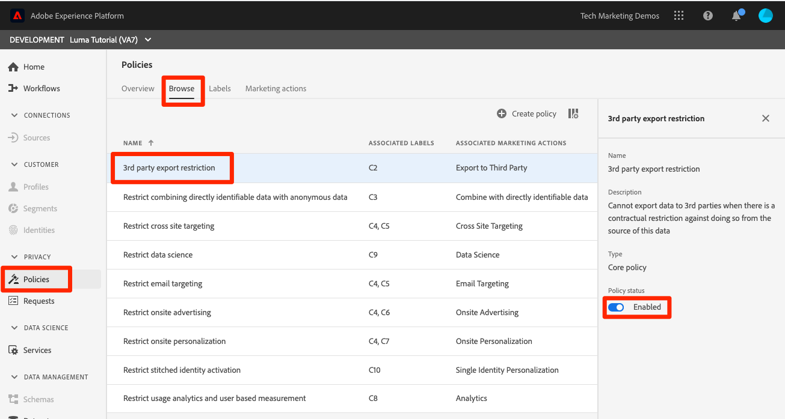

# Anwendung des Data Governance-Frameworks

<!--15min-->

In dieser Lektion wenden Sie das Data Governance-Framework auf die Daten an, die Sie in Ihre Sandbox aufgenommen haben.

Mit Data Governance in Adobe Experience Platform können Sie Kundendaten verwalten und bei der Verwendung von Daten die Einhaltung von Vorschriften, Einschränkungen und Richtlinien sicherstellen. Die Funktion spielt in Experience Platform auf verschiedenen Ebenen eine wichtige Rolle, u. a. bei der Steuerung der Datennutzung.

Bevor Sie mit den Übungen beginnen, sehen Sie sich diese kurzen Videos über Data Governance an:
>[!VIDEO](https://video.tv.adobe.com/v/36653?learn=on)

>[!VIDEO](https://video.tv.adobe.com/v/29708?learn=on)

<!--
## Permissions required

In the [Configure Permissions](configure-permissions.md) lesson, you set up all the access controls required to complete this lesson, specifically:

* Permission items **[!UICONTROL Data Governance]** > **[!UICONTROL Manage Usage Labels]**, **[!UICONTROL Manage Data Usage Policies]** and **[!UICONTROL View Data Usage Policies]**
* Permission items **[!UICONTROL Data Management]** > **[!UICONTROL View Datasets]** and **[!UICONTROL Manage Datasets]**
* Permission item **[!UICONTROL Sandboxes]** > `Luma Tutorial`
* User-role access to the `Luma Tutorial Platform` Product Profile
-->

## Geschäftsszenario

Luma verspricht den Mitgliedern seines Treueprogramms, dass Treuedaten nicht an Dritte weitergegeben werden. Wir werden dieses Szenario im weiteren Verlauf der Lektion implementieren.

## Anwenden von Data Governance-Kennzeichnungen

Der erste Schritt im Data Governance-Prozess besteht darin, Governance-Kennzeichnungen auf Ihre Daten anzuwenden. Bevor wir dies tun, werfen wir einen kurzen Blick darauf, welche Kennzeichnungen verfügbar sind:

1. Wählen Sie in der Platform-Benutzeroberfläche **[!UICONTROL Richtlinien]** im linken Navigationsbereich aus
1. Gehen Sie zur Registerkarte **[!UICONTROL Bezeichnungen]**, um alle Bezeichnungen im Konto anzuzeigen.

Es gibt viele standardmäßige Kennzeichnungen. Sie können darüber hinaus auch eigene über die Schaltfläche [!UICONTROL Kennzeichnung erstellen] erstellen. Es gibt drei Haupttypen: [!UICONTROL Vertragskennzeichnungen], [!UICONTROL Identitätskennzeichnungen] und [!UICONTROL Sensitivitätskennzeichnungen] die häufigen Gründen entsprechen, dass Daten möglicherweise eingeschränkt werden. Jede der Kennzeichnungen hat einen [!UICONTROL Anzeigenamen] und eine kurze [!UICONTROL Name], die nur eine Abkürzung für den Typ und eine Zahl ist. Beispielsweise ist die [!DNL C1] für „Kein Export von Drittanbietern“, was wir für unsere Treuepolitik benötigen.

Jetzt ist es an der Zeit, die Daten zu kennzeichnen, deren Verwendung beschränkt werden soll:

1. Wählen Sie in der Platform-Benutzeroberfläche **[!UICONTROL Datensätze]** im linken Navigationsbereich aus
1. `Luma Loyalty Dataset` öffnen
1. Wechseln Sie zur Registerkarte **[!UICONTROL Data Governance]**
1. Sie können Kennzeichnungen entweder auf einzelne Felder anwenden oder sie auf den gesamten Datensatz anwenden. Wir wenden die Kennzeichnung auf den gesamten Datensatz an. Klicken Sie auf das Stiftsymbol. Wenn das Symbol nicht angezeigt wird, versuchen Sie, den Browser breiter zu gestalten oder das mittlere Bedienfeld nach rechts zu scrollen.
   
1. Erweitern Sie im modalen Fenster den Abschnitt **[!UICONTROL Vertrags-Kennzeichnungen]** und überprüfen Sie die **[!UICONTROL C2]**-Kennzeichnung
1. Klicken Sie auf **[!UICONTROL Schaltfläche]**Änderungen speichern“
   
1. Wenn Sie zum Hauptbildschirm [!UICONTROL Data Governance] mit dem **[!UICONTROL Übernommene Kennzeichnungen anzeigen]** zurückkehren, können Sie sehen, wie die Kennzeichnung auf alle Felder im Datensatz angewendet wurde.
   

<!--adding extra, unnecessary fields from field groups makes it harder to see which fields really need labels-->
<!--Are there any best practices for applying governance labels-->

## Erstellen von Data Governance-Richtlinien

Nachdem unsere Daten nun gekennzeichnet sind, können wir eine Richtlinie erstellen.

1. Wählen Sie in der Platform-Benutzeroberfläche **[!UICONTROL Richtlinien]** im linken Navigationsbereich aus
1. Auf der Registerkarte Durchsuchen gibt es bereits eine vorkonfigurierte Richtlinie mit der Bezeichnung „Exportbeschränkung von Drittanbietern“, die die Kennzeichnung C2 mit der Marketing-Aktion [!UICONTROL Export in Dritte] verknüpft - genau das, was wir benötigen!
1. Wählen Sie die Richtlinie aus und aktivieren Sie sie dann über den Umschalter **[!UICONTROL Richtlinienstatus]** .
   

Sie können Ihre eigenen Richtlinien erstellen, indem Sie auf die Schaltfläche **[!UICONTROL Richtlinie erstellen]** klicken. Dadurch wird ein Assistent geöffnet, mit dem Sie mehrere Bezeichnungen und Einschränkungen für Marketing-Aktionen kombinieren können.

## Durchsetzung von Governance-Richtlinien

Die Durchsetzung der Governance-Politik ist offensichtlich ein Schlüsselelement des Rahmens. Die Durchsetzung erfolgt nachgelagert, wenn Daten aktiviert und aus Platform heraus gesendet werden, insbesondere mit der Real-time Customer Data Platform, die Sie möglicherweise lizenzieren oder nicht. In beiden Fällen ist dies nicht Gegenstand dieses Tutorials. Aber damit Sie nicht hängen bleiben, können Sie mehr darüber erfahren, wie Richtlinien durchgesetzt werden in diesem Video, das ich in die Warteschlange gestellt habe, um den entsprechenden Teil. Außerdem erfahren Sie, was passiert, wenn eine Richtlinie verletzt wird.

>[!VIDEO](https://video.tv.adobe.com/v/33631/?t=151&quality=12&learn=on)

## Weitere Ressourcen

* [Dokumentation zu Data Governance](https://experienceleague.adobe.com/docs/experience-platform/data-governance/home.html?lang=de)
* [Referenz zur Datensatz-Service-API](https://www.adobe.io/experience-platform-apis/references/dataset-service/)
* [Governance Policy Service API-Referenz](https://www.adobe.io/experience-platform-apis/references/policy-service/)

Gehen wir nun zum [Abfrage-Service](run-queries.md).
