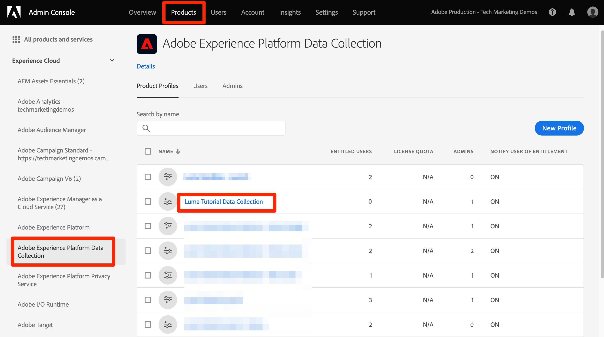
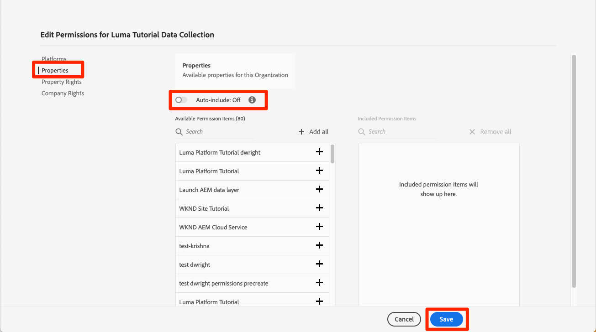

# Berechtigungen konfigurieren

<!--30min-->

In dieser Lektion konfigurieren Sie Benutzerberechtigungen für Adobe Experience Platform mithilfe von [!DNL Adobe's Admin Console] und dem Bildschirm [!UICONTROL Berechtigungen] in der Platform-Benutzeroberfläche.

Die Zugriffssteuerung ist eine wichtige Datenschutzfunktion beim Experience Platform. Wir empfehlen, die Berechtigungen auf das Minimum zu beschränken, das erforderlich ist, damit Benutzer ihre Aufgaben ausführen können. Weitere Informationen finden [ in der ](https://experienceleague.adobe.com/docs/experience-platform/access-control/home.html?lang=de) zur Zugriffssteuerung .

Datenarchitekten und Dateningenieure sind erfahrene Benutzer von Adobe Experience Platform und Sie benötigen viele Berechtigungen, um dieses Tutorial und später in Ihrer täglichen Arbeit abzuschließen. Datenarchitekten sind wahrscheinlich an der Verwaltung von *anderen Platform-Benutzern* in ihrem Unternehmen beteiligt, z. B. Marketing-Experten, Analysten und Datenwissenschaftler. Wenn Sie diese Lektion abgeschlossen haben, sollten Sie darüber nachdenken, wie Sie diese Funktionen verwenden können, um andere Benutzer in Ihrem Unternehmen zu verwalten.

**Datenarchitekten** konfigurieren häufig Berechtigungen für andere Benutzer außerhalb dieses Tutorials.

>[!IMPORTANT]
>
>Ein Systemadministrator von Adobe Experience Cloud-Produkten muss einige der Schritte in dieser Lektion ausführen, die in den Abschnittsüberschriften ausgeführt wird. Wenn Sie kein Systemadministrator sind, wenden Sie sich an einen Systemadministrator in Ihrem Unternehmen und bitten Sie ihn, diese Aufgaben durchzuführen. Es gibt auch eine Aufgabe, die sie während der Lektion [Einrichten von Developer Console und Postman&quot; ](set-up-developer-console-and-postman.md) müssen.

## Über die Admin Console

Die [!DNL Admin Console] ist die Benutzeroberfläche, die verwendet wird, um den Benutzerzugriff auf alle Adobe Experience Cloud-Produkte zu verwalten. Für den Zugriff auf Platform müssen Benutzende oder in der Admin Console hinzugefügt werden. Anschließend werden alle ihre granularen Berechtigungselemente im Bildschirm „Berechtigungen“ von Adobe Experience Platform verwaltet.

Im Folgenden finden Sie eine kurze Zusammenfassung der Rollen, die für Platform vorhanden sind:

* **Benutzer** eines Produktprofils können Aufgaben in der Benutzeroberfläche von Platform entsprechend den im Produktprofil zugewiesenen Berechtigungen ausführen.
* **Entwickler** können API-Anmeldeinformationen und Projekte in der Adobe Developer Console erstellen, um mit der Verwendung der Experience Platform-API zu beginnen
* **Produktadministratoren** können dem Adobe Experience Platform-Produkt in der Adobe Admin Console Benutzer und Entwickler hinzufügen sowie den granularen Benutzerzugriff im Bildschirm „Berechtigungen“ der Platform-Benutzeroberfläche verwalten.
* **Systemadministratoren** können Produktadministratoren hinzufügen und im Wesentlichen alle Berechtigungen für alle Adobe Experience Cloud-Produkte verwalten.

## Hinzufügen eines Benutzers und Entwicklers zum `AEP-Default-All-Users` Produktprofil (erfordert einen Systemadministrator oder Produktadministrator)

In dieser Übung fügen Sie oder ein System- oder Produktadministrator Sie als Benutzer und Entwickler zum Adobe Experience Platform-Produkt der Adobe Admin Console hinzu.

>[!NOTE]
>
>Wenn Sie als Systemadministrator einem Kollegen bei diesem Tutorial helfen, sollten Sie Ihre Kollegin als *Produktadministrator)* Adobe Experience Platform hinzufügen. Als Produkt-Administrator wären sie in der Lage, diese Schritte selbstständig auszuführen und andere Experience Platform-Benutzer in Zukunft zu verwalten.

So fügen Sie den Tutorial-Teilnehmer als [!UICONTROL Benutzer] und [!UICONTROL Entwickler] hinzu:

1. Melden Sie sich bei der [Adobe Admin Console ](https://adminconsole.adobe.com)
1. Wählen Sie **[!UICONTROL Produkte]** in der oberen Navigationsleiste aus.
1. **Adobe Experience Platform**
   
1. Möglicherweise haben Sie bereits mehrere Profile in Ihrer Experience Platform-Instanz. `AEP-Default-All-Users` auswählen
   

1. Wechseln Sie zur Registerkarte **[!UICONTROL Benutzer]**
1. Klicken Sie auf **[!UICONTROL Schaltfläche „Benutzer hinzufügen]**.
   
1. Schließen Sie den Workflow ab, um den Teilnehmer des Tutorials als Benutzer zum Produktprofil hinzuzufügen

1. Wechseln Sie zur Registerkarte **[!UICONTROL Entwickler]**
1. Klicken Sie auf **[!UICONTROL Schaltfläche „Entwickler hinzufügen]**
   
1. Schließen Sie den Workflow ab, um den Tutorial-Teilnehmer als Entwickler bzw. Entwicklerin zum Produktprofil hinzuzufügen

## Eine Rolle in Adobe Experience Platform hinzufügen (erfordert einen System- oder Produktadministrator)

Granulare Berechtigungen zum Experience Platform werden im Bildschirm Berechtigungen der Platform-Benutzeroberfläche verwaltet. Nur System- und Produktadministratoren haben Zugriff auf diesen Bildschirm. Wenn Sie also keine Administratorrechte haben, benötigen Sie die Hilfe einer Person, die über Administratorrechte verfügt.

Berechtigungen werden in Rollen verwaltet. Erstellen Sie eine Rolle für das Tutorial:

1. Anmelden bei [Adobe Experience Platform](https://platform.adobe.com)
1. Wählen Sie **[!UICONTROL linken Navigationsbereich]** Berechtigungen“ aus, um zum Bildschirm [!UICONTROL Rollen] zu gelangen
1. Wählen Sie **[!UICONTROL Rolle erstellen]**

   
1. Benennen Sie die Rolle `Luma Tutorial Platform` (fügen Sie den Namen des Tutorial-Teilnehmers am Ende hinzu, wenn mehrere Personen in Ihrem Unternehmen an diesem Tutorial teilnehmen) und wählen Sie **[!UICONTROL Bestätigen]**

   

1. Fügen Sie mithilfe von **[!UICONTROL +]** und „Alle hinzufügen“ alle Berechtigungselemente für **[!UICONTROL folgenden Ressourcen]**:

   1. Datenmodellierung
   1. Daten-Management
   1. Profilverwaltung
   1. Identity Management
   1. Sandbox-Verwaltung
   1. Abfrage-Service
   1. Datenerfassung
   1. Data Governance
   1. Dashboards
   1. Warnhinweise

      

1. Fügen Sie unter Datenaufnahme die Berechtigungselemente Quellen verwalten und Quellen anzeigen hinzu.

1. Nachdem Sie alle Berechtigungselemente hinzugefügt haben, klicken Sie unbedingt auf die Schaltfläche Speichern .
   

Developer Console Nach den Lektionen [Erstellen einer Sandbox“ und „Einrichten von ](create-a-sandbox.md) und Postman&quot; [ Sie diese Rolle ](set-up-developer-console-and-postman.md).

## Erstellen eines Datenerfassungs-Produktprofils (erfordert einen Systemadministrator oder Produktadministrator)

In dieser Übung erstellen Sie selbst oder ein Systemadministrator in Ihrem Unternehmen ein Produktprofil für die Datenerfassung (ehemals Adobe Experience Platform Launch) und fügen Sie als Produktprofiladministrator hinzu.

>[!NOTE]
>
>Wenn Sie als Systemadministrator einem Kollegen bei diesem Tutorial helfen, sollten Sie ihn als *Produktadministrator* für die Datenerfassung hinzufügen. Als Produktadministrator können sie diese Schritte selbstständig ausführen und andere Benutzer der Datenerfassung in Zukunft verwalten.

So erstellen Sie das Produktprofil:

1. Wechseln Sie in der [!DNL Adobe Admin Console] zum Produkt Adobe Experience Platform-Datenerfassung .
1. Fügen Sie ein neues Profil mit dem Namen `Luma Tutorial Data Collection` hinzu (fügen Sie am Ende den Namen des Tutorial-Teilnehmers hinzu, wenn mehrere Personen in Ihrem Unternehmen an diesem Tutorial teilnehmen)
1. Deaktivieren Sie die Einstellung **[!UICONTROL Eigenschaften]** > **[!UICONTROL Auto-include]**.
1. Weisen Sie derzeit keine Eigenschaften oder Berechtigungen zu
1. Tutorial-Teilnehmer als Administrator dieses Profils hinzufügen

Nachdem Sie diese Schritte abgeschlossen haben, sollten Sie sehen, dass das `Luma Tutorial Data Collection` mit einem Administrator eingerichtet wurde.

## Konfigurieren des Datenerfassungs-Produktprofils

Da Sie jetzt Administrator des Produktprofils `Luma Tutorial Data Collection` sind, können Sie die Berechtigungen und Rollen konfigurieren, die Sie zum Absolvieren des Tutorials benötigen.

### Hinzufügen von Berechtigungen

Jetzt fügen Sie die einzelnen Berechtigungselemente zum Profil hinzu:

1. Adobe Admin Console Navigieren Sie in der ](https://adminconsole.adobe.com) [zu **[!UICONTROL Produkte]** > **[!UICONTROL Datenerfassung]**
1. `Luma Tutorial Data Collection` öffnen
1. Navigieren Sie zur Registerkarte **[!UICONTROL Berechtigungen]** .
1. Öffnen Sie **[!UICONTROL Plattformen]**
1. Stellen Sie sicher, dass alle verfügbaren Plattformen ausgewählt sind (je nach Ihrer Lizenz werden möglicherweise unterschiedliche Optionen angezeigt)
1. **[!UICONTROL Speichern]** alle Änderungen
   
1. Öffnen Sie **[!UICONTROL Eigenschaften]**
1. Stellen Sie sicher **[!UICONTROL dass der Umschalter]** Automatisch einschließen“ deaktiviert ist, sodass Sie keinen Zugriff auf Eigenschaften haben (wir fügen später eine hinzu)
1. **[!UICONTROL Speichern]** alle Änderungen
   
1. Öffnen Sie **[!UICONTROL Eigenschaftsrechte]**
1. Wählen **[!UICONTROL Alle hinzufügen]**, um alle Eigenschaftsberechtigungen hinzuzufügen
1. **[!UICONTROL Speichern]**
   
1. Öffnen Sie **[!UICONTROL Unternehmensrechte]**
1. Hinzufügen **[!UICONTROL Eigenschaften verwalten]**
1. Wählen Sie **[!UICONTROL Speichern]**
   

### Selbst als Benutzer hinzufügen

Fügen Sie sich jetzt als Benutzer dem Datenerfassungsprofil hinzu:

1. Wechseln Sie zur Registerkarte **[!UICONTROL Benutzer]**
1. Klicken Sie auf **[!UICONTROL Schaltfläche „Benutzer hinzufügen]**.
   
1. Schließen Sie den Workflow ab, um sich selbst als Benutzer zum Produktprofil hinzuzufügen

Sie müssen sich nicht selbst als Entwickler für die Datenerfassung hinzufügen.

Jetzt verfügen Sie über fast alle Berechtigungen, die zum Abschließen des Tutorials erforderlich sind! Es gibt nur zwei weitere Anpassungen, die Sie im [!DNL Adobe Admin Console] vornehmen werden, einschließlich einer nach dem [Erstellen einer Sandbox](create-a-sandbox.md).
