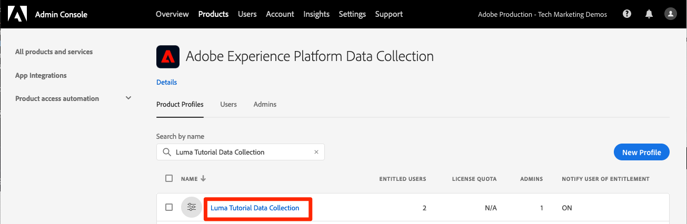

# Berechtigungen konfigurieren

<!--30min-->

In dieser Lektion konfigurieren Sie Adobe Experience Platform-Benutzerberechtigungen mit [!DNL Adobe's Admin Console] und dem Bildschirm [!UICONTROL Berechtigungen] in der Platform-Oberfläche.

Die Zugriffskontrolle ist eine wichtige Datenschutzfunktion im Experience Platform. Wir empfehlen, die Berechtigungen auf das für die Ausführung der Auftragsfunktionen erforderliche Minimum zu beschränken. Weitere Informationen finden Sie in der Dokumentation zur Zugriffssteuerung [1} .](https://experienceleague.adobe.com/docs/experience-platform/access-control/home.html?lang=de)

Datenarchitekten und Dateningenieure sind leistungsstarke Benutzer von Adobe Experience Platform und Sie benötigen viele Berechtigungen, um dieses Tutorial und später in Ihrer täglichen Arbeit abzuschließen. Datenarchitekten sind wahrscheinlich an der Verwaltung von *anderen Platform-Benutzern* in ihrem Unternehmen beteiligt, z. B. Marketingexperten, Analysten und Datenwissenschaftler. Überlegen Sie sich, wie Sie diese Funktionen zur Verwaltung anderer Benutzer in Ihrem Unternehmen verwenden können, während Sie diese Lektion abschließen.

**Datenarchitekten** konfigurieren häufig Berechtigungen für andere Benutzer außerhalb dieses Tutorials.

>[!IMPORTANT]
>
>Ein Systemadministrator von Adobe Experience Cloud-Produkten muss einige der Schritte in dieser Lektion ausführen, die in den Abschnittsüberschriften beschrieben wird. Wenn Sie kein Systemadministrator sind, wenden Sie sich an einen Mitarbeiter in Ihrem Unternehmen und bitten Sie ihn, diese Aufgaben auszuführen. Es gibt auch eine Aufgabe, die sie während der Lektion [Developer Console und Postman einrichten](set-up-developer-console-and-postman.md) abschließen müssen.

## Über die Admin Console

Der [!DNL Admin Console] ist die Oberfläche, über die der Benutzerzugriff auf alle Adobe Experience Cloud-Produkte verwaltet wird. Für den Zugriff auf Platform müssen Benutzer oder der Admin Console hinzugefügt werden. Anschließend werden alle detaillierten Berechtigungselemente im Bildschirm &quot;Berechtigungen&quot;von Adobe Experience Platform verwaltet.

Im Folgenden finden Sie eine kurze Zusammenfassung der Rollen, die für Platform vorhanden sind:

* **Benutzer** eines Produktprofils können Aufgaben in der Benutzeroberfläche von Platform entsprechend den im Produktprofil zugewiesenen Berechtigungen ausführen.
* **Entwickler** können API-Anmeldeinformationen und -Projekte in der Adobe Developer Console erstellen, um mit der Verwendung der Experience Platform-API zu beginnen
* **Produktadministratoren** können Benutzer und Entwickler zum Adobe Experience Platform-Produkt in der Adobe Admin Console hinzufügen und granularen Benutzerzugriff über den Bildschirm &quot;Berechtigungen&quot;der Platform-Oberfläche verwalten.
* **Systemadministratoren** können Produktadministratoren hinzufügen und im Wesentlichen alle Berechtigungen für alle Adobe Experience Cloud-Produkte verwalten.

## Fügen Sie einen Benutzer und Entwickler zum `AEP-Default-All-Users` -Produktprofil hinzu (erfordert einen Systemadministrator oder einen Produktadministrator).

In dieser Übung fügen Sie als Systemadministrator oder Produktadministrator Sie als Benutzer und Entwickler zum Adobe Experience Platform-Produkt von Adobe Admin Console hinzu.

>[!NOTE]
>
>Wenn Sie ein Systemadministrator sind, der einem Kollegen bei diesem Tutorial hilft, sollten Sie erwägen, Ihren Kollegen als *Produktadministrator* für Adobe Experience Platform hinzuzufügen. Als Produktadministrator könnten sie diese Schritte selbst durchführen und in Zukunft andere Experience Platform-Benutzer verwalten.

So fügen Sie den Tutorial-Teilnehmer als [!UICONTROL Benutzer] und [!UICONTROL Entwickler] hinzu:

1. Anmelden bei [Adobe Admin Console](https://adminconsole.adobe.com)
1. Wählen Sie **[!UICONTROL Produkte]** in der oberen Navigation aus.
1. Wählen Sie **Adobe Experience Platform**
   
1. Sie können bereits mehrere Profile in Ihrer Experience Platform-Instanz haben. Profil `AEP-Default-All-Users` auswählen
   

1. Navigieren Sie zur Registerkarte **[!UICONTROL Benutzer]** .
1. Wählen Sie die Schaltfläche **[!UICONTROL Benutzer hinzufügen]** aus.
   
1. Schließen Sie den Workflow ab, um den Tutorial-Teilnehmer als Benutzer zum Produktprofil hinzuzufügen.

1. Navigieren Sie zur Registerkarte **[!UICONTROL Entwickler]** .
1. Wählen Sie die Schaltfläche **[!UICONTROL Entwickler hinzufügen]** aus
   
1. Schließen Sie den Workflow ab, um den Tutorial-Teilnehmer als Entwickler zum Produktprofil hinzuzufügen.

## Eine Rolle in Adobe Experience Platform hinzufügen (Systemadministrator oder Produktadministrator erforderlich)

Die detaillierten Berechtigungen für Experience Platform werden im Bildschirm &quot;Berechtigungen&quot;der Platform-Oberfläche verwaltet. Nur System- und Produktadministratoren haben Zugriff auf diesen Bildschirm. Wenn Sie also keine Administratorrechte haben, benötigen Sie Hilfe von jemandem, der dies tut.

Berechtigungen werden in Rollen verwaltet. Erstellen Sie eine Rolle für das Tutorial:

1. Anmelden bei [Adobe Experience Platform](https://platform.adobe.com)
1. Wählen Sie **[!UICONTROL Berechtigungen]** im linken Navigationsbereich aus, der Sie zum Bildschirm [!UICONTROL Rollen] führt.
1. Wählen Sie **[!UICONTROL Rolle erstellen]**

   
1. Nennen Sie die Rolle &quot;`Luma Tutorial Platform`&quot;(fügen Sie dem Ende den Namen des Tutorial-Teilnehmers hinzu, wenn mehrere Personen aus Ihrem Unternehmen dieses Tutorial absolvieren) und wählen Sie &quot;**[!UICONTROL Bestätigen]**&quot;.

   

1. Fügen Sie alle Berechtigungselemente für die folgenden Ressourcen mit **[!UICONTROL +]** und **[!UICONTROL Alle hinzufügen]** hinzu:

   1. Datenmodellierung
   1. Daten-Management
   1. Profilverwaltung
   1. Identity Management
   1. Sandbox-Verwaltung
   1. Abfrage-Service
   1. Datenerfassung
   1. Data Governance
   1. Dashboards
   1. Warnhinweise

      

1. Fügen Sie unter Datenerfassung die Berechtigungselemente Quellen verwalten und Quellen anzeigen hinzu.

1. Nachdem Sie alle Berechtigungselemente hinzugefügt haben, klicken Sie auf die Schaltfläche Speichern .
   

Nach den Lektionen [Sandbox erstellen](create-a-sandbox.md) und [Developer Console und Postman einrichten](set-up-developer-console-and-postman.md) nehmen Sie einige kleine Aktualisierungen an dieser Rolle vor.

## Erstellen eines Datenerfassungs-Produktprofils (erfordert einen Systemadministrator oder einen Produktadministrator)

In dieser Übung erstellen Sie oder ein Systemadministrator in Ihrem Unternehmen ein Produktprofil für die Datenerfassung (ehemals Adobe Experience Platform Launch) und fügen Sie Sie als Produktprofiladministrator hinzu.

>[!NOTE]
>
>Wenn Sie ein Systemadministrator sind, der einen Kollegen bei diesem Tutorial unterstützt, sollten Sie ihn als *Produktadministrator* für die Datenerfassung hinzufügen. Als Produkt-Administrator können sie diese Schritte selbst durchführen und in Zukunft andere Benutzer der Datenerfassung verwalten.

So erstellen Sie das Produktprofil:

1. Wechseln Sie in &quot;[!DNL Adobe Admin Console]&quot;zum Adobe Experience Platform-Datenerfassungsprodukt.
1. Fügen Sie ein neues Profil mit dem Namen `Luma Tutorial Data Collection` hinzu (fügen Sie am Ende den Namen des Tutorial-Teilnehmers hinzu, wenn mehrere Personen aus Ihrem Unternehmen dieses Tutorial absolvieren)
1. Deaktivieren Sie die Einstellung **[!UICONTROL Eigenschaften]** > **[!UICONTROL Auto-Include]** .
1. Weisen Sie zu diesem Zeitpunkt keine Eigenschaften oder Berechtigungen zu
1. Hinzufügen des Tutorial-Teilnehmers als Administrator dieses Profils

Nachdem Sie diese Schritte ausgeführt haben, sollten Sie sehen, dass das `Luma Tutorial Data Collection` -Profil mit einem Administrator eingerichtet ist.

## Konfigurieren des Datenerfassungs-Produktprofils

Nachdem Sie nun Administrator des `Luma Tutorial Data Collection` -Produktprofils sind, können Sie die Berechtigungen und Rollen konfigurieren, die Sie zum Abschluss des Tutorials benötigen.

### Hinzufügen von Berechtigungen

Nun fügen Sie dem Profil die einzelnen Berechtigungselemente hinzu:

1. Wechseln Sie in der [Adobe Admin Console](https://adminconsole.adobe.com) zu **[!UICONTROL Products]** > **[!UICONTROL Datenerfassung]** .
1. Öffnen Sie das Profil `Luma Tutorial Data Collection` .
1. Navigieren Sie zur Registerkarte **[!UICONTROL Berechtigungen]** .
1. Öffnen Sie **[!UICONTROL Plattformen]** .
1. Stellen Sie sicher, dass alle verfügbaren Plattformen ausgewählt sind (je nach Lizenz werden Ihnen möglicherweise unterschiedliche Optionen angezeigt)
1. **[!UICONTROL Alle Änderungen speichern]**
   
1. Öffnen Sie **[!UICONTROL Eigenschaften]** .
1. Stellen Sie sicher, dass der Umschalter **[!UICONTROL Automatisches Einschließen]** deaktiviert ist, damit Sie keinen Zugriff auf Eigenschaften haben (wir werden später eine hinzufügen).
1. **[!UICONTROL Alle Änderungen speichern]**
   
1. Öffnen Sie **[!UICONTROL Eigenschaftsrechte]**
1. Wählen Sie **[!UICONTROL Alle hinzufügen]** aus, um alle Eigenschaftsberechtigungen hinzuzufügen.
1. **[!UICONTROL Speichern]**
   
1. Öffnen Sie **[!UICONTROL Unternehmensrechte]** .
1. Hinzufügen von **[!UICONTROL Eigenschaften verwalten]**
1. Wählen Sie **[!UICONTROL Speichern]** aus.
   

### Fügen Sie sich selbst als Benutzer hinzu

Fügen Sie sich jetzt als Benutzer dem Datenerfassungsprofil hinzu:

1. Navigieren Sie zur Registerkarte **[!UICONTROL Benutzer]** .
1. Wählen Sie die Schaltfläche **[!UICONTROL Benutzer hinzufügen]** aus.
   
1. Schließen Sie den Workflow ab, um sich selbst als Benutzer zum Produktprofil hinzuzufügen.

Sie müssen sich nicht selbst als Entwickler für die Datenerfassung hinzufügen.

Jetzt verfügen Sie über fast alle Berechtigungen, die zum Abschließen des Tutorials erforderlich sind. Es gibt nur zwei weitere Änderungen, die Sie innerhalb des [!DNL Adobe Admin Console] vornehmen, darunter eine nach dem [Erstellen einer Sandbox](create-a-sandbox.md)!
