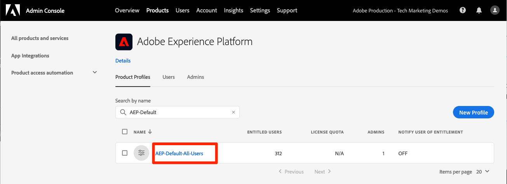
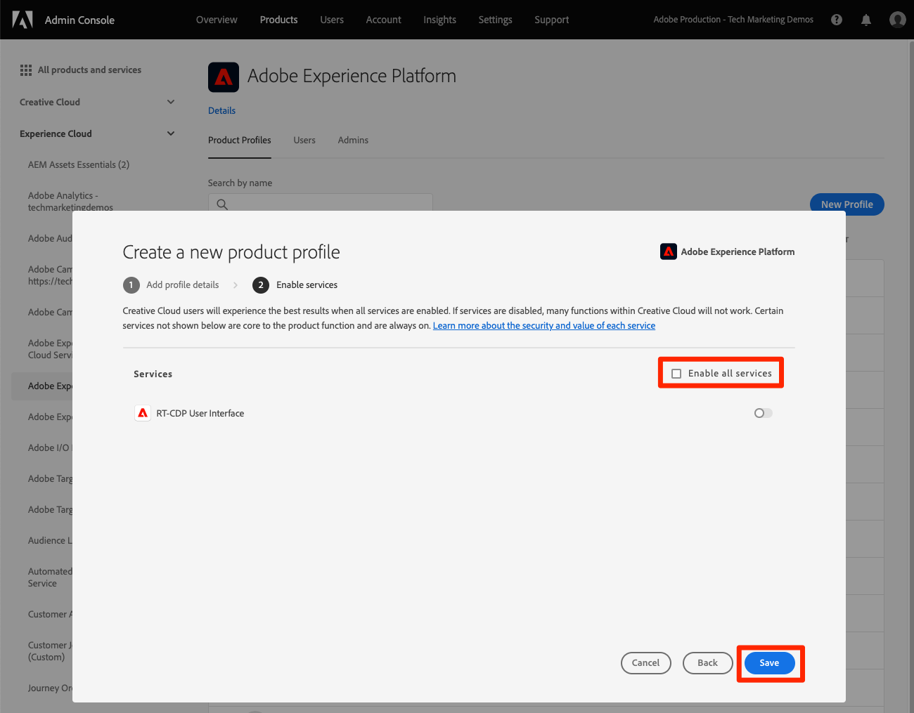
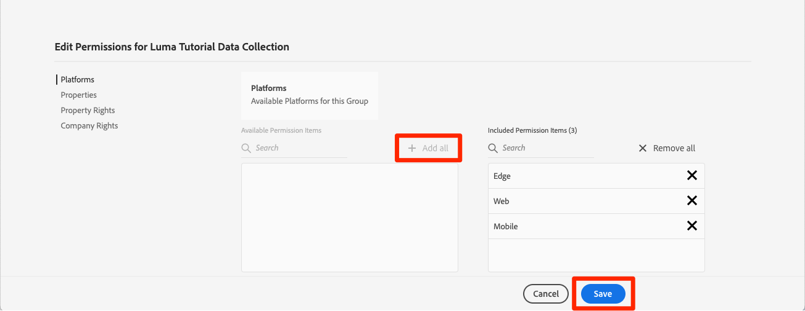

# Berechtigungen konfigurieren

<!--30min-->

In dieser Lektion konfigurieren Sie Adobe Experience Platform-Benutzerberechtigungen mithilfe von [!DNL Adobe's Admin Console].

Die Zugriffskontrolle ist eine wichtige Datenschutzfunktion in Experience Platform. Wir empfehlen, die Berechtigungen auf das für die Ausführung der Arbeitsaufgaben erforderliche Minimum zu beschränken. Siehe [Dokumentation zur Zugriffssteuerung](https://experienceleague.adobe.com/docs/experience-platform/access-control/home.html) für weitere Informationen.

Datenarchitekten und Dateningenieure sind leistungsstarke Benutzer von Adobe Experience Platform und Sie benötigen viele Berechtigungen, um dieses Tutorial und später in Ihrer täglichen Arbeit abzuschließen. Datenarchitekten sind wahrscheinlich an der Verwaltung von *andere Platform-Benutzer* in ihrem Unternehmen, z. B. Marketingexperten, Analysten und Datenwissenschaftler. Überlegen Sie sich, wie Sie diese Funktionen verwenden können, um andere Benutzer in Ihrem Unternehmen zu verwalten.

**Datenarchitekten** häufig Berechtigungen für andere Benutzer außerhalb dieses Tutorials konfigurieren.

>[!IMPORTANT]
>
>Ein Systemadministrator von Adobe Experience Cloud-Produkten muss einige der Schritte in dieser Lektion ausführen, die in den Abschnittsüberschriften beschrieben wird. Wenn Sie kein Systemadministrator sind, wenden Sie sich an einen Mitarbeiter in Ihrem Unternehmen und bitten Sie ihn, diese Aufgaben auszuführen.

## Über die Admin Console

Die [!DNL Admin Console] ist die Benutzeroberfläche, über die der Benutzerzugriff auf alle Adobe Experience Cloud-Produkte verwaltet wird. Siehe [Adobe Admin Console-Dokumentation](https://helpx.adobe.com/de/enterprise/using/admin-console.html) für detailliertere Informationen. Im Folgenden finden Sie einige Schlüssel [!DNL Admin Console] Konzepte:

* A **Produktprofil** ist eine Kombination aus Berechtigungen, Rollen und Sandbox-Umgebungen, die mit einem bestimmten Adobe-Produkt verknüpft sind. Für ein Adobe-Produkt können mehrere Produktprofile erstellt werden. Beispielsweise könnte ein &quot;Marketer&quot;-Profil die Berechtigungen auf das beschränken, was ein typischer Marketing-Experte zum Ausführen wichtiger Aufgaben in der Produktions-Platform-Umgebung benötigt, während ein &quot;Data Architect&quot;-Profil verwendet werden könnte, um in mehreren Platform-Umgebungen unterschiedliche Berechtigungen zu erteilen. In dieser Lektion erstellen Sie ein Produktprofil des &quot;Luma-Tutorials&quot;mit allen Berechtigungen, die ein Datenarchitekt und Dateningenieur für dieses Tutorial in einer Sandbox-Umgebung benötigen würde.
* Ein **Integration** ist eine Verbindung zu einem *Projekt* in der Adobe Developer-Konsole. Die Adobe Developer-Konsole ist der Kern der Authentifizierung und Konfiguration von Adobe-APIs. Sie konfigurieren eine Integration in der Developer Console und [!DNL Postman] Lektion.

Im Folgenden finden Sie eine kurze Zusammenfassung der Rollen, die für Platform vorhanden sind:

* **Benutzer** eines Produktprofils kann Aufgaben in der Benutzeroberfläche von Platform entsprechend den im Produktprofil zugewiesenen Berechtigungen ausführen.
* **Entwickler** eines Produktprofils Aufgaben mithilfe der Platform-API ausführen können, entsprechend den Berechtigungen im Produktprofil.
* **Produktprofiladministratoren** bearbeiten *das spezifische Profil* Berechtigungen und fügen Sie Benutzer, Entwickler und zusätzliche Profiladministratoren hinzu.
* **Produktadministratoren** kann *alle Produktprofile* für Platform und fügen Sie neue Produktprofile hinzu.
* **Systemadministratoren** kann Produktadministratoren hinzufügen und im Wesentlichen alle Berechtigungen für alle Adobe Experience Cloud-Produkte verwalten.

## Erstellen eines Experience Platform-Produktprofils (erfordert einen Systemadministrator oder einen Produktadministrator)

In dieser Übung erstellen Sie oder ein Systemadministrator in Ihrem Unternehmen ein Produktprofil für Adobe Experience Platform und fügen Sie Sie als Administrator für dieses Produktprofil hinzu.

>[!NOTE]
>
>Wenn Sie ein Systemadministrator sind, der einen Kollegen unterstützt, der dieses Tutorial durchführt, sollten Sie erwägen, Ihren Kollegen als *Produktadministrator* für Adobe Experience Platform. Als Produktadministrator können sie diese Schritte selbst durchführen und in Zukunft andere Experience Platform-Benutzer verwalten.

So erstellen Sie das Produktprofil:

1. Melden Sie sich bei der [Adobe Admin Console](https://adminconsole.adobe.com)
1. Auswählen **[!UICONTROL Produkte]** in der oberen Navigation
1. Auswählen **[!UICONTROL Adobe Experience Platform]** im linken Navigationsbereich (Sie müssen unter Umständen die **[!UICONTROL Experience Cloud]** Abschnitt)
1. Möglicherweise haben Sie in Ihrer Experience Platform-Instanz bereits mehrere Profile. Wählen Sie die **[!UICONTROL Neues Profil]** Schaltfläche zum Hinzufügen eines weiteren
   
1. Benennen Sie das Profil. `Luma Tutorial Platform` (Fügen Sie am Ende den Namen des Tutorial-Teilnehmers hinzu, wenn mehrere Personen aus Ihrem Unternehmen dieses Tutorial absolvieren) und wählen Sie die **[!UICONTROL Nächste]** button
   
1. Abhängig von den Details Ihrer Produktlizenz wird diese zweite möglicherweise nicht angezeigt. **[!UICONTROL Dienste]** angezeigt. In diesem Tutorial werden diese Dienste nicht verwendet. Deaktivieren Sie daher **[!UICONTROL Alle Dienste aktivieren]** nach *remove* Alle Dienste und wählen Sie **[!UICONTROL Speichern]**.
   

Fügen Sie nun den Tutorial-Teilnehmer als Administrator des neu erstellten Produktprofils hinzu. Wenn *you* als Tutorial-Teilnehmer, überspringen Sie [Konfigurieren des Experience Platform-Produktprofils](#configure-experience-platform-product-profile):

1. Wählen Sie die `Luma Tutorial Platform` Produktprofil:

   

1. Wählen Sie die **[!UICONTROL Administratoren]** und wählen Sie dann die **[!UICONTROL Admin hinzufügen]** Schaltfläche:

   

1. Schließen Sie den Workflow ab, um den Teilnehmer des Tutorials als Administrator hinzuzufügen.

Nachdem Sie diese Schritte ausgeführt haben, sollten Sie sehen, dass die `Luma Tutorial Platform` Profil mit einem Administrator eingerichtet.

## Konfigurieren des Experience Platform-Produktprofils

Jetzt, da Sie Administrator der `Luma Tutorial Platform` Produktprofil können Sie die Berechtigungen und Rollen konfigurieren, die Sie zum Abschluss des Tutorials benötigen.

### Hinzufügen von Berechtigungen

Nun fügen Sie dem Profil die einzelnen Berechtigungselemente hinzu:

1. Öffnen Sie die `Luma Tutorial Platform` Produktprofil
1. Wählen Sie die Registerkarte **[!UICONTROL Berechtigungen]** aus
1. under **[!UICONTROL Sandboxes]**, fügen Sie die **[!UICONTROL Prod]** Sandbox zum Profil. Es ist erforderlich, Zugang zu den [!DNL Prod] Sandbox, um zusätzliche Sandboxes zu erstellen. Nachdem wir die Tutorial-Sandbox in der nächsten Lektion hinzugefügt haben, werden wir die [!DNL Prod] Sandbox aus dem Produktprofil.
1. under [!UICONTROL Datenerfassung], fügen Sie die [!UICONTROL Quellen verwalten] und [!UICONTROL Quellen anzeigen] Berechtigungselemente.
1. Fügen Sie alle Berechtigungselemente für hinzu:
   1. [!UICONTROL Datenmodellierung]
   1. [!UICONTROL Daten-Management]
   1. [!UICONTROL Profilverwaltung]
   1. [!UICONTROL Identitäts-Management]
   1. [!UICONTROL Sandbox-Verwaltung]
   1. [!UICONTROL Abfragedienst]
   1. [!UICONTROL Datenerfassung]
   1. [!UICONTROL Data Governance]
   1. [!UICONTROL Dashboards]
   1. [!UICONTROL Warnhinweise]

1. Nachdem Sie alle Berechtigungselemente hinzugefügt haben, wählen Sie die **[!UICONTROL Speichern]** button

### Fügen Sie sich selbst als Benutzer hinzu

Wenn `Luma Tutorial Platform` Ihre *only* Produktprofil von Experience Platform können Sie sich weiterhin nicht bei der Benutzeroberfläche von Experience Platform anmelden. Dazu müssen Sie ein *Benutzer* im Produktprofil. Zum Glück, da Sie ein *admin* eines Produktprofils können Sie sich selbst als *Benutzer*!

1. Navigieren Sie zu **[!UICONTROL Benutzer]** tab
1. Wählen Sie die **[!UICONTROL Benutzer hinzufügen]** button
   
1. Schließen Sie den Workflow ab, um sich selbst als Benutzer zum Produktprofil hinzuzufügen.

### Fügen Sie sich selbst als Entwickler hinzu

Um die Platform-API zu verwenden, fügen Sie sich selbst als Entwickler hinzu:

1. Navigieren Sie zu **[!UICONTROL Entwickler]** tab
1. Wählen Sie die **[!UICONTROL Entwickler hinzufügen]** button
   
1. Schließen Sie den Workflow ab, um sich als Entwickler zum Produktprofil hinzuzufügen.

## Erstellen eines Datenerfassungs-Produktprofils (erfordert einen Systemadministrator oder einen Produktadministrator)

In dieser Übung erstellen Sie oder ein Systemadministrator in Ihrem Unternehmen ein Produktprofil für die Datenerfassung (ehemals Adobe Experience Platform Launch) und fügen Sie Sie als Produktprofiladministrator hinzu.

>[!NOTE]
>
>Wenn Sie ein Systemadministrator sind, der einen Kollegen bei diesem Tutorial unterstützt, sollten Sie sie als *Produktadministrator* für die Datenerfassung. Als Produkt-Administrator können sie diese Schritte selbst durchführen und in Zukunft andere Benutzer der Datenerfassung verwalten.

So erstellen Sie das Produktprofil:

1. Im [!DNL Adobe Admin Console] Wechseln Sie zum Adobe Experience Platform-Datenerfassungsprodukt.
1. Fügen Sie ein neues Profil mit dem Namen `Luma Tutorial Data Collection` (Fügen Sie am Ende den Namen des Tutorial-Teilnehmers hinzu, wenn mehrere Personen aus Ihrem Unternehmen dieses Tutorial absolvieren)
1. Deaktivieren Sie die **[!UICONTROL Eigenschaften]** > **[!UICONTROL Automatisch einschließen]** Einstellung
1. Weisen Sie zu diesem Zeitpunkt keine Eigenschaften oder Berechtigungen zu
1. Fügen Sie den Tutorial-Teilnehmer als Administrator dieses Profils hinzu.

Nachdem Sie diese Schritte ausgeführt haben, sollten Sie sehen, dass die `Luma Tutorial Data Collection` Profil mit einem Administrator eingerichtet.

## Konfigurieren des Datenerfassungs-Produktprofils

Jetzt, da Sie Administrator der `Luma Tutorial Data Collection` Produktprofil können Sie die Berechtigungen und Rollen konfigurieren, die Sie zum Abschluss des Tutorials benötigen.

### Hinzufügen von Berechtigungen

Nun fügen Sie dem Profil die einzelnen Berechtigungselemente hinzu:

1. Im [Adobe Admin Console](https://adminconsole.adobe.com), gehen Sie zu **[!UICONTROL Produkte]** > **[!UICONTROL Datenerfassung]**
1. Öffnen Sie die `Luma Tutorial Data Collection` profile
1. Navigieren Sie zu **[!UICONTROL Berechtigungen]** tab
1. Öffnen **[!UICONTROL Plattformen]**
1. Stellen Sie sicher, dass alle verfügbaren Plattformen ausgewählt sind (je nach Lizenz werden Ihnen möglicherweise unterschiedliche Optionen angezeigt)
1. **[!UICONTROL Speichern]** Sie die Änderungen
   
1. Öffnen **[!UICONTROL Eigenschaften]**
1. Stellen Sie sicher, dass **[!UICONTROL Automatisch einschließen]** -Umschalter ist aus, sodass Sie keinen Zugriff auf Eigenschaften haben (wir fügen später eine hinzu)
1. **[!UICONTROL Speichern]** Sie die Änderungen
   
1. Öffnen **[!UICONTROL Eigenschaftsrechte]**
1. Auswählen **[!UICONTROL Alle hinzufügen]** , um alle Eigenschaftsberechtigungen hinzuzufügen
1. **[!UICONTROL Speichern Sie]**
   
1. Öffnen **[!UICONTROL Unternehmensrechte]**
1. Hinzufügen **[!UICONTROL Eigenschaften verwalten]**
1. Wählen Sie **[!UICONTROL Speichern]** aus

   

### Fügen Sie sich selbst als Benutzer hinzu

Fügen Sie sich jetzt als Benutzer dem Datenerfassungsprofil hinzu:

1. Navigieren Sie zu **[!UICONTROL Benutzer]** tab
1. Wählen Sie die **[!UICONTROL Benutzer hinzufügen]** button
   
1. Schließen Sie den Workflow ab, um sich selbst als Benutzer zum Produktprofil hinzuzufügen.

Sie müssen sich nicht selbst als Entwickler für die Datenerfassung hinzufügen.

Jetzt verfügen Sie über fast alle Berechtigungen, die zum Abschließen des Tutorials erforderlich sind. Es gibt nur noch zwei weitere Stärken, die Sie im [!DNL Adobe Admin Console], einschließlich eines nach Ihnen [Sandbox erstellen](create-a-sandbox.md)!
