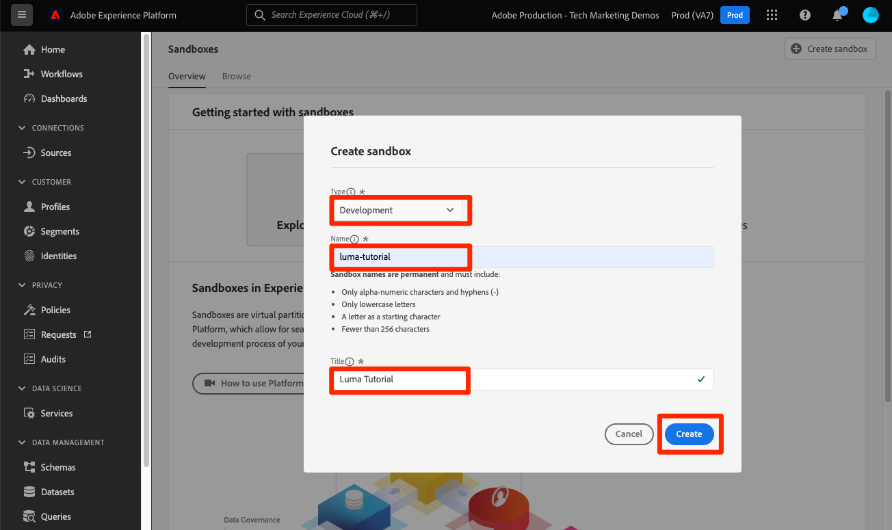

# Sandbox erstellen

<!--25min-->

In dieser Lektion erstellen Sie eine Sandbox für Entwicklungsumgebungen, die Sie für den Rest des Tutorials verwenden werden.

Sandboxes bieten isolierte Umgebungen, in denen Sie Funktionen ausprobieren können, ohne Ressourcen und Daten mit Ihrer Produktionsumgebung zu mischen. Weitere Informationen finden Sie unter [Sandbox-Dokumentation](https://experienceleague.adobe.com/docs/experience-platform/sandbox/home.html?lang=de).

**Datenarchitekten** und **Dateningenieure** müssen Sandboxes außerhalb dieses Tutorials erstellen.

Bevor Sie mit den Übungen beginnen, sehen Sie sich dieses kurze Video an, um mehr über Sandboxes zu erfahren:
>[!VIDEO](https://video.tv.adobe.com/v/29838/?learn=on)

## Erforderliche Berechtigungen

Im [Berechtigungen konfigurieren](configure-permissions.md) Lektion erstellen Sie alle Zugriffssteuerungen, die zum Abschluss dieser Lektion erforderlich sind.

<!--
* Permission items **[!UICONTROL Sandbox Administration]** > **[!UICONTROL View Sandboxes]** and **[!UICONTROL Manage Sandboxes]**
* Permission item **[!UICONTROL Sandboxes]** > **[!UICONTROL Prod]**
* User-role access to the `Luma Tutorial Platform` product profile
* Admin-level access to the `Luma Tutorial Platform` product profile
-->

## Erstellen einer Sandbox

Erstellen wir eine Sandbox:

1. Anmelden bei der [Adobe Experience Platform](https://experience.adobe.com/platform) Benutzeroberfläche
1. Navigieren Sie zu **[!UICONTROL Sandboxes]** in der linken Navigation
1. Auswählen **[!UICONTROL Sandbox erstellen]** oben rechts
   

1. Auswählen **[!UICONTROL Entwicklung]** als **[!UICONTROL Typ]**
1. Benennen Ihrer Sandbox `luma-tutorial` (erwägen Sie, Ihren Namen am Ende hinzuzufügen)
1. Anleitung benennen `Luma Tutorial` (erwägen Sie, Ihren Namen am Ende hinzuzufügen)
1. Klicken Sie auf die Schaltfläche **[!UICONTROL Erstellen]**
   
   >[!NOTE]
   >
   >Sie können zwar beliebige Werte für Ihren Sandbox-Namen und Titel verwenden, es wird jedoch empfohlen, die vorgeschlagenen Werte einzuhalten, da wir im Tutorial auf diese Beschriftungen verweisen werden. Wenn Ihre Organisation mehrere Personen hat, die dieses Tutorial abschließen, sollten Sie erwägen, Ihren Namen am Ende des Sandbox-Titels und -Namens hinzuzufügen, z. B. &quot;luma-tutorial-ignatiusjreilly&quot;.

Die Erstellung von Sandboxes dauert etwa 30 Sekunden, wobei ein[!UICONTROL Erstellen]Der Status wird angezeigt. Wenn die Sandbox vollständig erstellt wurde, wird sie als &quot;[!UICONTROL Aktiv]&quot;:

Warten Sie, bis Ihre Sandbox[!UICONTROL Aktiv]&quot;, bevor sie mit der nächsten Übung fortfahren.

## Hinzufügen der neuen Sandbox zur Rolle

Sobald die Sandbox aktiv ist, müssen Sie sie in Ihre Rolle aufnehmen, um sie verwenden zu können. So fügen Sie sie Ihrer Rolle hinzu (Systemadministrator- oder Produktadministratorberechtigungen erforderlich):

1. Navigieren Sie zu [!UICONTROL Berechtigungen] Bildschirm
1. Öffnen Sie die `Luma Tutorial Platform` Rolle
1. Optional _remove_ die `Prod` Sandbox aus der Rolle
1. Fügen Sie die `Luma Tutorial` Sandbox
1. Wählen Sie **[!UICONTROL Speichern]** aus
1. Im [!UICONTROL Sandboxes] Zeile auswählen **[!UICONTROL Bearbeiten]**

   

1. Laden Sie die Seite neu (oder drücken Sie die Umschalt-Umschalt-Umschalt-Umschalt-Umschalt-Umschalt-Umschalt-Umschalt-Umschalt-Umschalt-Umschalt-Umschalt-Umschalt-Umschalt-Umschalt-Umschalt-Umschalt-Umschalt-Umschalt-Umschalt-Umschalt-Umschalt-Umschalt-Umschalt-Umschalt). `Luma Tutorial` Sandbox oder sie sollte in der Sandbox-Dropdown-Liste angezeigt werden
1. Wechseln Sie zu `Luma Tutorial` Sandbox, falls noch nicht vorhanden

   

Gut, Sie haben Ihre Sandbox erstellt und sind bereit, [Einrichten von Developer Console und Postman](set-up-developer-console-and-postman.md)!
